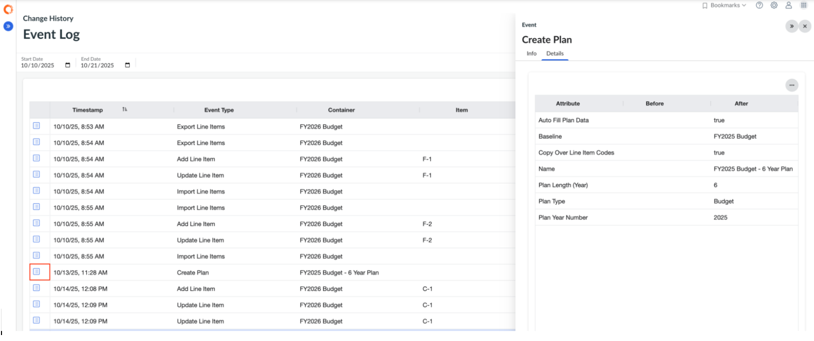

# Historial de cambios

El historial de cambios proporciona una pista de auditoría de las acciones clave realizadas en su entorno de planificación. Permite a las organizaciones mantener la transparencia, respaldar los requisitos de cumplimiento y solucionar problemas de planificación mediante el seguimiento de quién ha cambiado qué, cuándo y cómo.

Nota: Para acceder al Historial de Cambios se requieren los roles de Administrador o Propietario del Proceso Presupuestario.

## Dónde acceder al historial de cambios

Vaya a **Historial de cambios → Registro de eventos** mediante el navegador de la izquierda.

- Utilice filtros para profundizar en los tipos de eventos, intervalos de fechas, usuarios o ámbitos (planes, departamentos, cuentas).
- Utilice la función **Exportar** para descargar un CSV del registro de auditoría para su análisis externo o archivo.

## Tipos de actos

El historial de cambios captura diversos tipos de eventos. Las categorías más comunes son:

- **Eventos del plan** : Creación del plan, cambios de estado (Nuevo → Final), archivo, versionado.
- **Eventos de entrada de datos** : Edición de partidas, inserción/eliminación de registros, operaciones de importación.
- **Eventos de aprobación** : Presentación, aprobación, devolución, comentario.
- **Eventos de datos de referencia** : Cambios de dimensión (por ejemplo, cuentas, departamentos), actualizaciones de configuración.
- **Eventos de roles y permisos** : Asignación de roles de usuario, cambios de acceso.

Consulte la lista completa de [tipos de eventos](event-types.html "El historial de cambios captura una amplia gama de eventos del sistema en Apptio Planning, permitiéndole revisar quién hizo qué, cuándo y cómo. Cada evento se clasifica por tipo, área, contenedor, tipo de elemento y cambios de atributo.") para obtener información detallada y descripciones.

## Exportación del historial de cambios

- En la página Historial de cambios, haga clic en el **menú Elipses →Exportar** **a CSV.**
- El archivo incluye todos los filtros seleccionados y los datos del evento: fecha y hora, usuario, plan, departamento, tipo de evento, descripción y valores antes/después cuando están disponibles.
- Utilice la exportación para auditorías de cumplimiento, revisiones de procesos o integración con sistemas de BI/informes.

## Ver detalles del evento

Puede ver información adicional sobre cualquier evento del Historial de cambios abriendo el panel **Propiedades**.

**Para abrir las propiedades de un evento:**

- Haga clic en el **icono Propiedades** situado junto al evento en el Registro de eventos.

El panel Propiedades incluye dos pestañas:

- **Info** - Muestra información general sobre el evento (como tipo de evento, usuario y marca de tiempo).
- **Detalles** : muestra los cambios específicos, incluidos los valores anteriores y posteriores de todos los atributos afectados.

- **[Tipos de eventos](../../it-planning/planning/event-types.html)**  
   Change History captura una amplia gama de eventos del sistema dentro de Apptio Planning, permitiéndole revisar quién hizo qué, cuándo y cómo. Cada evento se clasifica por tipo, área, contenedor, tipo de elemento y cambios de atributo.
