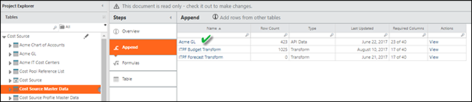
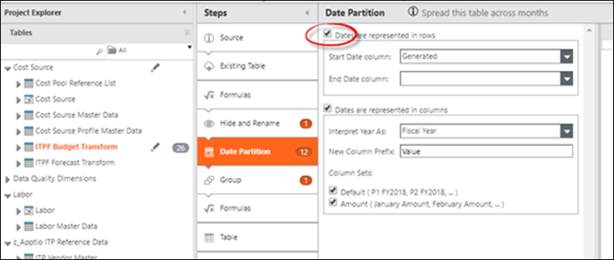
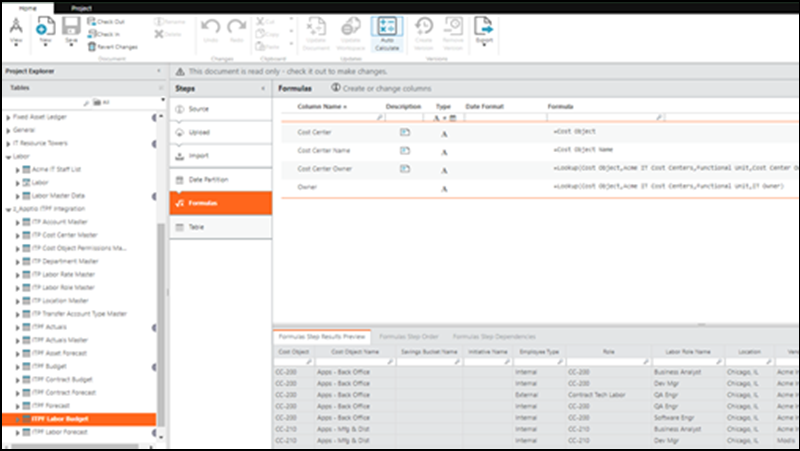
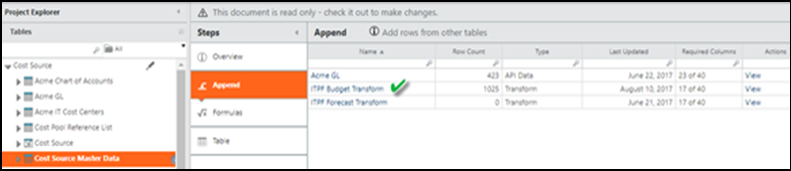
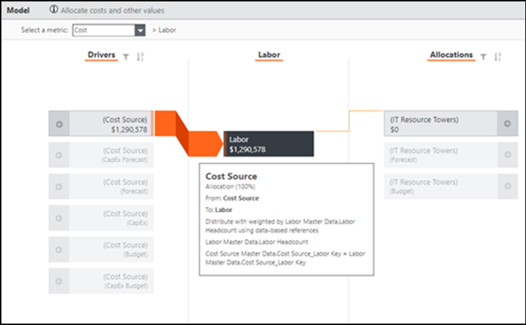
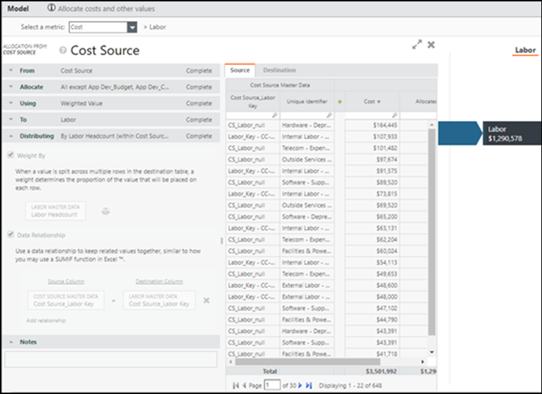

# Configure Apptio Costing Integration Datasets

Complete las siguientes tareas para configurar Costing Standard para que admita Planning. Las siguientes tareas sólo pueden ser realizadas por usuarios asignados a los roles de Administrador o Propietario de Proceso Presupuestario. Para obtener más información sobre las funciones, consulte Permisos y funciones de Frontdoor.

1. Edite sus datos de referencia según sea necesario. Véase [Gestionar datos de referencia](manage-reference-data.html).
2. Importar datos de referencia de Costing Standard. Véase [Integrar con transparencia de costes](integrate-ct.html "Si su organización utiliza tanto Apptio Costing Standard como una aplicación de planificación Apptio, puede integrarlas para compartir datos.").
3. Configure Costing Standard. Para obtener más información, consulte [Costing Standard Foundation Module configuration](https://www.ibm.com/docs/en/apptio-commercial/costing-standard/saas?topic=costing-standard-foundation-module-configuration "(se abre en una pestaña o una ventana nueva)"). Tendrá que crear un proyecto Costing
   Standard , configurar el tiempo para el proyecto y cargar y asignar los datos de Costing Standard .
4. Instale los componentes Apptio ITPF Integration y CTF-Labor en Costing Standard.
5. Asegúrese de configurar la integración de datos con Costing Standard. Véase [Integrar con transparencia de costes](integrate-ct.html "Si su organización utiliza tanto Apptio Costing Standard como una aplicación de planificación Apptio, puede integrarlas para compartir datos."). Apptio recomienda tener muy en cuenta la cadencia de las actualizaciones y las convenciones de nomenclatura al integrarse con Costing Standard.
6. Siga las siguientes instrucciones para configurar sus conjuntos de datos, datos maestros y modelos.

La siguiente tabla describe todos los datos de referencia necesarios para apoyar Planning. Cada conjunto de datos incluye una plantilla única que se utiliza para asignar los datos de los archivos fuente sin procesar al maestro.

| Conjunto de datos | Descripción |
| --- | --- |
| Maestro de cuentas | Estos datos, que suelen derivarse de los datos de referencia de las cuentas, incluyen la asignación de grupos de costes para futuras actualizaciones de las importaciones. |
| Maestro de centros de coste | Suele derivarse de la estructura jerárquica de su empresa. Puede ser el mismo que el de la lista de departamentos. |
| Departamento Master | Suele derivarse de la estructura jerárquica de su empresa. |
| Ubicación Maestro | (Opcional) Lista de ubicaciones operativas de la empresa utilizadas para aprovechar las capacidades de planificación laboral. Puede tratarse de oficinas, regiones geográficas, etc. |
| Vendedor principal | (Opcional) Enumere los proveedores con los que su empresa contrata los servicios o suministros necesarios para mejorar las capacidades de planificación laboral y contractual. |
| Maestro de clases de activos | Se utiliza para la planificación de activos. Contiene la información necesaria para determinar los tipos de depreciación, los métodos de cálculo y las correspondencias entre las clases de activos y las cuentas OpEx o CapEx. Si necesita cargar el maestro de clases de activos, créelo y cárguelo por separado. |
| Tipo de contrato Master | Se utiliza para la planificación de contratos. Contiene la información necesaria para determinar las correspondencias entre los tipos de contrato y las cuentas OpEx o CapEx. Si necesita cargar el maestro de tipos de contrato, créelo y cárguelo por separado. |
| Maestro de Trabajo | Se utiliza para la planificación laboral. Contiene información para cada rol laboral único. |
| Maestro de tarifas | Se utiliza para la planificación laboral. Contiene la información necesaria para determinar la correspondencia entre los roles laborales y las tasas de compensación. |
| Maestro de normas de asignación de mano de obra | Identifica las reglas de asignación de empleados internos y externos utilizadas para determinar su coste para la empresa (por ejemplo, impuestos y primas). Estos datos se actualizan en su aplicación Apptio Planning . |
| Actual Master | Se utiliza para elaborar presupuestos y previsiones. Traduce los datos reales del libro mayor a la plantilla Planning . |
| Transferencia Tipo de cuenta Maestro | Se utiliza para determinar la asignación correcta de dinero para consumir o apoyar a varios departamentos o grupos de trabajo. |
| Objetos de coste Permisos Maestro | Se utiliza para determinar qué usuarios pueden ver, editar o aprobar un Objeto de Coste. |

Se añade un nuevo campo "Código" en las tablas de datos Maestro de funciones laborales, Maestro de proveedores y Maestro de ubicaciones. Este campo es equivalente al ID en los Proyectos de Cálculo de Costes.  
Por ejemplo ID de Mano de Obra = Código en el Maestro de Funciones de Mano de Obra, ID de Vendedor = Código en el Maestro de Vendedores y Ubicación = Código en el Maestro de Ubicaciones.

## Configurar conjuntos de datos

## Datos reales

Añada los datos reales del libro mayor al maestro de fuentes de coste con las asignaciones apropiadas.

## Datos del plan

Al instalar el componente Planning Integration, se instalan una serie de transformaciones.

Si experimenta un problema durante el paso Partición de fechas, modifique el formato de los datos del plan (filas o columnas).

La siguiente tabla proporciona las asignaciones y fórmulas necesarias como parte de la anexión al maestro de fuentes de costes. Estos pasos se refieren a lo siguiente, pero pueden ser necesarias asignaciones adicionales:

- Presupuesto laboral ITPF
- Previsión laboral ITPF

Existen varias diferencias taxonómicas entre Planning y Costing Standard, incluida la traducción entre Centro de Coste y Objeto de Coste. Por ejemplo, un objeto de coste se utiliza para definir un departamento, un proyecto, un servicio o una unidad de negocio. La conversión de Objetos de Coste a Centro de Coste debe completarse para que Planning funcione correctamente.

Debe añadir varias fórmulas para traducir los datos entre los dos sistemas. Completa la siguiente cartografía:

1. En la tabla Presupuesto Laboral ITPF, añada un paso entre los pasos Partición de Fechas y Tabla :

   
2. Actualice la tabla de Presupuesto Laboral con las siguientes columnas de fórmulas:

   | Campo Datos maestros | Valor |
   | --- | --- |
   | Centro de costes | =Objeto de coste |
   | Nombre del centro de costes | =Nombre del objeto de coste |
   | Propietario del centro de costes | =lookup(Objeto de coste, Maestro de departamento, Código, Propietario del centro de coste) |
   | Propietario (Owner) | =lookup(Objeto de coste, Maestro de departamento, Código, Propietario) |
3. Repita los pasos anteriores para los datos de Previsión Laboral ITPF.

## Configurar conjuntos de datos maestros

## Conjunto de datos maestros de fuentes de costes

Un presupuesto o previsión se considera un plan financiero. Cada tipo de plan debe adjuntarse a los datos maestros de la fuente de costes para que Planning funcione correctamente.

## Datos del plan

La siguiente tabla proporciona las asignaciones y fórmulas necesarias como parte de la anexión a los Datos maestros de la fuente de costes. Estos pasos se refieren a lo siguiente, pero pueden ser necesarias asignaciones adicionales:

- Transformación del presupuesto ITPF
- Transformación de las previsiones ITPF

Asignaciones de datos necesarias:

| Campo Datos maestros | Valor |
| --- | --- |
| Cuenta | =Cuenta |
| Descripción de cuenta | =Descripción de la cuenta |
| Grupo de cuentas | =lookup(Cuenta, Maestro de cuenta, Código, Grupo de cuentas) |
| Subgrupo de cuentas | =lookup(Cuenta, Maestro de Cuenta, Código, Subgrupo de Cuenta) |
| Importe | =Importe |
| Centro de costes | =Centro de costes |
| Nombre del centro de costes | =Descripción del centro de coste |
| Propietario del centro de costes | =Lookup(Centro de coste, Maestro de departamento, Código, Propietario del centro de coste) |
| Pool de costes | =Lookup(Cuenta, Maestro de cuentas, Código, Pool de costes) |
| Sub Pool de costes | =Lookup(Cuenta, Maestro de Cuenta, Código, {Cost Sub-Pool} ) |
| Discrecional/No discrecional | =Lookup(Cuenta, Maestro de Cuenta, Código, {Discretionary/Non-Discretionary} ) |
| Tipo de gasto | =Tipo de gasto |
| Fijo Variable | =Lookup(Cuenta, Maestro de Cuenta, Código, {Fixed/Variable} ) |
| Es Trabajo | =IF(Pool de costes IN ("Mano de obra interna", "Mano de obra externa"), "Sí", "No") |
| Es Proyecto | =IF(ID del proyecto="", "No", "Sí") |
| Es Vendedor | =IF(ID del proveedor="", "No", "Sí") |
| Identificación de la revista | =ID de la revista |
| Línea Diario | =Descripción de la línea |
| ID de línea de diario | =ID de la revista |
| Propietario (Owner) | =Lookup(Centro de coste, Maestro de departamento, Código, Propietario de TI) |
| ID de proyecto | =ID del proyecto |
| Nombre de proyecto | =Nombre del proyecto |
| ID de proveedor | =ID del proveedor |
| Nombre de distribuidor | =Nombre del proveedor |

## Datos maestros de trabajo

La siguiente tabla proporciona las asignaciones y fórmulas necesarias como parte de la anexión a los Datos maestros de la fuente de costes. Estos pasos se refieren a lo siguiente, pero pueden ser necesarias asignaciones adicionales:

- Presupuesto Laboral ITPF a Datos Maestros Laborales
- Previsión de mano de obra ITPF a datos maestros de mano de obra

Asignaciones de datos necesarias:

| Campo Datos maestros | Valor |
| --- | --- |
| Centro de costes | =Centro de costes |
| Nombre del centro de costes | =Nombre del centro de coste |
| Propietario del centro de costes | =Propietario del centro de costes |
| Pool de costes | =IF(Tipo de empleado="Interno", "Mano de obra interna", "Mano de obra externa") |
| Nombre del centro de costes | =Descripción del centro de coste |
| Propietario del centro de costes | =Lookup(Centro de coste, Maestro de departamento, Código, Propietario del centro de coste) |
| Pool de costes | =Lookup(Cuenta, Maestro de cuentas, Código, Pool de costes) |
| Sub Pool de costes | ="Gasto" |
| Tipo de empleado | =Tipo de empleado |
| Tipo de gasto | =Tipo de gasto |
| Horas | =720 |
| Plantilla laboral | =1 |
| Identificación laboral | Código |
| Nombre laboral | =Nombre del empleado |
| Ubicación | =Ubicación |
| Propietario (Owner) | =Lookup(Centro de coste, Maestro de departamento, Código, Propietario de TI) |
| Plantilla prevista | =Valor |
| Posición | =Función |
| Región | =Lookup(Ubicación, Ubicación principal, Ubicación, Región) |
| Tipo de función | =Función |
| Título | =Función |
| Proveedor | =Proveedor |
| Factor de ponderación | =1 |

## Configurar modelos

Configure los modelos de Coste de mano de obra, Presupuesto y Previsión para que el plan de mano de obra y los gastos se asignen de Fuente de coste a Mano de obra, ponderados por plantilla.

Los valores financieros de la mano de obra (como los dólares) deben asignarse al 100% de la Fuente de Coste a la Mano de Obra.

**Tema principal:** [Conéctese a Apptio Costing](../../it-planning/planning/adm/adm_capabilities.html)
