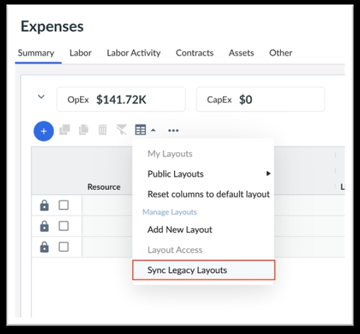
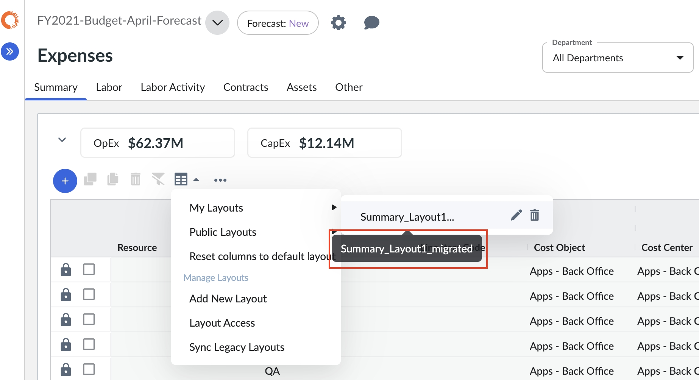

# Personaliza, guarda y comparte diseños de tablas

La Tabla de Gastos en la Nueva Vista ofrece capacidades de personalización mejoradas, incluyendo la posibilidad de personalizar la estructura de columnas, la agrupación, los filtros y guardar los cambios como un diseño. Los usuarios individuales pueden crear hasta 50 diseños privados, mientras que los usuarios administradores pueden crear hasta 50 diseños públicos. Esto representa un aumento con respecto al límite anterior de 30 diseños tanto en entornos públicos como privados en la Vista de Legado de Gastos.

En una futura versión, a finales de este año, los usuarios también podrán sincronizar los diseños existentes de la vista heredada de gastos con la nueva vista, lo que garantizará la continuidad y facilitará la transición.

## Personalizar el diseño de una tabla

Todos los usuarios pueden personalizar hasta 50 diseños de tabla. Además, los administradores y propietarios de presupuestos pueden personalizar el diseño predeterminado para todos los usuarios de su organización.

1. Vaya a **Planning** > **Gastos** en el menú de navegación de la izquierda.
2. Seleccione el plan adecuado en el desplegable **Plan de** la parte superior izquierda.
3. Seleccione la pestaña específica en la que desea personalizar el diseño de la tabla.
4. Opcionalmente realizar varias opciones de personalización compatibles para personalizar el diseño de la tabla, tales como
   - **Reordenar columnas** : Selecciona y arrastra el encabezado de una columna. A medida que arrastra la columna, aparece una barra vertical que indica la ubicación de destino.
   - **Mostrar u ocultar columnas** : Seleccione el menú Columnas en el menú derecho de la tabla y, a continuación, marque la casilla de las columnas que desee mostrar o desmarque la casilla de las columnas que desee ocultar.
   - **Ordenar columnas** : Las columnas se pueden ordenar seleccionando la cabecera de la columna. Aparece un indicador de clasificación junto al encabezamiento de la columna. Puede cambiar la dirección de la ordenación o eliminarla seleccionando en la cabecera de la columna. Las columnas agrupadas se ordenan por defecto.
   - **Agrupar o desagrupar datos de columna** : Seleccione Agrupar columna o Agrupar columnas y, a continuación, marque la casilla de verificación de las columnas que desee agrupar o desmarque la casilla de verificación de las columnas que desee desagrupar. Los grupos pueden anidarse y la información agrupada puede ampliarse o contraerse. Si los datos se habían agrupado previamente por otra dimensión, al seleccionar Agrupar columna se elimina esa agrupación y se aplica la nueva.
   - Columna **Pin** a la izquierda o a la derecha de la tabla.
   - **Aplicar filtros** en varias columnas y atributos.

## Guardar, aplicar, eliminar o compartir un diseño de tabla personalizado

Guarda hasta 50 diseños personalizados para reutilizarlos. Cada diseño es único para la pestaña activa (y si está disponible, para la subpestaña). Sin embargo, los diseños personalizados no son específicos del plan activo o del Centro de Coste.

Crear diseño
:   1. Personalice el diseño de la tabla según sus necesidades, siguiendo las instrucciones de la sección anterior.
    2. Seleccione  en el menú Tabla de Gastos.
    3. En el menú Diseño, seleccione **Añadir nuevo diseño**.
    4. Introduzca el nombre del diseño.
    5. Si desea guardar también en la maqueta los filtros aplicados, marque la casilla **Aplicar selección de filtros** y seleccione **Guardar**.
    6. El diseño recién creado aparecerá en **Mis diseños**.
    7. Pase el cursor por encima del botón **Diseño** para ver el diseño seleccionado actualmente.

Cambiar el nombre del diseño
:   1. Seleccione  en el menú Tabla de Gastos.
    2. En el menú Mis maquetas, seleccione el icono del lápiz de la maqueta cuyo nombre desea cambiar.

       
    3. Aparece la ventana emergente Renombrar diseño.

       
    4. Actualice el nombre del diseño y seleccione **Guardar**.

       Nota:

       El icono **Guardar** permanece desactivado hasta que se realiza un cambio en la presentación.

Editar diseño
:   1. Para personalizar un diseño, seleccione el diseño que desea cambiar.
    2. Realice los cambios necesarios y seleccione **Guardar**. Aparece un mensaje de confirmación "*Éxito: Guardar mis diseños* " y se carga el diseño actualizado.

       

Clonar diseño
:   Nota: Esta opción sólo está disponible para los diseños públicos. El icono **Clonar** permanece desactivado hasta que se realiza un cambio en la presentación.

    1. Seleccione  en el menú Tabla de Gastos.
    2. En el menú **Diseños públicos**, seleccione el "Diseño predeterminado" y seleccione el icono **Clonar** .

       
    3. Aparece la ventana emergente Copiar diseño. Introduzca un nombre para el diseño y seleccione **Guardar**.

       
    4. El diseño clonado se añade a la sección Mis diseños, como se muestra.

       

## Borrar diseño

1. Seleccione  en el menú Tabla de Gastos.
2. En el menú Mis maquetas, seleccione el icono **Eliminar** de la maqueta que desea eliminar.

   
3. El diseño se borra.

   Nota: Los diseños públicos no se pueden eliminar.

## Restablecer cambios de diseño

- Para restablecer el diseño completo, seleccione la opción **Restablecer columnas al diseño predeterminado** en el menú  .

  
- Para deshacer los cambios realizados en una maqueta concreta (antes de guardarla), seleccione el icono  de dicha maqueta.

  

  Aparece un mensaje de error como el que se muestra. Seleccione **Aceptar** para continuar con el restablecimiento.

  

## Gestionar el acceso al diseño

El Acceso al diseño sólo está habilitado para los Administradores. Permite al administrador hacer pública una presentación, de modo que esté disponible para todos los usuarios de la organización.

1. Seleccione  en el menú Tabla de Gastos.
2. En el menú desplegable, seleccione la opción **Acceso al diseño**. Aparecerá la siguiente ventana emergente.

   
3. Active la casilla de la presentación que desea hacer **pública** y seleccione **Aplicar**.

   
4. La maqueta seleccionada se elimina de la sección **Mis maquetas** y aparecerá en la sección **Maquetas públicas**. Una vez que el diseño se marca como "Público", no se puede eliminar.

   

   Para hacer que la presentación sea privada o eliminar una presentación pública, vuelva a activar el conmutador y seleccione **Aplicar**.

## Sincronizar diseños heredados

Ahora los usuarios pueden transferir sus diseños de tablas de gastos de la vista heredada a la nueva vista con un solo clic, lo que elimina la migración manual y ahorra tiempo.

Para sincronizar diseños, basta con hacer clic en el icono Diseños de la nueva vista y seleccionar "Sincronizar diseños heredados" Esto copiará automáticamente sus diseños de la vista heredada a la nueva vista. Tenga en cuenta que tendrá que sincronizar los diseños de cada pestaña de la Tabla de Gastos individualmente para completar la migración de la Vista heredada a la Nueva Vista.

Los diseños migrados de la vista heredada a la nueva vista serán visibles en Mis diseños y Diseños públicos para los diseños privados y públicos respectivamente. El nombre del diseño migrado llevará el sufijo "\_migrated". Consulte la captura de pantalla de referencia que figura a continuación.

Si sigue actualizando diseños en la Vista anterior después de migrarlos a la Nueva Vista, deberá utilizar la opción Sincronizar diseños anteriores en la Nueva Vista para llevar las actualizaciones a la Nueva Vista.

Nota:

- La maquetación es coherente en todos los planos y es específica de una página.
- El diseño puede guardar los filtros aplicados, la agrupación de columnas y las columnas visibles en la tabla.
- Los usuarios administradores y BPO pueden editar y guardar cambios en el diseño predeterminado.
- Los usuarios administradores/BPO también pueden compartir sus diseños guardados en privado haciéndolos "Públicos"
- Los usuarios que no son administradores/BPO, como los usuarios de CCO, pueden utilizar el diseño predeterminado (que debería mostrar los últimos cambios de diseño guardados) definido por los administradores, pero no pueden guardar sus cambios de diseño en él. En su lugar, pueden crear un nuevo diseño privado y guardar las personalizaciones realizadas en el diseño público.
- Los usuarios que no son administradores/BPO, como los usuarios de CCO, pueden crear hasta 50 diseños privados.
- Al elegir guardar un nuevo diseño privado, hay una opción de casilla de verificación para guardar el diseño con filtros (si se aplican) y si esa opción no está marcada, los filtros aplicados no son saved.Plan comparaciones se pueden guardar en el diseño.
- Las comparaciones de planos pueden guardarse en la maqueta.
- No es posible guardar el selector de períodos.
- Cuando el usuario realiza cambios en la presentación pero no los guarda, se muestra un asterisco junto a la presentación activa para que el usuario sepa que se han realizado cambios en la presentación pero no se han guardado. El usuario puede seleccionar Revertir para descartar los cambios recientes, o Guardar para guardarlos en la maqueta en la que se encuentra actualmente. El usuario también puede seleccionar Clonar para guardar estos cambios como un nuevo diseño. Si no se elige ninguna de estas opciones, la duración de los cambios de diseño recién realizados durará hasta que el usuario actualice la página o cierre la sesión. Si el usuario intenta cambiar a otra pestaña o seleccionar otro diseño con cambios no guardados en el diseño actual, se mostrará un mensaje de advertencia describiendo la pérdida de los cambios no guardados en el diseño.
- Si la tabla no muestra las columnas de periodo (meses, trimestres, años), siga los siguientes pasos para hacerlas visibles.
- 1. Seleccione Agrupación en el menú de la tabla.
  2. Asegúrese de seleccionar Año, Mes(es), Trimestre(s).
  3. Si las columnas del periodo siguen sin estar visibles, seleccione el botón Diseño situado encima de la tabla y seleccione **Restablecer columnas al diseño predeterminado**.
  4. Ahora todas las columnas de periodos deberían ser visibles.
  5. Vaya al botón Diseño > Diseño público > Diseño predeterminado y haga clic en el botón Guardar. Este paso garantizará que los cambios se guarden y que las columnas de periodos sean visibles por defecto.

  Estos pasos deberían hacer visibles las columnas de periodo en la vista de tabla.
