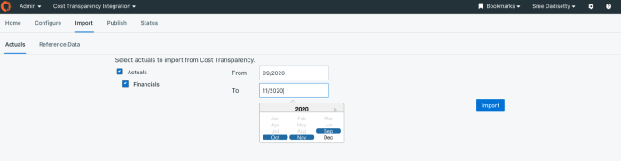
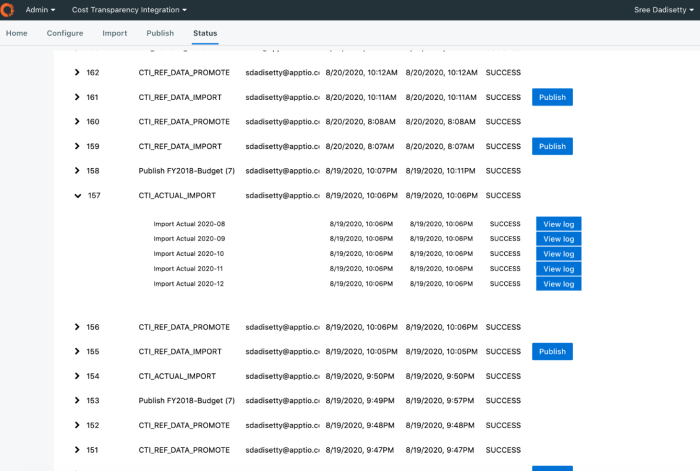

# FAQ: Panel de integración de la transparencia de costes

Esta lista de preguntas frecuentes sobre cómo funciona el panel Cost Transparency Integration (CTI), introducido en la versión de planificación 2.78. El panel CTI es un espacio autónomo donde los usuarios administradores pueden realizar todas las tareas de Cost Transparency Integration dentro de un único panel de control. El nuevo panel ofrece gestión centralizada e importación y exportación con un solo clic en Costing Standard.

En este FAQ:

[P. ¿Cómo activo la nueva funcionalidad?](#FAQCostTransparencyIntegrationPanel__Q.)

[P. ¿Qué tareas puedo realizar a través del Panel CTI?](#FAQCostTransparencyIntegrationPanel__Q.2)

[P. ¿Qué rol/permisos se necesitan para acceder al nuevo panel?](#FAQCostTransparencyIntegrationPanel__Q.3)

[P. ¿Puedo importar los datos reales de más de un mes a la vez?](#FAQCostTransparencyIntegrationPanel__Q.4)

[P. ¿Puedo realizar otras tareas ITP cuando mis trabajos CTI están en cola o en ejecución?](#FAQCostTransparencyIntegrationPanel__Q.5)

[P. ¿Puedo ver el estado detallado de mi trabajo?](#FAQCostTransparencyIntegrationPanel__Q.6)

[P. ¿Existe un orden de operaciones al importar datos de referencia en bloque?](#FAQCostTransparencyIntegrationPanel__Q.7)

[P. Si uno de los conjuntos de datos de referencia no se carga, ¿fallará todo el trabajo?](#FAQCostTransparencyIntegrationPanel__Q.8)

[P. ¿Dónde publico mis datos de referencia?](#FAQCostTransparencyIntegrationPanel__Q.9)

[P. ¿Dónde verifico que lo que he cargado es correcto y lo que esperaba?](#FAQCostTransparencyIntegrationPanel__Q.10)

[P. ¿El nuevo panel CTI sustituye alguna de las funciones y procesos CTI existentes?](#FAQCostTransparencyIntegrationPanel__Q.11)

[P. ¿La página de estado de CTI sólo muestra los trabajos programados mediante el panel Cost Transparency Integration ?](#FAQCostTransparencyIntegrationPanel__Q.12)

## P. ¿Cómo activo la nueva funcionalidad?

A La nueva funcionalidad está activada por defecto. Para acceder a la funcionalidad CTI mejorada, en el menú Configuración, haga clic en Cost
Transparency Integration.

## P. ¿Qué tareas puedo realizar a través del Panel CTI?

A Las siguientes tareas pueden realizarse a través del Panel CTI:

- Configure los ajustes de integración del TC.
- Importar datos reales de CT.
- Importar datos de referencia de CT y publicarlos en el plan.
- Publicar los datos del plan de ITP a CT.
- Ver el estado de todas las ofertas de empleo de CTI.

## P. ¿Qué rol/permisos se necesitan para acceder al nuevo panel?

A Administradores. No se realizan cambios con respecto a los permisos de los roles CTI existentes.

## P. ¿Puedo importar los datos reales de más de un mes a la vez?

A Sí. Utilice el selector de calendario para especificar un periodo. Seleccione los meses de inicio y fin. Para seleccionar sólo un mes, seleccione que los meses inicial y final sean el mismo.

## P. ¿Puedo realizar otras tareas ITP cuando mis trabajos CTI están en cola o en ejecución?

A Sí. No se le impide realizar ninguna tarea relacionada con CTI o ITP cuando un trabajo está en cola o en ejecución. Puede acceder a la página Estado en cualquier momento para ver el estado de cada trabajo CTI que se haya intentado, programado o completado.

## P. ¿Puedo ver el estado detallado de mi trabajo?

A Sí. En la página Estado, haga clic en el icono de la flecha para ampliar. Puede ver la lista de subtareas.

Puede acceder a esta página en cualquier momento para visualizar el estado de los trabajos CTI y sus subtareas que se han intentado, programado o completado.

Sólo mostramos las 100 ofertas más recientes con menos de 31 días de antigüedad.

## P. ¿Existe un orden de operaciones al importar datos de referencia en bloque?

A Para obtener información sobre el orden recomendado para importar datos de referencia, consulte: [Diagrama de dependencias de tablas de referencia](https://community.ibm.com/community/user/viewdocument/reference-table-dependencies-diagra?CommunityKey=4100dfb8-fc23-4203-83c7-019253cf7c0b&tab=librarydocuments "(se abre en una pestaña o una ventana nueva)").

## P. Si uno de los conjuntos de datos de referencia no se carga, ¿fallará todo el trabajo?

A Núm. Aunque una de las subtareas no se cargue, la tarea CTI\_IMPORT\_REF\_DATA\_IMPORT se aprobará con advertencias. Aparece un mensaje de estado de Advertencia. Para acceder a los registros de errores de las subtareas que fallaron, expanda el trabajo y, en Acciones, haga clic en Ver registro.

## P. ¿Dónde publico mis datos de referencia?

A Para publicar los datos de referencia, en la página Estado, en Acciones, haga clic en Publicar. El botón Publicar no se muestra si el estado del trabajo de importación es Fallido. Sólo se mostrará para los estados Correcto y Advertencia. Una vez publicados los datos de referencia, el texto del botón cambia a Publicado y el botón se desactiva.

AVISO

Cuando se publica un trabajo con estado Advertencia, sólo se publican las tareas que se han realizado correctamente. Los trabajos fallidos se ignoran y no se publican.

## P. ¿Dónde verifico que lo que he cargado es correcto y lo que esperaba?

A Puede verificar la carga antes de publicarla. Vaya a la página de datos de referencia y haga clic en el conjunto de datos correspondiente.

## P. ¿El nuevo panel CTI sustituye alguna de las funciones y procesos CTI existentes?

A Núm. Este panel CTI mejorado se utiliza junto con la funcionalidad existente.

## P. ¿La página de estado de CTI sólo muestra los trabajos programados mediante el panel Cost Transparency Integration ?

A Sí. Las actividades CTI realizadas fuera del nuevo panel CTI no son objeto de seguimiento y no aparecerán en la página Estado CTI.

Para más información, véase: [Cost Transparency Integration Panel](cti_panel.html "El panel actualizado de Integración de Transparencia de Costes (CTI), introducido en la versión de planificación 2.78, es un espacio autónomo en el que los usuarios administradores pueden realizar todas las tareas de Integración de Transparencia de Costes dentro de un único panel de control. El nuevo panel ofrece gestión centralizada e importación y exportación con un solo clic y Transparencia de costes.").
