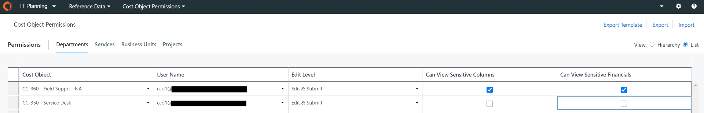
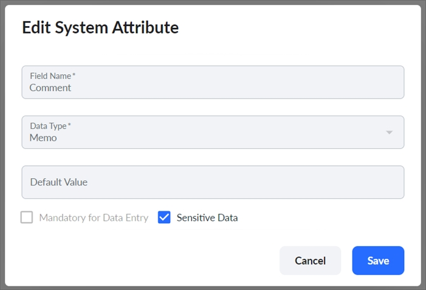

# FAQ: Ocultar datos laborales sensibles

Esta es una lista de preguntas frecuentes sobre las funciones Ocultar Datos Laborales Sensibles, que se introdujo en la versión Planning 2.81.

## P. ¿Para qué sirve habilitar la opción "Columnas sensibles a la vista"?

A Si activa Puede ver columnas sensibles, el usuario puede ver las columnas marcadas como sensibles en el esquema de la tabla de partidas de trabajo. Esto se aplica tanto a la pestaña Trabajo como a la pestaña Resumen.

Si el usuario no tiene activada la opción Puede ver columnas sensibles para un objeto de coste, no podrá ver las columnas sensibles de ese objeto ni de ninguno de sus objetos de coste padre o hijo.

## P. ¿Qué hace la habilitación "Puede ver datos financieros confidenciales"?

A Si activa la opción Puede ver las finanzas sensibles, el usuario podrá ver las finanzas generadas por la línea de trabajo. En la pestaña Resumen, pueden ver las partidas individuales de Mano de obra generadas sólo para lectura para el Objeto de Coste.

Si el usuario no tiene activada la opción Puede ver finanzas sensibles para un objeto de coste, el usuario no podrá ver ninguna de las finanzas generadas por mano de obra para ese objeto de coste. Esto significa que los valores faltan en KPIs, Gráficos, Tablas, Exportaciones y cualquier operación que extraiga datos de la base de datos.

## P. ¿Qué ocurre si activo la opción "Ver columnas sensibles" pero no la opción "Ver datos financieros sensibles"?

A Si un usuario tiene permiso para ver columnas sensibles pero no tiene permiso para ver Finanzas sensibles, podrá ver líneas en la pestaña Mano de obra pero no podrá ver las partidas de mano de obra generadas en la pestaña Resumen.

Figura 1: Conceder a un usuario acceso a datos laborales sensibles

## P. ¿Puede un usuario exportar valores de columnas sensibles si no tiene permiso para verlos?

A Núm. Si un usuario exporta los valores de un Objeto de Coste y no tiene permiso para ver las columnas sensibles de ese Objeto de Coste, IT Planning sólo exportará las columnas que tenga permiso para ver.

## P. ¿Puede un usuario importar valores en columnas sensibles si no tiene permiso para verlos?

A Núm. Si un usuario intenta importar valores para un Objeto de Coste utilizando la opción Reemplazar todo, la importación falla y se muestra un mensaje de error.

Para importar valores en las columnas que tienen permiso para ver, un usuario puede seguir utilizando la opción Añadir.

## P. ¿Cómo configuro una columna como Datos sensibles u Obligatoria para la introducción de datos?

A Haz lo siguiente:

1. Vaya a Configuración > Esquema > Partidas > Mano de obra y seleccione la columna Atributo.

   
2. En el cuadro de diálogo Editar atributo del sistema, seleccione Obligatorio para la introducción de datos o Datos sensibles y, a continuación, Guardar.

## P. ¿Se puede configurar una columna para que sea tanto «Obligatoria para la introducción de datos» como «Datos confidenciales»?

A Núm. Si una columna está configurada como Obligatoria para la introducción de datos o como Datos confidenciales, no puede configurarse como la otra.

## P. Si una presentación pública incluye una columna sensible, ¿puede ver la columna en la presentación un usuario que no tenga permiso para ver esa columna?

A Núm. Los permisos de datos sensibles se aplican a todas las presentaciones, por lo que el usuario no podrá ver la columna sensible cuando vea la presentación.

## P. Si se aplica un filtro o una agrupación a una columna sensible, y un usuario no puede ver columnas sensibles, ¿afecta esto a lo que el usuario puede ver?

A Si un usuario no tiene permiso para ver una columna, se eliminan todos los filtros o agrupaciones aplicados a esa columna.

## P. Si un usuario tiene un rol de Administrador o Propietario de Proceso Presupuestario, ¿ve automáticamente los datos sensibles?

A Sí, independientemente de los permisos que tengan en «Permisos de objetos de coste», los usuarios con el rol de «Administrador» o «Responsable del proceso presupuestario» podrán ver los datos confidenciales, independientemente de los permisos configurados en «Permisos de objetos de coste». Además, cualquier usuario al que se le haya asignado un rol personalizado con el permiso « “ManagePlans” » también podrá ver datos confidenciales.

## P. Si el propietario de un centro de costes tiene acceso a un proyecto de hoja y a un departamento de hoja, ¿puede tener permisos para ver las columnas de datos confidenciales de uno pero no del otro?

A Sí. Por ejemplo, si el propietario del centro de costes tiene permiso para ver datos confidenciales en el proyecto pero no en el departamento, podrá ver una columna confidencial desde el lado del proyecto pero no desde el lado del departamento.

## P. Si un administrador no tiene permiso para ver columnas de datos sensibles, ¿puede publicar datos de columnas sensibles en Costing Standard?

A Núm. Un administrador sólo puede publicar datos de Columnas de Datos Sensibles en Costing Standard si tiene permiso para ver Columnas de Datos Sensibles.

## P: Si un administrador no tiene permiso para ver las finanzas generadas para un objeto de coste de departamento, ¿qué ocurre cuando se publica en Costing Standard?

R: Las finanzas generadas a las que no tengan acceso se omitirán de la publicación a Transparencia de Costes.

## P: Si un administrador no tiene permiso para ver las columnas de datos confidenciales de un objeto de coste de departamento de hoja, ¿qué ocurre cuando publica en Costing Standard a nivel de todos los departamentos?

R: Ninguno de los datos de las columnas sensibles se publicará en Costing Standard.

Por ejemplo, un usuario está visualizando un Objeto de Coste (Objeto de Coste A). El usuario no tiene permiso para ver Columnas de Datos Sensibles, y un Objeto de Coste hijo del Objeto de Coste A (Objeto de Coste A1 ) tiene una columna establecida como Columna de Datos Sensibles. Planning oculta esta columna al usuario cuando visualiza el Objeto de Coste A. Esto se debe a que Planning sólo puede ocultar una columna entera; no puede ocultar las celdas específicas pertenecientes a un Objeto de Coste hijo.

Si un usuario no tiene permiso para ver una columna, no podrá exportarla a CSV ni publicarla en Costing Standard.

## Q. Si la opción Aplicar permisos de visualización está desactivada, ¿siguen aplicándose las restricciones a las columnas de datos confidenciales?

A Sí. Si un Objeto de Coste tiene configurados permisos de Columnas de Datos Sensibles, estas restricciones se aplicarán independientemente de si la opción Aplicar Permisos de Visualización está activada o desactivada.

## P. ¿Se puede marcar una columna de Delegación como sensible?

A Núm. Una columna de Delegación siempre puede ser vista por todos los usuarios.

## P. ¿El uso de permisos para datos sensibles reduce notablemente el rendimiento?

A Núm. Aunque aplicar permisos a datos sensibles requiere ejecutar una consulta en la Jerarquía de Objetos de Coste, se trata de una consulta única y no debería ser perceptible para los usuarios.

## P. ¿Puede el usuario saber si los datos que está viendo ocultan columnas sensibles o financieras?

A Núm. El usuario no puede saber si hay datos adicionales que no tiene permiso para ver.

## P. ¿Qué ocurre si la remuneración base se marca como dato sensible?

A. Si la Remuneración Básica está marcada como Datos Sensibles, un usuario que no tenga permiso para ver las Columnas de Datos Sensibles no podrá ver ninguna Información Financiera para el Objeto de Coste, incluyendo los Totales del Año Fiscal (FY).

## P. Si un usuario tiene permisos diferentes para un objeto de coste principal y uno secundario, ¿qué conjunto de permisos se aplica?

A Si un usuario no tiene permisos para ver datos confidenciales de un Objeto de Coste hijo, no podrá ver la columna o Financiera en el Objeto padre. Esto se debe a que las columnas sensibles y las Finanzas en los Objetos de coste padre agregan datos de los Objetos hijo, y no es posible mostrar los datos con precisión en el Objeto padre si se excluyen los datos de un Objeto hijo.

## P. Si un usuario tiene diferentes permisos de datos sensibles para un nivel de Objetos de Coste superior e inferior, ¿qué conjunto de permisos se aplica?

A A un usuario del centro de costes se le puede dar acceso para ver datos sensibles de gastos de mano de obra en un nivel de objeto de coste inferior en el que el usuario tenga acceso para ver/editar objetos de coste, al tiempo que se impide al mismo usuario el acceso para ver datos sensibles de gastos de mano de obra en un nivel de objeto de coste superior aunque el usuario tenga acceso para ver/editar objetos de coste en un nivel de objeto de coste superior.
