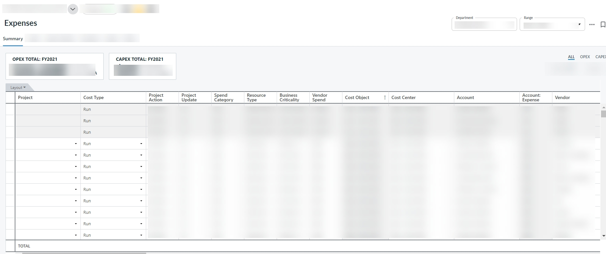

# Planificación integrada de inversiones

Importante: *Disponible con la* *suscripción a* ***Apptio Planning Standard***

Integrated Investment Planning permite a los responsables del presupuesto del proyecto planificar los costes relacionados con el proyecto junto con los costes operativos en un único plan integrado. Integrated Investment Planning introduce un atributo opcional Proyecto en todas las vistas de gastos. Si el gasto que está introduciendo no está relacionado con el proyecto, debe dejarlo en blanco. Si el gasto está relacionado con el coste del proyecto, seleccione un centro de costes que sea fuente de financiación del proyecto y etiquete el gasto con el identificador del proyecto

Para planificar los gastos de activos fijos, mano de obra, contratos y otros gastos financieros relacionados y no relacionados con proyectos, puede seguir la documentación existente para Gestionar los costes directos. Integrated Investment Planning introduce a continuación cambios en el proceso.

- El Centro de Coste es un campo obligatorio en cada tipo de gasto.
- El campo Objeto de Coste es de sólo lectura y se rellena automáticamente al seleccionar el Centro de Coste, basándose en la asignación de Objeto de Coste a Centro de Coste definida en los datos de referencia.
- El proyecto es un campo opcional en todos los tipos de gastos. Puede asignar un identificador de proyecto sólo a los gastos presupuestados para el proyecto.
- Al seleccionar el identificador del proyecto en la línea de gastos, se filtran automáticamente los valores del desplegable Centro de costes a los centros de costes aplicables para ese proyecto, tal y como se definen en los datos de referencia del proyecto.
- Cada tipo de gasto tiene un atributo de Tipo de Coste que puede establecerse como Ejecutar o Construir. Si la línea de gasto que está introduciendo está relacionada con el mantenimiento, la asistencia o los servicios relacionados con las aplicaciones y/o la infraestructura existentes, dichos gastos deben clasificarse como gastos de funcionamiento y los gastos asignados a nuevas inversiones e iniciativas deben clasificarse como gastos de construcción.

  

  Para más detalles sobre la planificación y asignación de mano de obra, véase [Planificación de recursos de mano de obra](labor-resource-planning.html).
