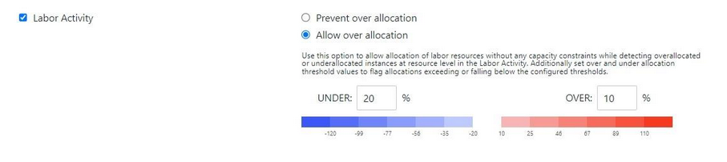
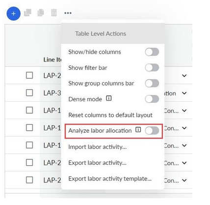
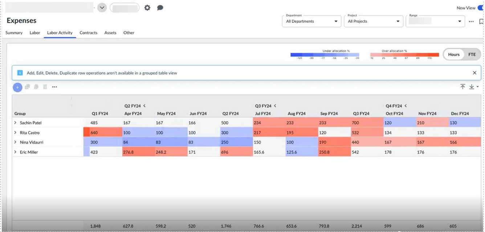
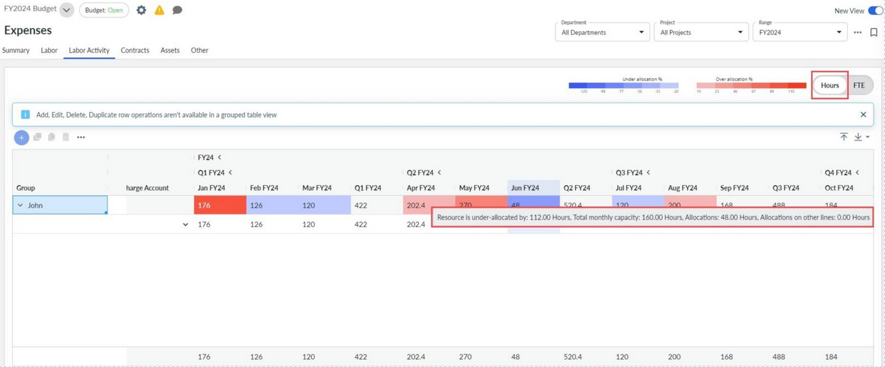
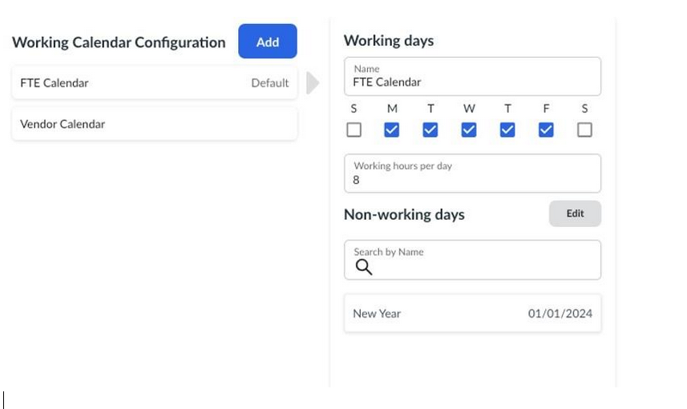

# Análisis de la imputación excesiva o insuficiente de la actividad laboral

Importante: *Disponible con la* *suscripción a* ***Apptio Planning Standard***

Recuerde: *la función de planificación integrada de inversiones (IIP) está habilitada.*

La mano de obra asignada suele representar una parte significativa del gasto total de un proyecto o inversión. Comprender cómo se utiliza la mano de obra es esencial para evaluar la capacidad disponible frente a la demanda, tomar decisiones de contratación, determinar cuándo pausar o detener proyectos no críticos e identificar recursos infrautilizados cuya capacidad se puede asignar mejor a otras áreas.

En muchas organizaciones, el **centro de costes de recursos** difiere del **centro de costes del** proyecto, y un único recurso laboral puede dar soporte a varios proyectos. Esto hace que la planificación de la capacidad sea más compleja y puede dar lugar a:

- **Subasignación**, donde se pierde capacidad valiosa
- **La sobreasignación**, que provoca retrasos en los proyectos y distorsiona la disponibilidad real de recursos
- Dificultad para evaluar la demanda total de puestos clave frente a la capacidad disponible
- Dificultades para estimar las necesidades de financiación de la mano de obra durante la elaboración del presupuesto

**La planificación integrada de inversiones (IIP)** aborda estos retos proporcionando controles para **evitar por completo la sobreasignación de recursos** o para **definir umbrales personalizados de sobreasignación y subasignación**. Estos umbrales facilitan la identificación de las asignaciones de trabajo que superan o no alcanzan los límites aceptables, lo que garantiza una previsión precisa de la capacidad y una planificación más eficaz del trabajo en toda la organización.

## Habilitar la configuración de planificación y asignación de actividades laborales

1. Navega a **Configuración** de administración (icono de engranaje) → **Perfil de la empresa**.
2. Asegúrese de que **la planificación integrada de inversiones (IIP)** esté habilitada primero; la actividad laboral no se puede activar sin ella.
3. Habilitar **actividad laboral**.
4. Elija si desea **evitar la sobreasignación** o **permitir la sobreasignación** de los recursos laborales.
   1. **Evitar la sobreasignación:** El sistema bloqueará las asignaciones que superen la capacidad de recursos disponible.
   2. **Permitir sobreasignación:** El sistema permitirá asignaciones por encima de la capacidad.
5. Si se permite la sobreasignación, especifique el **porcentaje de sobreasignación/subasignación** permitido.

   

   Una vez habilitada, la pestaña **Actividad laboral** estará disponible para planificar la mano de obra del proyecto.

## Habilitar el análisis de asignación de mano de obra

**Requisitos:** *Nueva página de experiencia de gastos habilitada.*

1. Vaya a **Gastos** → pestaña **Actividad laboral**.
2. Activar **nueva vista**
3. Haga clic en el menú **de puntos suspensivos**.
4. Seleccione **Analizar la asignación de mano de obra**.

   

Las celdas ahora estarán codificadas por colores para reflejar la utilización de la mano de obra:

- **Azul** : asignación insuficiente (por debajo del umbral configurado)
- **Rojo** : asignación excesiva (por encima del umbral configurado)
- **Sin color** : dentro de los límites permitidos

Las partidas de la línea de actividad laboral se agrupan por recurso, y cualquier asignación que se salga de los límites definidos se resalta con el color correspondiente. Las celdas sin color indican que la asignación se encuentra dentro del rango aceptable.

Puede pasar el cursor por encima de cualquier celda para ver la capacidad total del recurso y la cantidad asignada. Las asignaciones se pueden ver en **horas** o en **ETC**.

## Capacidad laboral

A cada recurso laboral se le asigna un calendario laboral que define sus días y horas de trabajo. Para obtener más información sobre cómo configurar calendarios, consulte [Calendarios de trabajo](../configure-working-days.html "El calendario laboral define cuántos días y horas laborables se utilizan para la planificación laboral, lo que influye en la conversión del equivalente a tiempo completo (ETC), la amortización de los costes laborales y los cálculos de gastos mensuales.").

En **Gastos** → **Mano de obra**, **la fecha de inicio**, **la fecha de finalización** y **la capacidad mensual de ETC** de un recurso determinan la capacidad disponible para la planificación. La capacidad laboral en horas se calcula utilizando la siguiente fórmula:

**Capacidad mensual = (días laborables mensuales × horas laborables diarias × cantidad de mano de obra mensual)**

Esta capacidad calculada se utiliza en la pestaña Actividad laboral para determinar el exceso y la falta de asignación.

**Ejemplo:**

Suponiendo un calendario gregoriano con la configuración del calendario laboral anterior (5 días a la semana, 8 horas al día) y un día no laborable para el día de Año Nuevo:

**Capacidad de trabajo para enero = (23 días laborables − 1 día festivo) × 8 horas = 176 horas**
