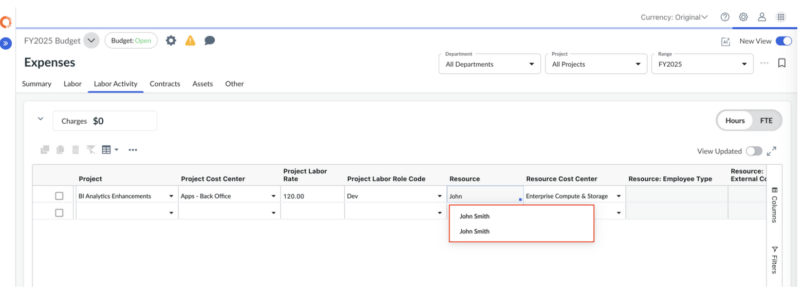
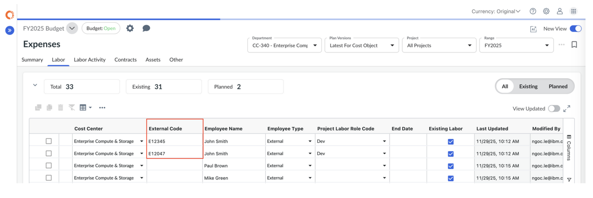
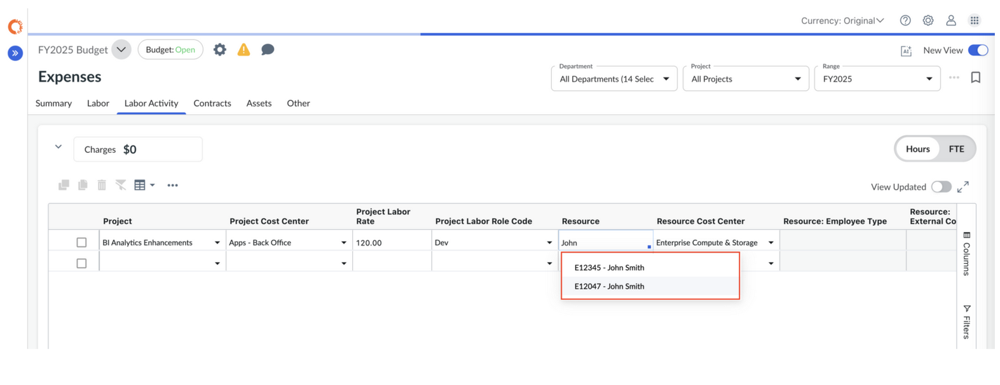
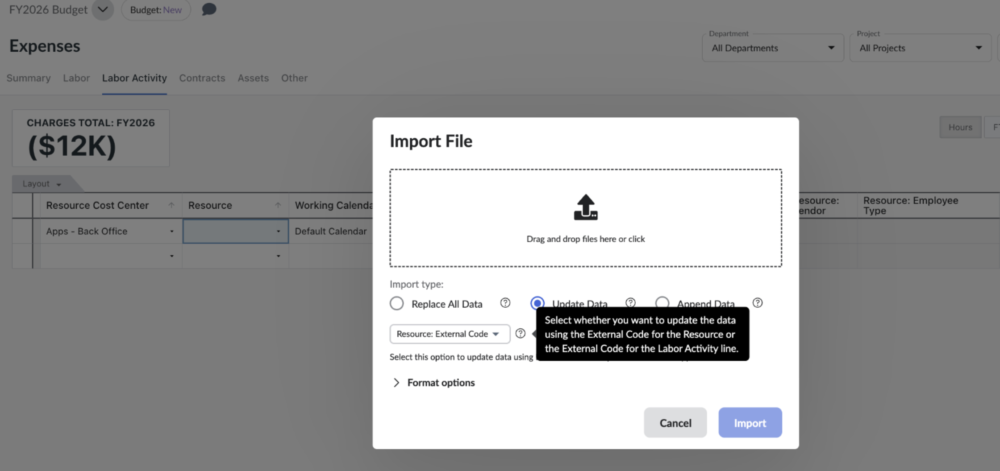

# Utilización de códigos externos para identificar recursos laborales

Importante: *Disponible con la* *suscripción a* ***Apptio Planning Standard***

Recuerde: *la función de planificación integrada de inversiones (IIP) está habilitada.*

De forma predeterminada, los recursos laborales se identifican en **Actividad laboral** por **nombre de recurso**. Cuando dos o más recursos comparten el mismo nombre, resulta difícil distinguirlos durante la asignación. Esto plantea retos tanto en la interfaz de usuario como al importar datos de actividad laboral.

Para garantizar que cada recurso sea identificable de forma única, Apptio Planning admite la asignación de un **código externo** (como el ID de empleado o el ID de puesto) a cada recurso laboral. Cuando está habilitado, los recursos aparecen como **<Código externo> – <Nombre>**, lo que permite una asignación precisa de proyectos, importaciones limpias y una sincronización fiable con sistemas externos de gestión laboral.

## Configuración del código externo

Para identificar de forma única los recursos, puede habilitar **el código externo** y asignar un identificador único desde su sistema de recursos humanos o laboral.

**Paso 1: habilitar código externo**

Nota: *Para realizar esta tarea se requieren los roles de administrador o responsable del proceso presupuestario.*

1. Vaya a **Configuración (icono de engranaje)** → **Perfil de la empresa**.
2. Habilite la opción **Código externo**.
3. La columna **Código externo** aparecerá en **Gastos** → **Mano de obra**.

Para más información, consulte [«Códigos externos](https://www.ibm.com/docs/en/apptio-commercial/planning-standard/saas?topic=configuration-external-unique-identifier "(se abre en una pestaña o una ventana nueva)") ».

**Paso 2: asignar códigos externos a los recursos laborales**

En la pestaña **Gastos** → **Mano de obra**, asigne un **código externo** único para cada recurso de mano de obra:

- **Empleados actuales:** utilice el ID de empleado, el número de empleado u otro identificador único de su sistema de RR. HH.
- **Trabajo planificado:** utilice el ID de posición o un código de marcador de posición único.
  - Cuando se cubra el puesto, sustituya el ID del puesto por el ID real del empleado.

**Paso 3: Ver códigos externos en la actividad laboral**

En la pestaña **Gastos** → **Actividad laboral**, el menú desplegable **Recursos** ahora mostrará los recursos como:

**<Código externo> – <Nombre>**

Esto garantiza que los nombres idénticos puedan distinguirse claramente.

Nota: Después de seleccionar un recurso, la columna **Recurso** solo mostrará el nombre del recurso. El código externo permanece visible en la columna **Recurso: Código externo**.

## Uso de códigos externos de recursos en las importaciones

- Al exportar una plantilla de actividad laboral, el archivo incluirá la columna «**Código externo de recurso** ».
- **Para importar** líneas de actividad de mano de obra utilizando el código externo de recursos, siga los pasos que se indican a continuación:
  1. Introduzca un código externo (por ejemplo, el número de identificación del empleado) para las partidas de mano de obra.
  2. Crea un archivo de importación de actividades de mano de obra CSV, asegurándote de que la columna «Recurso: Código externo» contenga el código externo correspondiente a cada recurso de mano de obra.
  3. Ve a Gastos > Actividad laboral y, en el menú Acciones, selecciona Importar actividad laboral.
  4. En el cuadro de diálogo «Importar archivo», selecciona «Actualizar datos».
  5. Selecciona «Recurso: Código externo» en el menú desplegable.
  6. Haz clic en «Importar».
- Resultado de la importación:
  - El sistema actualizará las líneas de actividad laboral del plan cotejando los registros en función de los valores del campo «Recurso: Código externo» del archivo « CSV ».
  - Si hay varias líneas de actividad laboral que utilizan el mismo «Código externo de recurso» y el usuario realiza la importación con la opción «Actualizar datos», se utilizará una combinación del «Código externo de recurso» y el «Código de partida» para identificar de forma unívoca las líneas que se van a actualizar.

    

Nota: Actualmente, la importación de datos de actividad laboral mediante **«Recurso: Código externo»** no es compatible con las importaciones realizadas a través de « Apptio » Costing mediante el Gestor de datos automatizado.
