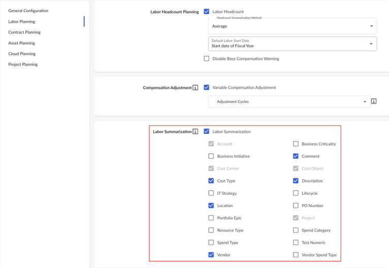

# Resumir las finanzas laborales

La función Resumir datos financieros de mano de obra le permite determinar cómo se agregan y presentan los datos de costes de mano de obra en la pestaña Resumen. Controla qué dimensiones (por ejemplo, centro de coste, cuenta, ubicación) se utilizan para agrupar y desglosar las líneas de costes laborales, garantizando que se obtiene el nivel adecuado de visibilidad y confidencialidad de las finanzas laborales.

Nota: Para configurar la integración de mano de obra se requieren los roles de Administrador o Propietario de Proceso Presupuestario.

## Cómo funciona

- Cuando se introducen partidas de mano de obra en la pestaña Mano de obra, el sistema utiliza las reglas de asignación de mano de obra definidas para generar asientos financieros por cuenta.
- Las **Configuraciones de Resumen Laboral** especifican qué dimensiones se utilizan para agrupar y agregar esas entradas financieras en la pestaña Resumen.
- Esto le permite actualizar los costes de mano de obra resumidos (por ejemplo, por Centro de Coste o Cuenta) en lugar de ver cada entrada de mano de obra individualmente.
- La elección de dimensiones de integración también ayuda a proteger los datos sensibles, ya que la agregación oculta los detalles de compensación a nivel individual.

## Dimensiones de resumen por defecto

Por defecto, las siguientes dimensiones están disponibles para resumir:

- **Cuenta**
- **Centro de costes**
- **Objeto de coste**
- **Comentario**
- **Ubicación**
- **Proyecto**
- **Proveedor**
- **Descripción**
- **Nombre de empleado**

**Centro de Coste, Objeto de Coste** y **Cuenta** están *siempre seleccionados* y no se pueden eliminar, ya que son necesarios para la agregación. Si la Planificación Integrada de Inversiones está activada, el Proyecto también se selecciona y no puede eliminarse.

Además de estos campos estándar, **las dimensiones personalizadas** que existen en los esquemas Financiero y Laboral también aparecerán en esta lista y pueden seleccionarse para la integración.

## Pasos de configuración

1. Navegue hasta **Ajustes (icono de engranaje) → Perfil de empresa**
2. En la sección de **recuento de mano de obra**, active la **integración de mano de obra**
3. Seleccione las dimensiones que desea utilizar para la integración.
4. Haga clic en **Guardar y Salir** para aplicar los cambios.

Los planes recién creados utilizarán automáticamente estas opciones de integración. Para los planes existentes, es necesario volver a crear el plan para aplicar los ajustes actualizados.

## Mejores prácticas

- Elija dimensiones amplias para la integración (como Centro de coste o Cuenta) cuando necesite confidencialidad y roll-up de alto nivel.
- Incluya dimensiones más granulares (como Ubicación o Descripción) sólo cuando se requiera una visibilidad detallada, y asegúrese de que existen controles de acceso a los datos. Consulte «[Ocultar datos confidenciales sobre el personal](hide-sensitive-labor-data.html "Los administradores pueden restringir la visibilidad de determinadas columnas de la pestaña «Personal» —como el nombre del empleado, el salario u otros datos sobre la remuneración— para que los usuarios que no dispongan de los permisos necesarios puedan consultar los registros de personal sin ver los campos confidenciales.") » para obtener más información.
