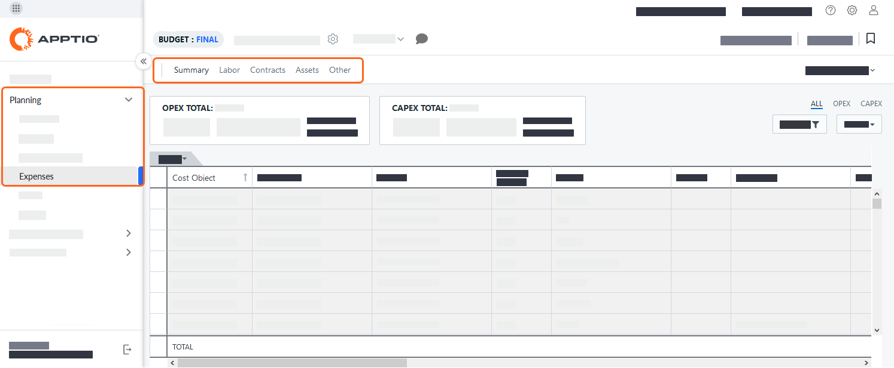

# Dimensiones personalizadas

Las siguientes tareas sólo pueden ser realizadas por usuarios asignados a los roles de Administrador o Propietario de Proceso Presupuestario. Para obtener más información sobre las funciones, consulte Permisos y funciones de Frontdoor.

Apptio Planning admiten dimensiones personalizadas, listas personalizadas y la edición del esquema de las tablas de partidas. Puedes hacer lo siguiente:

- Cree hasta 13 dimensiones personalizadas para ampliar las dimensiones incorporadas (véase [Aplicaciones de planificación: Gestionar datos de referencia](manage-reference-data.html) ). Utilice dimensiones personalizadas para definir los conjuntos de categorías de datos que amplían y mejoran su planificación y análisis financieros. Por ejemplo, cree una dimensión personalizada para asociar múltiples atributos como Iniciativa Empresarial con Código EDT.
- Cree listas personalizadas para definir los valores permitidos de un único atributo. Por ejemplo, puede crear una lista de estados con valores como Examinado, Entrevistado y Contratado para añadirlos a la tabla de partidas individuales de Mano de obra. Consulte [Listas personalizadas](custom-lists.html) para obtener más información.
- Personalizar el esquema de las tablas de partidas que se asignan a las pestañas de la vista Gastos:

  

Para acceder a dimensiones y datos personalizados:

En el menú de navegación, seleccione Configuración > Esquema.

## ¿Cuál es la diferencia entre Dimensiones personalizadas y Listas personalizadas?

| Dimensiones personalizadas | Listas personalizadas |
| --- | --- |
| Utilice dimensiones personalizadas para definir los conjuntos de categorías de datos que amplían y mejoran su planificación y análisis financieros. | Utilice listas personalizadas para definir los valores permitidos de un único atributo. |
| Las dimensiones personalizadas pueden incluir atributos personalizados, que contienen información complementaria estrechamente relacionada con la dimensión. | Las listas personalizadas no incluyen atributos personalizados. |
| Para crear una dimensión personalizada puede importar valores utilizando la integración de Costing Standard . | Para crear una lista personalizada debe introducir los valores manualmente. |
| Puede renombrar columnas en Datos de Referencia.  [Más información sobre cómo cambiar el nombre de una columna](manage_schema.html "Los esquemas definen la estructura de los datos en Apptio Planning. Especifican las tablas, campos y relaciones que determinan cómo se almacena, vincula y muestra la información en las pestañas de Gastos, como Trabajo, Contratos, Activos y Finanzas.").  - Cuando se cambia el nombre de la columna, los usuarios ven el nuevo nombre en las cabeceras de columna de la tabla de partidas. | No se puede cambiar el nombre de la columna en las listas personalizadas. |
| Puede filtrar una dimensión personalizada en una tabla de partidas. | No se puede filtrar una lista personalizada en una tabla de partidas. |
| Puede crear un máximo de 13 dimensiones personalizadas. | Puede crear un número ilimitado de listas personalizadas. |

Nota: Los datos de las dimensiones personalizadas eliminadas se borran de todos los planes y no pueden recuperarse.

## Gestionar dimensiones personalizadas

Consejo: Para crear una nueva dimensión personalizada o añadir un atributo a una dimensión, consulte [Añadir y gestionar atributos personalizados de dimensiones](manage_schema.html "Los esquemas definen la estructura de los datos en Apptio Planning. Especifican las tablas, campos y relaciones que determinan cómo se almacena, vincula y muestra la información en las pestañas de Gastos, como Trabajo, Contratos, Activos y Finanzas.").

## Descargar y rellenar plantillas de tablas de dimensiones personalizadas

Puede importar datos de referencia de Costing Standard. Al importar datos de referencia, Planning importa el conjunto de datos de referencia más reciente, independientemente de la configuración de fecha activa en Costing Standard. Véase [Integrar con transparencia de costes](integrate-ct.html "Si su organización utiliza tanto Apptio Costing Standard como una aplicación de planificación Apptio, puede integrarlas para compartir datos.").

1. En el menú de navegación, seleccione Configuración > Datos de referencia.
2. Seleccione la pestaña Dimensiones personalizadas.
3. Seleccione una tabla y luego seleccione  > Exportar.
4. En la ventana Exportar archivo, en Opciones de formato, puede cambiar el formato de los datos exportados.
5. Seleccione Exportar. Los datos de referencia se exportan como archivo.csv.
6. Abra el archivo de plantilla.csv descargado y añada los atributos adicionales que desee.

   NOTA : No modifique los títulos de las columnas ni la estructura de esta plantilla, ya que representa una estructura de datos obligatoria.
7. Guarde la plantilla en formato.csv para importarla a su aplicación Apptio Planning .

## Crear, importar y publicar una nueva dimensión personalizada

Una vez que haya creado el archivo.csv con los valores de dimensión que desea, puede crear la dimensión personalizada y, a continuación, cargar los valores de su archivo.csv en la dimensión.

1. Para crear una nueva dimensión personalizada, consulte [Añadir y gestionar atributos personalizados de dimensiones](manage_schema.html "Los esquemas definen la estructura de los datos en Apptio Planning. Especifican las tablas, campos y relaciones que determinan cómo se almacena, vincula y muestra la información en las pestañas de Gastos, como Trabajo, Contratos, Activos y Finanzas.").
2. Junto a la nueva dimensión personalizada, haga clic en Importar nuevo.
3. Siga las instrucciones que aparecen en pantalla para completar el proceso de importación de datos. Examine y verifique los datos importados:
   - Si sus datos parecen correctos y desea que estén disponibles en los planes, haga clic en Publicar.
   - Si observa problemas con sus datos y necesita solucionarlos antes de publicarlos, haga clic en Revertir.

## Eliminar una dimensión personalizada

Para eliminar una dimensión personalizada, consulte [Eliminar una columna de tabla de datos de referencia](manage_schema.html "Los esquemas definen la estructura de los datos en Apptio Planning. Especifican las tablas, campos y relaciones que determinan cómo se almacena, vincula y muestra la información en las pestañas de Gastos, como Trabajo, Contratos, Activos y Finanzas.")

PRECAUCIÓN:

Los datos de las dimensiones personalizadas eliminadas se borran de todos los planes y no pueden recuperarse.

**Tema principal:** [Visión general de los datos de referencia](../../it-planning/planning/edit-publish-reference.html "Las siguientes tareas sólo pueden ser realizadas por usuarios asignados a los roles de Administrador o Propietario de Proceso Presupuestario. Para obtener más información sobre las funciones, consulte Permisos y funciones de Frontdoor.")
