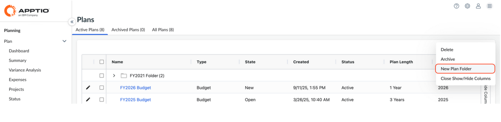
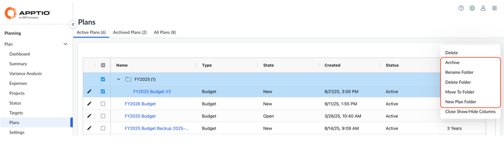

# Carpetas de planos

Para organizar tus planes y facilitar su localización, puedes utilizar carpetas de planes. En la página Planes, puede crear o gestionar carpetas y mover planes a las carpetas que haya creado.

Nota: Para crear y gestionar carpetas se requieren los roles de Administrador o Propietario de Proceso Presupuestario.

## Crear una carpeta de planes

Para crear carpetas de planes:

1. En el panel de navegación izquierdo, vaya a **Planes.**
2. En la parte superior derecha, haga clic en el **menú de desbordamiento de tres puntos**.
3. Haga clic en **Nueva carpeta de planes**.

   
4. En el cuadro de diálogo, introduzca un nombre de carpeta y haga clic en **Crear carpeta**.

## Ver y gestionar carpetas

Para acceder a tus carpetas y gestionarlas:

1. En el panel de navegación izquierdo, vaya a **Planes.**
2. Para ver los planes de una carpeta, haga clic en el **icono de la carita** situado junto al nombre de la carpeta.
3. Para cambiar el nombre de una carpeta, seleccione la casilla situada junto a la carpeta y, a continuación, seleccione el **menú de desbordamiento de tres puntos** y haga clic en **Cambiar nombre de carpeta**. En el cuadro de diálogo, introduzca un nuevo nombre de carpeta y, a continuación, haga clic en **Cambiar nombre**.
4. Para archivar una carpeta, seleccione la casilla situada junto a la carpeta y, a continuación, seleccione el **menú de desbordamiento de tres puntos** y haga clic en **Archivar**. Al archivar una carpeta se archivarán los planes que contenga.
5. Para eliminar una carpeta, seleccione la casilla situada junto a la carpeta y, a continuación, seleccione el **menú de desbordamiento de tres puntos** y haga clic en **Eliminar carpeta**. En el cuadro de diálogo de confirmación, escriba **ELIMINAR** en el cuadro de texto y seleccione si desea eliminar también los planes dentro de la carpeta, y haga clic en **Eliminar**.

## Añadir planes a una carpeta

Para mover planes a una carpeta:

1. En el panel de navegación izquierdo, vaya a **Planes.**
2. Seleccione las casillas de verificación situadas junto a los planes que desea mover y, a continuación, haga clic en el **menú de desbordamiento de tres puntos** y haga clic en **Mover a carpeta**.
3. En el cuadro de diálogo, seleccione una **carpeta** y haga clic en **Mover carpeta**.
