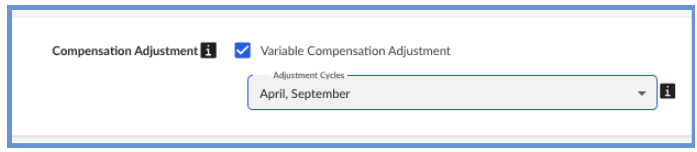
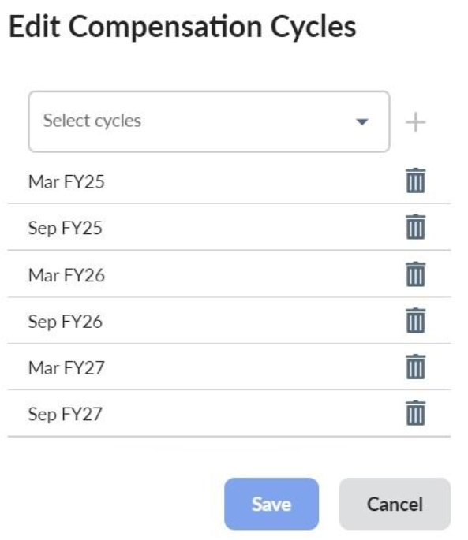
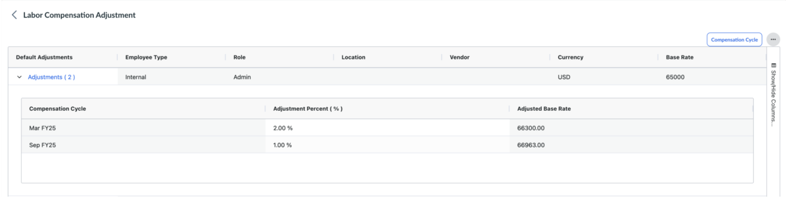
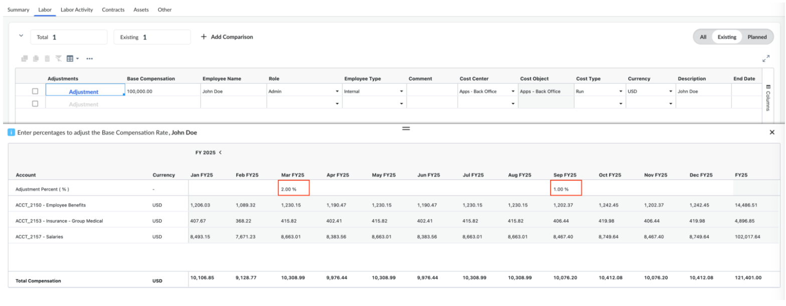

# Ajustes de la remuneración del trabajo

Los Ajustes de Remuneración Laboral permiten a las organizaciones modelizar los aumentos (o disminuciones) de remuneración a lo largo del tiempo dentro de Apptio Planning. Esta función ofrece una forma estructurada de contabilizar los ajustes salariales previstos, como aumentos por méritos, ajustes de mercado, ascensos o cambios en el coste de la vida.

Cuando esta opción está activada, los usuarios pueden definir porcentajes de ajuste y fechas de entrada en vigor que actualizan automáticamente los valores de remuneración base para los efectivos existentes o previstos. Los ajustes se aplican a partir de la fecha de entrada en vigor y se trasladan a los cálculos financieros, incluidos los costes laborales totalmente cargados y las asignaciones departamentales.

## Requisitos previos

Antes de poder utilizar esta función:

- La planificación de **la mano de obra** debe estar activada en **Configuración → Perfil de empresa**.
- Los Propietarios de Presupuesto necesitan los permisos **Ver Finanzas Sensibles** y **Ver Columnas Sensibles** para ver los campos de ajuste.

## Configurar los ajustes de compensación

1. Vaya a **Configuración → Perfil de la empresa → Planificación laboral.**
2. Activar **los ajustes de compensación variable**.
3. **Definir ciclos de compensación por defecto**
   1. Especifique los **Ciclos Retributivos** por defecto de su organización, normalmente alineados con los calendarios de aumento por méritos o de mercado.
   2. Seleccione los periodos en los que se permiten ajustes de compensación.
   3. Estos valores por defecto pueden modificarse posteriormente a nivel del plan.

   
4. **Configurar por plan**
   - Navegue hasta **Plan → Ajustes → Ajuste de la remuneración de la mano de obra**.
   - Seleccione el botón **Ciclo de compensación** y revise o ajuste los ciclos del plan actual.

   
5. **Definir porcentajes de ajuste por defecto**
   - La tabla de **ajuste de la remuneración de la mano de obra** extrae los tipos por defecto de la tabla de datos de referencia **de los tipos de la mano de obra**.
   - Para cada combinación de Funciones (Función, Proveedor, Ubicación, Tipo de empleado), especifique un porcentaje de ajuste por defecto para cada ciclo de compensación definido (por ejemplo, 2% en marzo, 1% en septiembre).
   - Opcionalmente, exporte una plantilla, actualice los porcentajes de ajuste y vuelva a importarla.

   
6. **Revisión de las tarifas ajustadas**
   1. El campo **Importe base ajustado** muestra el nuevo importe de compensación una vez que el ajuste surte efecto.
   2. En la **Nueva Vista**, el campo **Ajuste** aparecerá para cada partida de mano de obra, permitiéndole aplicar o anular tarifas directamente en la pestaña Mano de Obra.
   3. Los cambios se guardan automáticamente y se reflejan en los cálculos del plan.

## Permisos

Puede controlar quién puede ver o editar los ajustes de compensación:

- **ITPCompensationAdjustmentEdit** - Permite anular los porcentajes por defecto de los ciclos de compensación definidos.
- **ITPCompensationAdjustmentAllPeriodsEdit** - Permite editar los porcentajes de todos los periodos.
- **canEditPlanSettings** - Necesario para modificar la página de **Configuración del Plan**.
- **canViewPlanSettings** - Necesario para ver la página de **Configuración del Plan**.
- Por defecto, estos permisos se conceden a los roles **Admin** y **Propietario del proceso presupuestario**.
- Si desea que **los Propietarios de presupuesto** gestionen los ajustes de compensación, concédales los permisos adecuados en función de su modelo de gobernanza.

## Cómo planificar un ajuste retributivo

Puede modelar los cambios de remuneración directamente en su plan laboral, ya sea utilizando **la nueva vista** para ajustes interactivos basados en periodos o **la vista heredada** para un modelo de ajuste anual más sencillo.

***En Nueva Vista***

1. **Abrir el plan**
   1. Seleccione su plan y elija el **Departamento** adecuado.
   2. Navegue hasta **Planificación → Gastos → Mano de obra**.
2. **Abrir el cajón de ajustes**
   1. En la tabla Mano de obra, seleccione el botón **Ajuste** en la columna **Ajustes** para la fila de mano de obra que desea actualizar.
   2. El **cajón Ajustes** muestra los porcentajes predeterminados si se configuraron en la tabla **Ajustes del plan → Ajuste de la remuneración de la mano de obra**.
3. **Revisar y modificar los ajustes**
   1. Puede anular los porcentajes por defecto para periodos específicos si dispone de los permisos necesarios.
   2. El cajón muestra el **coste de mano de obra totalmente cargado por Cuenta** para la línea de mano de obra seleccionada-estas cuentas se alinean con sus **Reglas de Asignación de Mano de Obra** configuradas.
   3. Los ajustes actualizan automáticamente el coste laboral total, lo que le permite ver el impacto financiero en tiempo real.

Nota: Si están activados los Ajustes variables de la remuneración de la mano de obra, los ajustes de la mano de obra no pueden modificarse en la vista heredada. Si esta función está habilitada, la única forma de restaurar los ajustes laborales en la vista heredada es deshabilitar la función en el perfil de la empresa y volver a crear manualmente el plan (esto eliminará los códigos de los elementos).

***En Legacy View***

1. **Abrir el plan**
   1. Seleccione su plan y elija el **Departamento** adecuado.
   2. Navegue hasta **Planificación → Gastos → Mano de obra.**
2. **Introduzca los detalles del ajuste**
   1. **Fecha de entrada en vigor del** ajuste - Fecha en la que comienza el ajuste.
      1. Si el plan abarca varios años, el ajuste se acumula año tras año a partir de esa fecha.
   2. **Ajuste %** - El índice de aumento (positivo) o disminución (negativo).
3. **Resultados de la revisión**
   1. El sistema aplica el ajuste descendente para el resto del periodo del plan.
   2. Puede revisar el impacto actualizado de los costes en la pestaña **Resumen**, donde se reflejan las partidas financieras ajustadas en función de **las reglas de asignación de mano de obra** configuradas.

**Interacción con las reglas de asignación temporal a nivel de plan**

Cuando se configuran **reglas de asignación de mano de obra** con vigencia temporal a nivel de plan, los ajustes salariales utilizan la tasa de asignación vigente para el período correspondiente en el plan.

**El coste total que** se muestra en el panel **«Ajustes»** refleja la tasa de asignación temporal aplicable a cada período, en lugar de la tasa global predeterminada. Esto garantiza que los ajustes de las prestaciones sigan ajustándose a las hipótesis de distribución definidas en el plan.

Por ejemplo, si un plan establece una tasa de prestación del **7 % en el primer año** y **del 8 % en el segundo año**, cualquier ajuste salarial que se aplique en el segundo año se calculará utilizando la **tasa de prestación del 8** %. Dado que los tipos de asignación varían con el tiempo, los ajustes salariales se calculan automáticamente utilizando el tipo vigente en el periodo en el que se aplica el ajuste.
