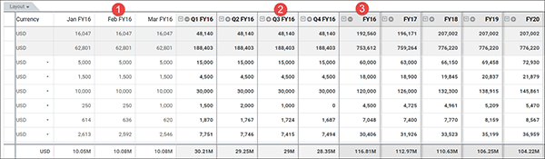

# Plan plurianual

Utilice las funciones de planificación plurianual para planificar y realizar un seguimiento de sus finanzas de TI en un horizonte temporal continuo y plurianual. Puede respaldar planes a largo plazo y previsiones continuas más allá de los límites del ejercicio fiscal.

Apptio Planning las aplicaciones soportan planes de hasta seis años. Un plan que abarque varios años le ayudará a hacer lo siguiente:

- Comprender mejor el impacto financiero de los recursos laborales, los contratos y los activos previstos a lo largo de varios años (véase [Gestión de activos](manage-assets.html) ).
- Previsión con hasta 12 meses (o cuatro trimestres completos) de datos reales para respaldar las previsiones renovables (véase [Planificación y previsión presupuestarias](budget-planning-forecasting.html) ).

## Sobre el ajustador de plazos

Utilice el ajustador de periodos de tiempo para obtener datos resumidos. Se parece a esto:

Así funciona el ajustador de periodos:

- La zona sombreada en azul indica el marco temporal actual. Para ajustar el periodo de tiempo, haga clic y arrastre los tiradores izquierdo y derecho.
- Los valores de los KPI en la vista Resumen se ajustan al periodo de tiempo establecido mediante el ajustador de periodo de tiempo.
- El gráfico de barras apiladas para un plan que abarca varios años incluye las siguientes opciones de visualización adicionales: línea de tendencia de los datos reales y posibilidad de agregar datos utilizando distintos periodos de tiempo (como una previsión renovable de cuatro trimestres).

## Funciones multianuales en los cuadros

Al trabajar con tablas de partidas individuales, puede ajustar la parte visible de un plan que abarca varios años. Consulte [Personalizar, guardar y compartir diseños de tabla.](customize-save-share.html)

- Ajuste los datos temporales para mostrar u ocultar meses, trimestres o ejercicios específicos.
- Mostrar u ocultar columnas específicas del año fiscal.
- Los datos escalados en el tiempo del siguiente ejemplo están configurados para mostrar (1) los meses y el total trimestral del trimestre actual, (2) los trimestres restantes del año actual y (3) los totales del ejercicio de los años anteriores.

Puede guardar los ajustes de la tabla de partidas individuales en un diseño de tabla personalizado. Además, los propietarios y administradores de procesos presupuestarios pueden hacer que un diseño personalizado sea el diseño predeterminado para otros usuarios. Consulte [Crear y compartir diseños de tabla personalizados](customize-save-share.html).

Los valores de planificación de recursos generados para mano de obra, contratos y activos (véase [Planificación de mano de obra](labor-planning.html "Utilice las funciones de planificación de la mano de obra para incorporar los costes basados en los recursos a su proceso general de planificación presupuestaria. Los costes laborales son siempre un componente importante, posiblemente el mayor, de sus presupuestos de TI. Ahora puede desglosar los costes basados en recursos por dimensiones específicas de la mano de obra, como el tipo, la ubicación y la función, utilizando reglas de cálculo de costes de mano de obra coherentes y gestionadas de forma centralizada.")) pueden extenderse a lo largo de la duración de un plan que abarque varios años. Véase [Planificación laboral.](labor-planning.html "Utilice las funciones de planificación de la mano de obra para incorporar los costes basados en los recursos a su proceso general de planificación presupuestaria. Los costes laborales son siempre un componente importante, posiblemente el mayor, de sus presupuestos de TI. Ahora puede desglosar los costes basados en recursos por dimensiones específicas de la mano de obra, como el tipo, la ubicación y la función, utilizando reglas de cálculo de costes de mano de obra coherentes y gestionadas de forma centralizada.") La planificación de recursos puede incluir lo siguiente:

- Los costes de mano de obra actuales o planificados sin fecha de finalización, o con una fecha de finalización posterior al plan plurianual, se extenderán a lo largo de todo el plan (véase [Crear un plan de mano de obra](create-labor-plan.html) ).
- Ajustes de compensación laboral que se aplican desde la Fecha de vigencia del ajuste hasta la duración del plan (consulte [Plan para ajustes de compensación laboral](plan-labor-compensation.html "Los Propietarios del Proceso Presupuestario o los usuarios con permisos de propietario para un Objeto de Coste pueden contabilizar los ajustes planificados a las tasas de compensación laboral. Esto puede hacerse para el trabajo en curso o previsto. Puede especificar un cambio porcentual en la remuneración base por recurso laboral y la fecha en la que se hará efectivo el cambio.") ). Los ajustes de las retribuciones laborales son recurrentes anualmente. Por ejemplo, un aumento del 3% efectivo a partir del 1 de abril del año en curso supondría un aumento interanual del 3%.

Los valores de los KPI en las tablas de partidas individuales se refieren únicamente al ejercicio en curso y se etiquetan en consecuencia. Los KPI por partidas no se ajustan en función de si los periodos fiscales son visibles o no.

Al importar o exportar datos financieros, las aplicaciones Apptio Planning admiten hasta 72 periodos de tiempo. Cada periodo de tiempo se etiqueta de P1 a P12, o P1 FYnnnn, donde P1 representa el primer periodo del año fiscal y nnnn representa el año fiscal de cuatro dígitos. Véase [Introducir o importar datos de partidas individuales](enter-import-line.html "Una vez abierto un plan presupuestario o una previsión, los propietarios del presupuesto reciben una notificación por correo electrónico y pueden empezar a introducir los datos de las partidas y presentar los planes. Los Propietarios de Departamento, los Propietarios de Servicio y los Propietarios de Proyecto pueden introducir o importar sus datos de partidas y presentar sus planes.") y [Exportar y rellenar tablas o layouts de partidas individuales](export-populate-line.html).

Al comparar dos versiones o planes, las columnas de comparación son adyacentes a las columnas de totales. Ver [Comparar versiones o planes](compare-versions-plans.html). Las cabeceras verdes indican comparaciones de versiones, mientras que las moradas indican comparaciones de planes.

CONSEJOS:

- Al crear un nuevo plan, especifique un plan a 1 o 6 años (véase [Crear un plan o previsión presupuestaria](create-budget-plan.html) ).
- Cuando se crea un nuevo plan plurianual utilizando un plan de un solo año, los datos del primer año del plan original se copian en los datos del primer año del nuevo plan, aunque los periodos fiscales del plan original y del nuevo sean diferentes.
- Al publicar un plan plurianual en Costing Standard, las aplicaciones Apptio Planning publicarán 72 meses de datos en una única acción de publicación (véase [Integración con Transparencia de costes](integrate-ct.html "Si su organización utiliza tanto Apptio Costing Standard como una aplicación de planificación Apptio, puede integrarlas para compartir datos.") ).
