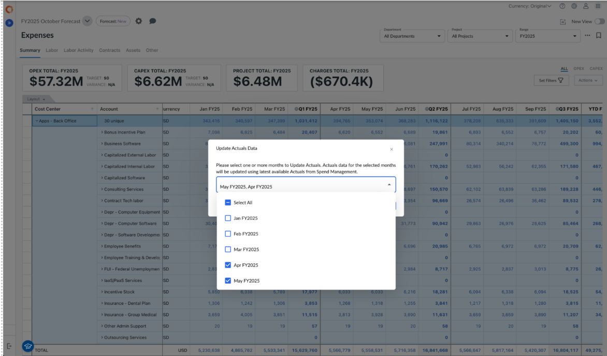

# Actualizar datos reales en planes de previsión

Nota: *Para actualizar los datos reales se requieren roles de administrador o responsable del proceso presupuestario.*

Los administradores y los usuarios Propietarios de procesos presupuestarios pueden actualizar los datos de gastos reales en un plan de previsiones sin necesidad de volver a crear el plan cada vez que lleguen nuevos datos reales.

Los datos reales pueden actualizarse en los planes de previsión que se encuentran en estado **NUEVO** o **ABIERTO**.

En el Plan de previsión, los datos financieros reales se pueden consultar en la pestaña «**Gastos > Resumen** ». Las partidas individuales reales se identifican por el valor **del «Tipo de partida individual»,** que está establecido en «**Valores reales** ».

## Cómo actualizar los datos reales

1. Abra su plan de previsiones y vaya a la página **Gastos**.
2. Haga clic en el **menú Elipses→** **Actualizar datos reales**.
3. En la ventana emergente, utilice el desplegable para seleccionar los **meses** cuyos valores reales desea actualizar.
4. Haga clic en **Actualizar** para actualizar los datos de los periodos elegidos.

