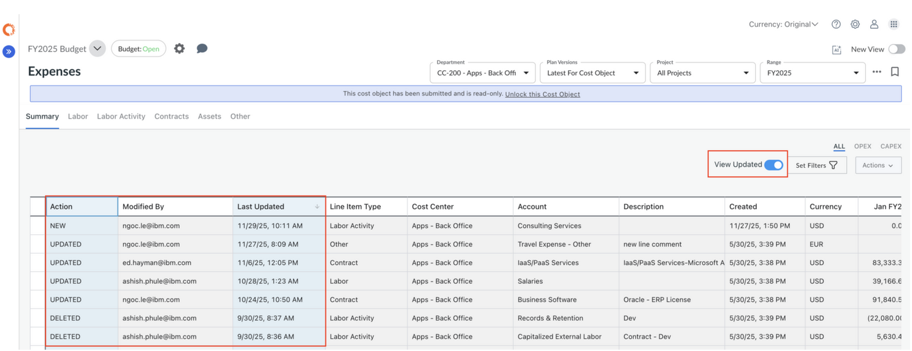

# Ver partidas actualizadas

La función **Ver elementos actualizados** le permite identificar rápidamente qué ha cambiado en un plan desde la última **presentación** o **instantánea**. Cuando está habilitado, el sistema filtra la tabla para mostrar solo las partidas individuales que se han añadido, actualizado o eliminado, lo que agiliza y mejora la precisión de las revisiones y aprobaciones.

Esta vista está disponible en la página **Gastos**. Cuando se selecciona un departamento de grupo o varios departamentos, la vista actualizada compara **la última instantánea** de cada departamento secundario con su **instantánea anterior** y muestra las diferencias.

**Ventajas más importantes:**

- Aísle rápidamente los cambios de grandes conjuntos de datos
- Mejora la precisión de las revisiones centrándote únicamente en las líneas modificadas
- Acelera la colaboración y las aprobaciones resaltando lo que requiere atención
- Proporcionar transparencia sobre quién realizó los cambios y cuándo

## Cómo funciona

1. Activa la opción **«Ver actualizaciones»** en la página «Gastos».
2. La tabla se actualiza inmediatamente para mostrar solo las líneas que han cambiado desde la última instantánea.
3. Cada línea mostrada incluye una columna **Acción** que describe el tipo de actualización, junto con las columnas **Modificado por** y **Última actualización** para mostrar quién realizó el cambio y cuándo.

   |  |  |
   | --- | --- |
   | **Acción** | **Descripción** |
   | **Nuevo** | Se ha añadido una nueva partida. |
   | **Actualizado** | Se modificó una partida existente. |
   | **Suprimida** | Se eliminó una partida. |

**Notas adicionales:**

- **Las líneas importadas** se marcan como **Nuevas** y muestran la marca de tiempo y el nombre de usuario de la importación.
- **Los datos financieros generados** (mano de obra, actividad laboral, contratos, activos) se marcan como **«Actualizados»** y reflejan las últimas actualizaciones realizadas en sus datos de origen.
- Los cambios aplicados a través de **Actualizar datos de referencia** o **Actualizar datos reales** no aparecen en el modo Ver actualizado.
- Los planes creados a partir de una línea de base conservan los valores **de Última actualización** de la línea de base para esos elementos.
