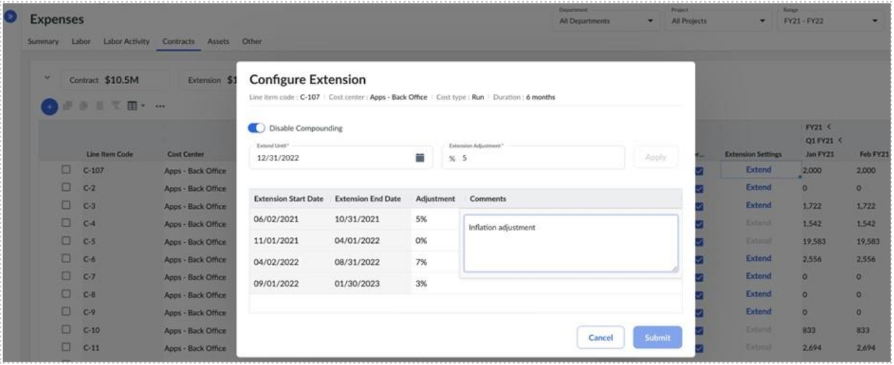
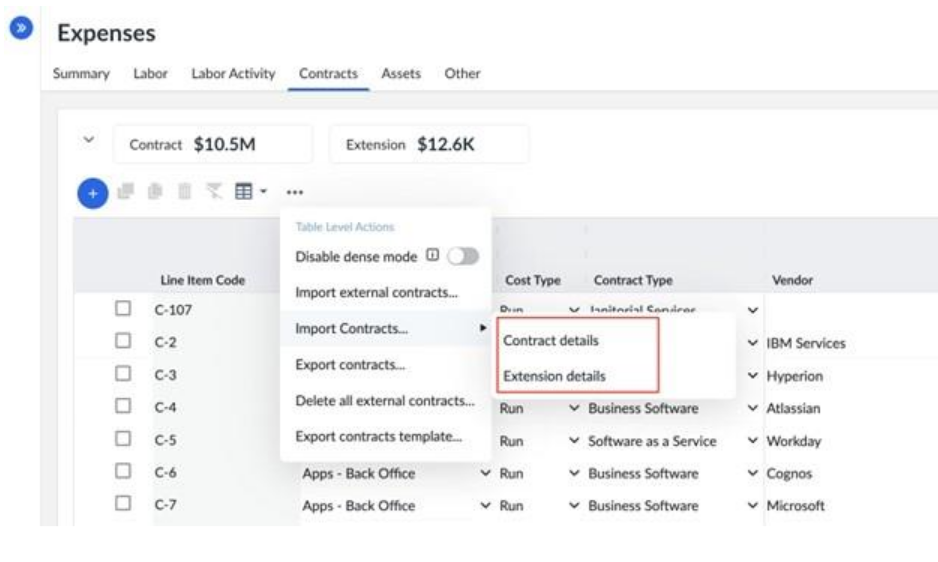
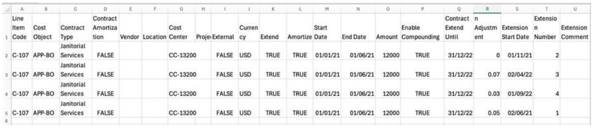

# Prórrogas de contratos

Apptio La planificación permite prorrogar los contratos más allá de su fecha de finalización original, con distintas posibilidades según se utilice la **vista anterior** o la **nueva**.

## Vista heredada (extensión básica)

En la experiencia heredada, cuando haga clic en **Ampliar** e introduzca un **Ajuste de ampliación (%)**, Apptio Planning lo hará:

- Aumentar el **importe del contrato** en el porcentaje especificado
- **Extender automáticamente el contrato hasta el final del plan**
- Aplicar el **porcentaje de ajuste** a todo el periodo de prórroga

Esto proporciona una elevación simple, pero **no** admite la capitalización ni las ampliaciones escalonadas múltiples.

Pasos para prorrogar un contrato (Legacy View)

1. Navegue hasta la pestaña **Gastos → Contratos**
2. En la partida del contrato, marque la **casilla Ampliar**.
3. Introduzca el **Ajuste de prórroga (%)** para aumentar el importe del contrato para el período de prórroga.
4. Seleccione el valor **de «Desplazamiento de la prórroga»** como **«Al día siguiente»** o «**Al mes siguiente** ». Esta opción se puede configurar cuando el método de amortización del contrato está establecido en **«Línea recta por duración»** o «**Línea recta por duración (calendario personalizado)** ».
   1. **Al día siguiente** : la prórroga del contrato entra en vigor el día inmediatamente posterior a la fecha de finalización del contrato vigente.
   2. **El mes que viene** : la prórroga del contrato entrará en vigor el mes siguiente a la fecha de finalización del contrato actual.

## Nueva vista (Extensiones compuestas)

La nueva vista introduce ampliaciones flexibles y compuestas. Ahora puedes:

- Aplicar **múltiples prórrogas de contrato**, cada una con su propia tarifa
- Elija si los ajustes deben **acumularse en el tiempo**
- Modelizar con precisión las pautas de renovación plurianual o las subidas de precios

Esto permite una modelización más realista de los contratos del mundo real, especialmente los que tienen renovaciones anuales, precios escalonados o tarifas de proveedor crecientes.

Pasos para prorrogar un contrato (Nueva vista)

1. Vaya a la pestaña **Gastos → Contratos** con la opción Nueva vista activada.
2. En la partida del contrato, marque la **casilla Ampliar**.
3. Esto activa el **botón Extender** en la columna **Configuración de la extensión** - haga clic en él.
4. Aparecerá el cuadro de diálogo **Configurar extensión**. Introduce lo siguiente:
   1. **Prorrogar hasta** - la nueva fecha de finalización del contrato
   2. **Ajuste de la ampliación (%)** - porcentaje de aumento que se aplicará a la ampliación
   3. **Desplazamiento de extensión**
      - Configurable si el método de amortización del contrato es **«Lineal por duración»** o **«Lineal por calendario personalizado de duración»**
      - **Al día siguiente** : la prórroga del contrato entra en vigor el día inmediatamente posterior a la fecha de finalización del contrato vigente.
      - **El mes que viene** : la prórroga del contrato entrará en vigor el mes siguiente a la fecha de finalización del contrato actual.
   4. **Activar acumulación** : activa si cada ampliación debe basarse en el valor ajustado anteriormente
5. Haga clic en **Aplicar** para generar el programa de ampliación.
6. El sistema creará una tabla de ampliación con las fechas de inicio y fin calculadas.
7. Opcionalmente, puede **añadir comentarios para cada periodo de prórroga**.
8. Si **la capitalización está activada**, puede ajustar la tasa individualmente por extensión.
9. Haga clic en **Enviar** para finalizar y aplicar la ampliación.

Nota: Si amplía un contrato utilizando la nueva vista y luego vuelve a la vista heredada, la modificación de la extensión en la vista heredada lo revertirá al modelo de extensión básico (no compuesto) - cualquier extensión compuesta previamente configurada se perderá.

Pasos para importar y exportar prórrogas de contrato (Nueva vista)

***Contratos de exportación y prórrogas***

1. **Cambie a la nueva vista**. (Póngase en contacto con su administrador si no está activado)
2. Vaya a la pestaña **Gastos → Contratos**.
3. Abre el **menú** **de la tabla Elipsis → Exportar contratos… → Exportar para volver a importar**
4. Recibirá **dos archivos** :
   1. \* **\_Contract.csv - datos básicos del contrato**
   2. \* **\_Contract-Extensions.csv - todos los periodos de prórroga y porcentajes de ajuste**

***Contratos de importación***

Los detalles del contrato y los detalles de la ampliación deben importarse por separado:

**Paso 1 - Importar los datos del contrato**

1. Vaya a la pestaña **Gastos → Contratos** con la opción Nueva vista activada.
2. Abra el **menú Elipses (...)** de la tabla→ **Importar contratos.... → Detalles del contrato**
3. Seleccione **Reemplazar todo** (borra todos los contratos) *oActualizar* **datos** (actualiza el código de partida / código externo coincidentes)
4. Haga clic en **Importar**

**Paso 2 - Importar los datos de la prórroga del contrato**

1. Abra el **menú Elipses (...)** de la tabla→ **Importar contratos.... → Detalles de la extensión**
2. Seleccione **Sustituir todo** (borra todas las prórrogas de contrato) *o Actualizar* **datos** (actualiza el Código de partida / Código externo coincidentes)
3. Haga clic en **Importar**

Nota: La importación de los detalles del contrato por sí sola *no* importa las extensiones. Las extensiones deben cargarse siempre por separado.

***Formato del expediente de prórroga de contrato***

Cada fila debe incluir:

- **Código de partida** - vincula la prórroga a un contrato específico
- **Número de extensión** - en orden secuencial (1 = primera extensión, 2 = segunda, etc.)
- **Contrato prorrogar hasta** - debe ser el **mismo para todas las prórrogas de ese contrato**
- **Enable Compounding** - TRUE para permitir múltiples periodos ajustados
- **Porcentaje de ajuste** : introducido como decimal (por ejemplo, 0.05 para el 5%)
- **Comentario de extensión** - notas opcionales por extensión

**Opcional:** Fecha de inicio de la prórroga - si se omite, Apptio la calculará automáticamente.
