# notas de la versión 2024

## 3.83 - 23 de diciembre de 2024

Esta versión introduce la función de ajustes variables de la remuneración de la mano de obra, que proporciona una mayor flexibilidad en la modelización de los costes laborales. Con esta funcionalidad, puedes:

Ajustes de la retribución variable del personal

- Aplicar mensualmente ajustes porcentuales a los salarios base, lo que permite una planificación precisa de las retribuciones.
- Defina ciclos de compensación por defecto y aumentos por méritos por función para agilizar los ajustes salariales en toda su plantilla.
- Modele cambios dinámicos en la remuneración impulsados por aumentos de méritos, ajustes del mercado o actualizaciones de las políticas.

  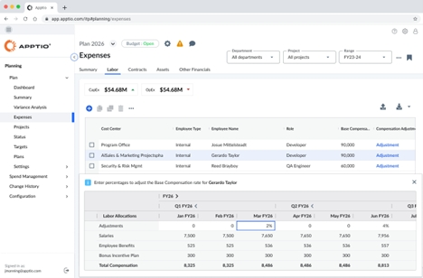

  Para más información, véase [Configuración de los ajustes de las indemnizaciones](../planning/plan-labor-compensation.html "Los Ajustes de Remuneración Laboral permiten a las organizaciones modelizar los aumentos (o disminuciones) de remuneración a lo largo del tiempo dentro de Apptio Planning. Esta función ofrece una forma estructurada de contabilizar los ajustes salariales previstos, como aumentos por méritos, ajustes de mercado, ascensos o cambios en el coste de la vida.") laborales.

Corrección de errores

- Se ha resuelto un problema por el que al importar datos de actividad laboral no se rellenaba el centro de coste de recursos.
- Se ha resuelto un problema por el que no se mostraban los campos en la pestaña Contratos de la vista Nuevo gasto.
- Se ha solucionado un problema por el que no se podían buscar las filas de la dimensión Proyectos cuando el recuento de registros superaba los 10.000.
- Se ha corregido un problema por el que el cambio de nombre de un atributo del proyecto registraba incorrectamente dos eventos en el historial de cambios en lugar de un único evento.
- Se ha mejorado el registro de eventos Crear plan para que incluya detalles que indiquen si se ha seleccionado (Verdadero) o no (Falso) la opción Copiar sobre códigos de partidas individuales.
- Se ha corregido un problema por el que el Historial de cambios no registraba los eventos de fallo cuando fallaba una acción Crear plan. Ahora el Historial de cambios capturará y mostrará correctamente los registros de los intentos fallidos de creación de planes.

## 3.82 - 2 de diciembre de 2024

Seleccione el período fuente para la importación de planes de Apptio Costing

Los Propietarios de Centros de Coste tienen ahora la posibilidad de seleccionar el periodo fuente al importar datos de referencia del plan desde Apptio Costing. Anteriormente, el sistema utilizaba por defecto el último periodo.

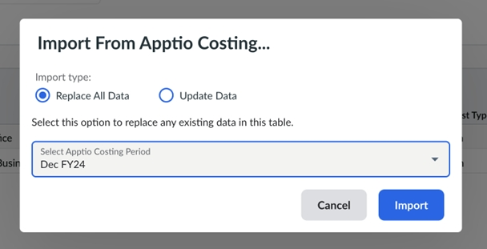

Contrato Total KPI

Para los planes de Previsión, el KPI Total de Contrato muestra ahora tanto el Total de Contrato (real más previsión) como el Total de Contrato Previsto para el periodo de tiempo seleccionado.

Total del contrato : Importe total del contrato para los periodos histórico y previsto.

Total de la previsión : Importe total del contrato sólo para los periodos de previsión.

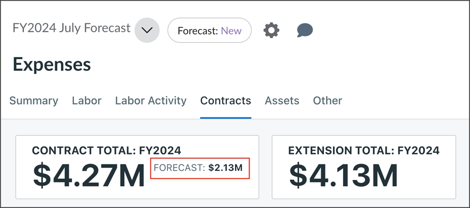

Registro mejorado para el análisis de varianza

Esta actualización introduce un registro detallado de las actividades de análisis de desviaciones, lo que proporciona una mayor transparencia y trazabilidad de las acciones clave:

Creación de un nuevo análisis de desviación : Ahora se generan registros cuando se crea un nuevo análisis de desviación, capturando información como el nombre del plan y la configuración de la desviación.

Añadir/modificar expl icaciones de análisis de desviaciones : Cualquier adición o modificación a las explicaciones de análisis de desviaciones se registra, incluyendo detalles como el texto antes y después, el objeto de coste, la cuenta y el plan asociado.

Corrección de errores

- Se ha resuelto un problema por el que faltaba "Es empleado existente" en la tabla Gastos > Mano de obra de la vista heredada cuando estaba activada la mano de obra racionalizada.
- Se ha solucionado un problema por el que las funciones de importación y exportación no funcionaban con las listas personalizadas que contenían el carácter "/" en el nombre.
- Se ha corregido un problema por el que la exportación de datos del plan que contenían los símbolos "&" o "," daba lugar a un archivo con formato incorrecto.
- Se ha corregido un problema por el que las dimensiones marcadas como obligatorias no se aplicaban como requeridas.
- Se ha corregido un problema por el que se enviaban periodos fiscales nulos en la solicitud de extracción de entidad a ADM, lo que provocaba que ADM importara por defecto planes del periodo fiscal de calendario actual en lugar del periodo fiscal seleccionado.
- Se ha solucionado un problema por el que los usuarios con permisos "Ver datos confidenciales" y "Ver datos financieros confidenciales" no podían publicar datos laborales confidenciales en Apptio Costing.
- Se ha solucionado un problema por el que el cambio entre la vista anterior y la nueva fallaba si había más de 20 diseños privados. - Se ha corregido un problema en la nueva vista por el que los filtros se restablecían al seleccionarlos, lo que impedía a los usuarios aplicar filtros correctamente.
- Se ha resuelto un problema por el que, si SDP o PFP no están activados, el Tipo de transacción aparecía incorrectamente en el menú Agrupar por de la pestaña Resumen.

## 3.81 - 18 de noviembre de 2024

Formato de fecha y número específico del usuario

La planificación se integra ahora con la configuración regional del usuario de Frontdoor, ajustando automáticamente los formatos de fecha y número para que coincidan con la configuración regional de cada usuario. Esta mejora permite a los usuarios personalizar la forma en que se muestran las fechas y los números, creando una experiencia más personalizada. Cada país o región sigue normas y convenciones distintas para representar los números. Las variaciones pueden incluir los símbolos utilizados para la separación decimal, los formatos de agrupación, la visualización de divisas y el orden del año, mes y día en las fechas.

Qué esperar

- A partir de la versión 3.81, Planificación mostrará las fechas y los formatos numéricos basándose en la configuración regional del usuario configurada en Frontdoor, en lugar de en la configuración regional del navegador.
- La configuración regional predeterminada en Frontdoor es en\_US, por lo que si los usuarios no han establecido una configuración regional preferida, las fechas y los números aparecerán en formato en\_US.
- Este cambio sólo se aplica a la visualización e introducción de fechas y números dentro de la aplicación. Para los archivos de importación/exportación, no se aplica la configuración regional de Frontdoor; los usuarios deben especificar los formatos de fecha y número en las opciones de formato del cuadro de diálogo de importación/exportación.

  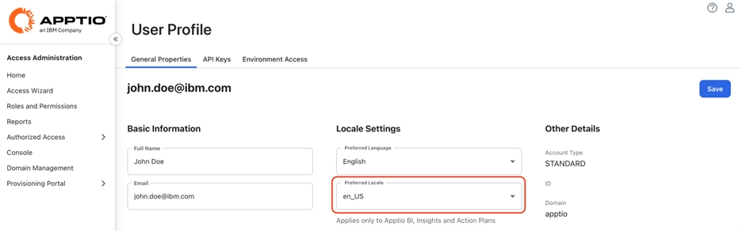

  Para más información, consulte [Configurar el formato de fecha y número](../planning/config-date-num-format.html).

Corrección de errores

- El menú desplegable Plan de comparación en el cuadro de diálogo Añadir comparación o Comparar acceso directo muestra ahora los nombres de los planes en orden alfabético, lo que facilita y agiliza la localización del plan deseado para la comparación.
- Se ha corregido un problema por el que las funciones de importación y exportación no funcionaban con las listas personalizadas que contenían el carácter "/" en el nombre.
- Se ha corregido un problema de ordenación en la columna "Nombre de usuario" de la tabla Configuración > Permisos de objetos de coste.
- Se ha solucionado un problema por el que la plantilla de exportación de proyectos proporcionaba encabezados incorrectos para la importación en los datos de referencia del proyecto.
- Se ha solucionado un problema en los entornos PFP que impedía la actualización de los datos de referencia debido a una limpieza incompleta de las dimensiones personalizadas en las tablas Asignación y Demanda.

## 3.80 - 4 de noviembre de 2024

Períodos de comparación personalizados para la configuración de desviaciones

Los Propietarios de Procesos Presupuestarios pueden ahora seleccionar un Periodo de Comparación personalizado al configurar el análisis de desviaciones para comparar los reales con el plan. Para mejorar la claridad, los nombres de las columnas de datos reales también se han actualizado para incluir "Datos reales", como "Sept FY24 Datos reales"

Se trata de una versión inicial destinada a respaldar futuras mejoras, que permitirán realizar comparaciones entre planes en cualquier intervalo de tiempo, como una desviación de todo un año.

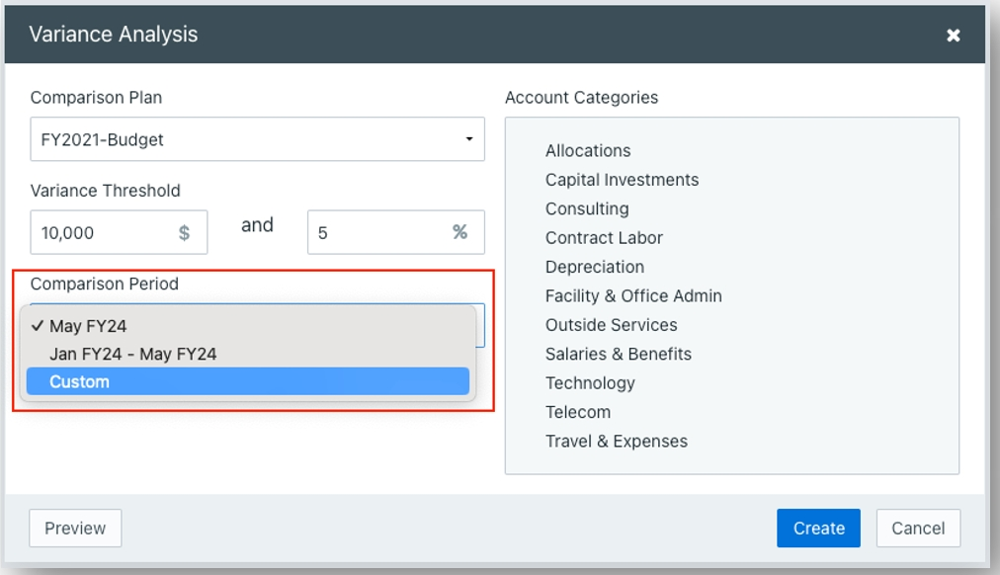

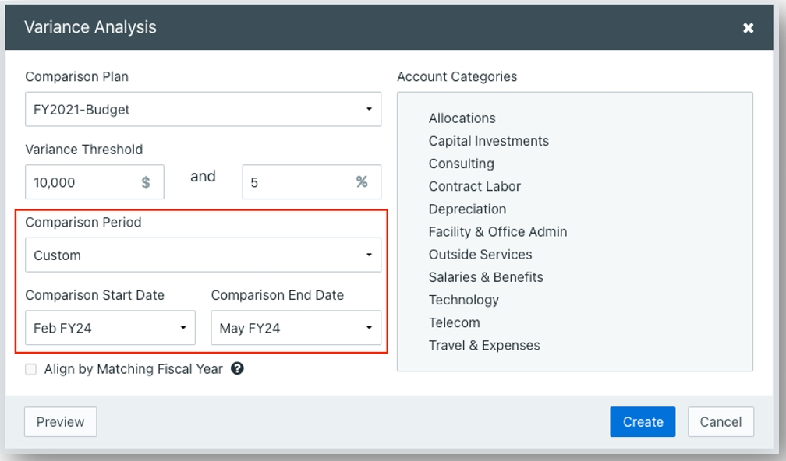

Interfaz de usuario de gastos

Los botones de importación y exportación de datos de Gastos se han reubicado en el menú de opciones situado encima de la tabla de gastos, lo que crea una interfaz de usuario más limpia. Ahora puede acceder a estas funciones directamente desde este menú.

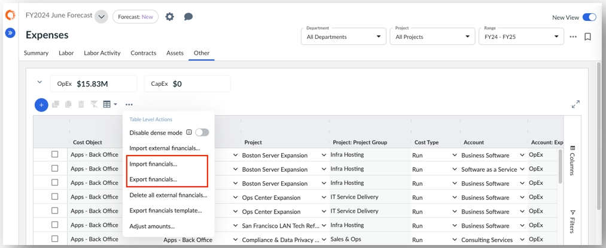

Mejora de la vista laboral

La pestaña Mano de obra de la nueva vista de gastos se ha actualizado con una subpestaña "Todos", que reúne los recursos de mano de obra planificados y existentes en una vista unificada para facilitar la consulta.

La subpestaña "Todos" incluye una columna de Mano de Obra Existente para indicar claramente si una línea de mano de obra es planificada o existente. Los usuarios pueden cambiar los recursos de mano de obra entre Planificados y Existentes editando la casilla de verificación de la columna Mano de Obra Existente.

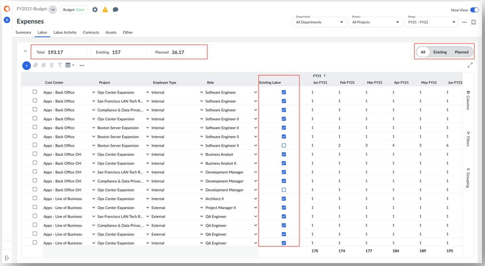

Mejora de la vista de activos

La pestaña "Activos" de la nueva vista de gastos incluye ahora una subpestaña "Todos", que combina los activos planificados y los existentes en una única vista unificada para facilitar la gestión.

En la subpestaña "Todos", una columna de Activos existentes indica claramente si cada línea de activos está prevista o es existente. Los usuarios pueden mover activos entre Planificados y Existentes ajustando la casilla de verificación de la columna Activo Existente.

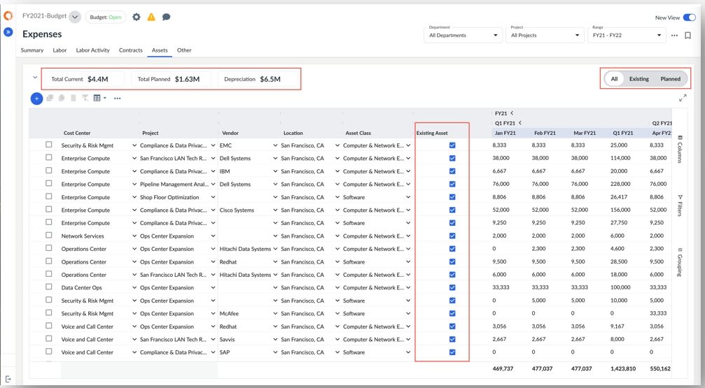

Corrección de errores

- Se ha solucionado un problema en Integrated Investment Planning (IIP) por el que la actualización de proyectos en la lista de proyectos utilizando la dimensión del proyecto en los datos de referencia provocaba errores si un atributo personalizado de la lista en los datos de referencia del proyecto contenía valores nulos.
- También se ha resuelto un problema en el gráfico de tendencias Resumen > Efectivos, que anteriormente mostraba la línea temporal del año dos veces a lo largo del eje x.

## Apptio Transición comunitaria a IBM TechXchange - 1 de noviembre de 2024

En la actualidad, la Comunidad Apptio ha pasado a llamarse IBM TechXchange.

Utilice y marque [esta nueva página de inicio](https://community.ibm.com/community/user/apptio/home "(se abre en una pestaña o una ventana nueva)") para los grupos temáticos de Apptio.

- Acceda al grupo temático que se ajuste a sus necesidades; algunos de los grupos temáticos con los que está familiarizado se han combinado en nuevos grupos temáticos.

  Están disponibles los siguientes grupos temáticos:
- [Apptio](https://community.ibm.com/community/user/apptio/communities/community-home?communitykey=4100dfb8-fc23-4203-83c7-019253cf7c0b "(se abre en una pestaña o una ventana nueva)") : Costing Essentials, Costing Standard (CT-Foundation), Apptio Planning (ITP/ITFMF), Facturación (Billing Standard), Evaluación comparativa (Benchmarking), ServiceNow Integración

  - [Planificación Notas de publicación](https://community.ibm.com/community/user/apptio/viewdocument/apptio-planning-whats-new-cumula?communitykey=4100dfb8-fc23-4203-83c7-019253cf7c0b&tab=librarydocuments "(se abre en una pestaña o una ventana nueva)")
  - [TBM Studio y Aplicaciones Notas de la versión](https://community.ibm.com/community/user/apptio/viewdocument/tbm-studio-and-applications-r12-rel?communitykey=44bcb0d2-5ce6-4504-89eb-019253d3b5d8&tab=librarydocuments "(se abre en una pestaña o una ventana nueva)")
- [Cloudability](https://community.ibm.com/community/user/apptio/communities/community-home?communitykey=15c0e07d-35c0-49de-a84b-019253d13376 "(se abre en una pestaña o una ventana nueva)") : Capacidades en la nube, planificación financiera, Cloudability TotalCost, Apptio Turbonomic Integración
- [Objetivoproceso](https://community.ibm.com/community/user/apptio/communities/community-home?communitykey=55a3712d-1835-4ec2-bcd7-603e88cd9dd2 "(se abre en una pestaña o una ventana nueva)")
- [Plataforma](https://community.ibm.com/community/user/apptio/communities/community-home?communitykey=44bcb0d2-5ce6-4504-89eb-019253d3b5d8 "(se abre en una pestaña o una ventana nueva)") : Apptio BI, ATUM, Automatizada Data Management, DataLink, Frontdoor, TBM Studio
- [Apptio para todos](https://community.ibm.com/community/user/apptio/communities/community-home?communitykey=2e85ed45-9b8a-486c-bd55-019253d466eb "(se abre en una pestaña o una ventana nueva)")
- Una vez que estés en tu grupo temático, lee y contribuye a todos los contenidos habituales, como enlaces rápidos, debates, preguntas y blogs.
- Consulte [estos recursos](https://community.ibm.com/community/user/participate/resources "(se abre en una pestaña o una ventana nueva)") sobre cómo navegar y utilizar la comunidad.
- Comience a enviar solicitudes de mejora en [IBM Ideas](https://login.ibm.com/idaas/mtfim/sps/idaas/login?client_id=nwnjmzc5njetmzlkyi00&target=https%3a%2f%2flogin.ibm.com%2foidc%2fendpoint%2fdefault%2fauthorize%3fqsid%3dc75ff073-50e8-4426-8979-7e4b6b992e80%26client_id%3dnwnjmzc5njetmzlkyi00 "(se abre en una pestaña o una ventana nueva)").

  - IBM utiliza un portal de ideas unificado en [ideas.ibm.com](https://ideas.ibm.com/ "(se abre en una pestaña o una ventana nueva)") para que pueda plantear ideas sobre todos los productos. A partir de hoy, esa lista se ha ampliado para incluir los productos recientemente adquiridos a Apptio. Las ideas presentadas antes de la adquisición se pondrán a disposición de los equipos de producto y podrán añadirse al portal en una fecha futura para garantizar la continuidad.

Póngase en contacto con el equipo comunitario en nuestro nuevo correo electrónico [support@communitysite.ibm.com](mailto:support@communitysite.ibm.com "(se abre en una pestaña o una ventana nueva)") con cualquier pregunta o necesidad.

## 3.79 - 21 de octubre de 2024

Sólo versión de mantenimiento

Esta versión contiene actualizaciones de mantenimiento del sistema y correcciones de errores.

Corrección de errores

- Se ha resuelto el problema por el que la actualización de los reales provocaba la eliminación de los reales generados en la página del libro mayor para los clientes de Project Financial Planning .
- Se resolvió el problema en la función Actualizar datos reales para los entornos Project Financial Planning (PFP) cuando los datos reales se eliminan de la Gestión de gastos y el usuario desea eliminar los datos reales del plan de previsión mediante la función Actualizar datos reales.
- Resuelto el problema en la funcionalidad de Actualizar Reales cuando la configuración de Generar costes en periodos reales está activada en Project Financial Planning (PFP) > Actividad Laboral.

## 3.78 - 7 de octubre de 2024

Sincronizar diseños heredados

Ahora los usuarios pueden transferir sus diseños de tablas de gastos de la vista heredada a la nueva vista con un solo clic, lo que elimina la migración manual y ahorra tiempo.

Para sincronizar diseños, basta con hacer clic en el icono Diseños de la nueva vista y seleccionar "Sincronizar diseños heredados" Esto copiará automáticamente sus diseños de la vista heredada a la nueva vista. Tenga en cuenta que tendrá que sincronizar los diseños de cada pestaña de la Tabla de Gastos individualmente para completar la migración de la Vista heredada a la Nueva Vista.

Corrección de errores

- Se ha resuelto un problema por el que la carga de datos quedaba incompleta cuando se utilizaba la configuración regional japonesa.
- Se ha resuelto un problema por el que la actualización de los reales provocaba la eliminación de los reales generados en la página del libro mayor para los clientes de Project Financial Planning .
- Se ha resuelto un problema por el que la página no se cargaba después de aplicar comparaciones y filtros y guardar la configuración en un diseño de la página Nuevo gasto.
- Se ha resuelto un problema por el que los usuarios administradores no podían ver las columnas marcadas como sensibles después de asignar permisos de objetos de coste con restricciones de visualización.

## 3.77 - 23 de septiembre de 2024

Sólo versión de mantenimiento

Esta versión contiene actualizaciones de mantenimiento del sistema y correcciones de errores.

Corrección de errores

- Se ha resuelto un problema por el que la pestaña Contratos no se cargaba cuando se accedía a ella desde la Nueva vista.
- Se ha resuelto un problema por el que al ordenar una columna en la tabla Permisos de objetos de coste, la página aparecía en blanco.

## 3.76 - 9 de septiembre de 2024

Integración del servicio de calendario fiscal

Apptio Planning se integra ahora con el Servicio de Calendario Fiscal (FCS), un servicio de plataforma centralizado dentro de Apptio. FCS está diseñado para gestionar los calendarios fiscales de todos los productos de Apptio, lo que permite a los clientes definir su calendario fiscal una vez y aplicarlo a todos los productos suscritos. Esta integración simplifica la gestión del calendario fiscal con una interfaz fácil de usar que facilita la visualización, edición y actualización de las configuraciones del calendario.

Nota: Si utiliza un calendario de Variante 445 o de 13 Períodos, gestionará las definiciones de su calendario a través del Servicio de Calendario Fiscal. Los tipos de calendario sólo pueden establecerse durante la configuración inicial.

Cómo acceder al Servicio de Calendario Fiscal

FCS es accesible para usuarios con rol Admin. FCS está disponible como una nueva aplicación en su entorno Frontdoor.

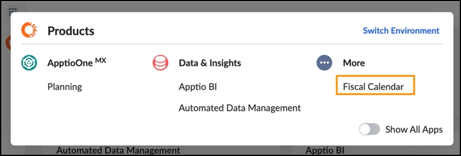

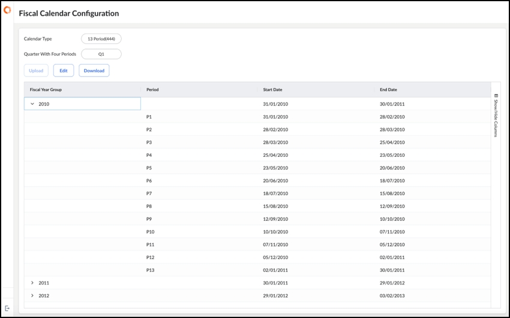

Para más información, consulte [Servicios de Calendario Fiscal](../../fiscal-calendar-services/home.html).

Corrección de errores

- Ahora puede crear diseños para subpestañas dentro de la pestaña Gastos, como Mano de obra existente o de planificación, en la Nueva vista.
- Se ha resuelto un problema con la exportación de datos del Plan a Apptio Costing (Cost Transparency) cuando se utiliza el formato "Publicar meses para todos los años fiscales como columnas en una sola fila". La exportación de datos del Plan se ajusta ahora correctamente a los ajustes de formato de exportación configurados.
- Se ha solucionado un problema en Actualizar reales por el que los reales del proyecto no se distribuían correctamente durante el proceso de actualización.

## 3.75 - 26 de agosto de 2024

A partir del lunes 26 de agosto de 2024, los principales inquilinos de producción comenzarán a actualizarse a la versión 3.75. Apptio lanzará la siguiente función en esta versión.

Calendario de publicación de los datos del plan en Apptio Costing

Los usuarios administradores pueden ahora crear programaciones diarias, semanales y mensuales, así como seleccionar una hora para ejecutar la programación utilizando la integración automatizada Data Management para publicar los datos del Plan desde Apptio Planning a Apptio Costing (Cost Transparency). Además, los usuarios también pueden especificar un periodo en Apptio Costing para el que deben publicarse los datos.

Esta mejora elimina la necesidad de publicar datos manualmente y agiliza el proceso de integración de datos entre Planificación y Cálculo de costes. Automated Data Management (ADM) se actualizará el 4 de septiembre de 2024 para permitir la programación de la publicación de los datos del plan en Apptio Costing.

Para más información, consulte [Programación de la publicación de datos del plan](../planning/adm/adm-sch-pub-plan-to-costing.html "Los usuarios administradores pueden ahora crear programaciones diarias, semanales y mensuales, así como seleccionar una hora para ejecutar la programación utilizando la integración automatizada Data Management para publicar los datos del Plan desde Apptio Planning a Apptio Costing (Cost Transparency). Además, los usuarios también pueden especificar un periodo en Apptio Costing para el que deben publicarse los datos.").

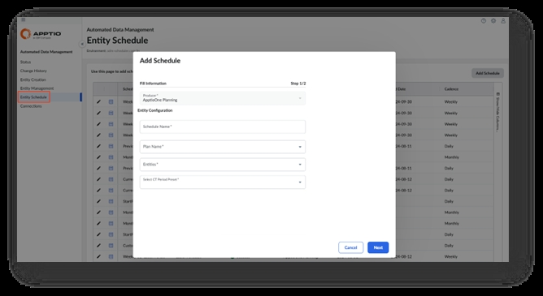

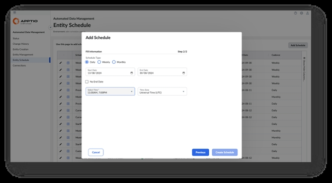

Corrección de errores

- La función "Actualizar datos reales" presentaba un error por el que los datos reales no se actualizaban como se esperaba, a pesar de que la operación se realizaba correctamente.
- Hemos resuelto un problema por el que los totales de las filas de resumen de Remuneración base (pestaña Mano de obra), Importe del contrato (pestaña Contrato) y Precio de compra (pestaña Activo) mostraban valores incorrectos cuando estaba activada la opción multidivisa. Anteriormente, los totales eran inexactos debido a una conversión de divisas incorrecta. Se ha actualizado la lógica de cálculo para garantizar que, con la opción multidivisa activada, los totales de las filas de resumen para la remuneración base, el importe del contrato y el precio de compra se calculen ahora correctamente utilizando el tipo de cambio medio del plan para la divisa seleccionada. El tipo medio del plan se determina promediando todos los tipos del plan para una divisa específica durante la duración del plan.
- Se ha resuelto un problema por el que se producía un error al actualizar los datos reales con la opción multidivisa activada. El problema se producía cuando las partidas reales contenían varias transacciones en distintas monedas para el mismo "Objeto de coste", "Centro de coste" y "Cuenta"
- Se ha solucionado el problema por el que los datos del mes, trimestre y año no eran visibles en la vista Gastos > Nuevo. Si sigues sin poder ver estas columnas, sigue estos pasos: Haz clic en el botón Diseño y selecciona "Restablecer columnas al diseño predeterminado." Esto debería mostrar todas las columnas de periodo (meses, trimestres y año). Una vez que las columnas sean visibles, vaya a Diseño > Diseño público > Diseño predeterminado y haga clic en "Guardar" para guardar los cambios en el diseño predeterminado.

## 3.74 - 12 de agosto de 2024

A partir del lunes 12 de agosto de 2024, los principales inquilinos de producción comenzarán a actualizarse a la versión 3.74. Apptio lanzará la siguiente función en esta versión.

Exclusión selectiva de las reglas de asignación de mano de obra del cálculo de la mano de obra totalmente cargada

En la versión de planificación 3.74, hemos introducido una nueva función que permite a los usuarios administradores excluir reglas de asignación de mano de obra específicas del cálculo de mano de obra totalmente cargada en la pestaña Mano de obra. Esta mejora garantiza que estas reglas seguirán generando partidas financieras en la pestaña Resumen, pero no afectarán a los totales del ejercicio que se muestran en la pestaña Trabajo.

Anteriormente, en la versión de planificación 3.71, mejoramos la capacidad del propietario del presupuesto para ver el coste de mano de obra totalmente cargado directamente en la columna Gastos > Mano de obra > Total del ejercicio, eliminando la necesidad de navegar a la sección Gastos > Resumen. Para más detalles, visite las notas de la versión 3.71.

Para dar cabida a las organizaciones que prefieren no incluir ciertas reglas de asignación de mano de obra en el Total FY que se muestra en la pestaña Gastos > Mano de obra, en esta versión se introducen las siguientes actualizaciones:

- Se ha añadido una nueva columna, "Excluir del cálculo de mano de obra", a la tabla Reglas de asignación de mano de obra.
- Los usuarios administradores pueden seleccionar la exclusión de una regla directamente en la interfaz de la tabla.
- Las reglas se incluyen por defecto en el cálculo del total del ejercicio laboral. Para excluir una regla, marque la casilla correspondiente.
- Cuando una regla se marca como excluida, no afecta al total del ejercicio mostrado en la pestaña Trabajo, pero sigue generando una partida financiera en la pestaña Resumen.

  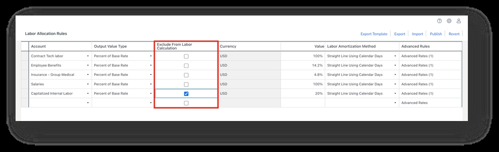

  Para obtener más información, consulte [las Normas de asignación de](../planning/manage-labor-allocation-rules.html) mano de obra.

Corrección de errores

- Los propietarios del presupuesto verán ahora el "Coste Totalmente Cargado" para el ejercicio fiscal correctamente visualizado como la suma de todos los costes generados de los periodos reales y los costes generados de los periodos de previsión. Anteriormente, la ausencia de datos reales de mano de obra hacía que la columna del ejercicio con plena carga de trabajo mostrara importes significativamente inferiores al importe de la retribución básica en los planes de previsión. Con esta corrección, los periodos reales se calculan utilizando las reglas de asignación de mano de obra y se incluyen en los importes de "Coste de mano de obra" totalmente cargados en la pestaña Mano de obra; sin embargo, no se generan datos financieros para los periodos históricos en la pestaña Resumen.

## 3.73 - 29 de julio de 2024

A partir del lunes 29 de julio de 2024, los principales inquilinos de producción comenzarán a actualizarse a la versión 3.73. Apptio lanzará la siguiente función en esta versión.

Gastos a pantalla completa ModeTable Diseños en la nueva vista de gastos

La tabla de gastos de la nueva vista ofrece ahora funciones de personalización mejoradas, incluida la posibilidad de personalizar la estructura de columnas, la agrupación, los filtros y guardar los cambios como un diseño. Los usuarios individuales pueden crear hasta 50 diseños privados, mientras que los usuarios administradores pueden crear hasta 50 diseños públicos. Esto representa un aumento con respecto al límite anterior de 30 diseños tanto en entornos públicos como privados en la Vista de Legado de Gastos.

En una futura versión, a finales de este año, los usuarios también podrán sincronizar los diseños existentes de la vista heredada de gastos con la nueva vista, lo que garantizará la continuidad y facilitará la transición.

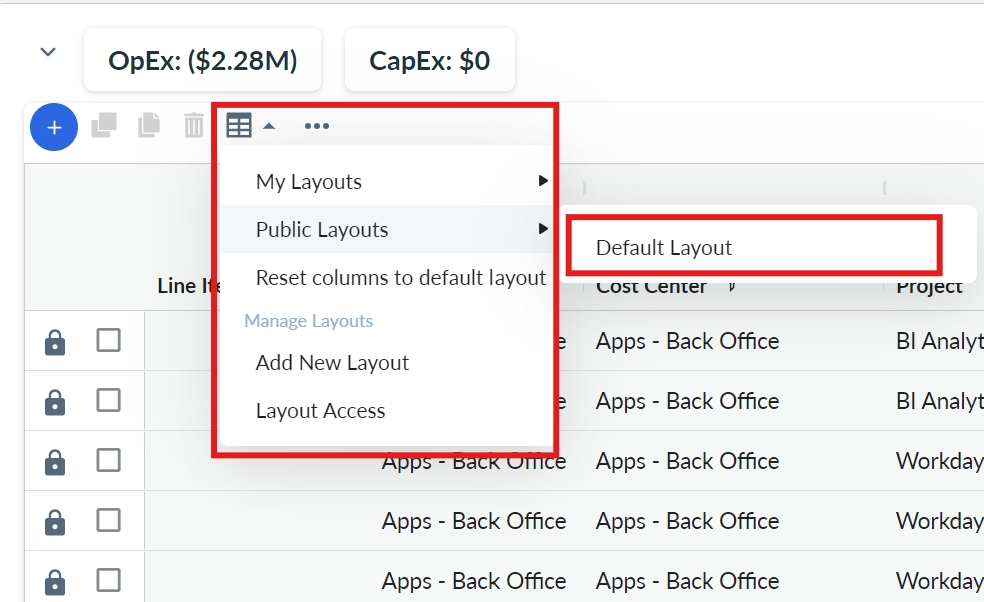

Para más información, consulte la sección [Distribución de las tablas](../planning/customize-save-share-apx.html).

Corrección de errores

- Se ha resuelto un error que impedía que los valores de comparación se actualizaran al navegar a un Departamento específico desde la página Estado con una comparación activa.
- Se ha corregido un error por el que, al utilizar el método de alineación Coincidencia de ejercicios para añadir una comparación, los valores de comparación aparecían en blanco.
- Se ha corregido un problema por el que el mensaje de error al añadir un Código de proyecto duplicado aparecía incorrectamente como "Error del servidor, inténtelo de nuevo"

## 3.72 - 15 de julio de 2024

A partir del lunes 15 de julio de 2024, los principales inquilinos de producción comenzarán a actualizarse a la versión 3.72. Apptio lanzará las siguientes funciones en esta versión.

Gastos Modo Pantalla Completa

La tabla de gastos ahora admite el modo de pantalla completa. Esta configuración permite a los usuarios maximizar el espacio en pantalla para visualizar y editar eficazmente las líneas de gastos. Tenga en cuenta que, la experiencia de la tabla Nueva vista es necesaria para activar el modo de pantalla completa.

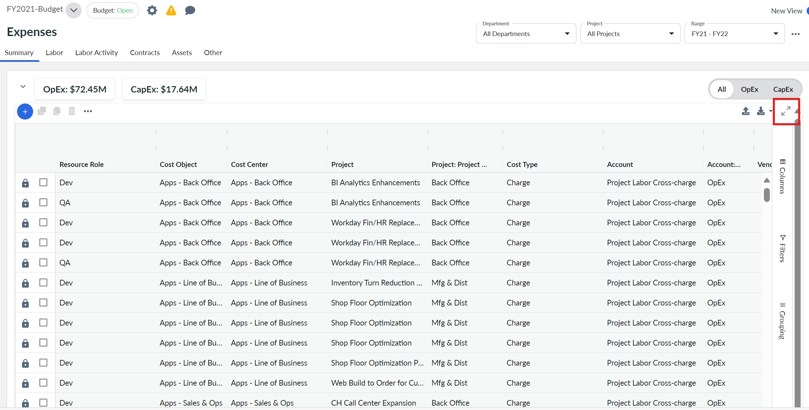

Para obtener más información, consulte [Trabajar con partidas individuales](../planning/working-with-apex-line-items.html "En este tema se explica cómo gestionar las partidas de Apex en la aplicación, lo que incluye añadir, insertar, duplicar, importar, exportar y eliminar partidas.") de Apex.

Delegación de contratos

Ahora los usuarios pueden delegar los gastos de contratos a un centro de costes diferente a partir de una fecha determinada. Esta mejora permite asignar con precisión los gastos al centro de costes adecuado. En el caso de proyectos con varias fases (por ejemplo, construcción/ejecución), delegar gastos en centros de costes específicos ayuda a realizar un seguimiento eficaz del rendimiento financiero de cada fase del proyecto.

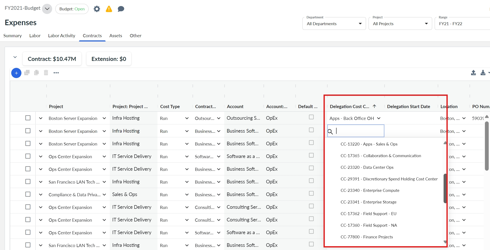

Para más información, consulte [Costes de proyectos delegados](../planning/iip/delete-project-costs.html).

Calendario de trabajo mensual fijo

Integrated
Investment Planning ahora admite un Calendario Laboral Mensual Fijo, que permite a los usuarios establecer un número total fijo de horas de trabajo al mes. Esta función permite convertir las imputaciones de actividad laboral ETC en imputaciones de actividad laboral por hora.

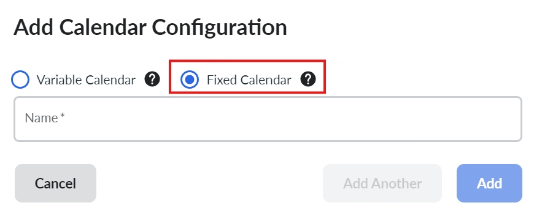

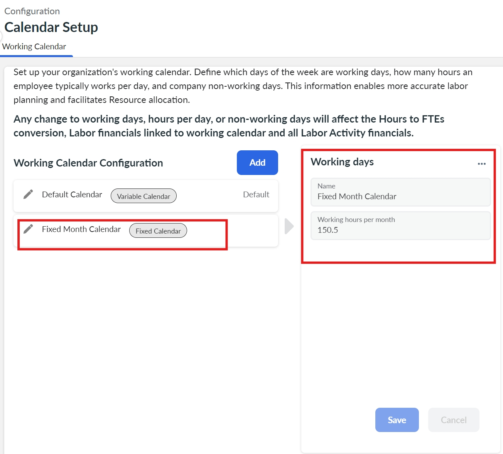

Para obtener más información, consulte [el calendario laboral](../planning/configure-working-days.html "El calendario laboral define cuántos días y horas laborables se utilizan para la planificación laboral, lo que influye en la conversión del equivalente a tiempo completo (ETC), la amortización de los costes laborales y los cálculos de gastos mensuales.").

Corrección de errores

- Anteriormente, cuando los datos reales estaban vacíos en la página Gestión de gastos y un usuario intentaba actualizar los datos reales en el plan para todos los meses con datos reales vacíos, las líneas del plan de previsiones no se borraban como se esperaba. Este problema ya se ha solucionado.
- Se ha corregido un problema de aspecto y resolución del logotipo de Apptio en los mensajes automáticos utilizados para informar a los usuarios de las actualizaciones del flujo de trabajo del Plan.
- Se ha implementado una corrección para garantizar que, cuando no están presentes las reglas de remuneración base y de asignación de mano de obra, las columnas de total del ejercicio en la pestaña Mano de obra sean correctas

## 3.71 - 2 de julio de 2024

A partir del martes 07/02/2024, los principales inquilinos de producción comienzan a actualizarse a la versión 3.71. Apptio lanza la siguiente función en esta versión menor.

Ver el coste de la mano de obra totalmente cargada

Los propietarios del presupuesto ahora pueden ver fácilmente el coste de mano de obra totalmente cargado directamente en las columnas Gastos > Mano de obra > Total del ejercicio, eliminando la necesidad de navegar a la sección Gastos > Resumen para obtener esta información. Anteriormente, esta columna sólo mostraba la Remuneración Base x Cantidad.

Por ejemplo, en la pestaña Mano de obra, puede ver una línea de mano de obra con un total de 196.888 USD en FY24. Este importe representa el coste de mano de obra totalmente cargado, calculado sobre la base de las normas de asignación de mano de obra configuradas.

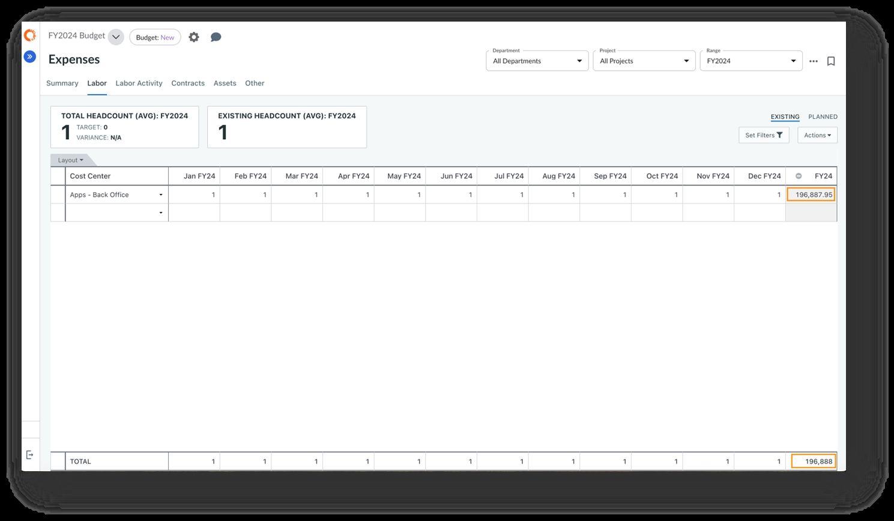

El coste de mano de obra totalmente cargado es la suma de las cuentas del libro mayor generadas a partir de Reglas de asignación de mano de obra en la pestaña Resumen. Como se muestra, el total de FY24 en la pestaña Resumen coincide con el total de FY24 en la pestaña Mano de obra.

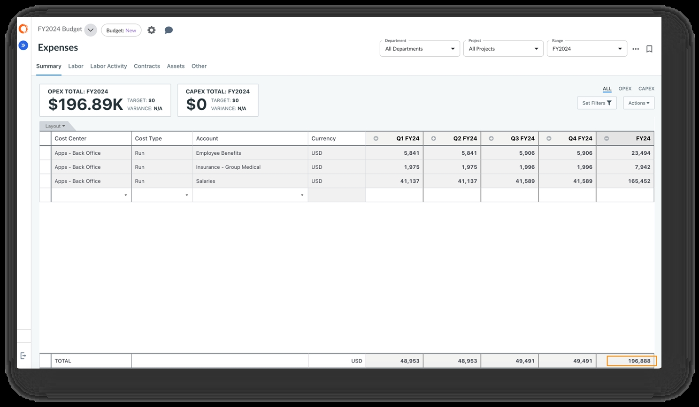

## 3.70 - 17 de junio de 2024

A partir del lunes 17/06/2024, los principales inquilinos de producción comenzarán a actualizarse a la versión 3.70. Apptio lanza las siguientes funciones en esta versión menor.

- Selección del Centro de Coste de Recursos : Ahora es posible reconocer fácilmente el Centro de Coste bloqueado en el desplegable Centro de Coste de Recursos en Gastos Nueva Vista > Actividad Laboral. Se muestra un mensaje de validación cuando se selecciona un centro de costes bloqueado para asignar recursos de mano de obra a un proyecto. Para saber más, consulte [aquí](../planning/iip/allocate-labor-project.html).
- Finalizar Plan : Se añade una nueva opción "Finalizar Plan" en el menú de acciones de Nuevo Gasto.

  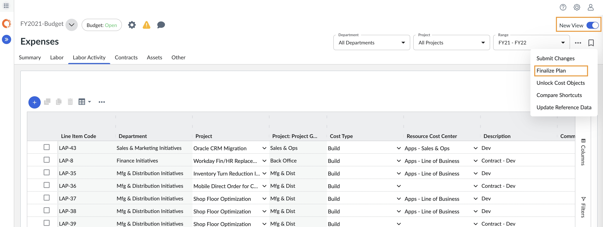

## 3.69 - 26 de mayo de 2024

A partir del lunes 26/05/2024, los principales inquilinos de producción comenzarán a actualizarse a la versión 3.69. Esta versión sólo contiene actualizaciones de mantenimiento.

Sólo versión de mantenimiento

Esta versión contiene actualizaciones de mantenimiento del sistema.

## 3.68 - 22 de abril de 2024

A partir del lunes 22/04/2024, los principales inquilinos de producción comenzarán a actualizarse a la versión 3.68. Apptio lanza las siguientes funciones en esta versión menor.

- Mostrar/Ocultar columnas de periodos - Ahora puede activar la agrupación en Gastos > Nueva vista. Esta función le permite mostrar/ocultar las columnas Mes, Trimestre y Año. Para obtener más información, consulte [Trabajar con columnas de Apex](../planning/working-with-apex-columns.html "Cuando un Administrador o Propietario de Proceso Presupuestario habilita la función Tabla de Partidas Apex, los usuarios con rol de no administrador pueden cambiar la vista de la tabla entre Vista Clásica y Nueva Vista.").
- Alineación del año fiscal del análisis de variación : ahora es posible alinear el año fiscal del plan de comparación en el análisis de variación para que coincida con el año fiscal del plan de origen. Para obtener más información, consulte [Analizar la variación presupuestaria](../planning/analyze-budget-variance.html "La función Análisis de desviaciones le ayuda a comparar un plan de previsión actual con una línea de base (presupuesto o previsión anterior), identificar diferencias significativas y crear un seguimiento de comentarios que explique los motivos de las desviaciones.").

## 3.67 - 8 de abril de 2024

A partir del lunes 04/08/2024, los principales inquilinos de producción comienzan a actualizarse a la versión 3.67. Apptio lanza las siguientes funciones en esta versión menor.

- Análisis de imputación de actividad laboral - Ahora es posible configurar umbrales de sobreimputación y subimputación para la planificación de la actividad laboral a nivel de recursos. Esto permite a los usuarios analizar la demanda de mano de obra frente a la capacidad laboral y tomar decisiones informadas sobre la utilización de la mano de obra, la reasignación, la contratación y el equilibrio entre el trabajo y los recursos. Para saber más, consulte [Activar/desactivar la actividad laboral.](../planning/iip/enable-disable-labor-activity.html)
- Actualizar datos reales - Ahora puede actualizar los datos reales de un plan de previsión existente, tanto si está en estado Nuevo como Abierto. Esto elimina la necesidad de recrear el plan de previsión para actualizar los datos reales, lo que supone un ahorro de tiempo y una mayor eficacia en el ciclo de previsión mensual. Para obtener más información, consulta «[Actualizar datos reales](../planning/update-actuals-data.html) ».

## 3.66 - 26 de marzo de 2024

A partir del lunes 26/03/2024, los principales inquilinos de producción comenzarán a actualizarse a la versión 3.66. Esta versión sólo contiene actualizaciones de mantenimiento.

Sólo versión de mantenimiento

Esta versión contiene actualizaciones de mantenimiento del sistema.

## 3.65 - 11 de marzo de 2024

A partir del lunes 03/11/2024, los principales inquilinos de producción comienzan a actualizarse a la versión 3.65 Apptio está lanzando las siguientes características en esta versión menor.

## 3.64 - 26 de febrero de 2024

A partir del lunes 26/02/2024, los principales inquilinos de producción comenzarán a actualizarse a la versión 3.64. Apptio lanza las siguientes funciones en esta versión menor.

- Análisis de desviaciones : Esta función se utiliza para marcar la desviación de gastos causada por gastos declarados en un plan pero ausentes en otro plan. Para obtener más información, consulta «[Analizar desviaciones presupuestarias](../planning/analyze-budget-variance.html "La función Análisis de desviaciones le ayuda a comparar un plan de previsión actual con una línea de base (presupuesto o previsión anterior), identificar diferencias significativas y crear un seguimiento de comentarios que explique los motivos de las desviaciones.") ».
- Prevenir la sobreasignación : esta función garantiza que los recursos laborales no se asignen en exceso a proyectos o inversiones durante la planificación de la actividad laboral, mejorando así la eficiencia de la gestión de recursos. Para saber más, consulte [Análisis de la sobre/infraimputación de la actividad laboral](../planning/iip/manage-over-under-allocation.html).
- Modo Denso : Ahora puede activar el Modo Denso en la opción Gastos > Nueva vista. Esta función aplica los últimos cambios de estilo a la tabla, optimizando el uso del espacio y permitiendo acomodar el máximo de filas. Para obtener más información, consulta «[Trabajar con tablas de Apex](../planning/working-with-apex-table.html "Cuando un Administrador o Propietario de Proceso Presupuestario habilita la función Tabla de Partidas Apex, los usuarios con rol de no administrador pueden cambiar la vista de la tabla entre Vista Clásica y Nueva Vista. Este tema proporciona instrucciones sobre la gestión de tablas de Apex, incluyendo el cambio de vistas, la selección de intervalos de fechas y el ajuste de las opciones de la tabla.") ».
- Creación asíncrona de planes (GA) : La creación asíncrona de planes se habilitará en todos los entornos principales a partir del 4 de marzo de 2024. El proceso de creación de planes es ahora asíncrono. Los usuarios pueden iniciar el proceso de creación del plan y seguir utilizando la aplicación Planificación para realizar otras tareas. Una vez creado el plan, el usuario recibirá una notificación. Para saber más, consulte [Creación de planes asíncronos.](../planning/create-budget-plan.html)

## 3.63 - 12 de febrero de 2024

A partir del lunes 02/12/2024, los principales inquilinos de producción comienzan a actualizarse a la versión 3.63. Apptio lanza la eliminación masiva de gastos en esta versión menor.

Borrar gastos en bloque

Ahora es posible seleccionar varias líneas de gastos y eliminarlas con un solo clic mediante la vista Gastos > Nuevo.

Para obtener más información, consulta [«Eliminación masiva de gastos».](../planning/working-with-apex-line-items.html "En este tema se explica cómo gestionar las partidas de Apex en la aplicación, lo que incluye añadir, insertar, duplicar, importar, exportar y eliminar partidas.")

## 3.62 - 29 de enero de 2024

A partir del lunes 29/01/2024, los principales inquilinos de producción comenzarán a actualizarse a la versión 3.62. En esta versión menor, el producto "Planificación de TI" pasa a llamarse "Planificación". Este cambio no afecta a ninguna funcionalidad existente.

A continuación se muestran algunos de los cambios en la experiencia del usuario para adaptarse a la nueva denominación del producto:

Azulejo/conmutador de la aplicación Frontdoor

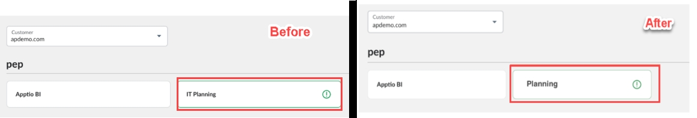

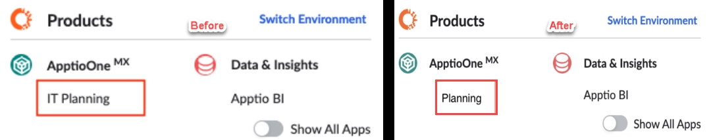

Panel de navegación izquierdo

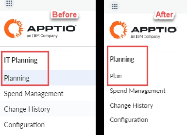

Apptio BI nombre de la colección de informes

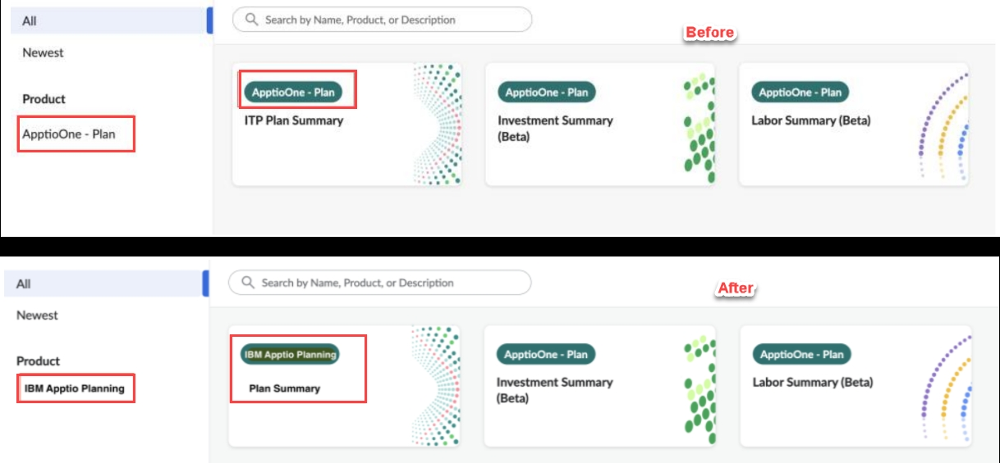

Gráficos de síntesis y cuadros de mando

Los cuadros de mando y de síntesis han pasado a denominarse Desglose de gastos, Cascada de gastos, Tendencias de gastos y Variaciones de gastos, respectivamente.

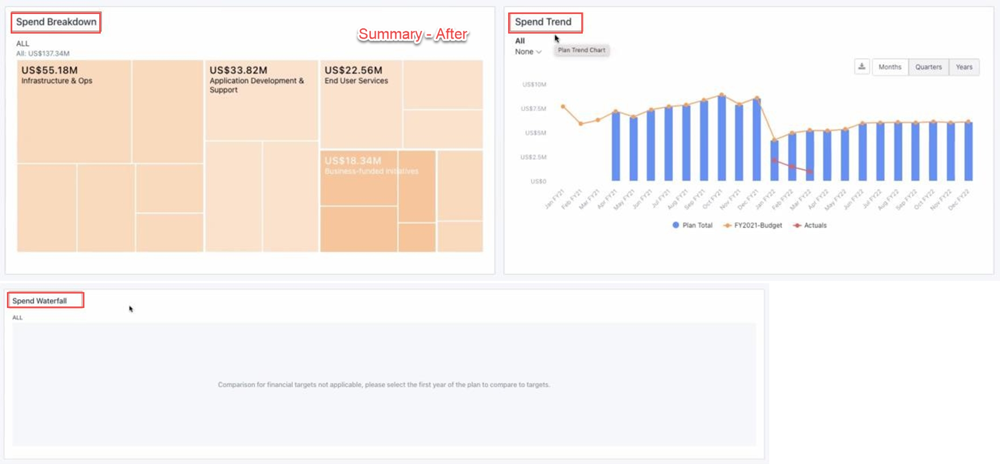

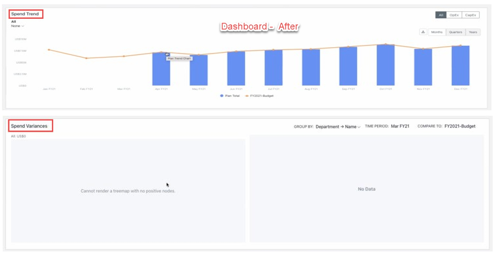

## 3.61 - 15 de enero de 2024

A partir del lunes 15/01/2024, los principales inquilinos de producción comenzarán a actualizarse a la versión 3.61. Esta versión sólo contiene actualizaciones de mantenimiento.

Sólo versión de mantenimiento

Esta versión contiene actualizaciones de mantenimiento del sistema.
