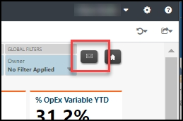
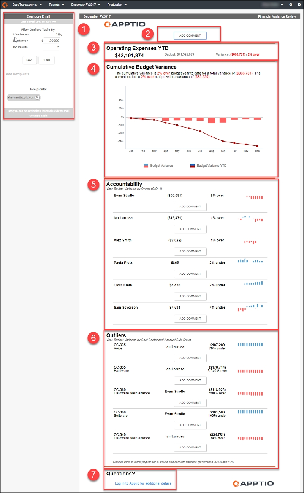

# Informe por correo electrónico de la revisión de la variación financiera ( v104 )

◆ Se aplica a: Planning y Costing
Standard en TBM Studio 12.3 y posteriores, con Plantilla v104 y posteriores

El informe por correo electrónico de Revisión de desviaciones financieras le ayuda a comprender las desviaciones presupuestarias y a centrar sus esfuerzos en garantizar el cumplimiento de su plan financiero para el ejercicio fiscal. La función de correo electrónico está limitada a los analistas financieros con permisos de administrador, lo que les permite enviar el informe de desviaciones con comentarios a los responsables de departamento y otras partes interesadas.

## Visualizar el informe

1. Inicie sesión en Apptio y vaya a Planning > Costing
   Standard.
2. En la página de inicio, haga clic en Finanzas de TI.

   Se abre el informe de revisión financiera.
3. En el informe Revisión financiera, haga clic en el icono Enviar correo electrónico de desviación del presupuesto financiero.

   NOTA : Este icono de correo electrónico sólo aparece para usuarios con permisos de administrador.

   

   Se abre el informe por correo electrónico de Revisión de desviaciones financieras.

1. Inicie sesión en Apptio y navegue hasta Costing Standard.
2. En la página de inicio, haga clic en Finanzas de TI.

   Se abre el informe de revisión financiera.
3. En el informe Revisión financiera, haga clic en el icono Enviar correo electrónico de desviación del presupuesto financiero.

   NOTA : Este icono de correo electrónico sólo aparece para usuarios con permisos de administrador.

   

   Se abre el informe por correo electrónico de Revisión de desviaciones financieras.

CONSEJO : Si tiene problemas para abrir este informe, haga lo siguiente:

- Asegúrese de que se encuentra en el entorno de Producción, comprobando que aparece en la barra de herramientas. La función de correo electrónico no está disponible en los entornos de desarrollo o ensayo.
- Comprueba la configuración de tu navegador. Por ejemplo, puedes tener problemas en Chrome si la opción **Bloquear cookies de terceros de 3rd** está activada. Otra opción es añadir " [https://[\*.]apptio.com](https://apptio.com/ "(se abre en una pestaña o una ventana nueva)") " a los sitios permitidos en Chrome, o una configuración similar en otros navegadores.

## Elementos clave

El informe contiene los siguientes elementos.

alternativo

(1) Configurar el correo electrónico

- Tabla de filtros de valores atípicos : (opcional) utilice las siguientes configuraciones para configurar la tabla de valores atípicos :
  - % Desviación - Establezca un porcentaje mínimo de desviación. Al ajustar este valor, el informe mostrará los valores atípicos que superen el umbral porcentual.

    Por ejemplo, un ajuste de "0%" devuelve todos los resultados, independientemente del porcentaje de varianza. Un ajuste de "50%" devuelve todo lo que tenga una varianza absoluta superior al 50%.
  - desviación $ - Establezca un importe mínimo de desviación en dólares. El informe mostrará los valores atípicos que superen el umbral en dólares.

    Por ejemplo, un valor de "0" devuelve todos los resultados, independientemente del importe en dólares. Un ajuste de "3000" devuelve los artículos con una desviación absoluta superior a $3000.
  - Principales resultados - Establezca el número de valores atípicos que desea incluir en el informe.

    Por ejemplo, un ajuste de "10" devolverá las 10 desviaciones principales.

    Los resultados que aparecen en la tabla de valores atípicos son la acumulación de estos ajustes. Por ejemplo, las configuraciones de "50%", "5000" y "10", respectivamente, devolverán los 10 primeros resultados que tengan una varianza absoluta superior a 5.000 dólares y superior al 50%.
- Destinatarios - (Opcional) Haga clic en el campo Añadir destinatarios para introducir una dirección de correo electrónico de la persona que desea que reciba este informe y, a continuación, pulse Intro. Repetir tantas veces como sea necesario.

  Cuando haya terminado de introducir todos los comentarios, haga clic en Enviar para distribuir el correo electrónico a la lista de destinatarios. Los botones Añadir comentario y Guardar están ahora desactivados y los filtros inactivos. Para enviar otro correo electrónico, haga clic en Restablecer, lo que le permitirá volver a editar los filtros, hacer comentarios y enviar el informe a un nuevo destinatario. Haga clic en Guardar para guardar los cambios sin enviar el correo electrónico.

  NOTA : Normalmente sólo se enviará un correo electrónico de revisión de la desviación financiera al mes. El filtro de valores atípicos y los destinatarios de correo electrónico que establezca persistirán en los siguientes periodos de tiempo hasta que se vuelvan a cambiar y guardar.

(2) Campos de comentario (opcional)

Puede añadir comentarios en cualquier lugar donde encuentre un botón Añadir comentario. La sección superior sirve para introducir un mensaje general sobre la revisión financiera del mes. Por lo general, es conveniente incluir una declaración de alto nivel sobre el estado del presupuesto y, posiblemente, explicaciones de las variaciones significativas. El campo está limitado a 400 caracteres.

Para editar un comentario guardado, haga clic en Editar comentario. Para eliminar un comentario, haga clic en **Editar comentario**, elimine el texto del cuadro de comentario y, a continuación, haga clic en Guardar.

(3) Gastos de explotación

Esta sección muestra su presupuesto y desviación al más alto nivel.

(4) Desviación presupuestaria acumulada

Esta sección muestra la desviación presupuestaria por periodo (columna) y la desviación presupuestaria acumulada hasta la fecha (línea de tendencia). Lo ideal es que la variación acumulada se aproxime o tienda a cero para cumplir el plan financiero.

(5) Responsabilidad

Esta sección muestra su variación presupuestaria por propietario, normalmente el nivel CIO-1. Se puede añadir un comentario para explicar cualquier variación a este nivel.

(6) Valores atípicos

Esta sección muestra la desviación de su presupuesto por centro de coste y subgrupo de cuenta utilizando los parámetros establecidos en el panel Configurar correo electrónico (elemento 1). Opcionalmente, puede introducir explicaciones para cada uno de ellos.

(7) Detalles

Si hace clic en el enlace Preguntas del mensaje de correo electrónico recibido, accederá al informe de revisión de las desviaciones presupuestarias en Apptio.

## Preguntas contestadas

Puede utilizar este informe para responder a las siguientes preguntas:

- ¿Qué centros de coste están generando desviaciones entre los gastos y el plan?
- ¿Qué cuentas de la contabilidad de centros de coste están generando la mayor desviación (por exceso o por defecto)?
