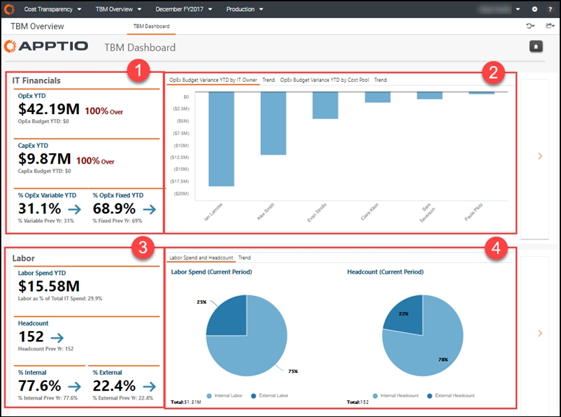
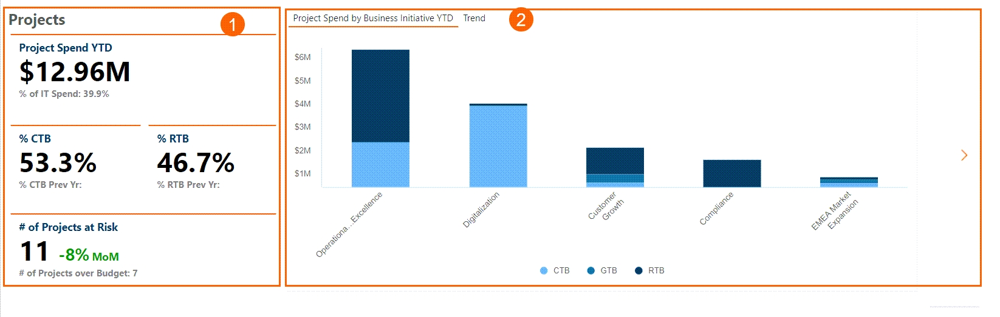
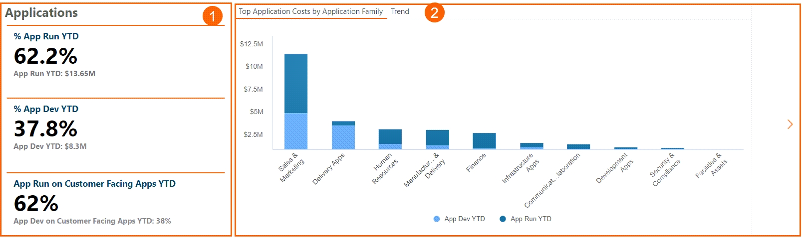
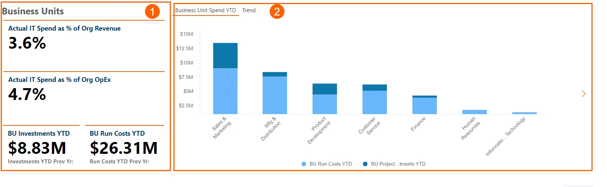
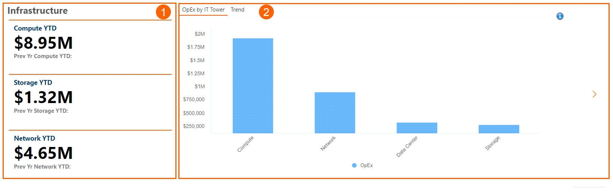
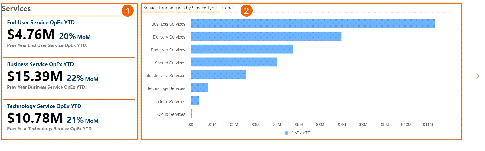

# TBM Dashboard ( v104 y posteriores)

◆ Se aplica a: Planning y Costing
Standard en TBM Studio 12.3 y posteriores, con Plantilla v104 y posteriores

Caso de uso

- Revisar y gestionar el gasto y los recursos de mano de obra
- Obtenga una visión general de la salud presupuestaria y el gasto laboral de su organización

El panel de control de TBM ofrece una visión ejecutiva de la variación presupuestaria y el gasto global de su organización en OpEx y CapEx. Cada sección del cuadro de mandos ofrece un resumen de los principales gastos en finanzas y mano de obra de TI en toda la organización. Utilice este informe para realizar las revisiones financieras periódicas que son esenciales para gestionar eficazmente el gasto en TI y los objetivos financieros.

Este informe está pensado para las siguientes funciones:

- Oficina del CIO
- Líderes de aplicación
- Jefes de proyecto

## Visualizar el informe

1. Inicie sesión en Apptio y vaya a Planning > Costing
   Standard.
2. En la página de inicio, haga clic en Vista general de TBM.

   Se abre el informe Tablero TBM.

El informe contiene los siguientes elementos.

## IT Finanzas y Trabajo

(1) KPI financieros de TI

- OpEx YTD - Este KPI muestra sus gastos operativos ( OpEx ) YTD y el porcentaje por encima o por debajo del presupuesto OpEx. El presupuesto previsto para gastos de funcionamiento figura en OpEx Budget YTD.
- CapEx YTD - Este KPI muestra sus gastos de capital (a largo plazo) ( CapEx ) YTD y el porcentaje por encima o por debajo del presupuesto de CapEx. El presupuesto previsto para gastos de capital figura en CapEx Budget YTD.
- % OpEx Variable YTD y % OpEx Fijo YTD - Estos KPIs le ayudan a determinar la agilidad de su gasto en TI mirando el balance de gasto fijo versus variable para el período fiscal actual y el período anterior.

(2) Gráficos

- OpEx Desviación presupuestaria YTD por propietario de TI - Este gráfico muestra la desviación OpEx por propietario de centro de coste (TI). Utilice esta información para comprender los gastos excesivos o insuficientes e identificar los centros de costes con la mayor desviación o excepción con respecto al plan.
- Tendencia - El gráfico de tendencia muestra la desviación de OpEx por propietario de centro de coste (TI) a lo largo del tiempo.
- OpEx Desviación presupuestaria interanual por grupo de costes - Este gráfico muestra la desviación de OpEx por grupo de costes. Utilice esta información para comprender los gastos excesivos o insuficientes e identificar los grupos de costes con mayor desviación o excepción con respecto al plan.
- Tendencia - El gráfico de tendencia muestra la desviación de OpEx por grupo de costes a lo largo del tiempo.

(3) KPI laborales

- Gasto en mano de obra YTD - Este KPI muestra su gasto en mano de obra YTD. La mano de obra como % del gasto total en TI muestra el porcentaje del gasto total en TI identificado como mano de obra.
- Plantilla - Este KPI muestra su número actual de empleados a tiempo completo para el año en curso y el periodo anterior.
- % Interno y % Externo - Estos KPIs muestran el balance de la mano de obra interna a tiempo completo frente a la mano de obra externa contratada para el periodo fiscal actual y el periodo anterior.

(4) Gráficos

- Gasto en mano de obra y plantilla - Estos gráficos muestran la relación entre el gasto en mano de obra interna y externa frente a la plantilla interna y externa para el periodo actual.
- Tendencia - Los gráficos de tendencia muestran el gasto en mano de obra y los efectivos a lo largo del tiempo.

Otros elementos del informe son:

## Proyectos

(1) Indicadores clave de rendimiento del proyecto

- Gasto del proyecto YTD - Este KPI muestra su gasto total del proyecto del año a los datos, calculando OpEX y CapEX métricas.
- CTB - El KPI CTB (Change the Business) está relacionado con sus costes CapEx.
- RTD - El KPI RTB (Run The Business) está relacionado con sus costes de OpEX.
- # Nº de proyectos en riesgo: este KPI muestra el número de proyectos en riesgo y el gasto atribuido a los mismos. El sub-KPI muestra el número de proyectos que superan el presupuesto.

(2) Gráficos

- Gasto en proyectos por iniciativa empresarial hasta la fecha - Estos gráficos muestran los nombres de los proyectos y los proyectos de mayor coste, tanto los relacionados con Capex como con Opex.
- Tendencia - Los gráficos de tendencia muestran el gasto en proyectos por iniciativa empresarial a lo largo del tiempo.

## Aplicaciones

(1) KPI de las aplicaciones

- % App Run YTD - El KPI de ejecución de aplicaciones (App Run) incluye la actividad diaria de OpEx y la amortización de proyectos relacionados con software y aplicaciones.
- % App Dev YTD - El KPI de desarrollo de aplicaciones (App Dev) muestra la inversión en proyectos - lo que se está haciendo para mejorar sus aplicaciones y habilitar las capacidades de negocio.
- App Run on Customer Facing Apps YTD - Este KPI incluye la actividad diaria de OpEx y la amortización de software en sus proyectos relacionados con clientes.

(2) Gráficos

- Principales costes de aplicaciones por familia de aplicaciones : estos gráficos muestran la relación entre la inversión en ejecución de aplicaciones y la inversión en desarrollo de aplicaciones para el periodo actual.
- Tendencia - Los gráficos de tendencia muestran los gastos de la BU a lo largo del tiempo.

## Unidades de negocio

(1) Indicadores clave de rendimiento de las unidades de negocio

Los dos primeros KPI se rellenan si tiene Benchmarking.

- Gasto real en TI como % de los ingresos de la organización : este KPI muestra los ingresos de la organización en un momento determinado.
- Gasto real en TI como % de Org OpEx - Este KPI muestra su organización OpEx en un momento determinado.
- BU Investment YTD - Este KPI muestra la inversión de su Unidad de Negocio en detalle.
- BU Run Cost YTD - Este KPI muestra el gasto de su Unidad de Negocio en detalle.

(2) Gráficos

- BU Spend YTD - Estos gráficos muestran la relación entre varias Unidades de Negocio para el periodo actual.
- Tendencia - Los gráficos de tendencia muestran el coste de las aplicaciones a lo largo del tiempo.

## Infraestructura

Los costes de infraestructura se basan en los costes de la Torre de Recursos de TI filtrados para Centro de Datos, Computación, Almacenamiento y Red. También se incluyen comunicaciones para las configuraciones de ATUM v1

(1) Indicadores clave de rendimiento de la infraestructura

- Compute YTD - Este KPI muestra su gasto total en compute YTD.
- Almacenamiento YTD - Este KPI muestra su gasto total en almacenamiento YTD.
- Red YTD - Este KPI muestra su gasto total en red YTD.

(2) Gráficos

- OpEx por IT Tower - Estos gráficos muestran los costes de IT Resource Tower filtrados por Centro de Datos, Computación, Almacenamiento y Red.
- Tendencia - Los gráficos de tendencia muestran los costes de infra a lo largo del tiempo.

## Servicios

(1) Indicadores clave de rendimiento de los servicios

- Servicio de usuario final OpEx YTD - Este KPI muestra su gasto en servicios de usuario final.
- Servicio comercial OpEx YTD - Este KPI muestra su gasto en servicios comerciales.
- Servicio tecnológico OpEx YTD - Este KPI muestra su gasto en servicios relacionados con la tecnología, como los servicios en la nube.

(2) Gráficos

- Gastos de servicios por tipo de servicio - Estos gráficos muestran los diferentes tipos de servicios.
- Tendencia - Los gráficos de tendencia muestran la tendencia de los gastos de servicio a lo largo del tiempo.
