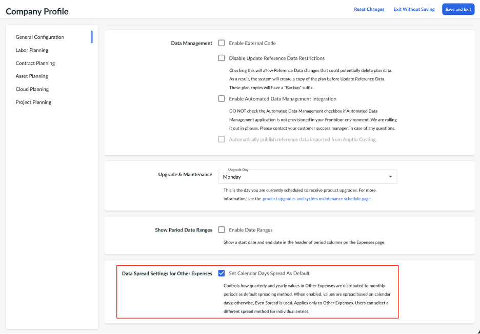
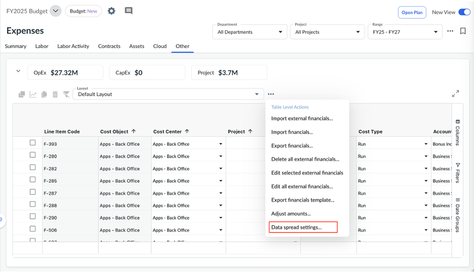
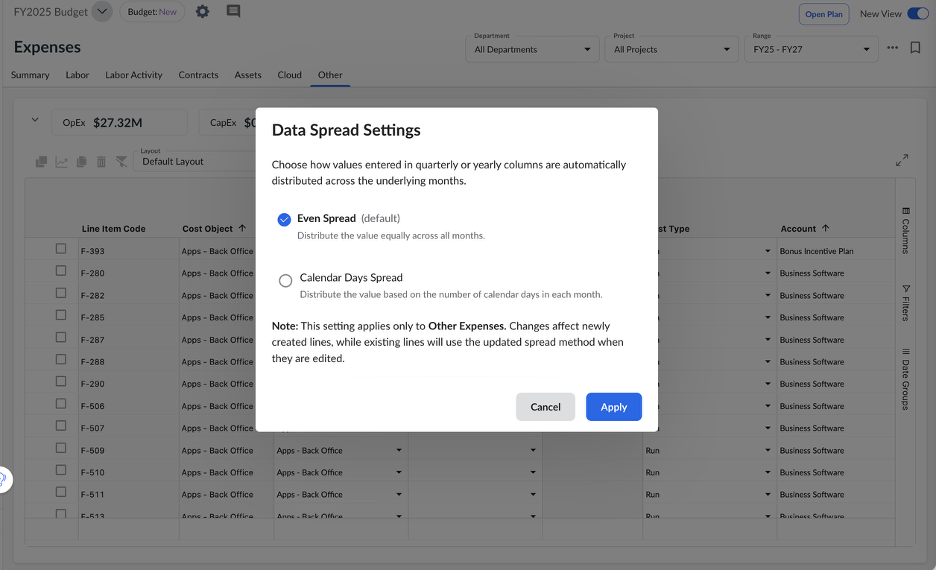
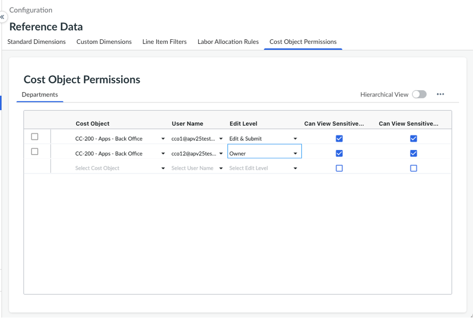
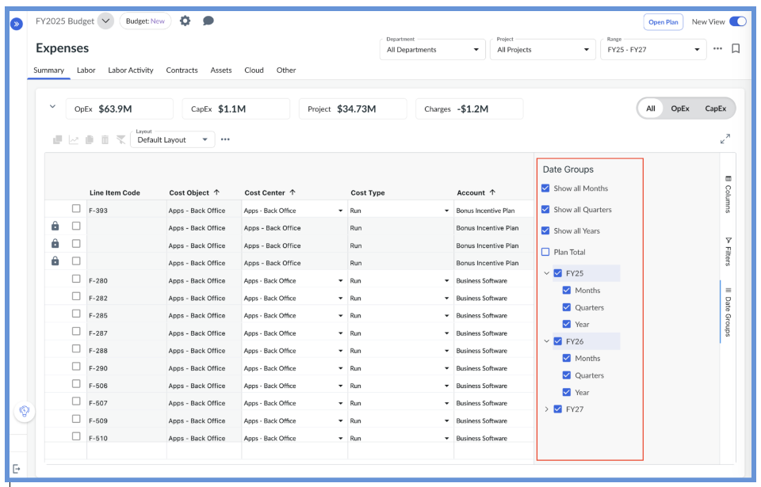
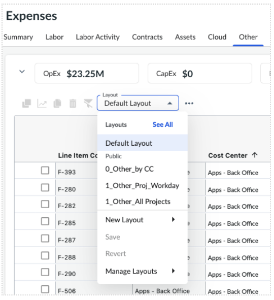
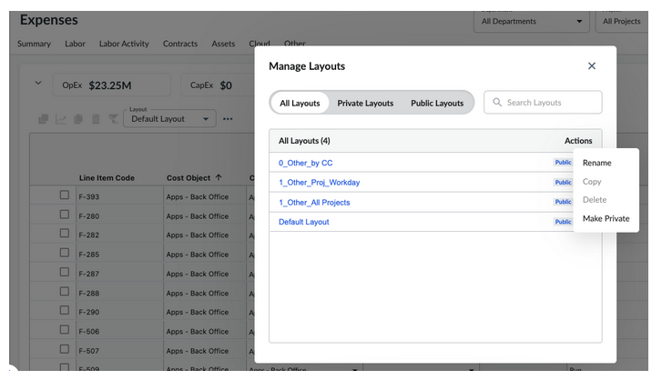
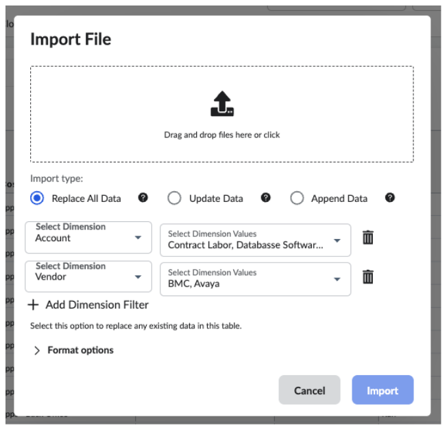
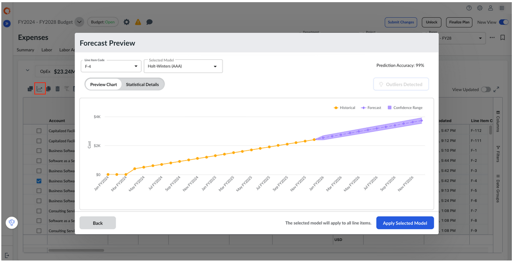
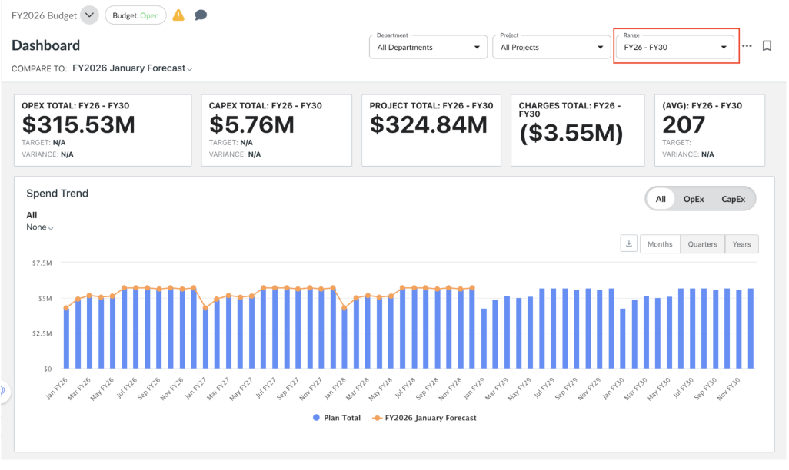

# Publicaciones recientes

## 5.26 : Sandbox: del 22 al 26 de junio de 2026 | Principal: del 29 de junio al 3 de julio de 2026

**API REST para la importación asíncrona de datos de gastos**

- El punto final **POST** inicia una importación asíncrona de datos de gastos en formato « CSV » para un plan específico y devuelve un identificador de importación único.
- El punto final **GET** recupera el estado actual de la operación de importación utilizando el identificador de importación facilitado.

Esta mejora permite a las organizaciones automatizar y ampliar de forma eficiente la importación de datos de gastos, especialmente en el caso de actualizaciones frecuentes o de gran volumen.

Para obtener más información, visita [Plan APIs](planning/plan-data-api.html#plndataapi__async).

**Compatibilidad con divisas para la API REST de exportación de planes**

Se ha mejorado la API REST de «Plan Export» para permitir la selección de la moneda durante la exportación de datos.

Exporta los datos del plan en uno de los siguientes formatos:

- **Moneda original** (por defecto): exporta los datos financieros en la misma moneda especificada para cada partida, sin aplicar ninguna conversión de moneda.
- **Moneda de la empresa** : exporta los datos financieros en la moneda predeterminada de la empresa. Todos los importes monetarios se convierten automáticamente utilizando los tipos de cambio correspondientes.

Esta mejora ofrece una mayor flexibilidad a la hora de elaborar informes y realizar análisis en planes multidivisa. Para obtener más información, visita [Plan APIs](https://www.ibm.com/docs/en/apptio-commercial/planning-standard/saas?topic=overview-plan-apis#plndataapi__title__3 "(se abre en una pestaña o una ventana nueva)").

**Distribución de importes basada en días naturales para otros gastos**

La distribución de los importes mensuales en **«Gastos > Otros»** ahora puede basarse en el número de días naturales de cada mes.

**Principales características**

- Los administradores pueden configurar **«Días del calendario»** como método de distribución predeterminado en los ajustes **del perfil de la empresa**.
- Cuando esta opción está activada, los importes introducidos en las columnas **trimestrales** o **anuales** se distribuyen automáticamente entre los meses en función del número de días naturales de cada mes.
- Los usuarios pueden modificar el método de distribución predeterminado a nivel de **la tabla «Gastos»** y elegir entre:
  - **Distribución uniforme**
  - **Diferencial en días naturales**

Esto aporta una mayor flexibilidad y mejora la precisión en la imputación de gastos a lo largo de los períodos contables.

**Corrección de errores**

- Se han solucionado los problemas de visibilidad en los menús desplegables «Versiones del plan» y «Factores de variación» de los grupos de nivel inferior de un solo departamento, garantizando así una visualización correcta y un acceso basado en permisos.
- Se ha solucionado un problema en la pestaña «Resumen» por el que, al profundizar en el gráfico «Cascada de gastos» mientras se comparaban planes, aparecía una ventana emergente en blanco con el error « E10000 ». Ahora los usuarios pueden profundizar correctamente en los gráficos de cascada al comparar los planes de previsión con los planes presupuestarios, y la ventana emergente de comparación muestra correctamente las partidas.
- Se ha solucionado un problema en la vista «Nuevos gastos» por el que la fila «Total» desaparecía al añadir una comparación de planes.
- Se ha solucionado un problema en la vista «Nuevos gastos» por el que la columna «Acumulado del año (YTD)» desaparecía cuando se deseleccionaba el ejercicio fiscal correspondiente en «Grupos de fechas».
- Se ha solucionado un problema en la pestaña «Mano de obra» por el que los campos de la lista de selección dependientes (como el «Código de centro de coste») no se rellenaban automáticamente al añadir nuevas líneas hasta que se actualizaba la página.
- Se ha solucionado un problema por el que no se podían guardar los permisos de usuario en la configuración del plan cuando no se había definido el nombre del departamento en los datos de referencia del departamento.

## Lanzamiento de « 5.25: » (Modo Sandbox): del 8 al 12 de junio de 2026 | (Servidor principal): del 15 al 19 de junio de 2026

**Normas de asignación de mano de obra en función del tiempo a nivel de plan**

Ahora es posible definir **reglas de asignación de mano de obra** **por horas** a nivel de plan, lo que permite modelar de forma más flexible los costes de mano de obra con todos los gastos incluidos en los planes plurianuales. Esto te permite aplicar diferentes valores de reglas a lo largo del tiempo —como **prestaciones, bonificaciones, formación y otros componentes de costes** — sin afectar a los datos de referencia globales.

**Principales prestaciones**

- Ampliar **las normas globales de asignación de mano de obra** con **plazos de entrada en vigor** **específicos para cada plan**
- Defina los valores **de «Válido desde»** para controlar cuándo entran en vigor los cambios en las reglas
- Aplicar automáticamente la regla correcta durante la generación de los costes de mano de obra en función del período correspondiente

Esta mejora permite una planificación de los costes de personal más precisa y basada en escenarios, con hipótesis que varían con el tiempo.

Para obtener más información, consulta [las «Normas de asignación de mano de obra en función del tiempo](https://www.ibm.com/docs/en/apptio-commercial/planning-standard/saas?topic=planning-labor-allocation-rules#laballrul__title__6 "(se abre en una pestaña o una ventana nueva)") ».

**Los permisos de objetos de coste se han trasladado a los datos de referencia**

**La página «Permisos de objetos de coste»** ya está disponible como una pestaña dentro de **«Datos de referencia»**, lo que permite gestionar los permisos junto con los elementos de configuración relacionados en una única ubicación unificada.

**Corrección de errores**

- Se ha solucionado un problema por el que no aparecían las opciones «Insertar fila arriba» e «Insertar fila abajo» al hacer clic con el botón derecho del ratón sobre las filas de la tabla de permisos de objetos de coste. Estas opciones de inserción de filas ahora se muestran correctamente, lo que permite a los usuarios añadir nuevas filas de permisos según sea necesario.
- Se ha solucionado un problema en la vista «Gastos antiguos» por el que no funcionaba la selección o deselección de las columnas de fechas (Mes, Total del ejercicio, Acumulado del año, Trimestres) mediante el menú «Mostrar/Ocultar columnas». Ahora los usuarios pueden mostrar y ocultar correctamente estas columnas relacionadas con el periodo, y el botón «Seleccionar todo» funciona correctamente para añadir todas las columnas disponibles al informe.
- Se ha mejorado la pestaña «Datos reales» del análisis de desviaciones para que, de forma predeterminada, se muestre el último periodo que contenga datos reales dentro del intervalo de fechas configurado, en lugar de mostrar el último periodo de todo el intervalo. De este modo, se garantiza que los usuarios vean de forma predeterminada datos reales y relevantes al analizar las variaciones, lo que elimina la necesidad de seleccionar manualmente el período correcto.
- Se ha solucionado un problema por el que la existencia de varias entradas de datos de referencia con nombres idénticos pero códigos diferentes (como las categorías de cuentas) provocaba un comportamiento incorrecto en la agrupación y el filtrado de los paneles de control. Al agrupar por nombre, ahora se muestran correctamente todas las partidas asociadas, y al desplegar las filas agrupadas se muestran todos los datos relevantes, en lugar de solo una parte de ellos.
- Se ha solucionado un problema por el que las columnas desplegables afectadas por los filtros de partidas individuales mostraban únicamente el valor «Nombre», en lugar del formato esperado «Código - Nombre». Ahora, los menús desplegables muestran de forma sistemática la combinación de «Nombre en clave» en todas las columnas, independientemente de si se aplican o no los filtros de partidas, lo que garantiza una presentación uniforme de los datos en toda la aplicación.
- Se ha solucionado un problema en la vista «Nuevo gasto» por el que los filtros no se guardaban en las plantillas. Ahora los filtros se conservan correctamente al guardar las plantillas, lo que garantiza que las preferencias de filtrado de los usuarios se mantengan entre sesiones.
- Se ha solucionado un problema por el que los valores de las listas personalizadas que contenían espacios al final provocaban que fallaran las funciones de agrupación, filtrado y expansión. Ahora el sistema gestiona correctamente los valores que contienen espacios adicionales, lo que garantiza que las filas agrupadas se puedan desplegar y filtrar correctamente sin que aparezca el error «Sin resultados».

## 5.24 : Sandbox: del 25 al 29 de mayo de 2026 | Principal: del 1 al 5 de junio de 2026

Versión de mantenimiento

Esta versión incluye actualizaciones de mantenimiento del sistema y correcciones de errores.

Corrección de errores

- Se ha solucionado un problema por el que el campo **«Horas de trabajo al día»** aparecía desactivado al crear o editar calendarios de trabajo, incluso con **la «Planificación integrada de inversiones»** activada. Ahora los usuarios pueden actualizar el horario laboral tal y como se esperaba, lo que permite una planificación precisa de la mano de obra.
- Se ha solucionado un problema por el que la agrupación de columnas eliminada en la **vista** «Gastos (nueva vista)» se volvía a aplicar automáticamente tras actualizar la página. Los cambios en el diseño ahora se conservan correctamente sin que vuelvan a aparecer las agrupaciones eliminadas.
- Se ha solucionado un problema por el que los KPI mostraban una divisa incorrecta cuando se seleccionaban varios objetos de coste en la vista «**Divisa: Original** ». Ahora, las agregaciones utilizan **la moneda del objeto de coste** cuando todos los objetos de coste seleccionados comparten la misma moneda, y se establece por defecto **la moneda de** la empresa únicamente cuando las monedas difieren.
- Se ha solucionado un problema por el que **los datos comparativos no se incluían** al exportar mediante la opción «Diseño de exportación» desde las pestañas **«Contratos»** y «**Activos** ». Las exportaciones ahora incluyen correctamente columnas de comparación, al igual que en las demás pestañas de gastos.
- Se ha solucionado un problema por el que las actualizaciones de la página **«Objetivos»** no se reflejaban de inmediato y era necesario actualizar la página. Los cambios se ven ahora al instante, lo que garantiza una visualización coherente y precisa sin necesidad de actualizar manualmente la página.
- Se ha solucionado un problema por el que los usuarios encontraban errores al importar datos en la pestaña «**Contratos** ». Las importaciones ahora se completan correctamente tras una validación adecuada, lo que garantiza un flujo de trabajo más fluido durante las actualizaciones de planificación.
- La acción **«Actualizar datos reales»** pasa a llamarse **«Actualizar datos financieros reales»** en todas las pestañas de la página «**Gastos** ». Esta actualización de la nomenclatura también se refleja en el cuadro de diálogo y **en el historial de cambios**, lo que proporciona una terminología más clara y coherente.
- Se ha solucionado un problema por el que los usuarios recién creados no aparecían inmediatamente en **los permisos del plan** y **en los permisos del objeto de coste**. Ahora los usuarios aparecen correctamente, lo que permite asignarles permisos sin demora.
- Se ha solucionado un problema en la Lista de proyectos de Project Financial Planning (PFP) por el que, al seleccionar un archivo en el cuadro de diálogo «Importar proyectos», no se iniciaba la carga ni se activaba la acción de importación. La selección e importación de archivos ahora funcionan correctamente, lo que garantiza que la carga de datos del proyecto se realice sin interrupciones.

## 5.23 : Sandbox: del 11 al 15 de mayo de 2026 | Principal: del 18 al 22 de mayo de 2026

**Identificación de los datos reales en los planes de previsión**

- En los planes de previsión, las partidas que incluyen importes reales se identifican ahora automáticamente con **«Reales» como tipo de partida**, mientras que las partidas de previsión no sufren cambios.
- Esto permite elaborar informes más claros y realizar análisis más precisos al agrupar, filtrar o comparar datos por **tipo** **de partida**.

**Mejora en la gestión de las prórrogas de los contratos basados en la duración**

- Las prórrogas de los contratos ahora se aplican con mayor precisión en los contratos que utilizan los métodos de amortización **«Línea recta por duración»** y «**Línea recta por calendario personalizado** ».
- Una nueva opción **de «Desplazamiento de la prórroga»** te permite controlar si una prórroga comienza al **día** siguiente o al **mes siguiente**, lo que evita que las fechas de renovación no coincidan y que se produzcan amortizaciones incorrectas, especialmente en los contratos que siguen el año natural y en los años bisiestos.
- De este modo, se garantiza que las prórrogas de los contratos se ajusten perfectamente a los ejercicios fiscales y a las expectativas de los usuarios.

**Métodos de asignación de mano de obra por períodos fijos**

Ya hay disponibles dos nuevos métodos de amortización para **las reglas de asignación de mano de obra**, lo que permite distribuir los costes basándose en **ratios de periodos fijos**.

- **Método lineal con días naturales y período fijo** : distribuye los costes en función del número de días naturales de cada período contable en relación con el ejercicio completo, sin prorratear las fechas de inicio o finalización del contrato.
- **Método lineal con días laborables y período fijo** : distribuye los costes en función de los días laborables de cada ejercicio, utilizando el calendario laboral configurado, sin prorratear las fechas de inicio o finalización del contrato. Vuelve a una distribución uniforme por periodos cuando los calendarios de trabajo son fijos.

**Descripciones específicas del plan en el encabezado del plan**

- Los administradores y los responsables del proceso presupuestario ya pueden añadir una **descripción** **específica del plan** para proporcionar contexto, orientación o supuestos clave mediante el campo **«Descripción»** del cuadro de diálogo «**Editar plan** ».
- La descripción aparece en el **encabezado del plan**, lo que facilita el acceso a información importante mientras se trabaja en él. Los usuarios pueden mostrar u ocultar la descripción en cualquier momento mediante el **icono de la campana** situado en la cabecera del plan.

**Mostrar intervalos de fechas en «Gastos» (nueva vista)**

- Los administradores ya pueden activar la opción **«Mostrar intervalos de fechas de los periodos»** en el **perfil de la empresa** para mostrar las fechas de inicio y fin de cada periodo en la tabla «Gastos (nueva vista)».
- Cuando está activada, los intervalos de fechas de los periodos se ajustan al calendario fiscal de la empresa y respetan la configuración regional del usuario para el formato de las fechas, lo que proporciona un contexto temporal más claro en la tabla.

**Corrección de errores**

- Se ha solucionado un problema por el que los usuarios no podían editar las notas de los factores de variación cuando había cambios no publicados en los datos de referencia de las categorías contables. Ahora la edición funciona correctamente sin necesidad de publicar esos cambios.
- Se ha solucionado un problema en la vista **«Gastos (nueva vista)»** por el que al desplegar las filas de un plan comparativo se producía un error. Ahora las filas se despliegan correctamente, lo que permite a los usuarios ver los datos detallados sin interrupciones.
- Se ha solucionado un problema por el que al configurar **el análisis de variaciones** aparecía un error cuando **las concreciones de mano de obra** estaban desactivadas. La configuración ahora funciona correctamente sin necesidad de habilitar la opción.
- Se ha solucionado un problema por el que, al introducir valores en la **columna «Ejercicio fiscal»** mientras **las columnas de los trimestres estaban ocultas,** se producía una distribución incorrecta entre los meses y los totales trimestrales resultaban inexactos. Los cálculos de los periodos ahora se ajustan correctamente en los totales mensuales, trimestrales y anuales.
- Los datos comparativos de la **tabla «Gastos»** ahora se distinguen visualmente, con columnas agrupadas y un sutil resaltado de fondo. Esto facilita la distinción entre los datos comparativos y el plan base.

## Lanzamiento de « 5.22 » - Sandbox: del 27 de abril al 1 de mayo de 2026 | Servidor principal: del 4 al 8 de mayo de 2026

**Comparaciones interanuales de gastos (nueva vista)**

Ahora puedes comparar periodos dentro del mismo plan —año a año, trimestre a trimestre o mes a mes— directamente en **«Gastos > Nueva vista»**, lo que facilita el análisis de tendencias y cambios a lo largo del tiempo.

**Principales prestaciones**

- Compara **años, trimestres o meses** según el periodo que selecciones
- Ver y ordenar por **variación absoluta o porcentual**
- Disponible en todas las pestañas que admiten comparaciones entre planes, con el mismo comportamiento de agrupación predeterminado

Para obtener más información, consulta [la sección «Comparación entre períodos](https://www.ibm.com/docs/en/apptio-commercial/planning-standard/saas?topic=plans-compare-versions#Compareversionsorplans__title__2 "(se abre en una pestaña o una ventana nueva)") ».

**Restablecer el presupuesto del departamento a la versión anterior**

**Los responsables de los centros de coste** ya pueden restaurar una instantánea anterior y convertirla en la versión actual de los datos del plan para su departamento. Esto facilita la recuperación tras cambios no deseados y permite continuar con la planificación a partir de un momento concreto conocido y fiable.

**Principales prestaciones**

- Restaurar una instantánea anterior para un departamento específico si el usuario tiene permisos de edición sobre dicho departamento
- Disponible cuando el plan está en estado «Abierto» y el departamento está en estado «En curso».
- Tracks registra las acciones en el historial de cambios para garantizar una visibilidad y una capacidad de auditoría completas

Para obtener más información, consulta «[Restaurar instantánea](https://www.ibm.com/docs/en/apptio-commercial/planning-standard/saas?topic=collaboration-snapshots-versioning#snapshot__title__6 "(se abre en una pestaña o una ventana nueva)") ».

**Modernización de la interfaz de usuario de los permisos de objetos de coste**

La pantalla **«Permisos de objetos de coste/departamentos»** se ha actualizado para adaptarse a la **experiencia de usuario unificada de Apptio**, al tiempo que se mantienen el comportamiento y los flujos de trabajo existentes.

**Principales prestaciones**

- Una experiencia de gestión de permisos coherente, en consonancia con la experiencia de usuario unificada de Apptio y los estándares de la red empresarial
- Compatibilidad total con **la edición en línea**, la importación y la exportación
- Las vistas de lista y jerárquicas, la visibilidad de las columnas y el acceso basado en roles funcionan como antes

**Publicar permisos de objetos de coste en los planes**

Con **los permisos de usuario a nivel de plan** habilitados, los administradores y los responsables del proceso presupuestario ahora pueden publicar **permisos globales de objetos de coste** directamente en los planes seleccionados. Esto simplifica la gestión centralizada de permisos y mantiene la coherencia entre los distintos planes sin necesidad de intervención manual.

**Principales prestaciones**

- Aplicar permisos globales a **uno, varios o todos los planes**, incluidos los planes archivados
- Controla cómo se aplican los **permisos** mediante «Actualizar permisos» o **«Reemplazar todos los permisos»**

Para obtener más información, visita [«Publicar permisos globales en los planes».](https://www.ibm.com/docs/en/apptio-commercial/planning-standard/saas?topic=administration-cost-object-permissions#cop__title__6 "(se abre en una pestaña o una ventana nueva)")

**Corrección de errores**

- Se ha solucionado un problema por el que la columna **«Total»** de la pestaña **«Mano de obra»** mostraba valores incorrectos al comparar planes entre ejercicios fiscales. Los totales reflejan ahora correctamente los valores del plan de comparación, lo que permite realizar un análisis preciso.
- Se ha corregido un error por el que la columna **«Acumulado del año»** en **«Actividad laboral» (modo «Horas»)** mostraba una media en lugar de una suma. Los valores acumulados del año se calculan ahora correctamente como **la suma** tanto de las filas agrupadas como de las no agrupadas.
- Se ha solucionado un problema por el que la **página «Resumen de gastos»** no se cargaba para los usuarios sin acceso a las columnas confidenciales tras la eliminación de un atributo confidencial. Ahora la página se carga correctamente, sin errores.
- Se ha solucionado un problema por el que los usuarios sin acceso a **«Todos los departamentos»** veían selecciones predeterminadas incorrectas y no podían desplegar los proyectos en el menú desplegable «**Proyecto** ». El menú desplegable ahora refleja correctamente los permisos de los usuarios y permite navegar con normalidad.

## 5.21 : Sandbox: del 14 al 17 de abril de 2026 | Main: del 20 al 24 de abril de 2026

**API de exportación del historial de cambios**

**Exportar registros del historial de cambios:** El punto final POST permite a los usuarios exportar los registros de eventos del historial de cambios como un archivo de formato « CSV » según los filtros aplicados.

Para obtener más información, consulta [la Descripción general de las API REST de Planning](planning/plan-api.html "Las API REST de planificación de « Apptio » proporcionan un acceso seguro y programático a los planes, los datos de planificación, los metadatos y los elementos relacionados dentro de « Apptio Planning». Estas API están diseñadas para facilitar la automatización y las integraciones de sistemas en casos de uso relacionados con la planificación, la previsión, el análisis, la gobernanza y el intercambio de datos.").

**Importar actividad laboral por código externo de recurso**

Ahora puede planificar e importar la actividad laboral utilizando **un código externo de recursos** (como el número de identificación del empleado), lo que simplifica la integración de la planificación de la mano de obra con los sistemas externos de recursos humanos.

- **Planificar líneas de trabajo utilizando códigos externos de recursos únicos**

  Defina y gestione los recursos humanos utilizando un identificador externo estable (por ejemplo, el número de identificación del empleado).
- **Importar asignaciones de actividades laborales por número de empleado**

  Las importaciones de actividades de mano de obra ahora resuelven los recursos mediante «**Recurso: Código externo** ».

Nota: Es necesario que la función **«Código externo»** esté activada.

Para obtener más información, consulta «[Códigos externos](planning/external-unique-identifier.html "Cuando se importan o actualizan datos de gastos (por ejemplo, mano de obra, actividades de mano de obra, contratos, activos) desde sistemas externos (sistemas de RR. HH., bases de datos de proveedores, etc.), Necesitas un identificador único y constante para poder relacionar las líneas de tu plan con los registros del sistema de origen.") » y «[Importar actividad laboral por código externo](planning/iip/unique-labor-resource-identification.html) »

**Mejora de la alineación del código externo en el resumen de gastos**

- Cuando se utiliza **el «Código externo»** como identificador único definido por el usuario en las líneas de gastos, los datos financieros generados a partir de dichas líneas (mano de obra, contratos, activos y actividad laboral) se resumen en la columna **«Código externo»** de la pestaña «**Gastos > Resumen** ». Esto facilita la alineación de las líneas de «Previsión» y «Real» utilizando el mismo código externo.
- Anteriormente, **el código externo** de los datos financieros generados solo aparecía en la columna «Código externo de origen», lo que dificultaba la comparación entre las previsiones y los datos reales por código externo.

Nota: Es necesario que la función **«Código externo»** esté activada.

Para obtener más información, visita «[Códigos externos](planning/external-unique-identifier.html "Cuando se importan o actualizan datos de gastos (por ejemplo, mano de obra, actividades de mano de obra, contratos, activos) desde sistemas externos (sistemas de RR. HH., bases de datos de proveedores, etc.), Necesitas un identificador único y constante para poder relacionar las líneas de tu plan con los registros del sistema de origen.") ».

**Actualización de la navegación por los datos de referencia**

**Las reglas de asignación de mano de obra** y **los filtros de partidas individuales** se han reorganizado en pestañas independientes dentro de **«Datos de referencia»,** en el panel de navegación de la izquierda. De este modo, **los datos de referencia** se centralizan en una única ubicación, lo que facilita la búsqueda y la gestión de las dimensiones relacionadas.

**Corrección de errores**

- Se ha actualizado el menú desplegable de la lista de selección en la vista «Nuevos gastos» para que ajuste dinámicamente su ancho en función de la longitud del contenido, lo que garantiza que todos los valores sean totalmente visibles sin que se trunquen.
- Se ha corregido el menú desplegable «Navegación por proyectos» para que muestre correctamente el proyecto principal cuando se seleccionan varios proyectos de distintos niveles jerárquicos. En lugar de mostrar «Todos los proyectos», el encabezado ahora refleja el elemento principal de mayor nivel, lo que proporciona un contexto más preciso y significativo.
- Se ha solucionado un problema en la página «Objetivos» por el que, al seleccionar un departamento con un único subdepartamento independiente, el departamento principal quedaba oculto, lo que impedía editar su objetivo. Ahora el menú desplegable muestra correctamente el departamento principal, lo que permite ver y actualizar los valores de destino tal y como se esperaba.
- Se ha solucionado un problema en la vista «Nuevo» de «Gastos» por el que las columnas fijadas volvían a su posición original al reordenarlas por primera vez. Ahora las columnas ancladas se pueden reordenar correctamente y conservan su nueva posición tal y como se esperaba.
- Se ha solucionado un problema en la vista «Nuevo gasto» por el que los usuarios que no tenían el permiso « EditExternalLine » podían duplicar partidas externas. Ahora el sistema aplica correctamente los permisos, lo que evita la duplicación para los usuarios que no disponen del acceso necesario.
- Se ha corregido un error por el que los atributos principales (generados) se mostraban incorrectamente en la tabla «Otros». Estos atributos ahora se limitan a la tabla «Resumen», tal y como estaba previsto, y ya no aparecen en la tabla «Otros».

## 5.20 : Sandbox: del 30 de marzo al 3 de abril de 2026 | Principal: del 6 al 10 de abril de 2026

**API REST para la gestión de gastos y el diseño de tablas**

En esta versión hemos incorporado las siguientes nuevas API REST.

- **Exportar datos desde la gestión de gastos:** El punto final POST exporta los datos reales desde la gestión de gastos
- **Importar datos a Spend Management:** El punto final POST importa los datos reales a Spend Management
- **Archivo de ayuda sobre errores de importación de la gestión del gasto:** El punto final GET exporta un archivo de ayuda en formato CSV que contiene los errores de importación de datos de la gestión del gasto, lo que permite a los usuarios analizar y solucionar los fallos de importación.
- **Exportación de diseños de tablas:** El punto final GET exporta todos los diseños de tablas a los que el usuario tiene acceso.
- **Exportar datos de planes por diseño:** Se ha mejorado el punto final de Post para la exportación de datos de planes con el fin de admitir un nuevo parámetro, **layoutId**, que permite exportar datos de planes en un formato de diseño específico.

**Resumen de gastos mejorado con contexto de la línea de origen**

Ahora puede consultar los atributos detallados de las partidas de origen, como contratos, activos, mano de obra y actividades de mano de obra, directamente en los informes financieros generados, en la pestaña «Resumen de gastos». Esta mejora ofrece mayor transparencia, contexto y trazabilidad, lo que le ayuda a analizar y comprender mejor los gastos.

- **Mayor riqueza de contexto de los datos:** los datos financieros incluyen ahora atributos adicionales, como detalles de contratos, propiedades de activos e información sobre recursos.
- **Trazabilidad desde el origen hasta los datos financieros:** localice fácilmente los datos financieros generados hasta la partida de origen utilizando los atributos adicionales de la pestaña «Resumen».
- **Compatibilidad con diseños:** Las columnas de atributos recién añadidas están ocultas de forma predeterminada, pero se pueden activar, guardar y exportar mediante las opciones de exportación **«Exportar diseño»** o «**Exportar todo** ».

A continuación se incluye la lista de los nuevos atributos de resumen añadidos para los tipos de gastos compatibles.

**Pestaña «Contratos»**

|  |  |
| --- | --- |
| **Nombre del atributo en la pestaña «Contrato»** | **Nombre del atributo asignado en la pestaña «Resumen»** |
| Importe | Importe del contrato |
| Fecha de inicio | Fecha de inicio del contrato |
| Fecha de finalización | Fecha de finalización del contrato |
| Método de amortización del contrato | Método de amortización del contrato |
| Tipo del IVA | Tipo de IVA del contrato |
| Importe con IVA | Importe del contrato con IVA incluido |

**Pestaña «Activos»**

|  |  |
| --- | --- |
| **Nombre del atributo en la pestaña «Activos»** | **Nombre del atributo asignado en la pestaña «Resumen»** |
| Clase de activos | Clase de activos |
| Vida útil del activo (meses) | Vida útil del activo (meses) |
| Valor residual (%) | Valor residual del activo (%) |
| Tasa de saldo (%) | Tasa de equilibrio de activos (%) |
| Método de amortización de activos | Método de amortización de activos |
| Precio de compra | Precio de compra del activo |
| Fecha de entrada en servicio | Fecha de puesta en servicio del activo |
| Cantidad | Cantidad de activos |
| ¿Es un activo existente? | ¿Es un activo existente? |

**Pestaña «Trabajo»**

|  |  |
| --- | --- |
| **Nombre del atributo en la pestaña «Trabajo»** | **Nombre del atributo asignado en la pestaña «Resumen»** |
| Nombre de empleado | Recurso |
| Rol | Rol de recurso |
| Función laboral en el proyecto | Rol de recurso |
| Tipo de empleado | Tipo de empleado |
| Cantidad | Cantidad de recursos |
| Fecha de inicio | Fecha de inicio del recurso |
| Fecha de finalización | Fecha de finalización del recurso |
| ¿Es un empleado actual? | ¿Es un empleado actual? |

**Pestaña «Actividad laboral»**

|  |  |
| --- | --- |
| **Nombre del atributo en la pestaña «Trabajo»** | **Nombre del atributo asignado en la pestaña «Resumen»** |
| Centro de costes de recursos | Centro de costes de recursos |
| Rol de recurso | Función laboral en el proyecto |
| Tipo de actividad | Tipo de actividad del recurso |

Interpretación de los permisos de usuario para la comparación de planes

Cuando se activa la función «Permisos de objetos de coste a nivel de plan», los permisos se aplican de la siguiente manera durante la comparación de planes:

- **Datos de gastos** : Los datos comparativos se muestran en función de los permisos del usuario en el plan de origen.
- **Datos confidenciales sobre el personal** : Las columnas y los datos financieros confidenciales sobre el personal solo son visibles si el usuario tiene acceso a todos los planes comparados.
- **Detalles del análisis de desviaciones** : El análisis de desviaciones se muestra según los permisos del usuario en el plan de origen.

**Corrección de errores**

- Se ha solucionado un problema por el que los usuarios seguían siendo redirigidos al último plan al que habían accedido, incluso después de que un administrador lo hubiera eliminado, lo que provocaba que, al iniciar sesión, se les redirigiera a un plan eliminado temporalmente.
- Se ha solucionado un problema por el que al establecer la fecha de finalización del contrato laboral más allá del año 2045 se producía un error.
- Se ha corregido un error por el que el gráfico en cascada del análisis de variaciones se establecía por defecto en el último mes del año; ahora se establece correctamente por defecto en el último mes del periodo de comparación seleccionado.
- Se ha corregido un problema para garantizar que los usuarios que no dispongan del permiso *« ExternalLineEdit »* no puedan eliminar líneas externas.
- Se ha solucionado un problema por el que los cálculos de los gastos de personal no tenían en cuenta las horas diarias configuradas en el calendario. Los cálculos ahora utilizan correctamente el horario laboral definido, incluyendo los casos en los que el trabajo comienza a mitad de período y las reglas de asignación basadas en la jornada laboral.

## 5.19 : Sandbox: 16-20 de marzo de 2026 | Principal: 23-27 de marzo de 2026

**Previsión inteligente**

Hemos ampliado **Intelligent Forecasting** para que admita datos sobre mano de obra, actividad laboral (horas), contratos y activos, lo que permite realizar previsiones más amplias basadas en la inteligencia artificial en todo el proceso de planificación.

**Trabajo y actividad laboral**

- La previsión predictiva ya está disponible en las pestañas «Mano de obra» y «Actividad laboral (horas)».
- Las vistas previas de las previsiones muestran las unidades correctas: número de empleados para la mano de obra y horas para la actividad laboral.
- Al aplicar las previsiones, se actualizan automáticamente los datos financieros relativos a la mano de obra y la actividad laboral.

**Contratos y activos**

- La función de previsión ahora admite contratos de amortización manual y activos de depreciación manual.
- La función de previsión para las filas de contratos y activos no compatibles está desactivada.
- La aplicación de las previsiones genera datos financieros actualizados tanto para los contratos como para los activos.

Estas mejoras incorporan la previsión basada en inteligencia artificial a más fases del flujo de trabajo de planificación, lo que ayuda a los usuarios a crear previsiones más rápidas, precisas y coherentes, con menos trabajo manual, en la planificación de personal, actividades, contratos y activos.

**Eliminar permisos de usuario de forma masiva**

Al gestionar los permisos de usuario a nivel de plan, los administradores y los usuarios de BPO ahora pueden eliminar rápidamente los permisos de un usuario en todos los planes. Cuando se seleccionan una o varias filas de permisos, aparece una nueva opción **llamada «Eliminar permiso de todos los planes** ».

Acción de eliminación masiva:

- Elimina el permiso seleccionado de todos los planes (Nuevo, Abierto, Final y Archivado).
- Elimina el permiso de los datos de referencia de «Permisos de objetos de coste».

**Indicadores clave de rendimiento (KPI) sensibles a los filtros en los gráficos de resumen**

- Los indicadores clave de rendimiento (KPI) de la página «Resumen» (Datos financieros y plantilla) ahora se actualizan automáticamente en función de los filtros que apliques.
- Esta mejora garantiza que los valores de los KPI reflejen siempre el mismo conjunto de datos filtrado que los gráficos subyacentes, lo que proporciona información coherente y precisa en toda la vista de resumen.

**Resumir los datos financieros de personal por nombre de empleado**

- Ahora puedes resumir los datos financieros de personal por nombre de empleado en la vista «Gastos > Resumen».
- Esta actualización te ayuda a analizar mejor el coste total de mano de obra por recurso. Se puede activar en la configuración de «Resumen de mano de obra».

**API REST para permisos de usuario**

Hemos incorporado API REST que permiten importar y exportar de forma programada los datos de permisos de los usuarios dentro de « Apptio Planning».

Entre sus principales funciones se incluyen

- **Importar datos de permisos:** El punto final POST importa datos de planes para los permisos de usuario o los permisos globales de objetos de coste.
- **Archivo de ayuda sobre errores de importación de permisos de exportación:** El punto final GET exporta un archivo de ayuda en formato CSV que contiene datos sobre errores de importación de permisos, lo que permite a los usuarios analizar y solucionar los fallos de importación.
- **Datos de permisos de exportación:** El punto final POST exporta los permisos de usuario o los permisos globales de objetos de coste.

**Corrección de errores**

- Se ha solucionado un problema por el que los campos personalizados de «Mano de obra» a los que se les había cambiado el nombre no aparecían en la lista de atributos del resumen de mano de obra. Los campos renombrados ahora se muestran correctamente en el perfil de la empresa y en el resumen.
- Se ha mejorado el menú desplegable «Proyecto» para que refleje con precisión los proyectos seleccionados —mostrando el nombre del proyecto en el caso de selecciones únicas y el grupo de proyectos correspondiente con el número de selecciones en el caso de selecciones múltiples o jerárquicas—, de modo que ahora es coherente con el menú desplegable «Departamento».
- Se ha solucionado un problema por el que la opción «Enviar todos los cambios y finalizar» mostraba un error inesperado. Ahora la finalización se lleva a cabo sin interrupciones.
- Se ha solucionado un problema que impedía crear un nuevo atributo de hipervínculo tras eliminar uno anterior.
- Se ha solucionado un problema que se producía durante la creación de planes y la actualización de datos reales, por el que podían aparecer datos reales duplicados al resumirlos según atributos no admitidos.
- Se ha solucionado un problema que impedía que los datos reales se actualizaran en los planes de previsión con más de un año de datos históricos.
- Se ha mejorado el filtrado por departamentos en «Permisos de usuario», de modo que las búsquedas por código, nombre o ambos devuelven resultados correctos.
- Se ha solucionado un problema por el que no se podían eliminar los planes presupuestarios después de eliminar el plan de previsión correspondiente en el Análisis de variaciones.
- Se ha solucionado un problema por el que al guardar y actualizar un diseño aparecía un duplicado del mismo.
- Se ha solucionado un problema en la vista «Gastos → Nuevo» por el que los diseños eliminados seguían apareciendo hasta que se actualizaba la página.
- Se ha corregido un problema por el que Costing Integration publicaba nombres de columnas incorrectos debido a metadatos obsoletos.

## Lanzamiento 5.18 Sandbox: 2-6 de marzo de 2026 | Principal: 9-13 de marzo de 2026

**Control configurable para permisos a nivel de plan**

Ahora puede habilitar o deshabilitar **los permisos de usuario a nivel de plan** desde **Perfil de la empresa → Configuración general**, lo que le brinda flexibilidad para administrar el acceso de la manera que mejor se adapte a su organización.

- Utilice **permisos globales de objetos de coste** para un control centralizado
- O habilite **permisos a nivel de plan** para una gestión de acceso más detallada

Para habilitar o deshabilitar los permisos de usuario a nivel de plan:

1. Vaya a **Configuración** **(icono de engranaje)** → **Perfil de la empresa**.
2. Seleccione **Configuración general → Acceso y permisos.**
3. Utilice la casilla de verificación **Habilitar permisos de objetos de coste a nivel de plan** para habilitar o deshabilitar la función.

**Ampliación de la compatibilidad con el calendario fiscal para la integración de Cloudability Financial Planning**

Apptio Planning ahora admite la integración con Cloudability Financial Planning (CFP) para organizaciones que utilizan **calendarios gregorianos con meses de inicio de año fiscal distintos de enero**.

**Importación mejorada de líneas de pedido filtradas**

Esta actualización mejora la forma en que se sustituyen selectivamente los datos al importar elementos de línea, lo que le proporciona un control más preciso al utilizar **la función «Reemplazar todos los datos con filtro de dimensión** ».

1. Ahora se admiten **dimensiones personalizadas** y **listas personalizadas** en el filtrado de dimensiones
2. Los filtros de dimensión y valor ahora se muestran en un formato claro **<código> – <nombre>** para facilitar la selección

**Visualización personalizable de la columna Periodo**

Esta mejora le ofrece una mayor flexibilidad en la forma en que se muestran las columnas de período en la **nueva vista de gastos.**

- Habilitar o deshabilitar las columnas **mensuales** y **trimestrales** de forma independiente para cada año
- Guardar configuraciones como **diseños de tabla reutilizables**

**API mejorada para la exportación de datos del plan**

La API de exportación de planes ahora admite opciones de exportación adicionales para adaptarse mejor a sus flujos de trabajo de planificación.

- Exportar datos de actividad laboral como ETC o horas utilizando el nuevo parámetro **« laborDisplayType » (Exportar datos de actividad laboral como ETC o horas).**
- Utilice el nuevo parámetro **isForReimport** para exportar datos en un formato listo para volver a importar.

**Corrección de errores**

- Se ha corregido un problema en la nueva vista de gastos que impedía establecer automáticamente el valor del objeto de coste al configurar el centro de coste.
- Se ha corregido el comportamiento del menú desplegable de la página Objetivos para mostrar de forma coherente el objeto principal seleccionado y sus descendientes de nivel más bajo, independientemente del número de objetos secundarios o de la actualización de la página, lo que garantiza una resolución jerárquica estable y precisa.
- Se ha corregido un problema en la pestaña Contratos que impedía expandir el grupo de elementos finales cuando se utilizaba una agrupación de columnas de 4 niveles.
- Se ha corregido un problema que permitía aplicar centros de coste no válidos a las líneas de actividad laboral al copiar y pegar partidas.
- Se ha corregido un problema en la opción Exportar para reimportar de la pestaña Mano de obra, de modo que ahora se exportan las columnas Código y Nombre para las dimensiones personalizadas añadidas a la pestaña Mano de obra.
- Se han actualizado los ajustes de exportación en la integración de costes para publicar los datos del plan con total precisión (8 decimales) y en la moneda original definida en la planificación.

## Lanzamiento 5.17 Sandbox: 16-20 de febrero de 2026 | Principal: 23-27 de febrero de 2026

Integración de la planificación financiera en la nube

Esta versión introduce la integración entre **Apptio Planning** y **IBM Cloudability ’s Cloud Financial Planning (CFP)**, lo que permite a los clientes incorporar el gasto en la nube en los flujos de trabajo de presupuestación y previsión.

**Pestaña Nube**

- Los clientes pueden habilitar una nueva **pestaña «Cloud»** en la nueva vista «Expenses» para gestionar los costes de la nube directamente desde « Apptio » «Budgets and Forecasts».
- La pestaña Cloud se puede habilitar de forma independiente y no requiere integración con CFP.

**Integración CFP**

- Los clientes pueden conectar Apptio Planning con Cloud Financial Planning (CFP) para importar presupuestos y previsiones en la nube desde CFP con una sola acción.
- Los gastos de nube importados se asignan automáticamente a la estructura financiera de Planning.

**Detalles adicionales** : el uso de la pestaña «Cloud» y la integración con CFP requieren una **licencia estándar de planificación** de Apptio.

Para obtener más información, visite [Connect en Cloudability Financial Planning](planning/connect-cfp.html).

Diseños mejorados en la nueva vista

Los diseños en New View se han rediseñado para mejorar la claridad y la gestión del diseño:

- El menú desplegable Diseños ahora siempre muestra el diseño aplicado actualmente.
- Los diseños creados tanto en la vista heredada como en la nueva vista se sincronizan automáticamente en ambas vistas, lo que elimina la necesidad de realizar una sincronización manual.
- La gestión del diseño se simplifica con la nueva experiencia de gestión de diseños, que permite a los usuarios:
  - Ver todos los diseños públicos y privados
  - Buscar diseños por nombre
  - Renombrar diseños
  - Cambiar la visibilidad del diseño entre Público y Privado
  - Eliminar diseños

  

  

Importación de líneas de pedido añadidas y filtradas

Nos complace anunciar el lanzamiento de la función «Importación de líneas de pedido añadidas y filtradas», diseñada para ofrecer a los usuarios más control y flexibilidad al importar datos a Planning.

**Ahora puedes:**

- Añadir nuevas líneas a los planes existentes sin sobrescribir todos los datos actuales.
- Filtre las importaciones por dimensiones específicas, como Proyecto, Cuenta, etc., para actualizar y sustituir de forma selectiva subconjuntos de partidas.

Para obtener más información, consulta la documentación de ayuda [«Carga masiva de líneas».](https://www.ibm.com/docs/en/apptio-commercial/planning-standard/saas?topic=plans-bulk-upload-line-item-values "(se abre en una pestaña o una ventana nueva)")

Actualización del nombre de la entidad planificadora en el sistema automatizado de gestión de datos ( Data Management, ADM)

- Los nombres de las entidades de planificación en ADM ( Data Management ) se han actualizado con etiquetas más claras y orientadas a la acción: Importar y Publicar, para que los nombres sean claros e intuitivos.
- Estas actualizaciones solo se aplican a los nombres que se muestran; todas las funciones de ADM permanecen sin cambios.

Para obtener más información, consulta la documentación de ayuda [«Conectarse a la función de cálculo de costes de Apptio](https://www.ibm.com/docs/en/apptio-commercial/planning-standard/saas?topic=integrations-connect-apptio-costing "(se abre en una pestaña o una ventana nueva)") ».

Estado de aprobación del plan API de exportación

- Apptio La planificación ahora admite la exportación programática de datos sobre el estado de aprobación de planes a través de la API de exportación.
- El punto final POST permite exportar los detalles del estado de aprobación en formato CSV para su procesamiento externo.

Para obtener más información, consulta la documentación de ayuda [«Plan APIs](https://www.ibm.com/docs/en/apptio-commercial/planning-standard/saas?topic=apis-plan-api "(se abre en una pestaña o una ventana nueva)") ».

Otras mejoras

- El esquema de la tabla de gastos para todos los tipos de gastos (Otros financieros, Mano de obra, Contratos, Activos y Actividad laboral) se ha actualizado para incluir **el estado del plan** como atributo estándar, mostrando el estado actual (En curso, Enviado, Aprobado o Devuelto) de cada línea de gastos.
- La gestión de gastos ahora incluye **«Cargo»** como tipo de coste estándar, junto con los tipos de coste **«Creación»** y **«Ejecución»** ya existentes. Esta mejora permite clasificar los datos reales de la actividad laboral del proyecto como cargo.
- La gestión de gastos ahora admite la carga de datos reales por **código externo**. Cuando está habilitada, los usuarios pueden importar y resumir los datos financieros reales por **código externo.**
- Ahora puede filtrar las columnas numéricas estándar y personalizadas en Gastos > Nueva vista utilizando operadores como **igual** **a**, **no igual a**, **mayor que**, mayor o igual que, **menor** **que**, menor o igual que y **entre**. Esta actualización facilita la búsqueda rápida de los valores que necesitas. Los campos numéricos compatibles incluyen
  - **Columnas de período:** Meses, Trimestres, Totales del año fiscal, Total del plan, Total restante previsto, Total acumulado del año
  - **Mano de obra:** remuneración base, cantidad de mano de obra, tarifa de mano de obra del proyecto
  - **Actividad laboral:** tasa de mano de obra del proyecto, capacidad mensual
  - **Contratos:** Importe del contrato
  - **Activos:** precio de compra y cantidad de activos.

Corrección de errores

- Se ha solucionado un problema que impedía mostrar las comparaciones de planes a pesar de que los usuarios tenían los permisos adecuados para los planes seleccionados.
- Se ha corregido un problema por el que los títulos de los gráficos no se actualizaban al cambiar entre las pestañas **«Finanzas»** y **«Plantilla»** en el resumen de un plan. Ahora los títulos cambian como se espera sin necesidad de actualizar la página.
- Se ha corregido un problema en **Gastos > Nueva vista** en el que no se podían añadir comparaciones de planes cuando la vista estaba desagrupada. A diferencia de la vista anterior, que agrupaba automáticamente los datos por **cuenta** y **objeto de coste**, la nueva vista ahora gestiona correctamente este escenario aplicando automáticamente la agrupación necesaria cuando se habilita la comparación de planes.
- Se ha mejorado el rendimiento de la captura instantánea de objetos de coste. El tiempo de captura de instantáneas ha mejorado casi un 50 %.
- Se ha corregido un problema por el que los contratos que utilizaban el método de amortización «Línea recta por duración (calendario fiscal personalizado)» no se ampliaban al crear un nuevo plan utilizando el plan de referencia. Los contratos con fechas de finalización anteriores a la fecha de inicio del nuevo plan no se prorrogaban como se esperaba; ahora se prorrogan correctamente durante la creación del plan.
- Se ha solucionado un problema en la API de exportación de planes que impedía la exportación de datos debido a la falta de un parámetro.

## Lanzamiento 5.16 - Sandbox: 2-6 de febrero de 2026 | Principal: 9-13 de febrero de 2026

Previsión inteligente

La previsión inteligente introduce la previsión basada en IA para generar automáticamente previsiones más precisas con menos esfuerzo manual. El sistema evalúa los patrones históricos de gasto a nivel de partida individual y aplica el modelo de previsión más adecuado a cada partida.

En esta versión, la función de previsión inteligente solo está disponible para otras partidas de gastos. Se prevé que en 2026 se admitirán otros tipos de partidas individuales.

**Las principales ventajas son:**

- Selección automatizada de modelos basada en tendencias históricas
- Detección de valores atípicos para mejorar la precisión de las previsiones
- Previsiones más precisas y coherentes
- Mayor transparencia y control, con la posibilidad de revisar y perfeccionar los resultados

Esta capacidad ayuda a los equipos a dedicar menos tiempo a gestionar las previsiones y más tiempo a analizar y actuar en función de la información obtenida.

Para obtener más información, consulta la documentación de ayuda [«Descripción general de la previsión inteligente».](planning/intelligent-forecasting.html "La función de previsión inteligente introduce técnicas avanzadas de previsión de series temporales en la planificación de e Apptio, lo que permite a los equipos elaborar previsiones más precisas y coherentes con menos esfuerzo manual. La función analiza los patrones históricos de gasto y aplica automáticamente el modelo más adecuado para cada partida.")

API de exportación de análisis de varianza

- Apptio La planificación ahora admite la exportación programática de datos de análisis de variaciones a nivel de plan a través de **la API de exportación de análisis de variaciones**.
- El punto final POST permite exportar datos de análisis de varianza a nivel de plan en formato CSV para su procesamiento externo.

Para obtener más información, consulta la documentación de ayuda «[Plan APIs](https://www.ibm.com/docs/en/apptio-commercial/planning-standard/saas?topic=apis-plan-api "(se abre en una pestaña o una ventana nueva)") ».

Otras mejoras

- El **panel de control** ahora admite **la selección de intervalos de fechas personalizados**, lo que permite analizar informes y gráficos durante cualquier período de tiempo deseado.

  
- **La API de importación de planes** se ha ampliado para admitir **líneas externas** mediante un nuevo parámetro, **externalItems**. Cuando se establece en **verdadero**, se importan todas las partidas marcadas como externas; cuando se establece en **falso**, se excluyen. Para obtener más información, consulta la documentación de ayuda «[Plan APIs](https://www.ibm.com/docs/en/apptio-commercial/planning-standard/saas?topic=apis-plan-api "(se abre en una pestaña o una ventana nueva)") ».

Corrección de errores

- Se ha solucionado un problema con la comparación de instantáneas en la nueva vista de gastos.
- Se ha solucionado un problema que afectaba a los diseños de exportación para los usuarios que no eran administradores cuando se habilitaba la comparación de planes.
- Se ha corregido un problema por el que las columnas de periodos (meses, trimestres, años) no se conservaban en el diseño guardado en la nueva vista de gastos.
- Se ha resuelto un problema con la configuración de exportación de datos del plan «Exportar todo» al compartir datos del plan de activos mediante la integración automatizada de costes ( Data Management ) o la integración de costes heredada (legacy Costing Integration).
- Cálculos de depreciación de activos fijos cuando se utiliza el método de depreciación de activos por saldo decreciente en períodos iguales.

## Lanzamiento 5.15 - Sandbox: 19-23 de enero de 2026 | Principal: 26-30 de enero de 2026

Apoyo externo para el trabajo y la actividad laboral

Se ha ampliado la compatibilidad con líneas externas para incluir Labor y Labor Activity. Los administradores y los responsables del proceso presupuestario ahora pueden importar líneas externas para ambos tipos de partidas.

La edición y eliminación de líneas externas en la interfaz de usuario están disponibles para los administradores, los propietarios del proceso presupuestario y cualquier usuario al que se le haya asignado el permiso « **ExternalLineEdit** » (Editar y eliminar líneas de presupuesto).

Para obtener más información, consulta la documentación de ayuda [«Líneas externas».](https://www.ibm.com/docs/en/apptio-commercial/planning-standard/saas?topic=plans-external-line-items "(se abre en una pestaña o una ventana nueva)")

Configuración de exportación para la integración de costes

Ahora hay disponible una nueva configuración de «Export Settings» (Configuración de exportación) en la página « Apptio Costing Integration» (Integración de costes de la transacción) cuando se habilita la integración de transparencia de costes o la « Data Management » (Integración de costes de la transacción) automatizada. Esta configuración le permite definir el comportamiento de exportación predeterminado para todos los conjuntos de datos del plan en una única ubicación centralizada.

**Las capacidades clave incluyen:**

- **Opciones de formato de exportación:** elige entre publicar el esquema completo (Exportar todo) o un formato reimportable (comportamiento actual).
- **Configuración de moneda:** publicar utilizando la moneda predeterminada de la organización o en la moneda original.
- **Formato de fecha y precisión decimal:** Configure el formato de fecha utilizado al publicar en Costing. La precisión decimal se establece de forma predeterminada según la configuración de la organización definida en el perfil de la empresa.
- **Filtros de datos confidenciales:** habilita o deshabilita el filtrado de datos confidenciales laborales y financieros durante la publicación.
- **Estructura de exportación:** La opción de publicar los meses como filas o columnas se ha trasladado de la sección Configurar a esta nueva configuración de Ajustes de exportación.

Para obtener más información, consulta la documentación de ayuda [«Conectarse a la función de cálculo de costes de Apptio ».](https://www.ibm.com/docs/en/apptio-commercial/planning-standard/saas?topic=integrations-connect-apptio-costing "(se abre en una pestaña o una ventana nueva)")

Otras mejoras

- Notificaciones por correo electrónico mejoradas para el flujo de trabajo de aprobación multinivel, con el fin de garantizar que los usuarios solo reciban notificaciones cuando sean relevantes para su nivel de edición y su posición en la cadena de aprobación. Solo el aprobador del siguiente nivel recibe un correo electrónico cuando se envía una solicitud de aprobación. Los usuarios con nivel de edición: Propietario, Editar y enviar o Editar reciben notificaciones cuando los departamentos que han enviado son aprobados o devueltos.
- Los atributos de memo recién creados ahora admiten hasta 1024 caracteres.
- Los usuarios con el rol de administrador o responsable del proceso presupuestario pueden publicar la lista de proyectos a nivel de planificación desde « Apptio » (Planificación) a « Apptio » (Cálculo de costes) mediante la función « Data Management » (Transferencia de datos) automatizada.

Para obtener más información, consulta la documentación de ayuda, «[Gestionar notificaciones por correo electrónico](https://www.ibm.com/docs/en/apptio-commercial/planning-standard/saas?topic=administration-manage-email-notifications "(se abre en una pestaña o una ventana nueva)") », «[Publicar la lista de proyectos en el sistema de cálculo de costes de Apptio](https://www.ibm.com/docs/en/apptio-commercial/planning-standard/saas?topic=costing-publish-projects-list-apptio "(se abre en una pestaña o una ventana nueva)") ».

**Corrección de errores**

- Se ha corregido el cuadro de diálogo de vista previa de Actualizar datos de referencia para clasificar correctamente las actualizaciones de departamento en lugar de mostrarlas como actualizaciones de proyecto.
- Se ha corregido un problema en la creación de planes y en el proceso de actualización de datos reales que podía provocar la duplicación de datos reales cuando estos se resumían por atributos no presentes en Spend Management.
- Se ha actualizado el enlace del Centro de ayuda para que los usuarios accedan directamente a la documentación de planificación de Apptio en el sitio de documentación IBM.
- Se ha corregido un problema en el menú desplegable Departamentos, donde la búsqueda de departamentos podía dar lugar a errores.
- Se ha corregido un problema por el que los filtros de columna no filtraban correctamente los atributos del proyecto según los permisos del usuario.
