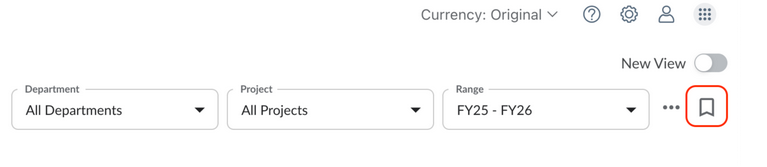
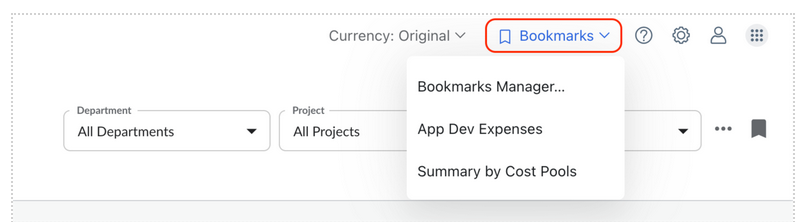
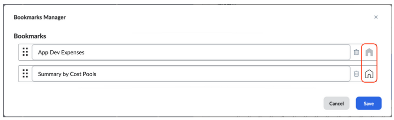

# Marcar uma página como favorito

Os marcadores permitem que você retorne rapidamente às páginas usadas com frequência no Apptio Planning sem precisar reaplicar filtros, layouts ou configurações todas as vezes. Qualquer usuário pode criar marcadores, e você também pode definir uma como sua página de destino padrão, para que ela seja aberta automaticamente quando você fizer login.

## O que um marcador salva

Quando você cria um marcador, as seguintes informações são capturadas:

- Seleções de departamento, projeto e intervalo de datas.
- A guia atual (se a exibição contiver várias guias).
- Alterações no layout da tabela (ordem das colunas, tamanho, visibilidade).
- Filtros aplicados.

Observação: Os marcadores são pessoais para cada usuário e não podem ser compartilhados.

## Criar um marcador

1. Navegue até a página que deseja marcar como favorita.
2. Selecione o **ícone Bookmark (marcador** ) no canto superior direito**.**
   1. O ícone aparecerá preenchido se a página atual já estiver marcada como favorito.

   
3. Na caixa de diálogo **Criar novo marcador**, digite um nome para o marcador.
4. (Opcional) Selecione a opção para definir essa página como sua página inicial.
5. Selecione **Salvar**.

## Abrir um marcador

1. Selecione **Bookmarks (Marcadores** ) na barra de menu superior e, em seguida, escolha o marcador desejado.
2. O **menu suspenso Marcadores** aparece somente quando você tem pelo menos um marcador salvo.

## Definir uma página de destino padrão

Você pode escolher qualquer marcador salvo como sua página de destino padrão. Essa página será aberta automaticamente sempre que você fizer login.

1. Abra **Bookmarks > Bookmarks Manager** na barra de menu superior.
2. Selecione o marcador que deseja definir como sua página inicial e clique no ícone **Página inicial**.
3. Clique em **Salvar**.

## Gerenciar marcadores

Use o **Bookmarks Manager** para editar, reordenar ou excluir marcadores.

1. Selecione **Favoritos > Gerenciador de favoritos**.
2. A partir daqui, você pode:
   1. **Editar** - Selecione o nome de um marcador para renomeá-lo.
   2. **Reordenar** - Selecione e arraste o ícone de reordenação para alterar a ordem.
   3. **Excluir** - Selecione o ícone de exclusão para remover um marcador.

   Dica: Crie marcadores para exibições filtradas usadas com frequência (por exemplo, um departamento específico ou um período de previsão) para economizar tempo e otimizar seu fluxo de trabalho.
