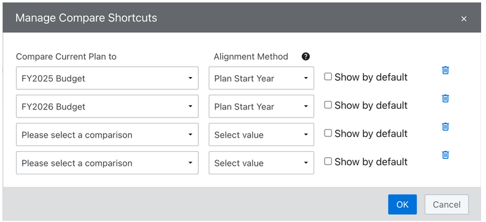
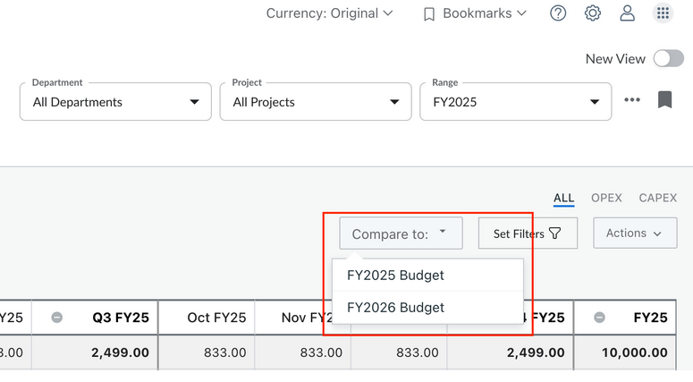

# Comparar versões ou planos

Você pode comparar os dados financeiros entre dois períodos ou versões do mesmo plano, ou entre dois planos diferentes. Essas comparações revelam diferenças entre períodos de tempo e itens de linha para ajudá-lo a entender as mudanças e variações.

## Comparação entre períodos

Observação: Requer a nova visualização de despesas.

Permite comparar períodos dentro do mesmo plano — ano a ano, trimestre a trimestre ou mês a mês —, facilitando a análise de tendências e mudanças ao longo do tempo.

Para comparar planos usando a comparação período a período, siga as etapas abaixo:

1. Acesse **Despesas > Nova visualização**.
2. Selecione a **guia “Despesas”** que deseja comparar.
3. Na **coluna “Período** ”, abra o **menu** e selecione “**Adicionar comparação** ”. A caixa de diálogo **“Adicionar comparação”** é exibida.
4. Selecione o botão de opção “**Período a período** ”.
5. Escolha o período de comparação com base no local onde a comparação é invocada:
   1. **Quando chamado a partir da coluna Mês**
      - **Plano anual** : Selecione o **mês** de comparação.
      - **Plano plurianual** : selecione o **ano** de referência e o **mês** correspondente dentro desse ano.
   2. **Quando chamado a partir da coluna Quarter**
      1. **Plano anual** : Selecione o **trimestre** de comparação.
      2. **Plano plurianual** : selecione o **ano** de referência e o **trimestre** correspondente dentro desse ano.
   3. **Quando chamado a partir da coluna Ano**
      1. **Plano anual** : a opção **“Período a período”** não está disponível.
      2. **Plano plurianual** : Selecione o **ano** de referência.
6. Clique em **Comparar** para iniciar a comparação.
7. Analise os resultados da comparação apresentados na tabela, que mostram **o Total**, **a Variação** e **a Variação** (%) agrupados por atributos comuns, como **Objeto de custo** e **Conta**.
8. Para remover a comparação, abra o **menu do período** na **coluna de** origem e selecione “**Remover comparação** ”.

## Comparação entre planos

Permite comparar períodos ou versões entre dois planos, facilitando a análise das diferenças entre diferentes exercícios financeiros e cenários hipotéticos.

## Método de alinhamento de comparação

Ao comparar planos, você pode escolher entre dois métodos de alinhamento. Você deve selecionar uma delas ao adicionar uma comparação da tabela Despesas ou ao usar Atalhos de comparação.

1. Ano de início do plano

   Alinha os planos com base em seus exercícios fiscais iniciais.

   Exemplo:
   - **O Plano A** cobre FY2019–2020
   - **O Plano B** cobre FY2020–2021
   - Usando esse método, **FY2019 do Plano A** é comparado a **FY2020 do Plano B**.
2. **Ano fiscal correspondente**

   Alinha os planos comparando o **mesmo ano fiscal** em ambos os planos.

   Exemplo:
   - **O Plano A** cobre FY2019–2020
   - **O Plano B** cobre FY2020–2021
   - Usando esse método, ele compara **FY2020 do Plano A** com **FY2020 do Plano B**.

## Como comparar versões ou planos

1. Abra o plano que você deseja comparar no menu **Plan (Plano** ).
2. Na tabela Despesas, passe o mouse sobre uma coluna **Mês**, **Trimestre** ou **Ano fiscal**, abra o **menu do cabeçalho da coluna** e selecione **Adicionar comparação...**
3. Escolha a **versão ou plano** para comparar. *Observação: as versões só estão disponíveis ao visualizar os Departamentos de folhas.*
4. Selecione o método de alinhamento: **Plan Start Year (Ano de início do plano** ) ou **Matching Fiscal Year (Ano fiscal correspondente** ).
5. *(Opcional)* Ative **Include Quarters (Incluir trimestres** ) ou **Include Year (Incluir ano)** para adicionar comparações em massa em vários períodos de tempo.
6. Clique em **Comparar**.
7. Novas colunas **Total**, **Desvio** e **% de desvio** aparecerão ao lado do período de tempo selecionado para exibir os resultados da comparação.
8. Para ajustar a granularidade da comparação, altere o **agrupamento da tabela** - por padrão, as comparações são mostradas por **Objeto de custo e Conta**.

   Observação: a Visualização antiga oferece suporte à funcionalidade de comparação para as guias Outros e Resumo em todos os períodos e para a guia Mão de obra apenas nas colunas totais do ano fiscal. Para adicionar comparações em Contratos, Ativos, Mão de obra e Atividade de mão de obra em todos os períodos, use a Nova visualização.

## Atalhos de comparação

Os atalhos de comparação permitem que você compare rapidamente seu plano atual com até quatro outros planos. Os administradores também podem optar por ativar um plano de comparação padrão para todos os usuários. Os usuários podem ativar ou desativar as comparações a qualquer momento no menu Compare To (Comparar com).

## Como definir atalhos de comparação

Observação: os usuários com **ManagePlan** permissão, como administradores ou proprietários de processos orçamentários, podem configurar atalhos de comparação.

1. No **menu Ellipsis**, selecione **Compare Shortcuts (Comparar atalhos** ).
2. Na janela **Manage Compare Shortcuts (Gerenciar atalhos** de comparação), escolha os planos que deseja comparar e selecione um Alignment Method (Método de alinhamento) para cada um.
3. Opcionalmente, ative **Mostrar por padrão** para exibir automaticamente as comparações para todos os usuários.
4. Clique em **OK** para salvar suas configurações.

Uma vez configurado, os usuários podem alternar as comparações a qualquer momento no menu **Comparar com**. As comparações aparecerão automaticamente em todas as colunas visíveis de Trimestre, Ano e YTD. Os atalhos de comparação são configurados por plano, o que significa que você pode definir planos de comparação diferentes para cada plano individual.

