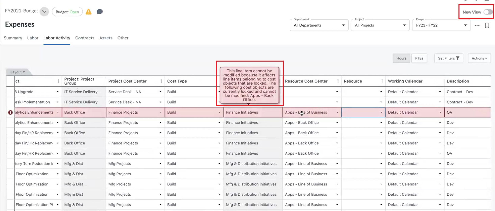
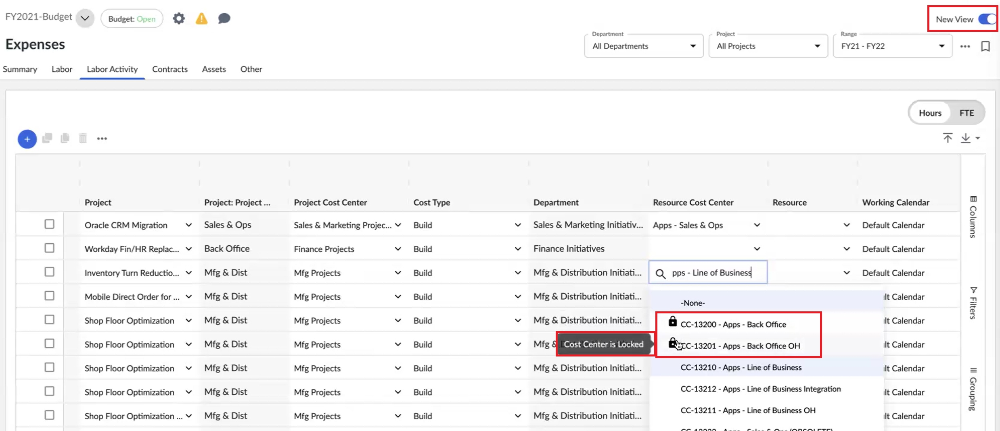
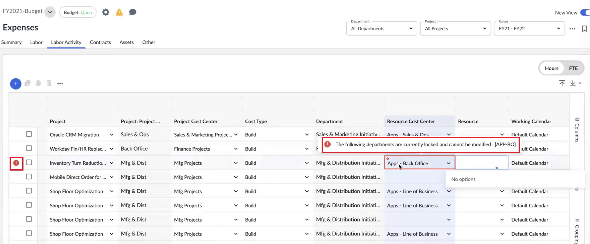
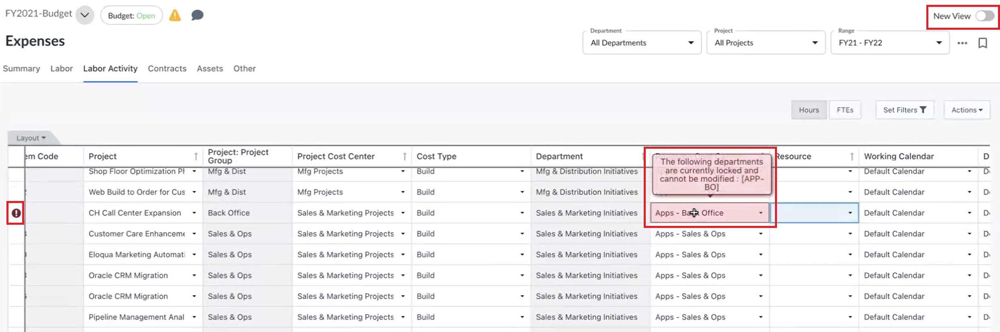
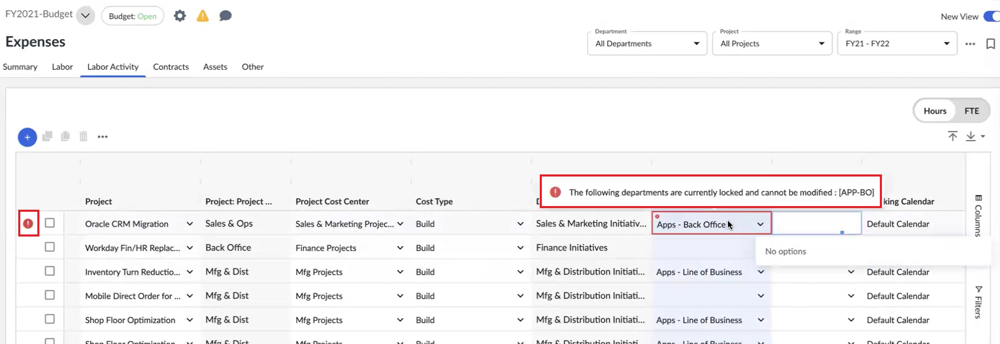

# Editar itens de linha de atividade de trabalho

Importante: *Disponível com a* *assinatura* ***do Apptio Planning Standard***

Integrated Investment Planning permite que os proprietários de projetos e de centros de custo aloquem recursos a um projeto como alocação baseada em função ou alocação baseada em nome.

A alocação de mão de obra para o projeto é feita em Planning > Expenses > visualização Labor Activity (Atividade de mão de obra).

1. Selecione Projeto para alocação de atividade de mão de obra.

   O menu suspenso Centro de custo mostra os centros de custo aplicáveis ao projeto selecionado.
2. Selecione um centro de custos.

   Normalmente, esse centro de custos é a fonte de financiamento do projeto.

   O objeto de custo do centro de custo é preenchido automaticamente, conforme configurado nos dados de referência.
3. Selecione um centro de custos de recursos.

   Esse é o centro de custos que fornece recursos de mão de obra para trabalhar no projeto.
4. Para alocar recursos a um projeto com base na função, selecione Project Labor Role para escolher a função de recurso desejada.

   Por exemplo, há a função de trabalho do projeto Desenvolvedor e essa é a função que você alocou, o que significa que qualquer recurso dessa função pode ser atribuído para trabalhar no projeto.
5. Para alocar recursos a um projeto como recurso de mão de obra específico ou baseado em nome no Resource Cost Center, selecione recurso específico no menu suspenso Resource (Recurso).

   O menu Recurso filtra automaticamente apenas os recursos do Resource Cost Center selecionado.
6. Selecione o tipo de atividade.

   A definição de atividade na linha define a conta do centro de custo de cobrança e a conta de cobrança cruzada com base na configuração de dados de referência da conta de atividade de mão de obra.

   Para saber mais, consulte [Configurar carga cruzada](configure-cross-charge.html)
7. Selecione Horas ou FTEs no botão de alternância FTE/Hours acima da tabela Despesas de atividades de mão de obra. Insira a mão de obra alocada usando a unidade FTE ou a unidade de horas, de acordo com a alternância selecionada. Assegure o alinhamento entre os dados disponíveis em CSV e a alternância selecionada (FTEs/Hours).
8. Os dados inseridos como FTE serão convertidos em horas usando o calendário de trabalho do recurso alocado.

Para saber mais sobre como configurar o calendário de trabalho, consulte [Configurar um calendário de trabalho](../configure-working-days.html "O calendário de trabalho define quantos dias e horas de trabalho são usados para o planejamento de mão de obra, o que influencia a conversão de equivalentes de tempo integral (FTE), a amortização de custos de mão de obra e os cálculos de despesas mensais.").

Para saber mais sobre o uso de calendários no planejamento de mão de obra, consulte [Alocação de mão de obra usando o calendário de dias úteis.](planning-labor-allocation.html)

As despesas de atividade de mão de obra do projeto são geradas na visualização Despesas > Resumo.

## Atribuição de recursos para o centro de custos de recursos apresentado

A alocação de recursos não é permitida quando um Resource Cost Center é bloqueado ou enviado.

O comportamento esperado para Despesas > Visualização clássica/antiga e Despesas > Nova visualização ao selecionar um Centro de custos de recursos que esteja no estado bloqueado ou enviado é explicado abaixo.

O centro de custo de recursos "Apps-Back Office" está no estado enviado/bloqueado e o centro de custo de recursos "Apps-Line of Business" não está enviado.

Cenário 1 : Remova o centro de custo de recursos que é enviado/bloqueado na linha Atividade de mão de obra.

## Despesas > Visão clássica/antiga

Na guia Despesas > Atividade de mão de obra, altere o centro de custo do recurso de "Apps-Back Office" para "Apps-Line of Business". O item de linha é destacado em vermelho e a mensagem de erro é exibida conforme mostrado.

## Despesas > Nova visualização

Selecione o menu suspenso Centro de custos de recursos. Você pode ver o código e a informação de que o centro de custo está bloqueado.

Se você ainda selecionar o centro de custo bloqueado, será exibida uma mensagem de erro de validação, conforme mostrado:

Cenário 2 : Atribua o centro de custo de recursos que é enviado/bloqueado na linha Atividade de mão de obra.

## Despesas > Visão clássica/antiga

Na guia Despesas > Atividade de mão de obra, altere o centro de custo do recurso de "Apps-Line of Business" para "Apps-Back Office" para. A mensagem de erro de validação é exibida conforme mostrado:

## Despesas > Nova visualização

Na guia Despesas > Atividade de mão de obra, altere o centro de custo do recurso de "Apps-Line of Business" para "Apps-Back Office" para. A mensagem de erro de validação é exibida conforme mostrado:

Em todos os cenários acima, a alteração não será salva.
