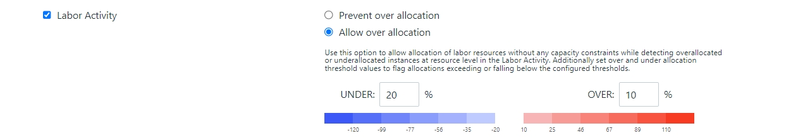
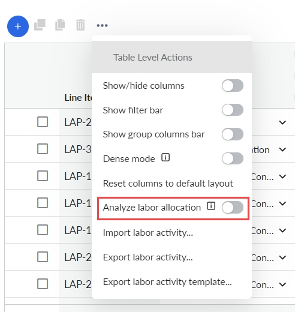
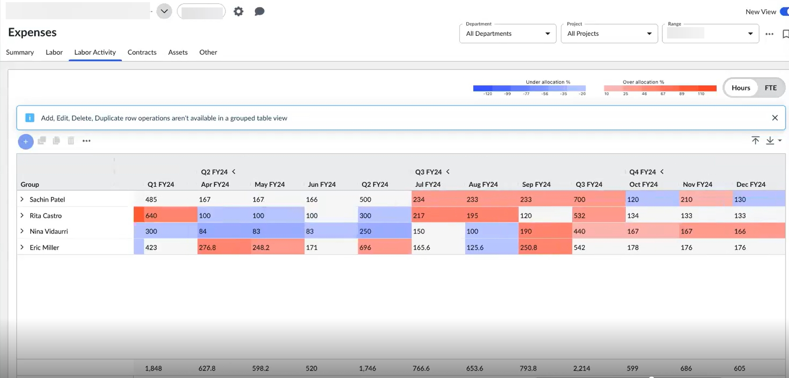
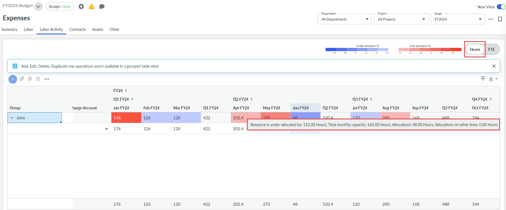
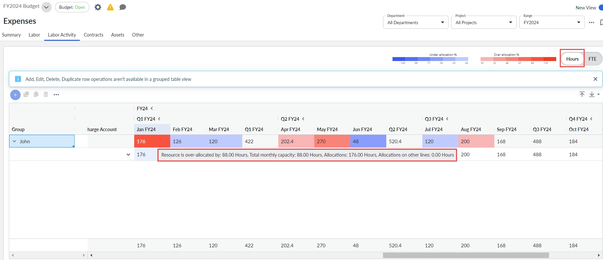
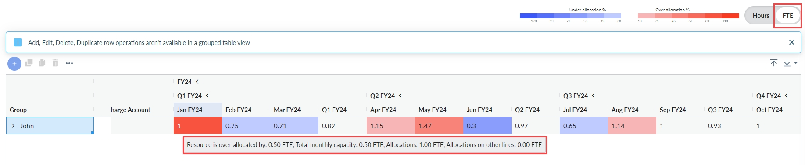
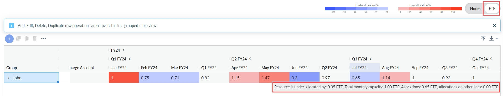

# Configurações de alocação de mão de obra

Importante: *Disponível com a* *assinatura* ***do Apptio Planning Standard***

A seleção dessa opção ajudará os proprietários do orçamento a permitir a alocação excessiva do recurso. Ele também permite que você defina valores de limite de alocação "acima" e "abaixo" para sinalizar alocações que excedam ou fiquem abaixo dos limites configurados. Siga as etapas abaixo para ativar e usar o recurso.

## Habilitar Permitir alocação geral

Navegue até a seção Perfil da empresa > Habilitar recursos e marque a caixa de seleção Atividade de trabalho. Selecione a opção Allow over allocation (Permitir alocação excessiva ) e, em seguida, Save and Exit (Salvar e sair ) na página de perfil da empresa.

AVISO : A caixa de seleção Atividade de trabalho ficará visível no Perfil da empresa somente se a caixa de seleção "Enable Integrated Investment Planning" (Ativar ) estiver ativada.

Você também pode definir os valores-limite do recurso que está sendo "alocado em excesso" ou "alocado em falta". Nesse caso, se um recurso estiver subalocado em 20% ou superalocado em 10% ou mais, a diferença será sinalizada com a cor mencionada. Depois de definir os valores de limite, selecione Save and Exit (Salvar e sair ).

Navegue até a guia Despesas > Atividade de trabalho. Em , ative a opção Analisar alocação de mão de obra.

Os recursos são agrupados e as alocações que estão além do limite definido (abaixo de 20% e acima de 10%) são destacadas nos tons de cores apropriados, conforme mostrado. As células sem nenhuma cor indicam que sua alocação está dentro dos limites definidos.

A tonalidade da célula colorida pode ser combinada com a chave na parte superior, para entender qual é a porcentagem da alocação a mais ou a menos.

## Detectar e permitir a alocação geral

Considere que a capacidade de trabalho de John em janeiro de 2024 é de 88 horas e em junho de 2024 é de 160 horas.

Navegue até a guia Despesas > Atividade de trabalho e deslize o botão de alternância para Horas. Passe o mouse sobre qualquer célula sombreada em azul. A janela pop-up informará que o recurso está subalocado por quantas horas, qual é a capacidade mensal total e quais são as outras alocações.

Nesse cenário, a diferença entre o valor inserido 48 e a capacidade de 160 do John é de 112 horas, e o recurso está subalocado em 112 horas.

Da mesma forma, agora passe o mouse sobre qualquer célula sombreada em vermelho. A janela pop-up informará que o recurso está superalocado em quantas horas, qual é a capacidade mensal total e quais são as outras alocações.

Nesse cenário, a diferença entre o valor inserido 176 e a capacidade de 88 do John é de 88 horas, e o recurso está superalocado por essas 88.00 horas.

Em seguida, mude a alternância para FTE e passe o mouse sobre qualquer célula sombreada em vermelho. A janela pop-up informará que o recurso está superalocado em quantos FTE, qual é a capacidade mensal total e quais são as outras alocações, tudo em FTE.

Nesse cenário, a diferença entre o valor 1 inserido e a capacidade do John de 0.5 FTE é 0.5 FTE, e o recurso está superalocado em 0.5 FTE.

Da mesma forma, se você passar o mouse sobre qualquer célula sombreada em azul, o pop-up dirá que o recurso está subalocado em quantos FTE, qual é sua capacidade mensal total e quais são suas outras alocações, tudo em FTE.

Nesse cenário, a diferença entre o valor inserido 0.65 e a capacidade de 1 FTE do John é 0.35 FTE, e o recurso está subalocado em 0.35 FTE.

