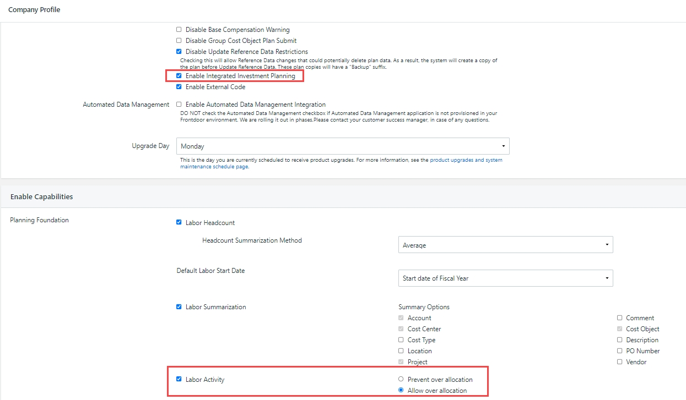
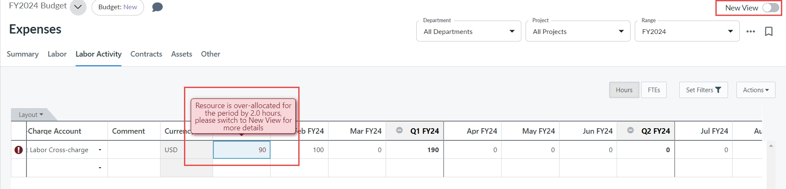
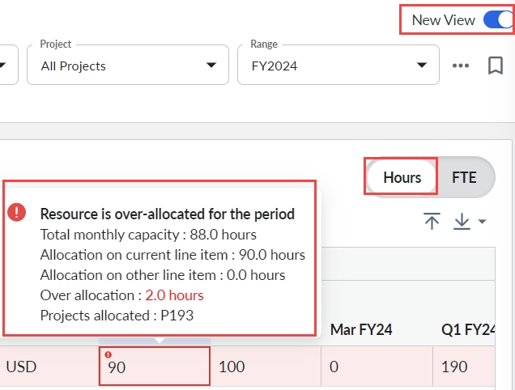
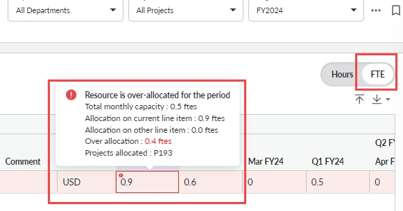
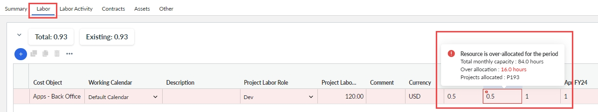
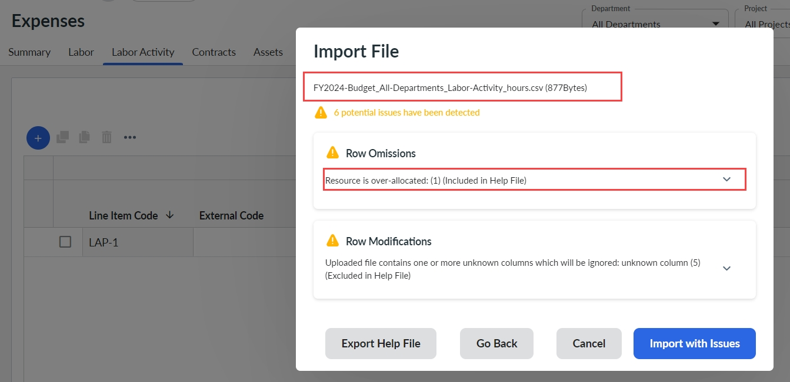
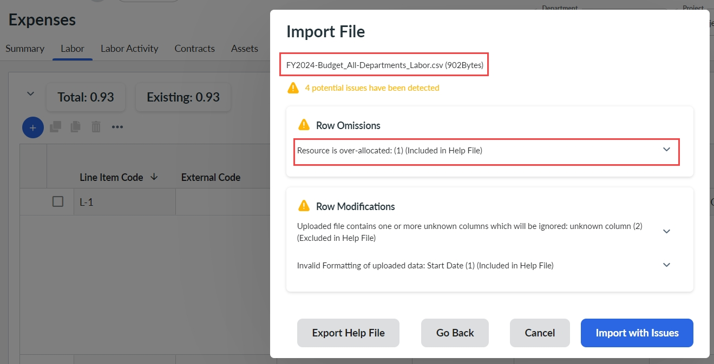

# Evitar a globalização

Importante: *Disponível com a* *assinatura* ***do Apptio Planning Standard***

A ativação desse recurso ajudará os proprietários do orçamento a evitar a alocação excessiva do recurso além da capacidade disponível. Siga as etapas abaixo para ativar e usar o recurso.

## Habilitar Prevenir a alocação geral

Navegue até a seção Perfil da empresa > Habilitar recursos e marque a caixa de seleção Atividade de trabalho.

Observação: A caixa de seleção Labor Activity (Atividade de trabalho) ficará visível no Company Profile (Perfil da empresa) somente se a caixa de seleção "Enable Integrated Investment Planning" (Ativar ) estiver ativada.

As duas opções aparecem como abaixo.

Selecione a opção Prevent over allocation (Impedir alocação excessiva ) e, em seguida, Save and Exit (Salvar e sair ) na página de perfil da empresa.

## Detectar e prevenir a globalização

Nos cenários abaixo, estamos tentando alocar João, cuja capacidade mensal para janeiro é de 88 horas no projeto " P193 - BI Analytics Enhancements", como 8 horas por dia.

1. Na visualização de despesas herdadas, navegue até a guia de atividade trabalhista e insira um valor maior que 88 em Jan FY24. Se você passar o mouse sobre a célula, a mensagem de erro pop-up será exibida como "*O recurso está superalocado para o período em 2.0 horas. mude para New View para obter mais detalhes*". A diferença entre o valor inserido 90 e a capacidade de 88 do John é de 2 horas.

   
2. Como a mensagem anterior não mostrou todos os detalhes, mudaremos para New Expenses View e deslizaremos o botão de alternância para Hours. Mais uma vez, insira o mesmo valor acima em Jan FY24. A célula é destacada com um ícone de erro vermelho e, ao passar o mouse sobre ela, será exibida a mensagem de erro, conforme abaixo.

   

   A janela pop-up informará que o recurso está superalocado para o período e fornecerá todos os detalhes, como a capacidade mensal total, a alocação no item de linha atual, a alocação em outro item de linha, a superalocação e os projetos alocados, em horas.

   Nesse cenário, a diferença entre o valor inserido 90 e a capacidade de 88 do John é de 2 horas, e isso é exibido em vermelho.
3. Agora, vamos mudar para New Expenses View e deslizar o botão de alternância para FTE. Insira um valor maior que 0.5 em Jan FY24. A célula é destacada com um ícone de erro vermelho e, ao passar o mouse sobre ela, será exibida a mensagem de erro, conforme abaixo.

   

   A janela pop-up informará que o recurso está superalocado para o período e fornecerá todos os detalhes, como a capacidade mensal total, a alocação no item de linha atual, a alocação em outro item de linha, a superalocação e os projetos alocados, em ftes.

   Nesse cenário, a diferença entre o valor inserido 0.9 e a capacidade do John de 0.5 é 0.4 ftes e é exibida em vermelho.
4. No próximo cenário, vamos impedir a alocação geral durante a edição de dados do Labor a partir da interface do usuário de despesas. Para isso, navegue até a guia Trabalho e altere a alocação para John na célula Feb FY24.

   

   Aqui, vemos que a capacidade mensal total para John em fevereiro de 2024 é de 84 horas (já que fevereiro tem apenas 21 dias úteis). Ele está alocado 16 horas a mais porque sua alocação para fevereiro FY24 na guia Atividade de Trabalho foi de 100. Veja o segundo cenário acima.
5. Vejamos agora o cenário para evitar a superalocação durante a importação da atividade de trabalho. Exporte um arquivo da guia Atividade de trabalho. No arquivo CSV baixado, altere a alocação do John para P1 FY2024 como 93 e salve o arquivo. Quando você carrega esse arquivo e seleciona Importar, é exibida uma mensagem de aviso, conforme mostrado.

   

   A mensagem mostra o nome do arquivo de atividade de trabalho e os problemas que ele apresenta, como alocação geral e modificações de linha. Expanda a seção para ver os detalhes do problema.
6. No último cenário, vamos impedir a alocação geral durante a importação de mão de obra. Exporte um arquivo da guia Trabalho. No arquivo CSV baixado, altere a alocação de John para P2 FY2024 como 0.4 e salve o arquivo. Quando você carrega esse arquivo e seleciona Importar, é exibida uma mensagem de aviso, conforme mostrado.

   

   A mensagem mostra o nome do arquivo de trabalho e os problemas que ele apresenta, como alocação geral e modificações de linha. Expanda a seção para ver os detalhes do problema.

Nota:

- O recurso é suportado somente quando recursos individuais são atribuídos a projetos/investimentos. Se o campo Recurso na atividade de trabalho estiver vazio, não haverá suporte para a detecção de alocação excessiva.
- Quando o recurso Prevent Overallocation estiver ativado, as alocações gerais nos planos existentes serão detectadas quando o usuário tentar editar essas linhas na interface do usuário ou tentar reimportar os dados de atividade de mão de obra.
- A alteração das horas do calendário de trabalho levará a uma alocação excessiva de recursos, se as novas horas de trabalho mensais forem menores do que as horas de trabalho anteriores. Nesses casos, as despesas alocadas em excesso serão detectadas ao editar ou reimportar as linhas de atividade de trabalho.
- Se o controle de acesso em nível de projeto estiver configurado e o gerente de projeto conectado não tiver acesso para visualizar todas as alocações do recurso selecionado, ainda será possível detectar a alocação excessiva causada pela alocação do recurso a outros projetos. O código do projeto dos projetos em que o recurso está alocado será exibido na mensagem pop-up de detecção de alocação excessiva. Essas informações ajudarão o gerente de projeto conectado a resolver a alocação geral trabalhando com os gerentes de projeto dos outros projetos.
- Quando as configurações do perfil da empresa são alteradas para Permitir alocação geral, a prevenção da alocação geral não será possível.
- A funcionalidade para definir o limite de superalocação e subalocação está em andamento e será lançada no início de Q2 2024.
