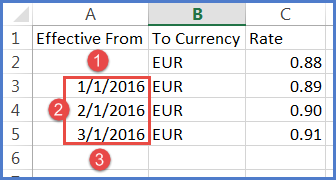

# Requisito de dados de referência

As tarefas abaixo só podem ser realizadas por usuários atribuídos às funções Admin ou Budget Process Owner. Para obter mais informações sobre funções, consulte Permissões e funções do Frontdoor.

Apptio Planning os aplicativos suportam duas tabelas de taxas distintas:

- Tabela de taxas de conversão de moeda do plano - Use para todas as conversões de moeda em planos e previsões orçamentárias
- Tabela de taxas de conversão de moedas reais - Use para converter os valores reais registrados em várias moedas locais em uma moeda comum para exibições resumidas dos valores reais

As taxas de conversão de moeda planejada e real fazem parte das dimensões incorporadas que você gerencia nos dados de referência. Consulte [Gerenciar dados de referência das tabelas de taxas de conversão de moeda](manage-multi-currency.html "As tarefas abaixo só podem ser realizadas por usuários atribuídos às funções Admin ou Budget Process Owner. Para obter mais informações sobre funções, consulte Permissões e funções do Frontdoor."). Especifique a taxa de conversão entre a moeda comum de sua organização e outra moeda. Consulte [Definir a moeda comum](set-common-currency.html "Uma moeda única e comum é usada para todas as conversões de moeda. A moeda comum geralmente é a moeda de registro da organização. Todas as taxas de conversão de moeda são definidas em relação a essa moeda e, a menos que outra seja especificada, essa é a moeda de exibição padrão por centro de custo."). Opcionalmente, você pode especificar um período de tempo para o qual uma taxa de conversão específica será aplicada.

## Faça o download e preencha o modelo de tabela de taxa de conversão de moeda

Para criar um dado de referência:

1. Certifique-se de que o suporte a várias moedas esteja ativado (consulte [Suporte a várias moedas](support-multiple-currencies.html) ).
2. No menu de navegação, selecione Configuração > Dados de referência. Você tem duas taxas de câmbio: Taxa de moeda real e taxa de moeda planejada.
   - Os dados de referência da taxa de câmbio real definem as taxas de conversão de moeda usadas para converter várias moedas em uma moeda comum. Isso permite que você veja visualizações resumidas dos dados reais:

     
   - Os dados de referência da taxa de moeda do plano definem as taxas de conversão de moeda usadas para converter várias moedas em uma moeda comum nos planos e previsões orçamentários:

     

     Consulte [Gerenciar dados de referência das tabelas de taxas de conversão de várias moedas](manage-multi-currency.html "As tarefas abaixo só podem ser realizadas por usuários atribuídos às funções Admin ou Budget Process Owner. Para obter mais informações sobre funções, consulte Permissões e funções do Frontdoor.").

     Observação: É necessário exportar um modelo para a moeda real e a moeda planejada. Se o seu aplicativo Apptio
     Planning estiver integrado ao Costing Standard, você deverá usar a mesma tabela de taxas de câmbio reais para ambos os aplicativos.
3. Abra o arquivo de modelo.csv. Não altere os títulos das colunas nem a estrutura desse modelo.
4. Insira seus valores de taxa de conversão. As opções por valor de moeda incluem:
   - Uma única taxa de conversão que abrange todos os períodos de tempo.
   - Taxas de conversão variadas por caixa de tempo por valor de moeda. Especifique um período de início Efetivo a partir de para uma taxa de conversão específica. Em seguida, especifique as datas de início de outros períodos de tempo para esse mesmo valor de moeda.
5. Opcionalmente, inclua uma linha para a moeda comum com uma taxa de conversão de 1. DICA: Seus aplicativos Apptio Planning trabalharão com os dados da tabela de tarifas em qualquer ordem de linha, mas os cabeçalhos devem permanecer na linha 1. Ao editar o arquivo.csv, você pode classificá-lo por qualquer título de coluna (por exemplo, classificar por data ou por código de moeda). A ordem de classificação que você usar será aplicada à tabela de taxas de câmbio depois que ela for importada para o aplicativo Apptio Planning .
6. Salve o modelo no formato.csv para importação.

Por exemplo, os valores da tabela de taxas que definem as taxas de moeda por mês para a moeda da empresa dólar americano e o euro:

Nesta tabela de exemplo, todas as conversões de dólar americano/euro antes de 1º de janeiro de 2016 (1) usam a taxa de conversão de 0.88. Em seguida, a taxa é ajustada mensalmente, conforme mostrado (2). Como não foram especificadas taxas de conversão posteriores, todas as conversões após 1º de março de 2016 usarão a taxa 0.91 (3).

Quando você publicar as taxas, elas estarão disponíveis aqui: Na navegação à esquerda, selecione Planning > Despesas > Resumo, e as taxas publicadas estarão disponíveis em cada uma destas guias: Summary (Resumo ), Labor (Trabalho ), Contracts (Contratos ), Assets (Ativos ), Others (Outros ).. Além disso, você poderá selecionar quaisquer visualizações com base nas moedas que estão sendo publicadas.

## Importar e publicar tabelas de taxas de câmbio

Para carregar e publicar os dados de referência das tabelas de taxas de câmbio, consulte [Gerenciar dados de referência das tabelas de taxas de conversão de várias moedas](manage-multi-currency.html "As tarefas abaixo só podem ser realizadas por usuários atribuídos às funções Admin ou Budget Process Owner. Para obter mais informações sobre funções, consulte Permissões e funções do Frontdoor.").

## Resolução de problemas

Nesta seção, você pode encontrar alguns erros frequentes e soluções para eles.

[Seu KPI ou valores em um plano exibem o erro #REF](ts_ref-error-kpi-plan.html)
