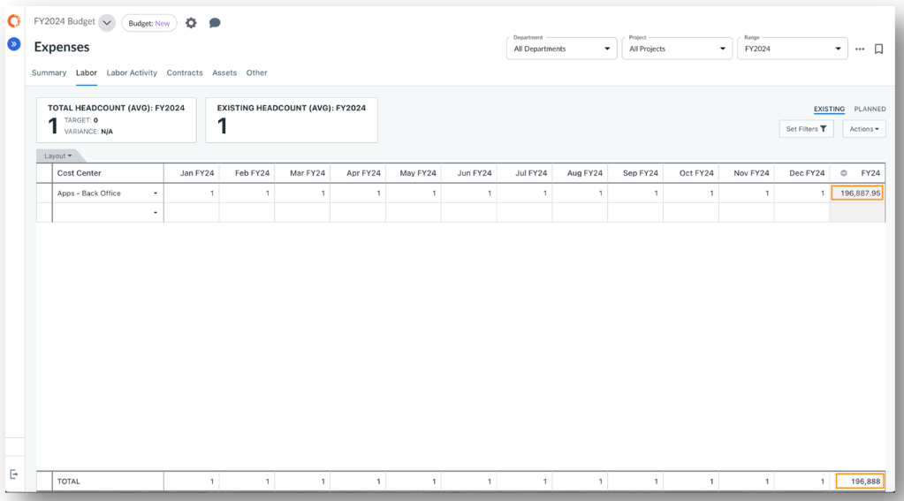
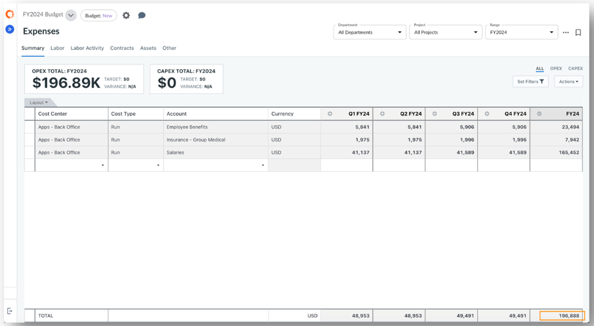

# Visão geral do planejamento trabalhista

O módulo Labor Planning permite que as organizações planejem e façam o orçamento das despesas relacionadas à força de trabalho, incluindo salários, benefícios, impostos e alocações de custos associados. Ele ajuda a modelar as necessidades de pessoal, atribuir custos aos departamentos e alinhar a estratégia da força de trabalho com as prioridades da empresa.

**Por que usar o planejamento trabalhista**

- Fornece visibilidade do número de funcionários, dos custos dos funcionários e das despesas em nível de função nos departamentos e projetos.
- Permita que o Financeiro e o RH colaborem de forma mais eficaz no planejamento da capacidade, na contratação e na otimização dos custos da força de trabalho.
- Configure as regras de alocação de mão de obra para calcular automaticamente o custo total de cada funcionário, incluindo salário, benefícios e custos indiretos.

## Configurar o planejamento de mão de obra

Observação: As funções de administrador ou proprietário do processo orçamentário são necessárias para executar essas tarefas.

Antes de começar a inserir os itens de linha de mão de obra, você precisará ativar o Labor e configurar os dados de referência para que as alocações de mão de obra se comportem de forma consistente em seu modelo.

A ativação do planejamento de mão de obra ativa as tabelas de dados de referência relacionadas e adiciona a guia **Mão de obra** à tabela Despesas.

**Permitir o planejamento de mão de obra**

1. Vá para **Settings** (ícone de engrenagem) **→ Company Profile**.
2. Habilitar **o número de funcionários**
3. **Configure Headcount Summarization Method (Configurar método de compactação de efetivo** ) - Determina como os totais de efetivo são calculados e exibidos nos KPIs:
4. **Média** - Calcula o número médio de funcionários no período selecionado.
5. **Início do período** - Usa o número de funcionários no início do período.
6. **Fim do período** - Usa o número de funcionários no fim do período.
7. **Selecione Configurações de compactação de mão** de obra - Escolha por quais dimensões compactar os dados financeiros de mão de obra gerados na guia **Resumo**.
8. As dimensões disponíveis incluem qualquer dimensão compartilhada entre os esquemas **Labor** e **Financials**. Consulte *[Resumir finanças trabalhistas](labor-summarization.html "O recurso Summarize Labor Financials permite determinar como os dados de custo de mão de obra são agregados e apresentados na guia Summary (Resumo). Ele controla quais dimensões (por exemplo, centro de custo, conta, local) são usadas para agrupar e agrupar as linhas de custo de mão de obra, garantindo que você obtenha o nível certo de visibilidade e confidencialidade para as finanças da mão de obra.")* para obter mais detalhes.
9. **Ativar ajustes de remuneração variável** *(requer nova visualização)* - Permite a modelagem de alterações mensais na remuneração base.
10. Consulte *[Ajustes de remuneração de mão de obra](plan-labor-compensation.html "Os ajustes de remuneração de mão de obra permitem que as organizações modelem aumentos (ou reduções) de remuneração ao longo do tempo no site Apptio Planning. Esse recurso oferece uma forma estruturada de contabilizar os ajustes salariais planejados, como aumentos por mérito, ajustes de mercado, promoções ou mudanças no custo de vida.")* para obter mais detalhes.
11. Clique em **Save and Exit (Salvar e sair** ).

**Configurar funções de trabalho**

1. Navegue até **Configuration → Reference Data → Role.**
2. **Exporte** o modelo e preencha os campos obrigatórios:
3. **Código** - Identificador exclusivo da função.
4. **Nome** - Nome ou título do cargo.
5. **Importe** o arquivo ` CSV ` atualizado e **publique** as alterações para disponibilizar as funções nos planos.

*Dica:* você pode personalizar o esquema **Role** em **Schema → Standard Dimensions** para incluir atributos adicionais.

**Configurar taxas de mão de obra**

Definir taxas de remuneração base padrão para cada função de trabalho para padronizar a modelagem de custos. As regras podem usar combinações de **tipo de funcionário**, **função**, **local** e **fornecedor**. Quando um item de linha de mão de obra corresponde a esses atributos, a taxa padrão correspondente é aplicada automaticamente.

1. Vá para **Configuration → Reference Data → Labor Rates.**
2. **Exporte** o modelo e preencha os campos principais:
3. **Tipo de funcionário** - *interno* ou *externo*
4. **Função** - O código de função da tabela Funções de trabalho
5. **Localização** - O código de localização dos dados de referência de localização
6. **Fornecedor** - O código do fornecedor dos dados de referência do fornecedor
7. **Moeda** - Código da moeda para a taxa
8. **Base Rate** - Remuneração anual da função
9. **Importe** o arquivo ` CSV ` atualizado e **publique** as alterações para disponibilizar as tarifas nos planos.

**Configurar regras de alocação de mão de obra**

As Regras de alocação de mão de obra definem como os custos de mão de obra são distribuídos entre os departamentos e as contas do GL. Cada item de linha de mão de obra no Apptio Planning começa com uma taxa básica e as regras de alocação aplicam automaticamente a lógica de distribuição - como uma porcentagem da taxa básica ou um valor fixo. Isso garante a precisão dos custos de mão de obra "totalmente onerados" e a alocação correta aos departamentos e contas GL apropriados.

1. Vá para **Configuration → Labor Allocation Rules.**
2. Exporte um modelo ou insira os seguintes campos diretamente na interface do usuário:
   1. **Conta** - O código da conta dos dados de referência da conta. Isso gera uma entrada de despesa para cada linha de mão de obra que atenda às condições da regra.
   2. **Output Value Type (Tipo de valor de saída** ) - Define como o custo é calculado:
      1. **Valor fixo** - Aplica um valor anual fixo.
      2. Percentual **da taxa básica** - Calcula um percentual da taxa básica de mão de obra.
      3. Porcentagem **de outra taxa** - Calcula uma porcentagem da taxa de outro trabalho.
   3. **Excluir do cálculo de mão de obra** - Determina se esse custo está incluído no total do ano fiscal mostrado na guia Mão de obra:
      1. **Verdadeiro (marcado)** - Exclui o custo do total (por exemplo, para cobranças cruzadas ou custos não onerados).
      2. **Falso (desmarcado)** - Inclui o custo no total do ano fiscal.
   4. **Valor** - A porcentagem ou valor fixo a ser aplicado com base no tipo de valor de saída.
   5. **Método de amortização de mão de obra** – Define como o custo é distribuído ao longo dos períodos (consulte *[Regras de alocação de mão de obra](manage-labor-allocation-rules.html)* para obter mais detalhes):
      1. **Straight Line Even Periods (Linha reta para períodos pares** ) - Distribui o custo uniformemente por todos os períodos.
      2. **Linha reta usando dias do calendário** - Distribui o custo proporcionalmente ao número de dias em cada período.
      3. **Straight Line Using Working Days (Linha reta usando dias úteis** ) - Usa o calendário de trabalho definido para ponderar a distribuição de custos.
3. **Importe** o arquivo “ CSV ” preenchido e **publique** as alterações para que as regras de alocação fiquem disponíveis para uso nos planos.

**Regras de alocação de mão de obra com eficiência de tempo no nível do plano**

As regras de alocação de mão de obra podem ser configuradas no nível do plano com **valores efetivos de tempo**, permitindo que os custos de mão de obra variem ao longo do horizonte de planejamento sem modificar os dados de referência globais das regras de alocação de mão de obra.

Essa funcionalidade é útil para modelar variações nos custos relacionados à mão de obra, tais como benefícios, bônus, treinamento e outros componentes que possam aumentar ou diminuir ao longo do tempo dentro de um plano específico.

Cada plano mantém seu próprio cronograma de regras de alocação de mão de obra, independentemente dos dados de referência globais. Durante a geração financeira da mão de obra, o sistema aplica a taxa adequada no nível do plano com base na data de início da mão de obra e no período fiscal que está sendo calculado. Se não houver nenhum valor no nível do plano para um determinado período, será utilizado o valor correspondente da Regra de Alocação de Mão de Obra global.

***Pontos importantes a serem considerados***

- Selecione o **plano** e, em seguida, acesse **Configurações** do plano → Regras de alocação de mão de obra para definir os valores das regras específicas do plano.
- Use as datas **de vigência** para definir quando cada taxa entra em vigor no plano.
- As alterações nas regras de alocação de mão de obra no nível do plano são refletidas imediatamente no plano atual; não é necessário publicar.
- As regras de alocação de mão de obra no nível do plano exibem os atributos da regra da versão global correspondente da Regra de Alocação de Mão de Obra como somente leitura, permitindo, ao mesmo tempo, adicionar e atualizar as taxas efetivas de tempo para cada regra.
- Os prazos das regras de alocação de mão de obra no nível do plano são mantidos ao criar um plano a partir de uma linha de base.
- Os ajustes salariais e os cálculos do custo total da mão de obra utilizam automaticamente a taxa aplicável no nível do plano para o período em questão.
- Se não for definida nenhuma taxa no nível do plano para um determinado período, o sistema recorre ao valor correspondente da Regra de Alocação de Mão de Obra global.
- As regras de alocação de mão de obra no nível do plano também suportam a importação por meio de um arquivo. CSV.

## Entrada e gerenciamento de itens de linha de mão de obra

1. Abra seu plano e navegue até a guia **Labor** na página **Expenses (Despesas** ).
2. Adicione uma nova linha de mão de obra:
   1. Usando a **linha vazia** na parte inferior da tabela, ou
   2. **Clique com o botão direito do mouse** e selecione **Inserir linha**
3. **Forneça as informações necessárias** para cada linha de mão de obra:
   1. **Centro de custos** - A unidade organizacional responsável pelo custo do trabalho.
   2. **Função** - O cargo ou título do trabalho associado ao recurso de mão de obra (por exemplo, desenvolvedor, gerente de projeto).
   3. **Tipo de funcionário** - Indica se o trabalho é **interno** (funcionário) ou **externo** (contratado).
   4. **Localização** - O local de trabalho ou a região do recurso de mão de obra; usado para aplicar taxas baseadas em localização.
   5. **Fornecedor** - O fornecedor ou a empresa de recrutamento que fornece o recurso (se aplicável).
   6. **Nome do funcionário -** O nome do indivíduo; útil para rastreamento, mas não obrigatório.
   7. **Remuneração base** - A remuneração base anual ou o custo por funcionário antes de aplicar alocações ou ajustes.
   8. **Outras remunerações** - Componentes adicionais de pagamento anual (por exemplo, bônus, incentivos, subsídios) usados em regras de alocação que aplicam um cálculo de porcentagem de outra taxa.
   9. **Quantidade** - O número de recursos (número de funcionários) representados por esse item de linha.
   10. **Data de início / Data de término** - O período durante o qual o recurso está ativo ou orçado.
   11. **Descrição** - Uma breve explicação ou observações sobre o item de mão de obra (por exemplo, atribuição de projeto, tipo de função).
   12. **Calendário de trabalho** - Define os dias úteis usados para calcular as distribuições de custos entre os períodos de tempo.
4. O sistema gera automaticamente um plano de headcount com base na quantidade, na data de início e na data de término. Revise o plano gerado para confirmar que a distribuição do número de funcionários entre os períodos está alinhada com suas expectativas.
5. Modifique a distribuição, se necessário, editando os campos mensais ou periódicos diretamente na tabela.
6. As linhas de mão de obra que correspondem à função, ao fornecedor, ao local e ao tipo de funcionário configurados aplicam automaticamente a taxa de mão de obra e as regras de alocação corretas.
7. Você pode substituir as taxas de mão de obra em itens de linha específicos quando necessário - por exemplo, para refletir a remuneração real de um indivíduo em vez de uma taxa padrão.
8. A coluna **Total do ano fiscal** exibe o **custo anual totalmente onerado** para cada linha de mão de obra.
   1. Se a opção **Variable Labor Adjustments** estiver ativada, você poderá modelar as alterações mensais da remuneração base e visualizar as alocações de custo detalhadas por conta GL.
   2. Para mais detalhes, consulte *[“Ajustes na remuneração dos trabalhadores](plan-labor-compensation.html "Os ajustes de remuneração de mão de obra permitem que as organizações modelem aumentos (ou reduções) de remuneração ao longo do tempo no site Apptio Planning. Esse recurso oferece uma forma estruturada de contabilizar os ajustes salariais planejados, como aumentos por mérito, ajustes de mercado, promoções ou mudanças no custo de vida.")* ”.

## Comportamento importante: Quantidade de funcionários

- **A quantidade de funcionários não é rateada** com base na **data de início** ou na **data de término** de um funcionário.

  Por exemplo, se um recurso de mão de obra começar em **15 de janeiro**, ele ainda contará como **1 FTE** para o mês de janeiro por padrão.
- Os métodos de amortização **Linha reta por dias de calendário** e **Linha reta por dias úteis** **levam** em conta o rateio das datas de início e término ao calcular o **custo**, mas não o número de funcionários.
  - Por exemplo, se você ajustar manualmente o número de funcionários de um mês parcial para **0.5** o sistema aplicará o rateio de custos adequadamente (por exemplo, 0.5 × 15 dias em janeiro = 7.5 dias de custo, ou aproximadamente um quarto da despesa do mês).
- **Straight Line by Even Periods (Linha reta por períodos pares** ) **não** realiza o rateio baseado em datas - os custos são distribuídos uniformemente por todos os meses em que o recurso de mão de obra está ativo.
  - Portanto, ajuste apenas **o número de funcionários para FTE parcial (por exemplo, 0.5** ) ao usar a **linha reta por períodos pares** para representar uma contratação no meio do mês ou um recurso de meio período.
- **Os métodos de amortização determinam** como **os custos** são distribuídos ao longo do tempo (por exemplo, por período, dias corridos ou dias úteis), mas **não alteram a contagem de funcionários** nos relatórios ou nos KPIs.

Dica: se a sua organização precisar representar o efetivo de pessoal de meses parciais, você poderá modelar o efetivo de pessoal parcial diretamente nas colunas periódicas ou ajustar o campo de quantidade ao usar **Straight Line by Even Periods (Linha reta por períodos pares** ).

## Visualizar as finanças do trabalho gerado

- A guia Resumo agrega o total de custos de mão de obra onerados por departamento, proporcionando uma visibilidade clara de como as despesas com a força de trabalho são distribuídas na organização.
- Cada item de linha de mão de obra gera uma entrada financeira para cada regra de alocação de mão de obra aplicável. O número de linhas compactadas exibidas na guia Resumo depende de suas Configurações de compactação de mão de obra, que definem as dimensões de agrupamento usadas para rollup. Essa estrutura garante uma alocação detalhada e, ao mesmo tempo, protege a confidencialidade dos salários individuais ao resumir os custos em um nível agregado em vez de expor os dados de remuneração individual. Consulte *[“Ocultar dados confidenciais sobre mão de obra”](hide-sensitive-labor-data.html "Os administradores podem restringir a visibilidade de colunas específicas na guia Trabalho, como nome do funcionário, salário ou outros detalhes de remuneração, para que os usuários sem a permissão necessária possam visualizar as entradas de trabalho sem ver os campos confidenciais.")* para obter mais detalhes.

