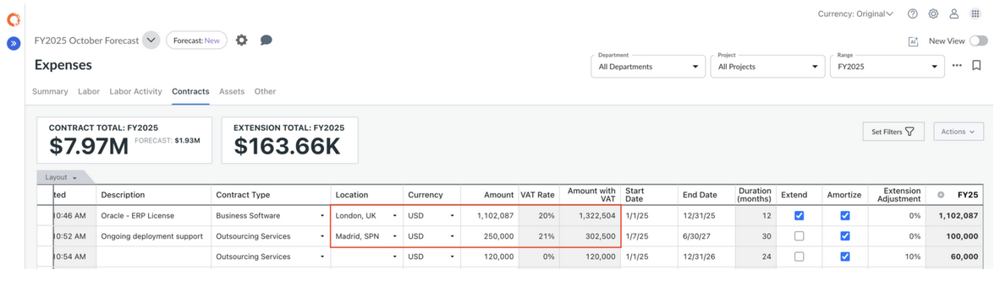

# Visão geral do planejamento de contratos

O módulo Contract Planning permite orçar, prever e gerenciar contratos de fornecedores e prestadores de serviços dentro do modelo de planejamento financeiro de TI. Com a modelagem de contratos - seu compromisso, acumulação de custos e amortização - você obtém maior visibilidade das obrigações fixas e recorrentes, apoiando uma melhor tomada de decisão em relação a renovações, compromissos de gastos e cronograma de despesas.

**Por que é importante**

- Os contratos geralmente representam a maior parte das despesas operacionais de TI.
- Sem a modelagem de contratos, o planejamento pode omitir compromissos de longo prazo ou ocultar obrigações futuras até o momento da renovação.
- Com o Contract Planning, você pode:
  - Capturar datas de início e término do contrato, valores e metodologia de amortização
  - Prever como as despesas do contrato serão atingidas ao longo do tempo (não apenas no momento da compra)
  - Alinhar as obrigações contratuais aos centros de custo, contas, departamentos e planos financeiros

## Configurar o planejamento do contrato

Observação: As funções de administrador ou proprietário do processo orçamentário são necessárias para executar essas tarefas.

Antes de começar a inserir os itens de linha do contrato, você precisará ativar os Contratos e configurar os dados de referência para que os contratos se comportem de forma consistente em seu modelo.

A ativação do planejamento de contratos ativa as tabelas de dados de referência relacionadas e adiciona a guia **Contratos** à tabela Despesas.

Etapas de configuração

1. Vá para **Settings** (ícone de engrenagem) **→ Company Profile**.
2. Habilite **os contratos** e clique em **Salvar e sair**.
3. Navegue até **Configuração → Dados de referência → Tipo de contrato**.
4. Exportar o modelo e preencher os campos-chave:
5. **Tipo de contrato - Uma** classificação ou rótulo usado para identificar a categoria ou a natureza do contrato.
6. **Método de amortização do contrato** (por exemplo, linha reta de períodos pares, linha reta usando dias do calendário, linha reta rateando primeiro e último, linha reta por duração, amortização manual). Consulte [Métodos de amortização](https://www.ibm.com/docs/en/apptio-commercial/planning-standard/saas?topic=planning-amortization-methods "(Abre em uma nova guia ou janela)").
7. **Conta** - a conta GL onde o custo do contrato será acumulado
8. Importe o CSV atualizado e **publique** as alterações para que elas fiquem disponíveis para novos planos.

## Configurar o imposto sobre valor agregado (IVA)

Observação: As funções de administrador ou proprietário do processo orçamentário são necessárias para executar essas tarefas.

Apptio O planejamento pode calcular automaticamente **o imposto sobre valor agregado (IVA)** - também conhecido como imposto sobre mercadorias e serviços - para itens de linha do contrato.

Para ativar os cálculos de IVA, vá para **Configurações → Perfil da empresa** e ative a opção **Incluir imposto sobre valor agregado (IVA)**. A ativação dessa configuração criará automaticamente uma tabela de dados de referência de **taxas de IVA**.

O IVA é calculado com base no **local** selecionado em cada item de linha do contrato:

- Quando um item de linha de contrato é inserido e um **Local** é especificado,
- Apptio O Planning procurará **a taxa de IVA** na tabela de dados de referência,
- E calcular automaticamente o **valor com IVA**.
- O IVA não é amortizado - somente o valor original (antes do IVA) é usado para amortização.

Consulte [Imposto sobre valor agregado](value-added-tax.html "Apptio O Planning suporta a modelagem do imposto sobre valor agregado (IVA) para itens de linha do contrato, permitindo que as organizações representem com precisão o total de despesas do contrato, incluindo ou excluindo impostos. O IVA é um imposto sobre o consumo aplicado a bens e serviços e, dependendo das políticas contábeis de sua organização, pode ser recuperável ou não recuperável.") para obter mais detalhes

**Etapas de configuração**

**Antes de importar as taxas de IVA**, certifique-se de que seus **dados de referência de local** incluam todos os locais relevantes onde o IVA deve ser aplicado.

1. Vá para **Settings** (ícone de engrenagem) **→ Company Profile**.
2. Ative **Include Value-Added Tax (VAT) (Incluir imposto sobre valor agregado** ) e clique em **Save and Exit (Salvar e sair** ).
3. Navegue até **Configuration → Reference Data → VAT Rates**.
4. Exportar o modelo e preencher os campos-chave:
5. **Localização** - O identificador de localização usado para determinar a taxa de IVA aplicável.
6. **Taxa de IVA** - A taxa de imposto a ser aplicada, inserida como um decimal (por exemplo, insira 0.20 para 20%).
7. Importar o CSV atualizado
8. Clique no **menu Elipses** e **publique** as alterações para que elas fiquem disponíveis para os planos.

## Inserção e gerenciamento de itens de linha do contrato

- Abra seu plano e navegue até a guia **Contracts (Contratos** ) na página **Expenses (Despesas)**.
- Adicione um novo contrato:
  - Usando a **linha vazia** na parte inferior da tabela, ou
  - **Clique com o botão direito do mouse** e selecione **Inserir linha**
- Forneça as informações necessárias para cada contrato:
  - **Tipo de contrato** - A categoria ou classificação do contrato, que determina as regras contábeis padrão, como o método de amortização.
  - **Centro de custos -** **O** centro de custos financeiramente responsável pelo custo e pela amortização do contrato.
  - **Fornecedor** (opcional) - O fornecedor ou parte externa que presta o serviço contratado. Útil para relatórios e análise de despesas de fornecedores.
  - **Local** (opcional) - Usado para determinar a taxa de IVA aplicável se o IVA estiver ativado. O IVA é calculado com base nesse local.
  - **Valor do contrato -** O valor total do contrato comprometido a ser amortizado durante o prazo do contrato selecionado.
  - **Data de início** - A data em que o contrato se torna ativo e o reconhecimento da despesa (amortização) começa.
  - **Data final** - A data em que o prazo do contrato termina e o reconhecimento da despesa é interrompido.
  - **Método de amortização -** O método usado para distribuir o custo do contrato entre os períodos de tempo. Isso é preenchido automaticamente com base no Tipo de contrato, mas pode ser substituído, se necessário.
  - **Amortizar** (caixa de seleção) -
    - Ativado (verdadeiro): Distribui o valor do contrato uniformemente durante todo o prazo do contrato.
    - Desativado (falso): Reconhece o valor total do contrato no primeiro período da data de início do contrato.
- Analise o cronograma de amortização gerado pelo sistema e verifique se ele atende às suas expectativas (por exemplo, custo distribuído entre os meses de forma adequada).

Depois que o contrato é inserido, o Apptio Planning calcula automaticamente a despesa de amortização com base nos detalhes do contrato e no método de amortização selecionado. A despesa é então distribuída pelas colunas de período de tempo na guia Contratos.

Na guia **Summary (Resumo** ), o Apptio Planning gera a entrada financeira correspondente para a despesa de amortização usando a **conta de amortização** configurada.

## Delegar despesas do contrato a um centro de custos diferente

Se a despesa de amortização tiver que ser cobrada em um centro de custo diferente daquele que possui o contrato, você poderá preencher os campos **Centro de custo de delegação** e **Data de início da delegação**. Isso redireciona a despesa para outro centro de custo a partir da data especificada.

Isso é útil em cenários como quando um contrato é comprado por um centro de custo de projeto, mas os custos contínuos devem ser cobrados em um centro de custo operacional diferente.

Nessa configuração, o contrato continua pertencendo ao centro de custo original, mas o impacto financeiro é aplicado ao centro de custo delegado.
