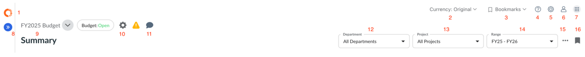
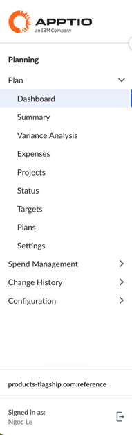

# Um guia para a navegação do planejamento Apptio

Este tópico fornece uma visão geral de como a navegação em Apptio Planning está organizada. Os itens de menu exibidos na sua conta dependem das suas permissões de usuário.

## Barra de navegação superior

A barra de navegação superior oferece acesso rápido às principais configurações, ferramentas de navegação e ações em nível de plano no site Apptio Planning:

1. **Apptio Logotipo:** Alterne entre os aplicativos Apptio disponíveis em sua organização. Apptio Planning suporta login comum e administração de usuários por meio do Frontdoor.
2. **Moeda:** Se a opção de várias moedas estiver ativada, use o menu de moedas para alterar sua visualização para uma moeda diferente. Selecione **Original** para visualizar e editar valores em suas moedas originalmente inseridas.
3. **Menu Favoritos:** Abra ou gerencie os favoritos salvos. Disponível quando você cria um marcador.
4. **Ajuda:** Abra a Central de Ajuda, envie feedback sobre o produto, visualize notas de versão ou acesse a Comunidade IBM.
5. **Configurações:** Acesse o perfil da empresa, gerencie usuários e defina as configurações do sistema.
6. **Profile Settings (Configurações de perfil):** Gerencie seu perfil de usuário; os administradores podem se passar por usuários.
7. **Menu de aplicativos:** Alterne entre os aplicativos Apptio disponíveis em sua organização. Apptio Planning suporta login comum e administração de usuários por meio do Frontdoor.
8. **Ícone Chevron:** Expande ou recolhe o painel de navegação esquerdo.
9. **Menu de planos:** Selecione e alterne entre os planos disponíveis.
10. **Ícone de engrenagem:** Configure as definições de exibição de KPI.
11. **Comentários:** Visualize e gerencie comentários no nível do plano.
12. **Departamentos:** filtre sua visualização por hierarquia de departamentos.
13. **Projetos:** Filtre sua visualização por projetos específicos.
14. **Intervalo de datas:** Ajuste o intervalo de tempo visível para o plano.
15. **Menu de estouro de três pontos:** Acesse ações adicionais, incluindo alterações no estado do plano (Open, Final), aprovações, envios ou outras tarefas administrativas.
16. **Ícone de marcador:** Cria um novo marcador para a página atual.

## Menu da barra lateral de navegação

O menu da barra lateral esquerda organiza as diferentes áreas em suas definições de plano e configuração:

- **Painel de controle:** Veja uma visão geral dos principais KPIs, tendências e métricas de desempenho do plano.
- **Resumo:** Analise os dados financeiros e de número de funcionários consolidados em seu plano.
- **Análise de variação:** Analise as variações entre o orçamento e o real, identifique os fatores determinantes e adicione comentários.
- **Despesas:** Insira, ajuste e revise as despesas no nível do item de linha.
- **Projetos:** Gerencie a lista de projetos e os detalhes de planejamento associados.
- **Status:** Acompanhe o status, os envios e as aprovações do plano.
- **Metas:** Definir metas financeiras e de número de funcionários por departamento.
- **Planos:** Criar, organizar e gerenciar planos. (Somente usuários administradores).
- **Configurações:** Ajustar as definições e configurações em nível de plano. (Somente usuários administradores).
- **Gerenciamento de despesas:** Importe, atualize e gerencie dados reais.
- **Histórico de alterações:** Visualize e audite as alterações do plano em um registro detalhado (somente para usuários administradores).
- **Configuração:** Gerencie as configurações de todo o sistema, como dimensões, esquemas e permissões de usuário. (Somente usuários administradores).
