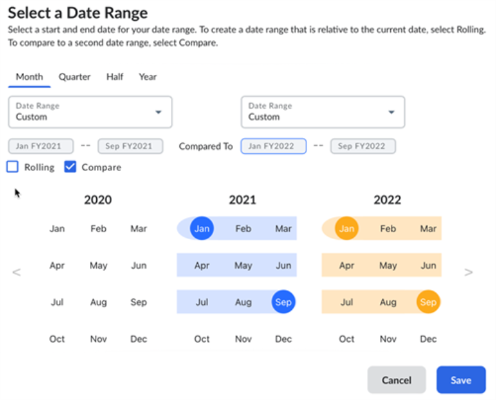

# Intervalos de datas personalizados

Os clientes do Costing & Planning agora podem criar relatórios de vários anos usando intervalos de datas personalizados.

## Suporte para intervalos de datas personalizados com fontes de dados de planejamento

Agora você pode selecionar os seguintes períodos personalizados para suas visualizações:

- Mês
- Trimestre
- Metade
- Ano

Esses períodos personalizados são fornecidos além dos intervalos de datas existentes. Você também pode usar a opção Rolling and Compare com esses períodos personalizados.

Para usar períodos de data personalizados em suas visualizações:

1. Abra o editor de visualização em Apptio BI e selecione qualquer fonte de dados de Planning .
2. Adicione as dimensões e métricas aplicáveis.
3. No seletor Date Range (Intervalo de datas), selecione um dos seguintes períodos personalizados: Mês, Trimestre, Semestre ou Ano.
4. Defina a opção Rolling, se necessário.
5. Rolling: A opção Rolling torna um intervalo de datas relativo; o intervalo de datas muda à medida que você avança no tempo. Para definir um intervalo de datas contínuo, marque a caixa de seleção Contínuo. Essa caixa de seleção não é selecionada por padrão.
6. Comparar: A opção Comparar permite que você compare dois períodos de tempo para ver como uma determinada métrica mudou ao longo dos períodos especificados. Para usar a opção Comparar, selecione o primeiro intervalo de datas e, depois de marcar a caixa de seleção Comparar, selecione o segundo intervalo de datas. A caixa de seleção de comparação não está selecionada por padrão.
7. Salve a visualização.

A figura a seguir mostra um exemplo de seleção de período de comparação para uma visualização.
