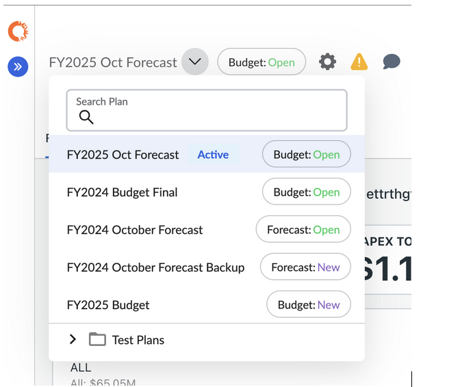
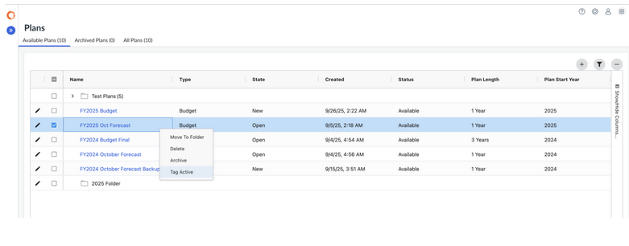
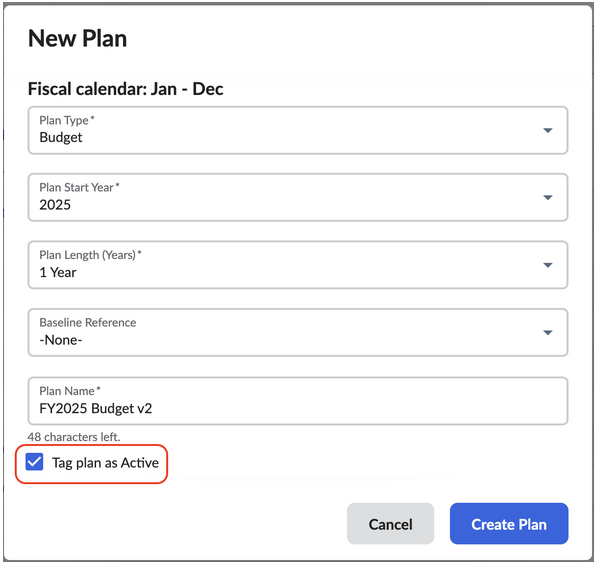

# Marcar planos como ativos

O recurso **Tag as Active** permite que os administradores priorizem planos importantes marcando-os como **Active**. Isso ajuda os usuários a localizar rapidamente e a se concentrar nos planos mais importantes.

Observação: As funções de administrador ou de proprietário do processo orçamentário são necessárias para gerenciar planos.

Quando um plano é marcado como Ativo, ele será:

- Exibir um **rótulo "Active" (Ativo** ) ao lado do nome do plano
- Aparece automaticamente na **parte superior do menu suspenso Plan (Plano)**
- Ser tratado como o **plano padrão** quando os usuários fizerem login

## Como marcar ou desmarcar um plano como ativo

Na página de planos

- Clique com o botão direito do mouse em um plano e selecione **Tag Active**
- Para remover a tag, clique novamente com o botão direito do mouse e selecione **Untag Active**

Ao criar um novo plano

- No modal **Create New Plan**, marque **a opção Tag as Active**
- O plano será marcado como Active imediatamente após a criação

## Comportamento dos planos ativos

|  |  |
| --- | --- |
| **Comportamento** | **Descrição** |
| Exibir | A tag Active aparece ao lado do nome do plano no menu suspenso Plan (Plano). |
| Ordem | Os planos ativos sempre aparecem primeiro, classificados em ordem alfabética se houver mais de um. |
| Planos não ativos | Os planos e as pastas sem a tag Active são listados abaixo dos planos Active, também em ordem alfabética. |
| Plano padrão no login | Se houver apenas um plano Active, os usuários terão esse plano como padrão. Se houver vários planos Active, os usuários terão como padrão o plano criado mais recentemente. |
| Regra de arquivamento | Os planos arquivados não podem ser marcados como ativos. Se um plano Active for arquivado, a tag será removida automaticamente. |
| Trilha de auditoria | Todas as alterações no status Active de um plano são registradas no Change History. |
