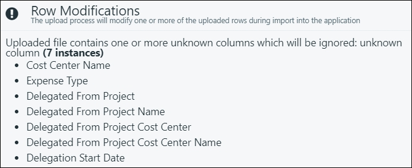
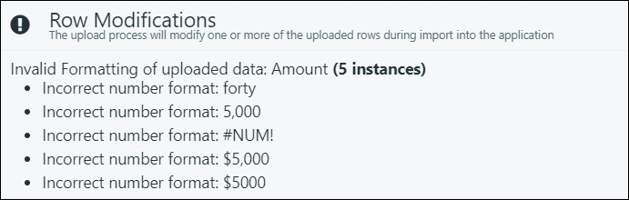
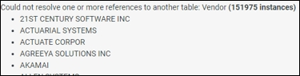
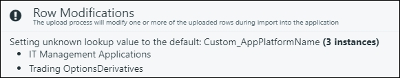
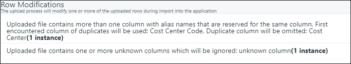
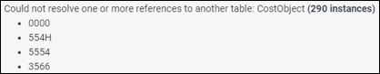
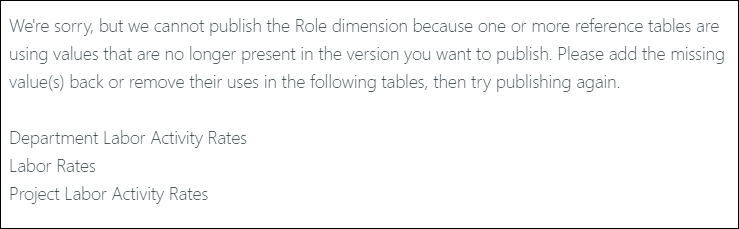
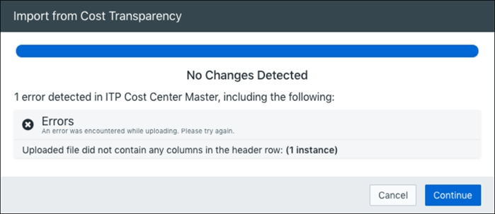
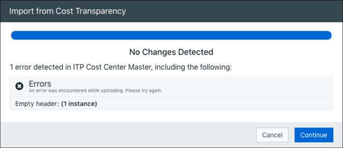

# Solucionar erros de upload de dados de planejamento

Você pode encontrar alguns dos seguintes erros ao fazer upload de dados para o site Planning. Consulte as seções a seguir para identificar o erro que está ocorrendo.

Modificações de linha

- [O arquivo carregado contém uma ou mais colunas desconhecidas que serão ignoradas](#TroubleshootPlanningdatauploaderrors__Uploaded)
- [Formatação inválida dos dados carregados](#TroubleshootPlanningdatauploaderrors__Invalid)
- [Não foi possível resolver uma ou mais referências a outra tabela](#TroubleshootPlanningdatauploaderrors__Could)
- [Definição do valor de pesquisa desconhecido como padrão](#TroubleshootPlanningdatauploaderrors__Setting)
- [Os arquivos carregados contêm mais de uma coluna com nomes de alias que são reservados para a mesma coluna](#TroubleshootPlanningdatauploaderrors__Uploaded2)

Omissões de linha

- [Mapeamentos inválidos de centros de custo e objetos de custo](#TroubleshootPlanningdatauploaderrors__Invalid2)
- [Não foi possível resolver uma ou mais referências a outra tabela](#TroubleshootPlanningdatauploaderrors__Could2)
- [Os dados carregados incluem itens que foram delegados de outros objetos de custo; esses itens serão excluídos](#TroubleshootPlanningdatauploaderrors__Uploaded3)

Outros erros

- [Lamentamos, mas não podemos publicar o... dimensão](#TroubleshootPlanningdatauploaderrors__Were)
- [Nenhuma alteração detectada: 1 erro detectado em <Dataset>, incluindo o seguinte: O arquivo carregado não continha nenhuma coluna na linha do cabeçalho](#TroubleshootPlanningdatauploaderrors__No)
- [Nenhuma alteração detectada: 1 erro detectado em <Dataset>, incluindo o seguinte: Cabeçalho vazio](#TroubleshootPlanningdatauploaderrors__No2)
- [Os dados reais do usuário não estão aparecendo na previsão.](#TroubleshootPlanningdatauploaderrors__useract)
- [Uma dimensão específica está em branco na previsão](#TroubleshootPlanningdatauploaderrors__A)

## Modificações de linha

Os erros de modificações de linha ocorrem quando os valores não obrigatórios nos dados importados são inconsistentes com os modelos do aplicativo ou com os dados de referência. Planning modificará automaticamente os dados quando esses erros ocorrerem para garantir uma importação bem-sucedida. Na maioria das situações, os dados inválidos são modificados ou removidos da importação, enquanto os dados restantes são importados.

## O arquivo carregado contém uma ou mais colunas desconhecidas que serão ignoradas

Sintoma
:   

    As colunas listadas não são importadas para Planning, mas outras colunas válidas são importadas normalmente.

O que está acontecendo
:   Os arquivos carregados devem seguir o modelo Planning e o posicionamento das colunas. As colunas que não fazem parte dos modelos do site Planning não são reconhecidas e não serão carregadas.

    A mensagem de erro deve listar todas as instâncias de colunas omitidas.

Solução
:   Certifique-se de que esteja importando dados usando o modelo Planning associado.

    1. Navegue até a página para a qual você deseja importar dados.
    2. Clique no botão Ações e selecione:
       - Exportar modelo de <nome da página>... para fazer o download de um modelo em branco.
       - Exportar <Nome da página>... para fazer download de todos os dados atuais no formato de modelo.
    3. Os modelos estão no tipo de arquivo.CSV, que pode ser editado com o Excel.
       - Todas as colunas aceitas pelo site Planning serão incluídas no modelo.

## Formatação inválida dos dados carregados

Sintoma
:   

    Os valores listados não são carregados em Planning, o que pode deixar lacunas em seu conjunto de dados.

O que está acontecendo
:   Planning identificou dados que estão formatados incorretamente. Conforme explicado na entrada anterior, o site Planning usa modelos para importação de dados. Cada coluna de modelo requer um tipo específico de dados (ou seja, texto, numérico, etc.). A falha na correspondência do tipo de valor correto para uma coluna é a causa mais comum desse erro.

    A mensagem de erro deve listar todas as instâncias de dados formatados incorretamente.

Solução
:   Investigue seus dados e confirme se todos os dados da coluna estão formatados corretamente para sua respectiva coluna.

    - Números: sem formatação, pontuação ou símbolos (600000).
    - Texto: sem pontuação (Executivo). Espaços são permitidos, se necessário (Contas a pagar).
    - Data: Para obter mais informações, consulte [Solução de problemas de formatos de data inválidos no Planning](ts_invalid_date_formats.html).
    - As equações ou funções do Excel são inválidas.

## Não foi possível resolver uma ou mais referências a outra tabela

Sintoma
:   

    Planning

O que está acontecendo
:   Os dados importados devem estar correlacionados com seus dados de referência, que funcionam como uma chave para vincular departamentos, contas e IDs. Os dados não necessários que você está importando não podem ser encontrados nos seus dados de referência.

    A mensagem de erro deve listar todas as instâncias de dados que não podem ser correlacionadas aos dados de referência.

Solução
:   1. Verifique se todos os valores em seu arquivo importado estão correlacionados com os dados de referência publicados.
       - Caso contrário, atualize sua referência Data.For. Para obter mais informações, consulte [Gerenciar dimensões de dados de referência](manage-reference-data.html).
    2. Selecione Atualizar dados de referência apenas para os orçamentos aos quais você deseja aplicar as alterações.
    3. Importe seus dados novamente e confirme se as alterações nos dados de referência foram bem-sucedidas.

## Definição do valor de pesquisa desconhecido como padrão

Sintoma
:   

O que está acontecendo
:   Em Reference Data, você pode criar listas e dimensões personalizadas.

    Uma vez estabelecidos, esses elementos personalizados agem da mesma forma que todos os outros dados de referência.

    Esse erro é funcionalmente o mesmo que o erro anterior, "Não foi possível resolver uma ou mais referências a outra tabela:", mas é específico para listas e dimensões personalizadas.

Solução
:   1. Verifique se todos os valores em seu arquivo importado estão correlacionados com suas listas e dimensões personalizadas publicadas. Caso contrário, atualize suas informações personalizadas e importe-as para Planning.
    2. Clique em Update Reference Data (Atualizar dados de referência) apenas para os orçamentos aos quais você deseja aplicar as alterações.
    3. Importe seus dados novamente e confirme se as alterações nos dados de referência foram bem-sucedidas.

## Os arquivos carregados contêm mais de uma coluna com nomes de alias que são reservados para a mesma coluna

Sintoma
:   A primeira coluna de duplicatas encontrada será usada: <Column1>. A coluna duplicada será omitida: <Column2>.

    

    <Column1> é importado, enquanto <Column2> não é importado para Planning.

O que está acontecendo
:   Planning detectou vários nomes de colunas que correspondem ao nome de uma coluna de modelo.

    Na imagem de exemplo, há duas colunas identificadas como "Cost Center Code" (Código do centro de custo) e "Cost Center" (Centro de custo) Ambas as colunas incluem o nome de coluna obrigatório "Centro de custo"

    Planning terá como padrão a primeira coluna que corresponder na ordem da esquerda para a direita ao ler o arquivo.CSV. Qualquer correspondência de coluna adicional não será importada.

Solução
:   Se quiser usar um nome em vez do outro, troque a ordem das colunas para que o nome preferido seja lido primeiro (na ordem da esquerda para a direita).

## Omissões de linha

Os erros de omissões de linha ocorrem quando os valores necessários em seus dados importados são inconsistentes com os modelos Planning ou com os dados de referência. Esses erros são significativos e podem fazer com que sua importação de dados falhe completamente. É importante resolver esses erros quando eles aparecerem.

## Mapeamentos inválidos de centros de custo e objetos de custo

Sintoma
:   

O que está acontecendo
:   Os departamentos e projetos podem ser associados a centros de custo específicos. Em caso afirmativo, apenas esses centros de custo são considerados válidos.

    Seus dados importados estão associando centros de custo a departamentos que não são explicitamente permitidos em suas configurações atuais.

Solução
:   Para departamentos:

    1. Vá para Departments Reference Data (Dados de referência dos departamentos) e atualize os códigos de centro de custo associados.
    2. Você pode deixar a coluna Código do centro de custo em branco para permitir todos os centros de custo.

Para projetos sem investimento Planning:

- Acesse Dados de referência de projetos e atualize os códigos de centro de custo associados.

Para projetos com investimento Planning:

- Vá para a visualização Listagem de projetos e modifique a coluna Código do centro de custo.

Para projetos, você pode ativar a opção Permitir qualquer centro de custo para desativar a restrição de mapeamento. Essa opção está disponível nos Dados de referência do projeto ou na Listagem de projetos, dependendo do fato de você ter ou não o investimento Planning.

## Não foi possível resolver uma ou mais referências a outra tabela

Sintoma
:   

O que está acontecendo
:   Os dados importados devem estar correlacionados com seus dados de referência, que funcionam como uma chave para vincular departamentos, contas e IDs. Os dados necessários que você está importando não podem ser encontrados nos seus dados de referência.

    A mensagem de erro deve listar todas as instâncias de dados que não podem ser correlacionadas aos dados de referência.

Solução
:   1. Verifique se todos os valores em seu arquivo importado estão correlacionados com os dados de referência publicados.
       - Caso contrário, atualize sua referência Data.For. Para obter mais informações, consulte [Gerenciar dimensões de dados de referência](manage-reference-data.html).
    2. Selecione Atualizar dados de referência apenas para os orçamentos aos quais você deseja aplicar as alterações.
    3. Importe seus dados novamente e confirme se as alterações nos dados de referência foram bem-sucedidas.

## Os dados carregados incluem itens que foram delegados de outros objetos de custo; esses itens serão excluídos

## Sintoma

## O que está acontecendo

Os custos delegados ocorrem quando um projeto é encerrado e seus custos de manutenção são transferidos para um departamento diferente. Os custos delegados ainda aparecerão em seu departamento original como linhas acinzentadas e somente leitura.

Os dados de custos delegados devem ser atualizados quando o custo tiver sido delegado.

## Solução

Identificar onde o custo foi delegado. Você deve atualizar esses custos em seu local delegado, não em seu local de origem.

Para obter mais informações, consulte [Delegar custos do projeto](pfp/delegate-project-costs.html).

## Outros erros

Outros tipos de erros que podem ocorrer em Planning.

## Lamentamos, mas não podemos publicar o... dimensão

## Sintoma

Porque uma ou mais tabelas de referência estão usando valores que não estão mais presentes na versão que você deseja publicar

## O que está acontecendo

Erro de publicação: Os dados de referência que existiam anteriormente em Planning agora estão faltando. Como os elementos do seu relatório dependem desses dados de referência, é gerado um erro grave e a operação de publicação falha.

## Solução

Consulte [Solução de problemas de erros de exclusão de dados de referência](ts-reference-data.html).

## Nenhuma alteração detectada: 1 erro detectado em <Dataset>, incluindo o seguinte: O arquivo carregado não continha nenhuma coluna na linha do cabeçalho

## Sintoma

## O que está acontecendo

Costing Standard para Planning Integration Error: Esse problema pode ser causado por:

- Um erro nas definições ou na configuração da integração Costing Standard .
- Uma ou mais tabelas importadas são verificadas em Costing Standard.

## Solução

Navegue até Planning, clique no menu Settings (Configurações) e, em seguida, clique em Costing Standard Integration (Integração ). Verifique o seguinte:

- Todas as tabelas estão escritas e nomeadas corretamente nas seções Integração de planos, Integração de dados reais e Integração de dados de referência.
- O campo Importar de está definido como Desenvolvimento.

Navegue até Costing Standard e verifique o seguinte:

- Todas as mesas têm check-in.
- Defina o ano fiscal atual como Aberto.

## Nenhuma alteração detectada: 1 erro detectado em <Dataset>, incluindo o seguinte: Cabeçalho vazio

Sintoma

O que está acontecendo

Costing Standard para Planning Erro de integração: Planning está extraindo dados do mês atual em Costing Standard. O mês deve estar aberto em Costing Standard; caso contrário, a integração não conseguirá encontrar nenhum dado.

Solução

1. Navegue até Costing Standard.
2. Abra o mês atual em Costing Standard.
3. Clique em Save.
4. Volte para Planning e tente importar novamente.

## Os dados reais do usuário não estão aparecendo na previsão.

Verifique os seguintes motivos pelos quais os dados reais podem não aparecer na previsão e tome as medidas corretivas

Razão

Mês de início da previsão definido incorretamente na criação do plano de previsão - os dados reais aparecem para os períodos até o mês de início da previsão menos um.

Solução

Recrie o plano de previsão selecionando o mês de início da previsão correto.

Razão

Os dados reais não estão disponíveis em Planning > Spend Management

Solução

Certifique-se de que o período real no Spend Management mostre os dados reais. Caso contrário, preencha os dados reais no Spend Management usando a Integração de transparência de custos ou usando o site automatizado Data Management ou carregando manualmente o arquivo.csv no período real.

## Uma dimensão específica está em branco na previsão

Isso pode ser devido a um dos seguintes motivos:

Razão

As dimensões não estão ativadas para a compactação de resultados reais no perfil da empresa.

Solução

Navegue até Company Profile, selecione a dimensão de Actuals Summarization e salve as alterações. Recriar o plano de previsão depois que a dimensão for salva para compactação.

Razão

A dimensão não tem dados no Gerenciamento de despesas.

Solução

Certifique-se de que os dados reais da dimensão estejam disponíveis no Gerenciamento de despesas. Caso contrário, preencha os dados reais no Spend Management usando a Integração de transparência de custos ou usando o site automatizado Data Management ou carregando manualmente o arquivo.csv no período real.

Para obter informações adicionais, consulte:

- [Solução de problemas: não é possível importar ou exportar arquivos do Excel](ts_unable_imp_exp_xsl.html)
- [Solucionar problemas de formatos de data inválidos no Planning](ts_invalid_date_formats.html)
- [Gerenciar dimensões de dados de referência](manage-reference-data.html)
