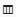
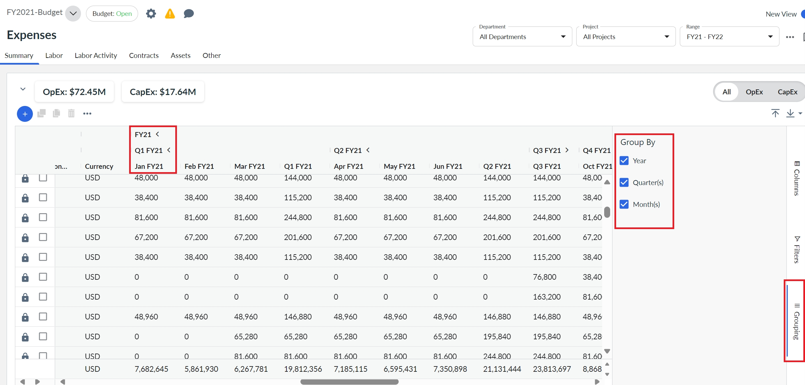
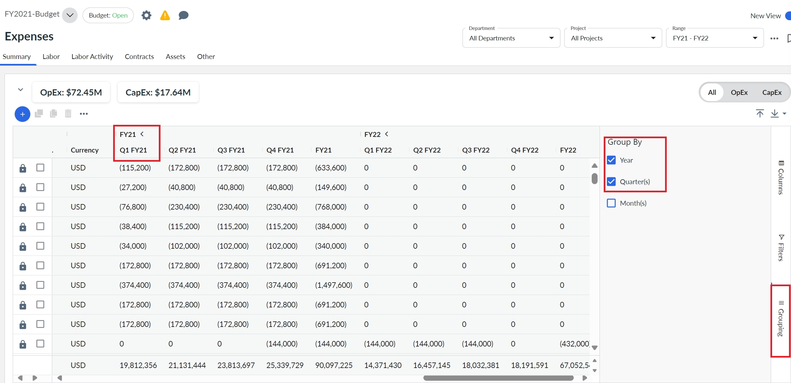

# Trabalhando com colunas do Apex

Quando um administrador ou proprietário de processo orçamentário ativa o recurso Apex Line Item Table, os usuários com função não administrativa podem alterar a visualização da tabela entre Classic View e New View.

## Sobre esta tarefa

Observação: todos os recursos listados aqui estão disponíveis apenas para os clientes que não têm PFP ou SDP.

## Procedimento

- Alterar opções de coluna
  1. Passe o mouse sobre o cabeçalho da coluna.
  2. Selecione 

     - Coluna de pinos - fixa a coluna à direita ou à esquerda.
     - Autosize This Column (Redimensionar automaticamente esta coluna) - ajusta automaticamente a largura da coluna selecionada para se ajustar ao seu conteúdo.
     - Autosize All Columns (Dimensionar automaticamente todas as colunas) - aplica o comando Autosize This Column (Dimensionar automaticamente esta coluna) a todas as colunas da tabela.
     - Hide Column (Ocultar coluna) - remove a coluna selecionada da tabela.
     - Agrupar por - agrupa as linhas de despesas pela coluna selecionada.
- Mostrar e ocultar colunas

  1. Acima da tabela Expenses (Despesas), selecione o ícone  .
  2. Selecione Mostrar/ocultar colunas.
     - O painel Mostrar/ocultar colunas está ativado.
  3. Para adicionar uma coluna ao site `expense view`, selecione o nome da coluna na lista.
  4. Para remover uma coluna do site `expense view`, limpe uma coluna.

  Nota:

  Você também pode acessar o painel Mostrar/ocultar colunas passando o mouse sobre o cabeçalho de uma coluna e selecionando o ícone .
- Opções de filtro

  1. Passe o mouse sobre o cabeçalho da coluna.
  2. Selecione o ícone  (representado por um funil).
  3. Selecione os valores que você deseja incluir.

  Observação: Para ver quais colunas têm filtros aplicados, no menu de opções da tabela, ative Mostrar barra de filtros.

  Para saber mais sobre as opções de tabela, consulte [Trabalho com tabelas do Apex](working-with-apex-table.html)
- Agrupar colunas usando a barra de colunas de grupo

  1. Acima da tabela Expenses (Despesas), selecione o ícone  .
  2. Selecione Mostrar barra de colunas de grupo.

     Acima das linhas do cabeçalho da tabela, aparece a barra de agrupamento de colunas.
  3. Para agrupar colunas, clique e arraste as colunas para a barra de colunas de grupo.
  4. Para agrupar e desagrupar linhas, adicione ou remova colunas das colunas do grupo.
- Classificar colunas

  1. Selecione um cabeçalho de coluna para classificar a coluna.

     Uma seta indicando a ordem de classificação aparece no cabeçalho da coluna.
  2. Selecione o cabeçalho da coluna novamente para alterar a ordem de classificação ou para remover a classificação da coluna.
- Exibir\Ocultar colunas de período

  1. No lado direito da tabela Despesas, selecione Agrupamento. O pop-up Group By é exibido conforme mostrado.

     
  2. Para ocultar ou exibir as colunas de ano, mês(es) ou trimestre(s), marque ou desmarque a caixa de seleção apropriada.

     Na página abaixo, desmarcamos a caixa de seleção Month(s) e, portanto, as colunas são agrupadas apenas por ano e trimestres.

     

     Da mesma forma, você pode desmarcar a caixa de seleção Quarter(s) ou Year para ocultar as respectivas colunas.
