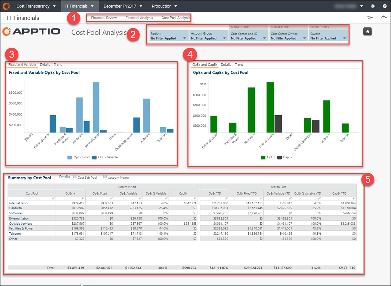
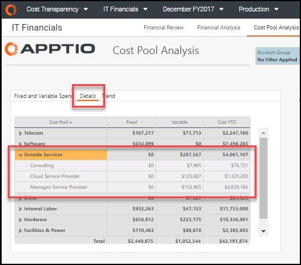
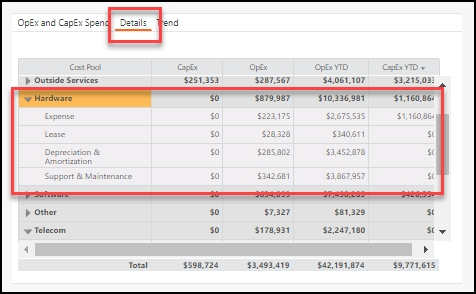
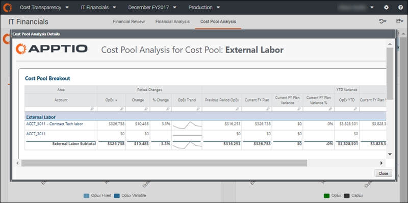

# Relatório de análise do pool de custos ( v104 e posterior)

aplica-se a: Planning e Costing
Standard em TBM Studio 12.3 e posterior, com o modelo v104 e posterior

O relatório **Cost Pool Analysis** agrega seus gastos financeiros em categorias padrão (conhecidas como pools de custos), conforme definido pelo TBM Council. O relatório detalha ainda os gastos do pool de custos por despesas operacionais ( OpEx ) e despesas de capital ( CapEx ), bem como custos fixos e variáveis.

## Exibir o relatório

Navegue até **Costing Standard** > **IT Financials**. O relatório **Revisão financeira** é aberto.

Na guia de coleta de relatórios (elemento 1, abaixo), selecione **Análise do pool de custos**.

**(1) Coleta de relatórios**

Cada um dos relatórios desta coleção fornece os detalhes financeiros de que você precisa para analisar os desvios de gastos e a precisão das previsões:

- [Relatório de revisão financeira ( v107 )](itfmf-ct_financialreview107.html "aplica-se a: Planejamento e cálculo de custos padrão no TBM Studio 12.3 e posterior, com o Template v107 e posterior")
- [Revisão financeira - relatório CapEx ( v107 )](itfmf-ct_financialreviewcapexv107.html)
- [Relatório de análise financeira ( v104 )](itfmf-ct_financialanalysis104.html "aplica-se a: Planejamento e cálculo de custos padrão no TBM Studio 12.3 e posterior, com o Template v104 e posterior")
- Análise do pool de custos (descrita neste artigo)

**(2) Cortadores**

Use as segmentações locais e globais para refinar os dados em seu relatório. Os fatiadores nesse relatório permitem que você veja seus dados de custo por região, grupo de contas e responsabilidade organizacional, incluindo centro de custo, proprietário do centro de custo e proprietário (por exemplo, CIO -1)).

As seguintes funções podem usar as segmentações neste relatório para obter uma visualização mais personalizada:

- **Controlador financeiro de TI ou CIO.** Sem definir quaisquer segmentações, você pode ver a visão geral das despesas de cada pool de custos em toda a organização. É possível detalhar os pools de custos, os proprietários de centros de custos e as contas individuais.
- **Proprietário do centro de custos ou CIO -1.** Defina as segmentações do **centro de custo** ou **do proprietário do centro de custo** para filtrar suas áreas de responsabilidade.
- **Analista financeiro.** Defina o fatiador **do centro de custos** para as áreas às quais você dá suporte ou defina um grupo de contas específico para permitir uma análise detalhada e interorganizacional das despesas por categoria.

**(3) Despesas fixas e variáveis OpEx por grupo de custos**

Use essa visualização para entender a agilidade financeira dos gastos com TI e onde existem oportunidades para impactar os custos no ano fiscal atual.

- **Fixed and Variable (Fixo e variável** ) exibe um gráfico do OpEx por pool de custos (guia padrão).
- **Details** exibe uma planilha do OpEx por pool de custos dividido por variável fixa. Expanda qualquer item na coluna **Pool** clicando na seta à esquerda do item.

  
- **A tendência** exibe o OpEx fixo e variável ao longo do tempo.

**Perguntas respondidas** :

- Se a demanda ou o consumo cair, tenho flexibilidade para reduzir os gastos?
- Onde posso considerar mudanças no sourcing que criarão uma estrutura de custos mais variável?
- Que agilidade financeira é apropriada para nossa empresa neste momento? Devo definir uma meta variável percentual?
- Quanto de minhas despesas é fixo e variável?
- O que está determinando a proporção de despesas fixas versus variáveis?

**(4) OpEx e CapEx Gastos por grupo de custos**

Use essa visualização para entender as despesas do pool de custos separadas por OpEx e CapEx:

- **OpEx e CapEx** - exibe um gráfico de OpEx e CapEx por pool de custos (guia padrão).
- **Detalhes** - exibe uma planilha dos sites OpEx e CapEx por pool de custos. Expanda qualquer item na coluna **Pool de custos** clicando na seta à esquerda do item.

  
- **A tendência** exibe as despesas de OpEx e CapEx ao longo do tempo.

**Perguntas respondidas** :

- Quanto do meu gasto é CapEx vs. OpEx?
- Como a capitalização varia de acordo com o pool de custos?
- Onde está capitalizada a maior parte de meus gastos?
- Como minhas despesas com o CapEx variam ao longo do ano fiscal? Há um pico de fim de ano (gastar ou perder)?

**(5) Resumo por pool de custos**

Use essa tabela para visualizar todos os pools de custos com seus custos fixos e variáveis e as despesas em CapEx e OpEx. Detalhes adicionais, incluindo o subgrupo de custos e o nome da conta, estão disponíveis.

Clique em qualquer linha da coluna **Pool de custos** para exibir o relatório **Detalhamento** do pool de custos, no qual você pode ver as contas que compõem o pool ou subpool de custos selecionado.

Em seguida, clique em um código de conta para ver os detalhes da transação da sua fonte financeira de registro (como o seu GL).

**Perguntas respondidas** :

- Quais contas estão sendo transferidas para as categorias de pool de custos?
- Qual é a variação orçamentária nessas contas?
- Quais transações ocorreram no período atual para uma conta?
