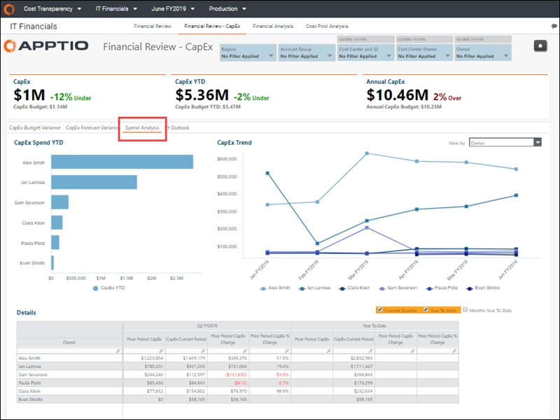

# Revisão financeira - relatório CapEx ( v107 )

aplica-se a: Planning e Costing Standard em TBM Studio 12.3 e posterior, com o modelo v107 e posterior

Casos de uso

- Acompanhe os gastos de TI pelo site CIO-1 em nível executivo, pelo proprietário do centro de custos e por pool de custos
- Analisar os detalhes em nível de transação para entender os fatores do plano de variação
- Identificar variações significativas de gastos em relação ao planejado

O relatório Financial Review - CapEx fornece uma visão executiva da variação geral do orçamento CapEx e das despesas CapEx de sua organização. O relatório detalha o custo de TI por pool de custos e proprietário para que você possa determinar quais proprietários de TI são responsáveis pelos maiores gastos com TI. Vários gráficos no relatório também o ajudam a determinar se as variações são reais ou causadas por categorização incorreta.

Use este relatório para criar um resumo executivo que explique as despesas de TI CapEx e para realizar as revisões financeiras periódicas que são essenciais para o gerenciamento eficaz das despesas de TI. Os dados desse relatório incluem itens de linha do razão geral para que você possa ajustar os planos para acomodar a variação.

Este relatório foi elaborado para ser usado pelas seguintes funções:

- CIO -1 (Escritório da TBM)
- Proprietários de centros de custo
- Analistas financeiros de TI

## Exibir o relatório

1. Faça login em Apptio e navegue até Planning > Costing
   Standard.
2. Na página inicial, clique em IT Financials.

   O relatório Revisão financeira é aberto.
3. Na guia de coleta de relatórios (elemento 1, abaixo), clique em Financial Review - CapEx.

1. Faça login em Apptio e navegue até Costing Standard.
2. Na página inicial, clique em IT Financials.

   O relatório Revisão financeira é aberto.
3. Na guia de coleta de relatórios (elemento 1, abaixo), clique em Financial Review - CapEx.

O relatório contém os seguintes elementos.

(1) Coleta de relatórios

Esta coleção de relatórios fornece os detalhes financeiros de TI de que você precisa para analisar as variações de gastos e a precisão das previsões:

- [Revisão financeira ( v107 )](itfmf-ct_financialreview107.html "aplica-se a: Planejamento e cálculo de custos padrão no TBM Studio 12.3 e posterior, com o Template v107 e posterior")
- Financial Review - CapEx ( v107 ) (descrito neste artigo)
- [Relatório de análise financeira ( v104 e posterior)](itfmf-ct_financialanalysis104.html "aplica-se a: Planejamento e cálculo de custos padrão no TBM Studio 12.3 e posterior, com o Template v104 e posterior")
- [Relatório de análise do pool de custos ( v104 e posterior)](itfmf-ct_costpoolanalysis104.html "aplica-se a: Planejamento e cálculo de custos padrão no TBM Studio 12.3 e posterior, com o Template v104 e posterior")

(2) Cortadores

Use as segmentações locais e globais para refinar os dados em seu relatório. Os fatiadores nesse relatório permitem que você veja seus dados de custo por região, grupo de contas e responsabilidade organizacional, incluindo centro de custo, proprietário do centro de custo e proprietário (por exemplo, CIO -1)).

As seguintes funções podem usar as segmentações neste relatório para obter uma visualização mais personalizada:

- Controlador financeiro de TI ou CIO. Sem definir quaisquer segmentações, você pode ver a visão geral das despesas em todos os centros de custos da organização. É possível detalhar os pools de custos, os proprietários de centros de custos e as contas individuais.
- Proprietário do centro de custos ou CIO -1. Defina as segmentações do centro de custo ou do proprietário do centro de custo para filtrar suas áreas de responsabilidade.
- Analista financeiro. Defina o fatiador do centro de custos para as áreas às quais você dá suporte ou defina um grupo de contas específico para permitir uma análise detalhada e interorganizacional das despesas por categoria.

(3) KPIs

Os KPIs fornecem uma visão de alto nível de seus gastos em CapEx :

- CapEx e CapEx Budget (Orçamento ) - Esses dois KPIs mostram seu orçamento geral CapEx em comparação com o CapEx do mês atual. A porcentagem de variação é mostrada à direita.
- CapEx YTD e CapEx Budget YTD - esses dois KPIs mostram suas despesas em CapEx em comparação com o orçamento YTD. A porcentagem de variação é mostrada à direita.
- Annual CapEx e Annual CapEx Budget- Esses dois KPIs mostram suas despesas em CapEx em comparação com o orçamento YTD. A porcentagem de variação é mostrada à direita.

(4) CapEx Variação orçamentária

Use este gráfico e tabela para visualizar a variação do orçamento do CapEx com base no pool de custos, grupo de contas, proprietário, proprietário do centro de custos ou ID do centro de custos. Você pode usar essas informações para visualizar os gastos a mais ou a menos por categoria e identificar as fontes de maior variação ou exceção ao planejado. Essas informações o ajudarão a priorizar onde procurar oportunidades de redução.

Selecione uma métrica (pool de custos, grupo de contas, proprietário, proprietário do centro de custos ou ID do centro de custos) na lista Exibir por para preencher os gráficos Top Over Budget YTD e **Top Under Budget YTD** com os itens da categoria com a maior variação de orçamento em relação ao planejado YTD.

Clique em uma barra em um dos gráficos para abrir uma caixa de diálogo Detalhe de variação que mostra as despesas, o orçamento, a variação e a porcentagem de variação do CapEx para a métrica selecionada. Use as opções na parte superior da página para alternar entre os períodos de tempo.

Clique em um código de conta para ver os detalhes da transação na fonte de registro financeiro (como o razão geral).

A tabela Detalhes permite que você veja um resumo do orçamento, da variação e da porcentagem de variação do CapEx para todos os itens na métrica selecionada com base nos períodos de tempo selecionados acima da tabela.

Perguntas respondidas :

- Onde há variações significativas entre as despesas e o planejamento?
- Quais centros de custos estão gerando variação de despesas em relação ao planejado e quem é responsável por esse centro de custos?
- A variação é real ou causada pela categorização incorreta de uma despesa?

(5) CapEx Variação da previsão

Selecione uma métrica (pool de custos, grupo de contas, proprietário, proprietário do centro de custos ou ID do centro de custos) na lista Exibir por para preencher os gráficos Top Over Forecast YTD e Top Under Forecast YTD com os itens com a maior variação de previsão em relação ao planejado YTD.

Clique em uma barra em um dos gráficos para abrir uma caixa de diálogo Detalhe de variação que mostra as despesas, a previsão, a variação da previsão e a porcentagem de variação do CapEx para a métrica selecionada. Use as opções na parte superior da página para selecionar um período de tempo.

Clique em um código de conta na coluna da esquerda para ver os detalhes da transação da sua fonte financeira de registro (como o seu GL).

A tabela Detalhes permite que você veja um resumo da previsão CapEx, da variação da previsão e da porcentagem da variação da previsão para todos os itens na métrica selecionada com base nos períodos de tempo selecionados acima da tabela.

Perguntas respondidas :

- Para onde vai a maior parte de nossos gastos com TI? Por pool de custos? Por proprietário de TI (por exemplo, CIO-1 )? Por proprietário do centro de custo?
- Onde observamos mudanças significativas nas despesas de um período para outro?
- Quais são os itens de linha de despesas que contribuem para o custo de uma função de TI?

(6) Análise de despesas

Selecione uma métrica (pool de custos, grupo de contas, proprietário, proprietário do centro de custos ou ID do centro de custos) na lista Exibir por para preencher os gráficos Top Over Forecast YTD e Top Under Forecast YTD com os itens com a maior variação de previsão em relação ao planejado YTD.

Clique em uma barra do gráfico para abrir uma caixa de diálogo Detalhe de variação que mostra as despesas, a previsão, a variação da previsão e a porcentagem de variação do CapEx para a métrica selecionada. Use as opções na parte superior da página para selecionar um período de tempo.

Clique em um código de conta na coluna da esquerda para ver os detalhes da transação da sua fonte financeira de registro (como o seu GL).

A tabela Detalhes permite que você veja um resumo da previsão CapEx, da variação da previsão e da porcentagem da variação da previsão para todos os itens na métrica selecionada com base nos períodos de tempo selecionados acima da tabela.

Perguntas respondidas :

- Para onde vai a maior parte de nossos gastos com TI? Por pool de custos? Por proprietário de TI (por exemplo, CIO-1 )? Por proprietário do centro de custo?
- Onde observamos mudanças significativas nas despesas de um período para outro?
- Quais são os itens de linha de despesas que contribuem para o custo de uma função de TI?

(7) Perspectivas para o ano fiscal

Use a guia FY Outlook para visualizar o orçamento CapEx, a previsão e a variação de gastos para o ano fiscal.

Clique em qualquer item da coluna da esquerda para ver os detalhes da transação da fonte financeira de registro (como o GL).

(8) Ícone de e-mail

O ícone de e-mail é visível apenas para analistas financeiros com permissões de administrador. Clique no ícone para abrir o relatório de e-mail Finance Variance Review. Consulte o [relatório de e-mail Finance Variance Review](itfmf-ct_financialvariancereviewemail104.html "aplica-se a: Planejamento e cálculo de custos padrão no TBM Studio 12.3 e posterior, com o Template v104 e posterior").
