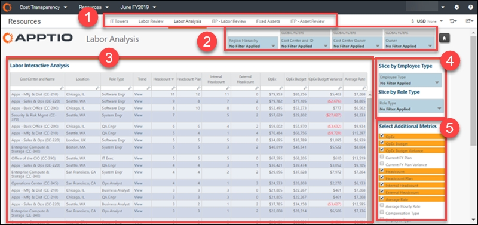
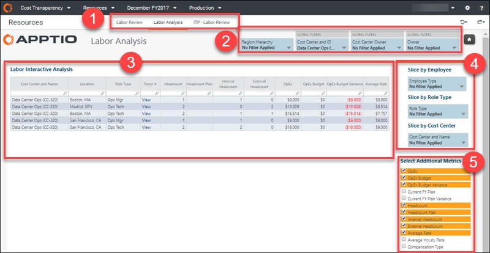
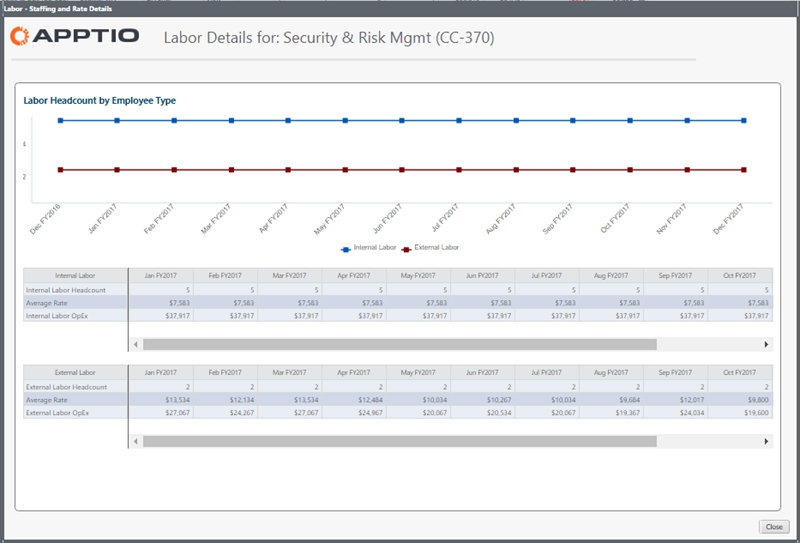

# Relatório de análise de mão de obra ( v104 e posterior)

aplica-se a: Planning e Costing
Standard em TBM Studio 12.3 e posterior, com o modelo v104 e posterior

Casos de uso

- Realizar análises ad hoc dos custos de mão de obra
- Visualizar dados granulares de funções, locais e centros de custo específicos

O relatório de análise de mão de obra fornece uma visão agregada e ad hoc de todos os dados relacionados aos seus gastos com mão de obra. Você pode filtrar o relatório e selecionar métricas específicas em várias combinações para que possa se concentrar nos dados de que precisa. Adicione filtros e métricas para obter uma visão mais granular; remova filtros e métricas para obter uma visão de nível superior. O relatório pode lhe dar visibilidade dos gastos com mão de obra por centro de custo, comparar as taxas horárias com as taxas médias mensais e comparar as taxas por função em vários locais.

Este relatório foi elaborado para ser usado pelas seguintes funções:

- Analista financeiro
- Analista de negócios

## Exibir o relatório

1. Faça login em Apptio e navegue até Planning > Costing
   Standard.
2. Na página inicial, clique em Labor.

   O relatório do Labor Review é aberto.
3. Nas guias de coleta de relatórios (elemento 1, abaixo), clique em Análise de mão de obra.

1. Faça login em Apptio e navegue até Costing Standard.
2. Na página inicial, clique em Labor.

   O relatório do Labor Review é aberto.
3. Nas guias de coleta de relatórios (elemento 1, abaixo), clique em Análise de mão de obra.

O relatório contém os seguintes elementos.

(1) Coleta de relatórios

Essa coleção de relatórios fornece os detalhes de que você precisa para analisar seus recursos de mão de obra:

- Relatório das torres de TI ( v104 )
- Relatório da Labor Review ( v104 )
- Relatório de análise de mão de obra ( v104 )
- ITP - Relatório de Revisão Trabalhista ( v104 )
- Relatório de ativos fixos ( v104 )
- ITP - Relatório de revisão de ativos ( v104 )

(2) Cortadores

Use as segmentações locais e globais para refinar os dados em seu relatório. Os fatiadores nesse relatório permitem que você veja seus dados de custo por região, grupo de contas e responsabilidade organizacional, incluindo centro de custo, proprietário do centro de custo e proprietário (por exemplo, CIO -1)).

As seguintes funções podem usar as segmentações neste relatório para obter uma visualização mais personalizada:

- Controlador financeiro de TI ou CIO - Sem definir quaisquer segmentações, você pode ver a visão geral das despesas em todos os centros de custos da organização. É possível detalhar os pools de custos, os proprietários de centros de custos e as contas individuais.
- Proprietário do centro de custo ou CIO -1 - Defina o fatiador do centro de custo para filtrar suas áreas de responsabilidade.
- Analista financeiro - Defina o fatiador de centro de custos para as áreas às quais você dá suporte ou defina um grupo de contas específico para ver uma análise detalhada de despesas por categoria interorganizacional para esse grupo.

(3) Análise interativa do trabalho

Essa tabela contém uma visão completa das despesas com mão de obra em todos os centros de custos por função, número de funcionários internos e externos, orçamento OpEx, OpEx, variação do orçamento e taxa média por padrão. Na tabela, são usados os seguintes códigos:

- (E-xxx) = Funcionário
- (C-xxx) = Empreiteira
- (CC-xxx) = Orçamento planejado para o número de funcionários por departamento

Selecione itens no painel Select Additional Metrics (Selecionar métricas adicionais ) (elemento 5, acima) para personalizar a tabela com as métricas que você deseja ver.

Na coluna Trend (Tendência ), clique em View (Exibir ) para abrir uma caixa de diálogo com detalhes mês a mês do item em que você clicar.

(4) Fatiador por funcionário, tipo de função ou centro de custo

Use essas segmentações adicionais para refinar o relatório por tipo de funcionário, tipo de função e responsabilidade do centro de custo.

## Perguntas respondidas

Você pode usar esse relatório para responder às seguintes perguntas:

- Estamos cumprindo nosso plano de contratação e gastos com mão de obra?
- Quais habilidades e funções estão apoiando meus aplicativos? Quantos são DBAs, desenvolvedores, etc.?
- De onde vêm os custos de mão de obra dos FTEs internos, dos contratados ou de algum outro prestador de serviços?
- Qual é a composição de nossos custos de mão de obra?
- Como os custos de conjuntos de habilidades semelhantes variam de acordo com a região e o contratante?
- Qual é a combinação de mão de obra interna e externa que dá suporte a cada função de TI?
- Quais contas GL contribuem para o trabalho de uma determinada função (como administrador do sistema)?
- Quais departamentos têm o maior número de vagas de funcionários no plano de contratação? Quais delas excedem o plano de pessoal?
