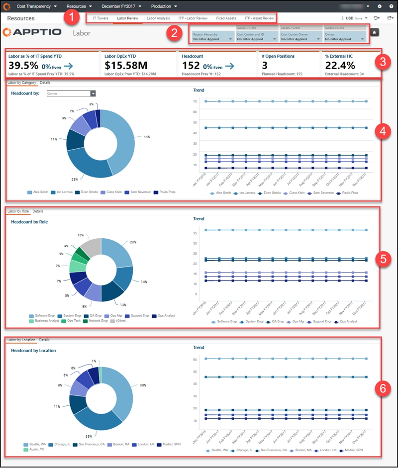
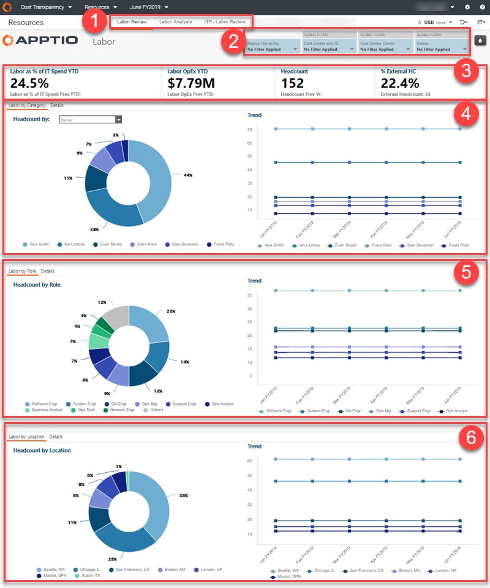
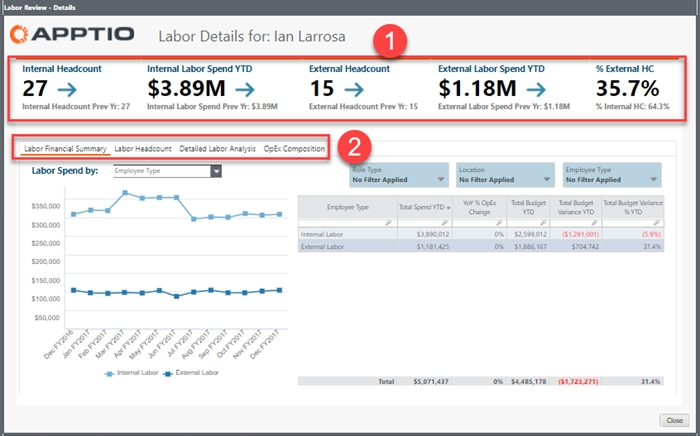
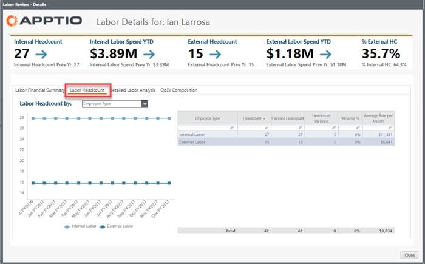
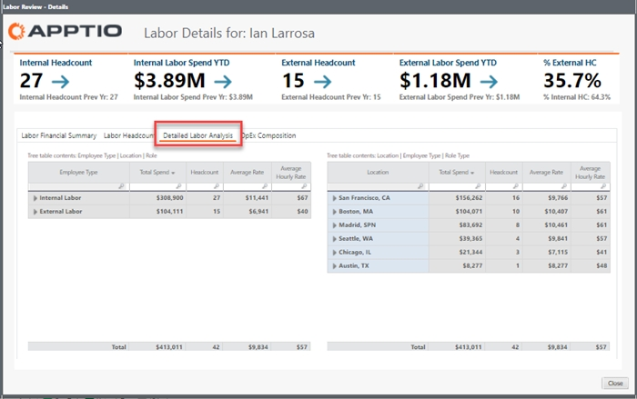
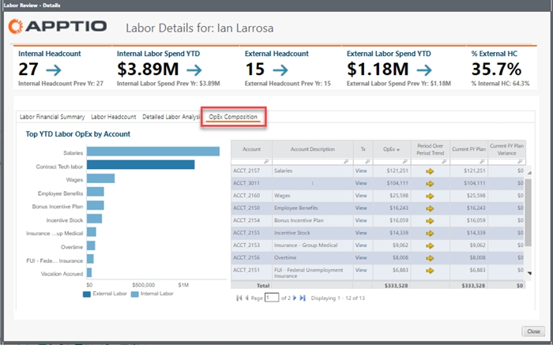
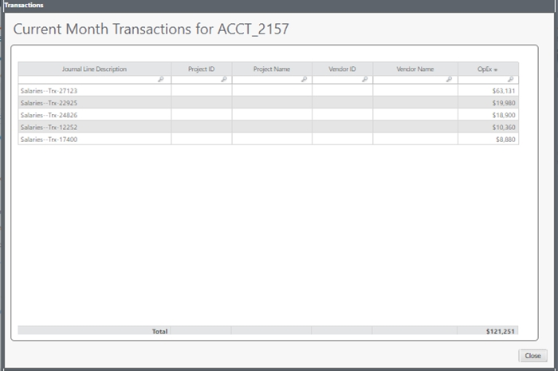
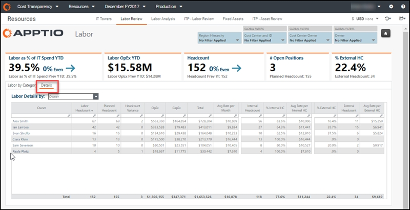
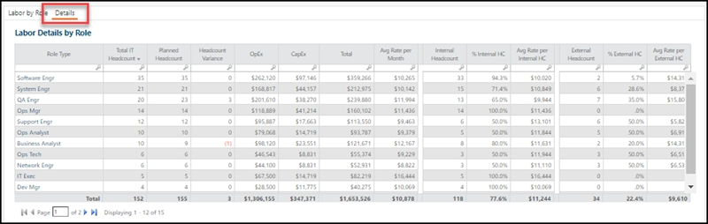
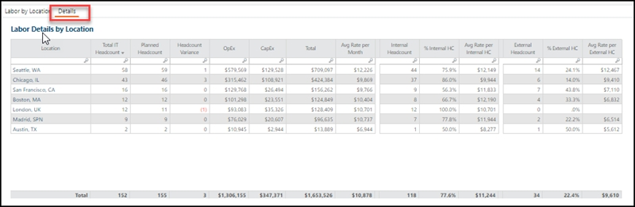

# Relatório do Labor Review ( v104 e posterior)

aplica-se a: Planning e Costing
Standard em TBM Studio 12.3 e posterior, com o modelo v104 e posterior

Caso de uso

- Compreender os gastos atuais com mão de obra de sua organização
- Analisar o custo do número total de funcionários em comparação com o orçamento
- Entenda qual departamento ou centro de custo é responsável pelo maior gasto com mão de obra

O relatório Labor Review fornece métricas de alto nível relacionadas ao custo e ao número de funcionários da mão de obra interna e de contratados externos, incluindo o número e a natureza das posições em aberto, o equilíbrio entre mão de obra interna e externa e a porcentagem de gastos com mão de obra.

O custo da mão de obra (o custo total da mão de obra) é um dos custos operacionais mais substanciais para todas as organizações de TI. As revisões mensais do número de funcionários internos e externos são essenciais para eliminar as variações orçamentárias. O relatório de revisão de mão de obra ajuda você a entender os fatores que provocam essas variações.

Quando você usa esse relatório para entender os fatores que impulsionam a variação da mão de obra externa, pode incorporar esses fatores às suas previsões trimestrais e revisões executivas, identificar oportunidades de conciliar o orçamento e planejar com mais eficiência as principais iniciativas.

Este relatório foi elaborado para as seguintes funções:

- Liderança de TI, para ter uma visão agregada e poder controlar os custos
- Gerentes de recursos, para que você possa acompanhar onde e como a mão de obra é tratada
- Proprietários de centros de custo e proprietários de orçamentos (CIO -1)) ), para que você possa gerenciar seu pessoal e seus orçamentos

## Exibir o relatório

1. Faça login em Apptio e navegue até Costing Standard.
2. Na página inicial, clique em Labor.

   O relatório do Labor Review é aberto.

1. Faça login em Apptio e navegue até Planning > Costing
   Standard.
2. Na página inicial, clique em Labor.

   O relatório do Labor Review é aberto.

O relatório contém os seguintes elementos.

(1) Coleta de relatórios

Essa coleção de relatórios fornece os detalhes de que você precisa para analisar seus recursos de mão de obra:

- [Relatório das torres de TI ( v104 )](../../cost-transparency/reports-v104/it_towers_report_collection.html)
- Relatório de Revisão Trabalhista ( v104 ) (descrito nesta página)
- [Relatório de análise de mão de obra ( v104 )](itfmf-ct_laboranalysis104.html "aplica-se a: Planejamento e cálculo de custos padrão no TBM Studio 12.3 e posterior, com o Template v104 e posterior")
- [ITP - Relatório de Revisão Trabalhista ( v104 )](itfmf-ct_itplaborreview104.html "aplica-se a: Planejamento e cálculo de custos padrão no TBM Studio 12.3 e posterior, com o Template v104 e posterior")
- [Relatório de ativos fixos ( v104 )](../../cost-transparency/reports/fixed_assets.html)
- [ITP - Relatório de revisão de ativos ( v104 )](../../cost-transparency/reports-v104/itpassetreview104.html)

(2) Cortadores

Use as segmentações locais e globais para refinar os dados em seu relatório e ver os totais individuais por organização. Os fatiadores nesse relatório permitem que você veja seus dados de mão de obra por região, centro de custo, proprietário do centro de custo e proprietário (por exemplo, CIO -1)).

As seguintes funções podem usar as segmentações neste relatório para obter uma visualização mais personalizada:

- Controlador financeiro de TI ou CIO - Sem definir quaisquer segmentações, você pode ver a visão geral das despesas de cada pool de custos em toda a organização. É possível detalhar os pools de custos, os proprietários de centros de custos e as contas individuais.
- Proprietário do centro de custo ou CIO -1 - Defina as segmentações do centro de custo ou do proprietário do centro de custo para ver apenas suas áreas de responsabilidade.
- Analista financeiro - Defina o fatiador do centro de custo para as áreas às quais você dá suporte ou defina um grupo de contas específico para permitir uma análise detalhada e interorganizacional dos gastos dessa categoria.

(3) KPIs

Os KPIs fornecem uma visão de alto nível de seus gastos com mão de obra:

- Labor as % of Spend YTD - este KPI expressa seus gastos com mão de obra como uma porcentagem dos gastos gerais de TI no acumulado do ano e compara os gastos atuais no acumulado do ano com o período anterior. Isso é útil para entender o quanto de sua organização é impulsionado pela mão de obra.
- Mão de obra OpEx YTD - Esse KPI compara seus custos de mão de obra YTD com o YTD anterior. Esses números podem dar uma ideia da magnitude de suas condições atuais.
- Número de funcionários - Esse KPI compara seu número de funcionários atual com o do ano anterior, com a porcentagem de mudança.
- # Número de posições abertas - Esse KPI compara o número de vagas atuais com o planejado.
- % HC externo - esse KPI exibe o número de posições externas atuais e a porcentagem dessas posições em relação ao número total de funcionários, para que você possa entender a quantidade de mão de obra externa em comparação com seu gasto total.

(4) Número de funcionários por proprietário, centro de custos ou proprietário do centro de custos

Use esses gráficos para visualizar suas despesas com mão de obra por proprietário, centro de custos, proprietário do centro de custos, função ou local.

- Mão de obra por categoria - Use o gráfico de rosca para comparar a porcentagem de gastos com mão de obra por proprietário, centro de custo ou proprietário do centro de custo. Se você selecionar Cost Center Owner, por exemplo, os gráficos mostrarão os 10 principais centros com o maior número de funcionários.

  Use o gráfico de tendências para ver as despesas com mão de obra mês a mês. Você verá picos quando um grande número de novos funcionários ingressar na organização, ou o contrário, quando uma equipe estiver diminuindo o ritmo. Avalie essas informações para garantir que elas correspondam às suas expectativas. Você pode ver mais informações no relatório de análise de mão de obra, onde os dados reais são comparados aos planejados.

  Você pode remover pontos de dados individuais de qualquer gráfico clicando na lista de itens abaixo dos gráficos.

  Clique em qualquer barra do gráfico de rosca para abrir a caixa de diálogo Detalhes do trabalho com mais informações sobre o item em que você clicou.

  

  1 - Os KPIs comparam o número de funcionários internos e externos, os gastos com mão de obra e as porcentagens do acumulado do ano em relação ao ano anterior.

  2 - Gráficos e tabelas fornecem detalhes sobre seu custo de mão de obra e número de funcionários.

  - Resumo financeiro do trabalho - Use essa guia para ver se você está acima ou abaixo do orçamento. Visualize as despesas mensais com mão de obra com base em sua seleção de tipo de funcionário, tipo de função, local ou ID da conta (gráfico à esquerda). É possível ver a composição dos custos em termos de salário, prestadores de serviços, ordenados etc. no plano de contas, de modo que seja possível vinculá-los ao GL ou à fonte de registro.

    Os filtros acima da tabela à direita afetam os dois gráficos. A tabela à direita mostra o total de despesas no acumulado do ano, a variação ano a ano, o orçamento no acumulado do ano, a variação do orçamento e a porcentagem de variação do orçamento no acumulado do ano para mão de obra externa e interna.
  - Headcount de mão de obra - Use essa guia para determinar se existem desvios. Visualize o número de funcionários mensais, o número de funcionários em relação ao planejado, as variações e a taxa média mensal com base em sua seleção de tipo de funcionário, tipo de função, local ou conta (gráfico à esquerda). Os filtros acima da tabela à direita afetam os dois gráficos.

    
  - Análise detalhada da mão de obra - Use essa guia para obter detalhes adicionais, começando no nível do departamento ou da organização até os funcionários individuais. Veja o total de despesas, o número de funcionários, a taxa média e a taxa horária dos funcionários internos e externos por tipo, local e função.

    Por exemplo, se o custo de um engenheiro de controle de qualidade interno em um determinado local for menor do que o de um contratado, você pode considerar a contratação de mais engenheiros internos do que externos. Esses dados permitem que você use a arbitragem de mão de obra e os diferenciais de custo para determinar o custo dos negócios e as funções que funcionam melhor em cada local. Você também pode analisar uma cidade em termos de capacidade, funções, viabilidade de mover equipes e composição de equipes em nível organizacional.

    
  - OpEx Composição - Visualize as contas com o maior gasto de mão de obra no acumulado do ano (mão de obra interna e externa) no gráfico à esquerda. A tabela à direita mostra a tendência OpEx, período a período, o plano do exercício fiscal atual e a variação do plano para cada uma das contas.

    

    Clique em qualquer item da coluna View (Exibir ) para ver as transações da conta selecionada no mês atual.

    
- Detalhes - Clique nessa guia para obter uma imagem agregada do número de funcionários, do número de funcionários planejados, da variação, da taxa média mensal OpEx e CapEx, e do número de funcionários internos e externos. Essa visualização permite que você identifique e ajuste rapidamente o número de funcionários e os gastos com mão de obra. Os dados podem ser divididos por proprietário da função, centro de custo ou proprietário do centro de custo. Clique em qualquer item na primeira coluna da tabela para abrir uma caixa de diálogo Detalhes do trabalho com mais detalhes sobre o item clicado. Os relatórios disponíveis na caixa de diálogo são os mesmos que os de Trabalho por categoria (acima).

  

(5) Número de funcionários por função

Use esses gráficos para visualizar suas despesas com mão de obra de acordo com a função. Esses dados podem ajudar um proprietário de recursos ou um executivo a analisar as funções em todos os centros de custo ou por local ao considerar uma estratégia de mão de obra de longo prazo.

- Mão de obra por função - Use o gráfico de rosca para comparar a porcentagem de gastos com mão de obra por função. Use o gráfico de tendências para ver as despesas com mão de obra mês a mês.

  Clique em uma barra no gráfico de rosca para abrir uma caixa de diálogo Detalhes do trabalho com mais detalhes sobre o item clicado. Os relatórios disponíveis na caixa de diálogo são os mesmos que os de Trabalho por categoria (acima), exceto pelo fato de os dados serem por função.
- Detalhes - Clique nessa guia para exibir o número total de funcionários de TI, o número de funcionários planejados, a variação, OpEx e CapEx, e a taxa média por mês, discriminados por função e número de funcionários internos e externos. Use esses dados para encontrar vagas por função e local.

  Clique em qualquer item na primeira coluna da tabela para abrir uma caixa de diálogo Detalhes do trabalho com mais detalhes sobre o item clicado. Os relatórios disponíveis na caixa de diálogo são os mesmos que os de **Trabalho por categoria** (acima), exceto pelo fato de os dados serem por função.

  

(6) Número de funcionários por localidade

Use esses gráficos para visualizar seus gastos com mão de obra por local.

- Mão de obra por local - Use o gráfico de rosca para comparar as porcentagens de gastos com mão de obra por local. Use o gráfico de tendências para ver as despesas com mão de obra mês a mês.

  Clique em uma barra no gráfico de rosca para abrir uma caixa de diálogo Detalhes do trabalho com mais detalhes sobre a função em que você clicou. Os relatórios disponíveis na caixa de diálogo são os mesmos que os de Trabalho por categoria (acima), exceto pelo fato de os dados serem por local.
- Detalhes - Clique nessa guia para exibir o número total de funcionários de TI, o número de funcionários planejados, a variação, OpEx e CapEx, e a taxa média por mês, discriminados por local.

  Clique em qualquer item na primeira coluna da tabela para abrir uma caixa de diálogo Detalhes do trabalho com mais detalhes sobre o item clicado. Os relatórios disponíveis na caixa de diálogo são os mesmos que os de **Trabalho por categoria** (acima), exceto pelo fato de os dados serem por local.

  

## Perguntas respondidas

Você pode usar esse relatório para responder às seguintes perguntas:

- Estamos cumprindo nosso plano de contratação e gastos com mão de obra?
- Quais habilidades e funções apoiam meus aplicativos? Quantos são DBAs, desenvolvedores, etc.?
- Meus custos de mão de obra são provenientes de FTEs internos, contratados ou de algum outro prestador de serviços?
- Qual é a composição de nossos custos de mão de obra?
- Como os custos de conjuntos de habilidades semelhantes variam de acordo com a região e o contratante?
- Qual é a combinação de mão de obra interna e externa que dá suporte a cada função de TI?
- Quais contas GL contribuem para o trabalho de uma determinada função (como administrador do sistema)?
- Quais departamentos têm o maior número de vagas de funcionários no plano de contratação? Quais delas excedem o plano de pessoal?
