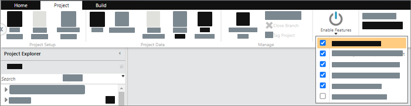

# Beta version features

TBM Studio sometimes contains features that are not yet released to all customers. These
are beta version features and may not work exactly as designed.

## Enable beta version features

As a TBMA, you can use the Enable Features option to control which beta version features your
users can access. When you enable a Beta feature, it becomes visible to all users in your
Environment.

1. On the Project tab, select Enable Features.
2. If you are not logged in as a TBMA, Enable Features is disabled. 
3. Use the checkbox to enable or disable beta version features.
