# Configuration

1. (TBM Studio): Create a Project.
2. (TBM Studio): Billing Essentials supports Multi-currency. See [here](multi-currency.html)  for the configuration details.
3. (TBM Studio): Configure Time Settings and Check in the changes.
4. (TBM Studio): Install  **Billing- Charge**  component in the project. 
   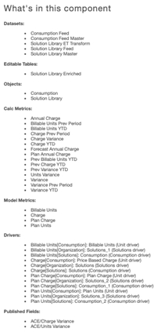
5. (TBM Studio): Create two input tables to ensure relevant details are uploaded.
   - Table Name: Consumption Feed
   - Feed Table Name: Solution Library

     Sample for Reference:

     Name of the tables can be
     customer specific

     
6. (TBM Studio): Save and Check in the changes.
7. (TBM Studio): These tables must be mapped to the Master/Feed tables as shown below

   Consumption Feed (Consumption Feed table)

   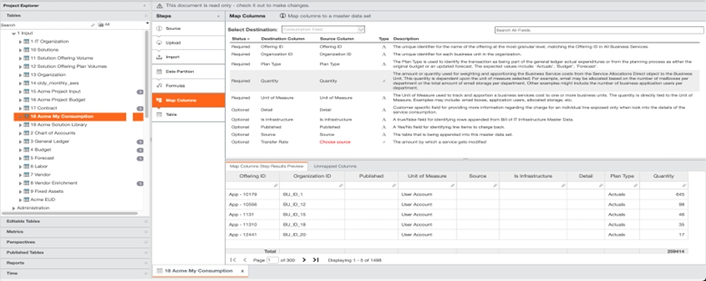

   Solution
   Library Feed (Solution Library table)

   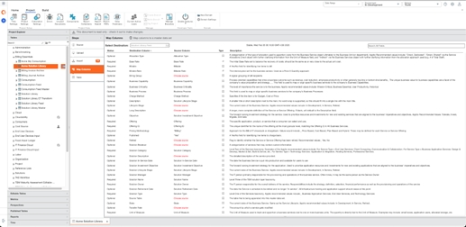

   *\*\* If the source
   column to map is missing, ensure that the right data type for the column is specified in 'Type
   Override' section in 'Import' transform for the table*
8. (TBM Studio): Save and Check in the changes.

   Note:
   - If there are any changes, upload the input table on an adhoc/monthly basis to ensure the
     accuracy of the reports
   - Verify that ‘Billable’ formula highlighted below is present in the Solution Master to ensure
     that accurate data is populated in the reports

   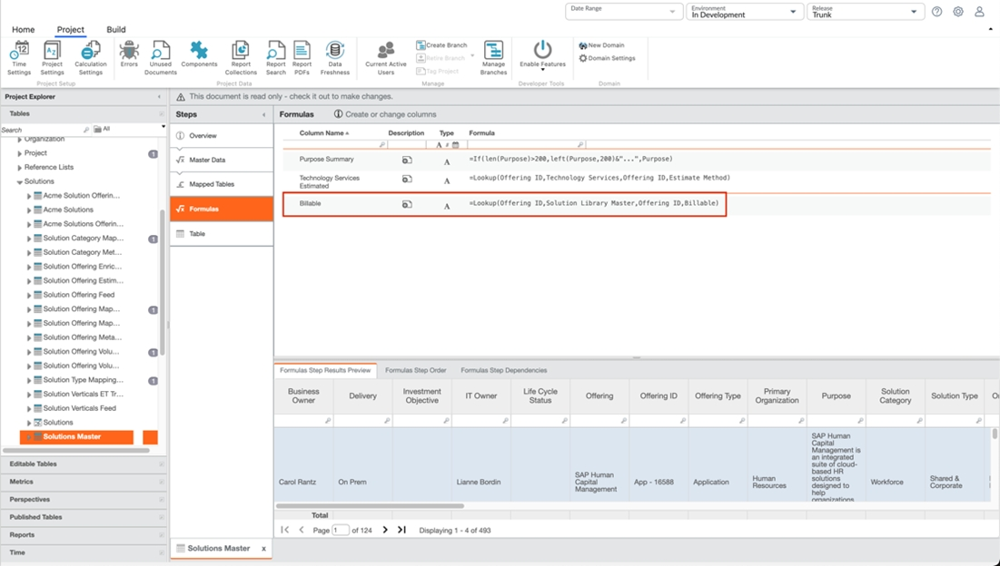

   Rate Management Report (‘Billing Charge- Reporting’ component should be installed)
9. (Report View): Navigate to Billing > Rate Management.

   Clear the filter from ‘Billable’ to
   reveal all Offerings. Use this table to edit the ‘Billable’ column to ‘Yes’ or ‘No’. Additionally,
   updates to the ‘Base Rate’ and ‘Rate Management’ column can be applied to set the Billable Rate if
   needed

   - **Base Rate**  - Initial rate established based on the unit cost from Costing Essentials
   - **Rate Adjustment**  - Enter a positive or negative number to calculate and adjust the Billable
     Rate (Billable Rate = Base Rate + Rate Adjustment), calculated via the ET script
   - **Rate Adj Impact**  - Used to clearly identify the charge vs cost recovery as a result of the
     Rate Adjustment

   Select  **Save**  and then  **Publish**  to propagate to all reports and models,
   “Solution Library ET Transform”

   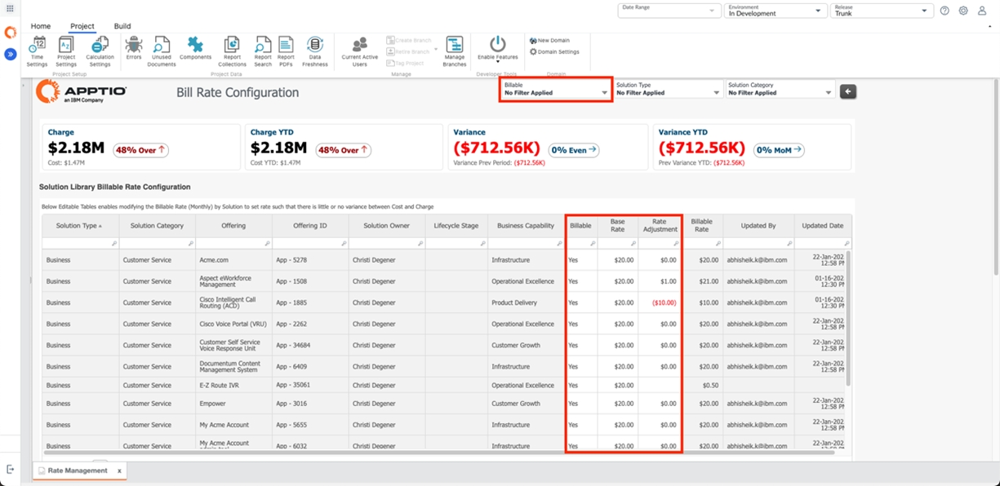

   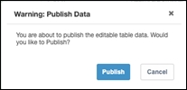

   \*\* Once published, ensure that 'Billable' filter is set to 'Yes' to see the Charge value in
   the report.
10. (TBM Studio): Navigate to Tables > Solution Library ET Transform and
    review the data post Publish in Step 10. Additionally, a recurring publish can be set for
    this table. For more information, see  [Recurring publish of transform table](https://www.ibm.com/docs/en/apptio-commercial/tbm-studio/saas?topic=administration-recurring-publish-transform-table "(Opens in a new tab or window)")  .
11. (TBM Studio): Open Consumption Model and verify the allocations

    Billable Units

    

    *\*\* This screenshot is for reference as the cost allocations will vary based on the data.*

    **Charge**

    

    *\*\* This screenshot is for reference as the cost allocations will vary based on the data.*

    Plan Charge

    

    *\*\* This screenshot is for reference as the cost allocations will vary based on the data.*

    Plan Units

    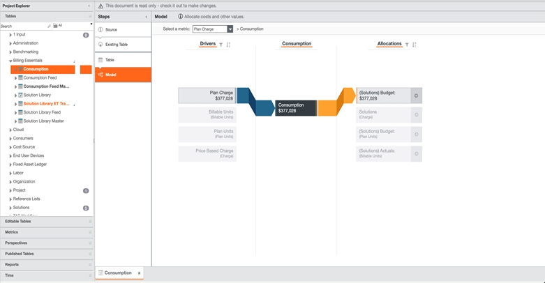

    *\*\* This screenshot is for reference as the cost allocations will vary based on the data.*

    Also, verify the allocations in  **Solutions**  model for the above-mentioned metrics

    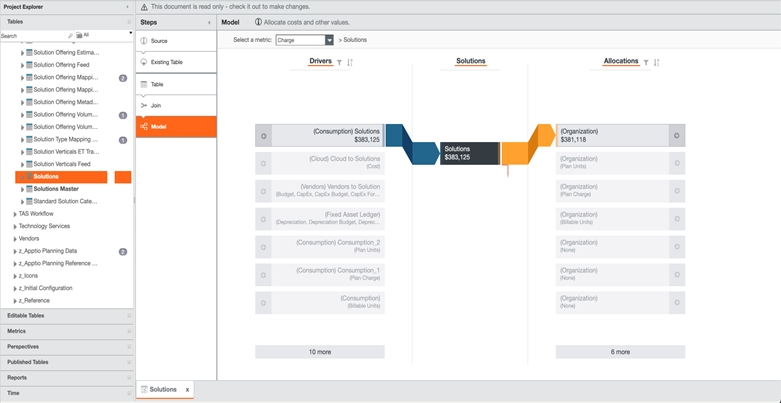

    *\*\* This screenshot is for reference as the cost allocations will vary based on the data.*

    Data Flow Chart

    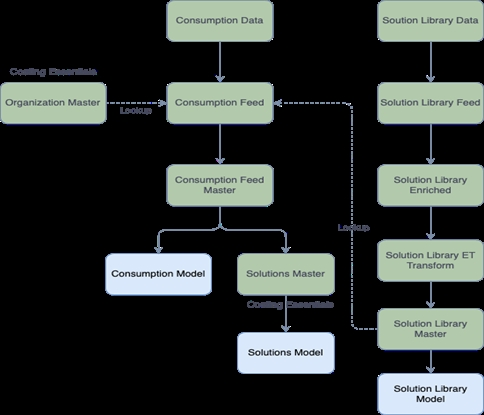

    Allocation Chart

    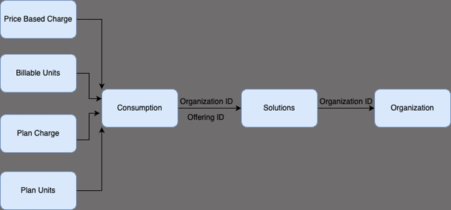

    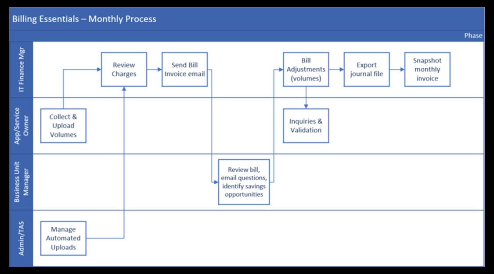

**Multi-Currency**

If customer uses Multi-currency this would be a good time to set that up. Multi-currency is the
same in Costing Essentials as in CT projects. You can reference the Multi-currency configuration in
Help Center.

However, if your customer uses a non-Gregorian calendar, the newer version of MCC doesn’t
support non-Gregorian. If your customer requires a non-Gregorian Calendar, follow the Legacy
Multi-currency configuration here.

Select the preferred  **Base Currency**  .

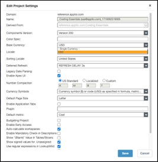

**Table Upload**

The  **Table Upload**  component allows end users with appropriate permissions to directly
 **upload**  data from spreadsheets into tables without the need for TBM Studio access. Table
Uploads report consists of two tabs: Table Upload and Table Upload Access.

**Table Uploads tab**

Table Uploads tab will help the users directly upload data into the Consumption/General Ledger,
Budget and Labor without the need for TBM Studio access.

Navigate to Workbench > Table Uploads > Table Upload as shown:

The table upload component offers two configuration options -  [Simple configuration](https://www.ibm.com/docs/en/apptio-commercial/tbm-studio/saas?topic=reports-table-upload-component#TableUploadcomponent__Simpleconfiguration__title__1 "(Opens in a new tab or window)")  &  [Advanced configuration](https://www.ibm.com/docs/en/apptio-commercial/tbm-studio/saas?topic=reports-table-upload-component#TableUploadcomponent__Advancedconfiguration__title__1 "(Opens in a new tab or window)")  . In this example, it is
equipped with Advanced Configuration, allowing user matching in the Table Upload Access tab.

**Table Upload Access tab**

Table Uploads Access tab will help the admins manage access to who can directly upload data into
the Consumption/General Ledger, Budget and Labor without the need for TBM Studio access.

Navigate to Workbench > Table Uploads > Table Upload > Table Upload Access as shown:

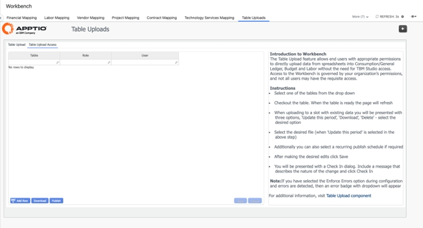

Grant table upload access by specifying the table name and the corresponding user details to
allow them to upload data into the designated table as shown below.

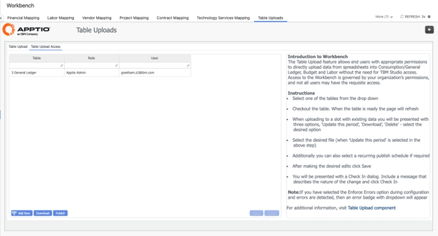

*\*\* Tab visibility can be customized based on the customer's requirements to control which user
roles have access to the "Table Upload Access" tab in the Table Upload report.*

For more information, see  [Table Upload](https://www.ibm.com/docs/en/apptio-commercial/tbm-studio/saas?topic=reports-table-upload-component "(Opens in a new tab or window)")  .
