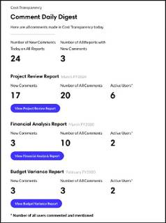
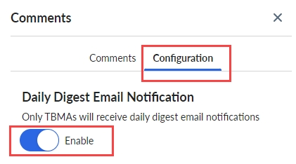

# Comments and Collaboration Admin Daily Digest Emails

Admin Daily Digest Emails

Anyone with Admin or Partner role can choose to receive a daily digest email that summarizes
commenting activities in Costing Standard, Billing Standard , and HBM reports. The daily digest
email summarizes the number of new comments, total number of comments, and total active users per
report, with a link to the report.

Daily digest emails can be enabled by anyone with the Admin or Partner role in a product
environment, with each product generating its own daily digest email.

To receive a daily digest email:

Navigate to  Comments  pane >  Configuration 
tab and then select  Enable  .   

  
 The  Configuration  tab is only visible to users with the Admin
or Partner role.

**Parent topic:** [Costing and Billing](../costing-billing/home.html)
