# AI TCO Configuration Guide

## Overview

The AI TCO & Usage solution is designed to solve key business problems and provide valuable
insights.

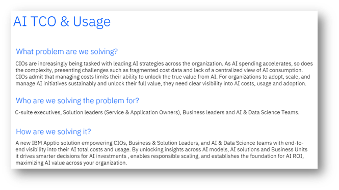

It supports the following use cases

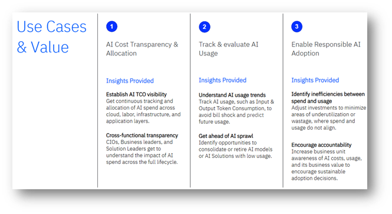

## Prerequisites

The prerequisites for the AI TCO & Usage solution are:

- IBM Apptio Costing Standard license
- IBM Apptio Server Version: R12.11.14 (or higher)
- Components Version v120 in Project Settings

## Configuration Steps

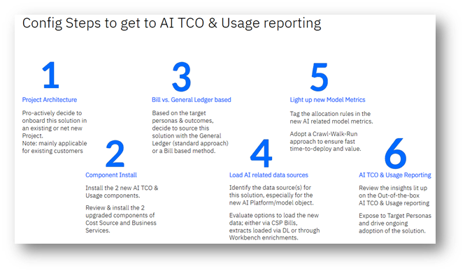

The following overview outlines the configuration steps required to achieve AI TCO & Usage
reporting, with detailed documentation provided in subsequent sections.:

1. Project Architecture - See the *architecture* section [here](#aitoconfig__arch)
2. Component Install - See the *component install* section [here](#aitoconfig__compinst)
3. Bill vs. General Ledger based. These 2 options are described at a high level in the
   *architecture* section [here](#aitoconfig__arch)
4. Load AI related data sources - See the *data requirements* section [here](#aitoconfig__datreq)
5. Light up new Model Metrics - See the *model* section [here](#aitoconfig__models)
6. AI TCO & Usage Reporting - See the *reporting* section [here](#aitoconfig__rep)

## Component Install

The core of the AI TCO & Usage solution is introduced via 4 components. 2 new components,
specifically created for this solution + 2 existing components that have been extended and hence are
expected to get upgraded. For new customers, the other "typical" components of Labor, Vendor, Cloud
etc. would need to be installed, as per the overall intended architecture. Existing customers can
re-use these previously installed components without any changes. Before installing these
components, it is essential to carefully review the architecture of your environment to determine
the best approach for implementation. You will need to decide whether to:

- Install the components in an existing project, or
- Create a new project specifically for the AI TCO & Usage solution

Following is the overview of the 4 components to consider and install in prioritized order.

Note: To
install required components, temporarily set *Components Version* to Version 120 in Project
Settings. Install the necessary components, then revert the version change to avoid triggering
unnecessary upgrade indicators.

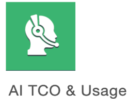

1. **AI TCO & Usage** component: This component provides clear view into AI expenditures and
   utilization across AI models, AI solutions, and business units. This component establishes the
   underlying framework through a set of new, AI specific master datasets, workbenches, models, and
   metrics, facilitating the modelling and calculation of AI TCO and usage outcomes.

   Install as the
   first component.

   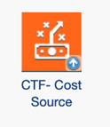
2. **CTF – Cost Source** component: A new version of the CTF - Cost Source component is
   available, which adds the following **new fields** to the Cost Source Master Data to support the
   AI TCO & Usage solution.:
   1. AI Cost Percentage: Brings in the AI Cost Percentage as set and defined by the user in the AI
      Tablematch table.
   2. AI Amount: Multiplies the existing Cost Source amount with the AI Cost Percentage to create a
      new AI Amount that looks to feed the new AI Cost model. To be installed as second component. If you
      do not install this component, you will not see the "% of Total IT Cost YTD" metric or the "AI Cost
      by Cost Pool" breakdown in your reports.

      Note: For existing customers (that intend to populate this solution using the Cost Source – General
      Ledger) it’s required to upgrade the following component:

   
3. **CT Apps – Services** component: A new version of the CT Apps - Services component is
   available, which adds new fields to All Business Services to support the AI TCO & Usage solution.

   Note: Existing customers must upgrade the following component to ensure compatibility and access to
   new features.

   1. IsAISolution: Needs to be set to “Yes” for any Service Offering that is considered directly or
      indirectly an AI Solution.
   2. AI Solution Type: Metadata that is used as a slicer in the AI TCO & Usage solution.
      Suggested values are:
      1. *Standalone:* A dedicated AI solution that operates independently as its own product or
         service.​
      2. *Embedded:* AI built deeply into an existing product, becoming a core native feature.
      3. *Augmented:* AI bolted on or lightly added to improve a feature/process, but not essential.
   3. AI Solution Users: Sums up the nr. of unique users of AI Solutions.
   4. AI Solution Count: Counts the nr. of AI Solutions.

   To be installed as 3rd component. Note: Not upgrading this component will break the AI TCO
   & Usage reporting, since most of the reporting is created at the level of AI Solutions =
   Business Services with the filter set on IsAISolution = “Yes”.

   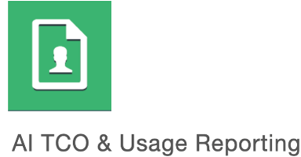
4. **AI TCO & Usage Reporting**component: This component delivers the reporting for the AI
   TCO & Usage solution. It consists of 2 reports, introduced in a new AI report collection. The
   main AI TCO & Usage report enables organizations to monitor the full lifecycle of AI
   investments, proactively addressing AI sprawl by tracking Total Cost of Ownership (TCO), usage
   trends, breakdowns, and anomalies. The main target personas are C-suite executives, Business &
   Solution Leaders, and AI & Data Science teams. In addition, there’s a secondary AI Cost
   Model report which allows users to dynamically trace the AI Cost & Usage allocations through
   interactive Sankey diagram visualizations.

   To be installed as the final component.

## Architecture

The first step is to decide where to install the components for the AI TCO & Usage solution.
You have multiple options, and we've outlined two possible approaches below.

**Option A**

Integrate the AI TCO & Usage solution into an
existing project and opt for a GL driven and Resource Tower approach.

This approach is
recommended for existing customers looking to leverage/re-use allocation logic that already exist in
the main Cost model metric. If you think your target users would benefit from a General
Ledger-driven approach with detailed views of Resource Towers and Cost Pools, this solution is a
good fit. The diagram below shows how to integrate the new AI Platforms object into your standard
model.

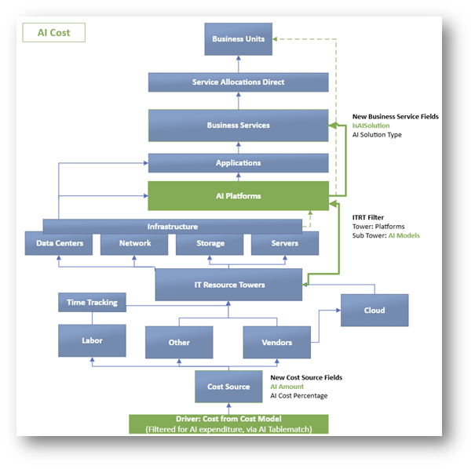

*AI Cost model metric blueprint – GL Based with Resource Towers*

The AI TCO & Usage solution introduces new metrics that work independently, even when
added to your existing project. The new AI Cost model is highlighted in the diagram, with
**blue** showing existing parts and **green** showing new additions, such as AI Platforms and
new fields in Cost Source and Business Services. This allows you to use your existing allocation
lines with the new AI Cost model on an as-needed basis, giving you more flexibility and
control.

The driver of the Cost Source object in the AI Cost model metric relies on a new
column called "AI amount", which is populated from the "Cost Source AI Tablematch" dataset. This
dataset is designed to identify General Ledger transactions related to Artificial Intelligence
(AI).

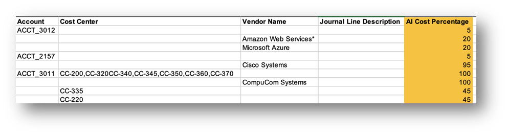

It is essential to
identify and populate the table with relevant accounts, cost centers, vendors, and journal line
descriptions that you associate with **AI Costs & Usage**, as demonstrated in the sample
above. Additionally, the AI Cost % column is required and must contain numeric values.

Note: In case of doubt regarding the AI Cost %, set it to 100. The allocation rules and mappings
will further refine the transaction amounts to only include AI-related costs.

The Table Match Logic will retrieve additional column details from the Cost Source data,
matching entries from the uploaded extract and populating relevant columns, as long as they exist in
the Cost Source data.

**Option B**

Create a new project for the AI TCO & Usage
solution + opt for a Bill driven approach, excluding Resource Towers.

Note: Opting for the Bill
driven approach and excluding Resource Towers at this point would be considered a custom approach.
Technically feasible but likely to require support from Apptio Professional
Services.

This approach is recommended for existing or new customers who first want to
completely reference this new solution and set of use cases related to AI. Also, it is suited for
customers that believe that the target personas for this solution would benefit from a Bill driven
source of truth with more direct allocation lines and without a need to report on cost breakdowns of
Resource Towers and Cost Pools. The below picture gives the blueprint on the architecture
.

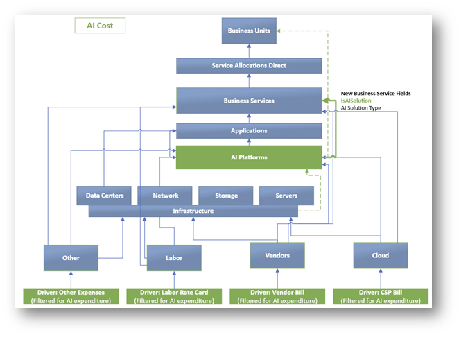

*AI Cost model metric blueprint – Bill Based without Resource
Towers*

The above framework steps away from the more traditional General Ledger – Cost Source driven
approach while also removing Resource Towers from the architecture. Where this might introduce
faster time-to-deploy it would rely on more custom allocations to be built. If adopting this
approach, the following out-of-the-box reporting views will no longer work:

- KPI of “% of Total IT Cost YTD”
- Breakdown of AI Cost by “Cost Pool”
- Breakdown of AI Cost by “Resource Towers”

## Crawl-Walk-Run

As you get started with the AI TCO & Usage solution, you don't need to have everything set up
from the beginning to start seeing value. The solution is designed to be flexible, allowing you to
start small and build up to a full understanding of your AI costs over time. This means you can
begin with the basics and add more details as you go, without needing to have all the pieces in
place right away. You can think of it as a **Crawl-Walk-Run** approach, where you start by taking
small steps, then gradually increase your pace as you become more comfortable with the solution.
This approach lets you deliver value quickly and build momentum over time, making it easier to get
the most out of your AI investments.

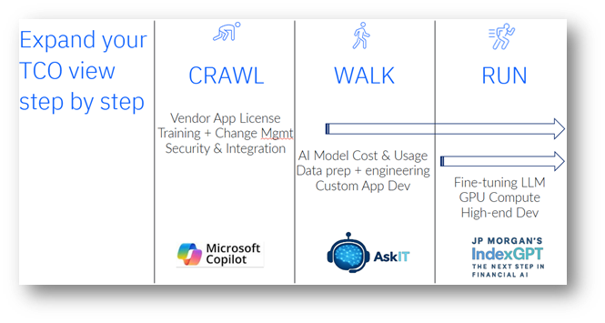

*AI TCO & Usage – Crawl/Walk/Run*

**Crawl**

In the crawl phase certain AI Solutions can get configured relatively quickly by only having to
bring in datasets related to certain areas. Focus here is on AI Solutions predominantly being
purchased.

- Sample AI Solution: Microsoft Copilot
- Main model objects:
  - Vendor: Vendor License
  - Labor: Training & Change Management
  - Other: Security & Integration
  - Service Allocations Direct: Consumption/Usage file
- Value: Understand the TCO of Microsoft Copilot as an AI Solution, including views into Labor
  contributions. Report and track the adoption of Microsoft Copilot across the organization by
  bringing in and leveraging the associated consumption/usage data.

**Walk**

In the walk phase the focus would shift towards AI Solutions that start to bring in the usage of
AI platforms and/or AI models, underpinning the TCO; alongside further advanced usages of skilled
labour. These AI Solutions would typically be a combination of buy & build.

- Sample AI Solution: AskIT
- Main model objects (in addition to the ones from the crawl phase):
  - Cloud: AI Model cost & usage
  - AI Platforms: Data representing the actual AI Platforms & AI Models
  - Data: In case of proprietary data, ensure to capture and represent cost related to Data
    preparation and training
- Value: Understand the TCO of an internal built AI Solution such as AskIT by starting to bring in
  data related to the AI platforms and/or AI models the solution is consuming. Report and track the
  cost drivers as well as obtaining insights into the AI model usage.

**Run**

In the most advanced run phase, it’s expected that most, if not all, typical modelled objects
would become applicable to light up the AI TCO & Usage outcomes & insights. The AI Solutions
represented in this phase are expected to be mostly in-house built AI solutions.

- Sample AI Solution: IndexGPT
- Main model objects (in addition to the ones from the crawl & run phase):
  - Infrastructure: Dedicated AI Compute (GPU), Storage, Database etc.
  - Time Tracking: More consumptive way to ensure proper activity tracking is in place for high-end
    labour activities
- Value: Obtain end-to-end insights into the AI TCO & Usage across all your AI solutions,
  including the most complex ones. Some of which are housed and built internally and therefore contain
  a significant infrastructure footprint that needs to be accounted for.

## Data Requirements

**Core Data**

As shown by the section focused on the Architecture,
the AI TCO & Usage solution introduces a new modelled object called AI Platforms. This object is
intended to be sourced with data focused on the cost, usage and adoption associated with AI
platforms and AI models.

The embedded file focuses on:

- The data required (listing all the columns with their respective description, whether they’re
  required or not and the effect if missing)
- Column clarifications (describes some sample values and their description)
- Sample data (an example of what the data would look like in AI Platforms)
- Source systems (sample references of potential source systems for the AI Platform data)

In addition to the main new object of AI Platforms, 2 master datasets have been updated to
reflect some of the necessary changes required for lighting up the main AI TCO & Usage reports.

Several new columns have been added to Cost Source Master Data and All Business Services,
which are documented in the same, embedded file.

Note: Data required to populate the other modelled objects that are part of this solution’s
blueprint are not covered in here. Please reach out to your Apptio representative to obtain insights
into the other, traditional data requirements.

For the data requirement details highlighted above, click here:

[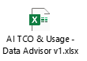](../../resources/AITCO-usage.xlsx "(Opens in a new tab or window)")

**Workbench**

As data gets sourced for AI Platforms, it goes
through the following architecture:

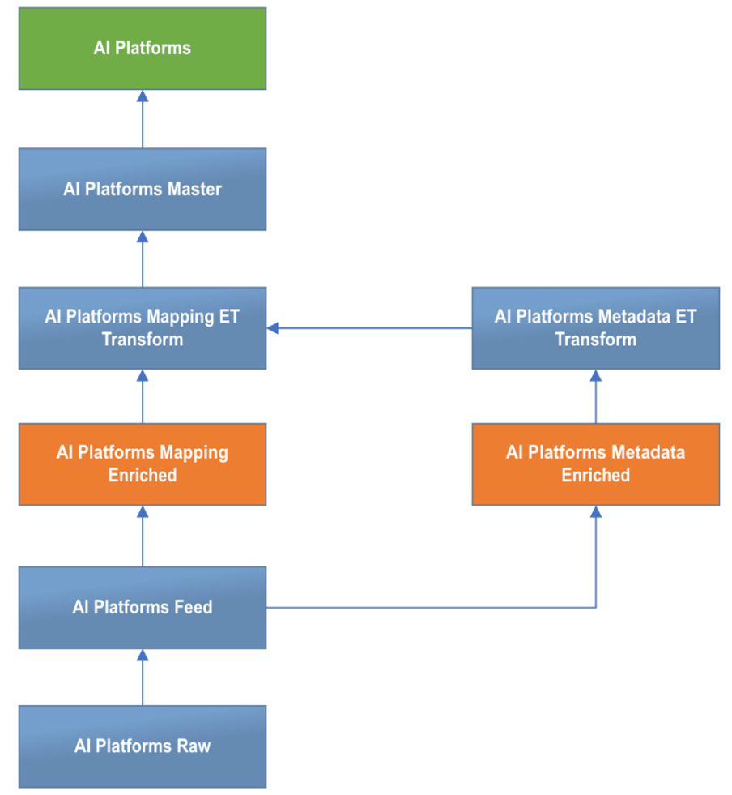

As one can see from the
above, it’s expected that your raw data gets appended into AI Platforms Feed firstly. From there, it
gets exposed into 2 editable tables (“AI Platforms Metadata Enriched” and “AI Platforms Mapping
Enriched) which make up the AI Workbench (which gets installed as part of the AI TCO & Usage
component). The AI Platforms Master dataset ultimately gets used to expose the data into the AI
model metrics via the AI Platforms modelled object. Please find a brief description for each of the
2 editable tables below:

- AI Platforms Data Enrichment

  The table “AI Platforms Data Enrichment” in the Workbench enables
  the enrichment of metadata, used for reporting, across the AI Platforms and AI Models. Any updates
  in this table get directly reflected in the “AI Platforms Metadata Enriched” editable table,
  enhancing the data related to AI platforms to support accurate cost tracking and reporting. The
  Enhanced data is further mapped to the “AI Platforms” passing through the “AI Platforms Mapping ET
  Transform”.

  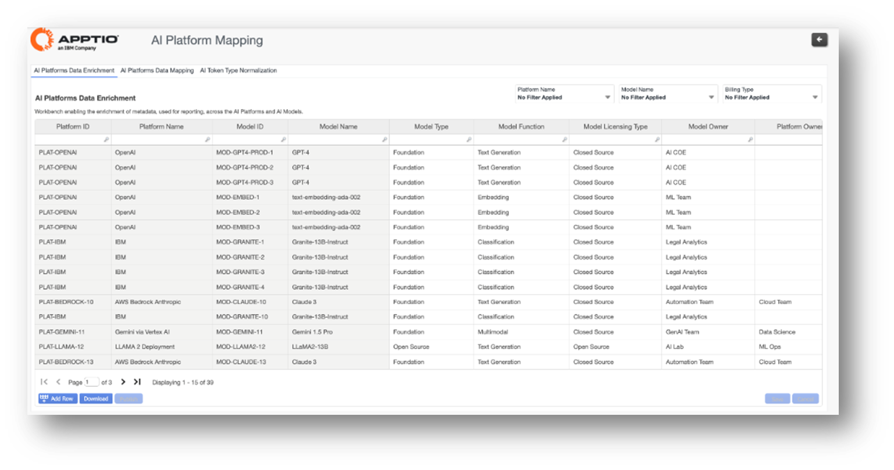
- AI Platforms Data Mapping

  This table in the workbench enables the mapping of the consumers of
  the AI Platforms and AI Models. It expects the mapping of an AI Platform or AI Model to 1 or many
  Solution Offerings. Alternatively, it can be mapped to a Business Unit or User ID in case the AI
  Platforms or AI Models are directly being consumed by end users. The Cost Weighting column is
  important since it allows for a weighted cost allocation/distribution across the consumers. Any
  updates in this table get directly reflected in the “AI Platforms Mapping Enrichment” editable
  table, which gets further mapped to the AI Platforms via the” AI Platforms Mapping ET
  Transform”.

  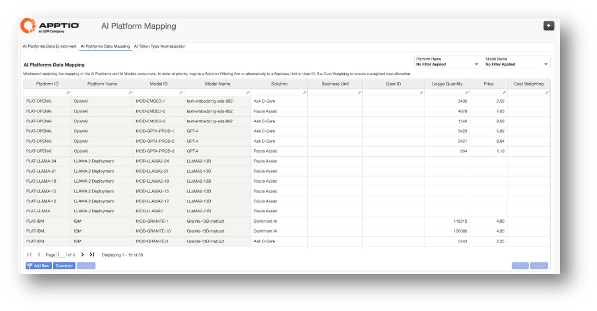
- AI Token Type Normalization

  This editable table enables the categorization and normalization
  of different token types (coming in through the raw data) into the Simplified Token Types of Input
  and Output. This categorization helps with simplified analysis and reporting views as it relates to
  exposing AI Usage details. Any updates in this table get directly reflected in the “AI Token Type
  Normalization” editable table and onto the “AI Token Type Normalization ET Transform” table. The
  latter gets looked up into the AI Platforms Master table via a formula.

  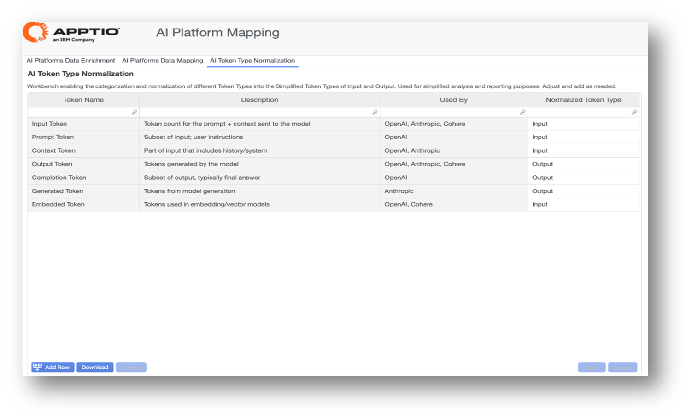

## Models

Once the data requirements are clear it is important to understand how this data is used in the
different model metrics, especially in terms of lighting up the end user reports.

The AI TCO & Usage component installs 13 model metrics, which may seem extensive, but
actually provides maximum flexibility for modeling and allocations, as well as enables easy
reporting views. As previously outlined in the architecture section, which introduced the new AI
Cost model and the two possible approaches, this section will delve into the details of all 13
models, explaining their purpose and rationale. The models are categorized into three groups:

- 5 AI Cost-related models
- 5 AI Usage-related models
- 3 AI Count-related models

The following section provides a detailed summary of the modelled metrics, along with their
corresponding driver logic

|  |  |  |
| --- | --- | --- |
| **Modelled Metric** | **Modelled Object Source** | **Driver Logic** |
| **AI Cost** | Cost | Formula:  If(Cost Source Master Data.Cost Source Model Driver IN (“OPEX – ACTUALS – FIXED”, “OPEX – ACTUALS – VARIABLE”), Cost Source Master Data. AI Amount),0)  Note: Filtered for AI expenditure, via AI Tablematch |
| AI Cloud Cost | Cloud Service Provider | Metric:  AI Cost |
| AI Vendor Cost | Vendors | Formula:  If(Is CSP!="Yes", AI Cost, 0) |
| AI Labor Cost | Labors | Formula:  AI Cost - AI Vendor Cost |
| AI Other Cost | Other Cost Pools | Metric:  AI Cost |
| **AI Usage** | AI Platforms | Column:  "Usage Quantity" from AI Platforms |
| AI Token Consumption | AI Platforms | Formula:  If(AI Platforms.Billing Type="Token Usage",AI Platforms.Usage Quantity,0) |
| AI Input Tokens | AI Platforms | Formula:  If(AI Platforms. Normalized Token Type = "Input", AI Usage, 0) |
| AI Output Tokens | AI Platforms | Formula:  If (AI Platforms. Normalized Token Type = "Output", AI Usage, 0) |
| AI Solution Users | AI Platforms | Column:  "AI Solution Total Users" from AI Platforms |
|  | Business Services | Formula:  If({AI Solution Users to Business Services (AI Platforms- AI Solution Users driver) }=0,{All Business Services.AI Solution Total Users Prep},0) |
| **AI Count** |  |  |
| AI Vendor Count | Vendors | Formula:  If({AI Cost}!=0,(1/SumIF(Vendor Master Data.Vendor ID,Vendor Master Data.Vendor ID,1)),0) |
| AI Model Count | AI Platforms | Column:  "Num of AI Models" from AI Platforms |
| AI Solution Count | AI Platforms | Column:  " AI Solution Count" from AI Platforms |
| AI Solution Count | Business Services | Formula:  If(AI Soution Count to Business Services(AI Platforms-AI Solution Count Driver))!=0,0,{All Business Services.AI Solution Count} |

**AI Cost models (5)**

AI Cost

Main cost model metric
that powers all the AI TCO & Usage reporting. In the view below (approach driven by the Cost
Source - General Ledger), it’s expected that AI Expenditures are identified (at the Cost Source
level), existing allocations (from the Cost model) are re-used by tagging them to this new AI Cost
model metric and new allocations are established as it relates to allocations in & out from the
new AI Platforms object.

This metric was created keeping the following in mind:

- Not to disturb the existing cost model.
- Allowing for a linkage to be made between the IT Towers and the AI Platforms object (containing
  the AI expenditures)
- Allowing for any extra drivers to be set (related to AI costs specifically) on an as-need basis
  by the customer (who wishes to further expand this modelled metric)

AI Cloud
Cost

This metric has been created to allow the end user to quickly and easily understand
the AI Cloud Cost driver on a monthly and year to date basis, as part of the TCO breakdown analysis.
It simply looks to mimic the main AI Cost model, focusing and starting from the Cloud Service
Provider object. Tag the upwards allocation lines that should be considered part of the AI Cloud
Cost.

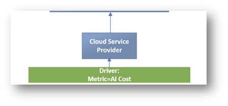

AI Vendor
Cost

This metric has been created to allow the end user to quickly and easily understand
the AI Vendor Cost driver on a monthly and year to date basis, as part of the TCO breakdown
analysis. It simply looks to mimic the main AI Cost model, focusing and starting from the Vendor
object. Note: It removes the Cloud Service Providers from this metric to ensure no double counting
happens with the AI Cloud Cost metric.

Tag the upwards allocation lines that should be
considered part of the AI Vendor Cost.

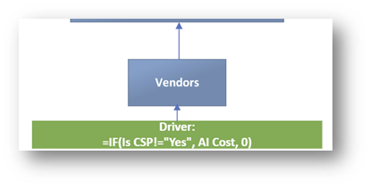

AI Labor Cost

This metric
has been created to allow the end user to quickly and easily understand the AI Labor Cost driver on
a monthly and year to date basis, as part of the TCO breakdown analysis. It simply looks to mimic
the main AI Cost model, focusing and starting from the Labor object. Note: It removes the AI Vendor
Cost Service from this metric to ensure no double counting happens with the AI Vendor and Cloud Cost
metrics.

Tag the upwards allocation lines that should be considered part of the AI Labor
Cost.

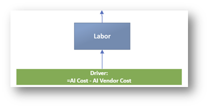

AI Other
Cost

This metric has been created to allow the end user to quickly and easily understand
any Other AI Cost drivers on a monthly and year to date basis, as part of the TCO breakdown
analysis. It simply looks to mimic the main AI Cost model, focusing and starting from the Other Cost
Pools object.

Tag the upwards allocation lines that should be considered part of the AI Other
Cost.

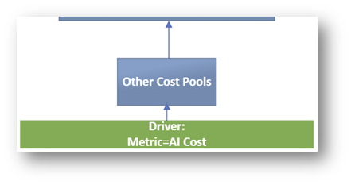

**AI Usage models (5)**

AI Usage

Together with the AI
cost model metric, this AI Usage metric is the most important metric, since it also powers all the
AI TCO & Usage reporting. It is however a more simplified metric, given it originates
immediately at the AI Platform modelled object and therefore traverses less layers. The driver for
this modelled metric comes directly from the Usage Quantity column from the AI Platforms master
dataset. It points to the usage of the AI Platforms and/or AI Models. If the relationship data is in
place, it’s expected to link onwards to Business Services (based on AI Solution = Service Offering)
and it’s expected for the data to get re-used in Service Allocations Direct to potentially highlight
any direct AI Platforms and/or AI Model consumption by the Business Units (based on User ID
belonging to a certain Business Unit).

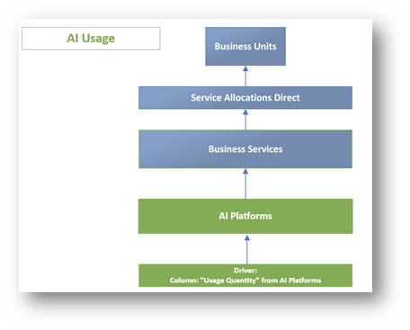

AI Token Consumption

This
metric has been created as a subset of AI Usage, focusing specifically on where the Billing Type =
Token Usage. It is used on the reporting as a Top KPI and for various Token Consumption views. While
we only highlight the driver in the below view, it’s expected to follow the same allocation
logic/lines as the AI Usage model metric.

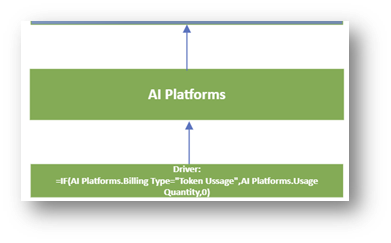

AI Input Tokens

This
metric has been created as a subset of AI Usage and a further subset of AI Token Consumption, since
it specifically focuses on AI Input Tokens. It predominantly is used on the Usage Detail tabs in the
reporting. Note: It has a dependency on the AI Token Normalization table, where different Token
Types look to get normalized into “Input” in this instance. It’s expected to follow the same
allocation logic/lines as the AI Token Consumption model metric.

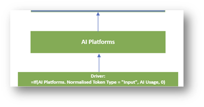

AI Output Tokens

This metric
has been created as a subset of AI Usage and a further subset of AI Token Consumption, since it
specifically focuses on AI Output Tokens. It predominantly is used on the Usage Detail tabs in the
reporting. Note: It has a dependency on the AI Token Normalization table, where different Token
Types look to get normalized into “Output” in this instance. It’s expected to follow the same
allocation logic/lines as the AI Token Consumption model metric.

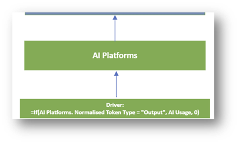

AI Solution Users

This
metric points to a different type of AI Usage, namely AI Adoption. It looks to report on the number
of users that are using/adopting the AI Solutions. It’s a key reporting KPI and instrumental to the
insights shown on the Business Units tab in the reporting. To ensure this metric works at all
levels, including slicing on AI Model related data such as AI Model Type, it gets sourced at 2
levels. First at the AI Platform modelled object (facilitated through a lookup in AI Platforms
master), in a second instance at the Business Services modelled object. The driver for the latter
ensures no double counting takes place by subtracting the former driver, set at the AI Platform
modelled object. Tag the upwards allocation lines to ensure the metric works when slicers from
Business Services or Business Units are being applied.

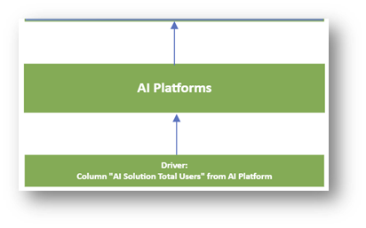

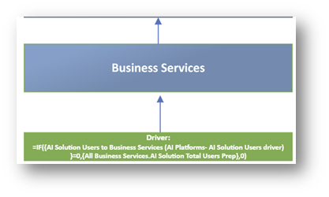

**AI Count models (3)**

AI Vendor Count

This metric
has been created to ensure accurate reporting can happen on the number of distinct Vendors that are
in play as it relates to AI Costs. It is shown as a Top KPI on the reporting. It only picks up
Vendors with an associated AI Cost to ensure not all Vendors are represented. Tag the upwards
allocation lines to ensure the metric works when slicers from Business Services or Business Units
are being applied.

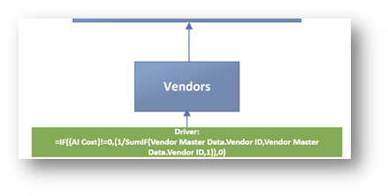

AI
Model Count

This metric has been created to ensure accurate reporting can happen on the
number of distinct AI Models that are in play. It is shown as a Top KPI on the reporting. It is
sourced directly from a formula created in the AI Platforms Master dataset. Tag the upwards
allocation lines to ensure the metric works when slicers from Business Services or Business Units
are being applied.

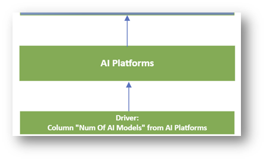

AI
Solution Count

This metric has been created to ensure accurate reporting can happen on the
number of distinct AI Solutions that are in play. It is shown as a Top KPI on the reporting. To
ensure this metric works at all levels, including slicing on AI Model related data such as AI Model
Type, it gets sourced at 2 levels. First at the AI Platform modelled object (facilitated through a
lookup in AI Platforms master), in a second instance at the Business Services modelled object. The
driver for the latter ensures no double counting takes place by subtracting the former driver, set
at the AI Platform modelled object. Tag the upwards allocation lines to ensure the metric works when
slicers from Business Services or Business Units are being applied.

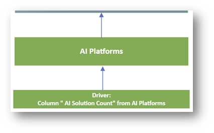

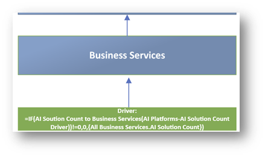

## Reporting

The AI TCO & Usage Reporting component installs the reporting features for AI TCO & Usage
solution. Two reports are installed in a new AI report collection.

The main AI TCO & Usage report enables organizations to monitor the full lifecycle of AI
investments, proactively addressing AI sprawl by tracking Total Cost of Ownership (TCO), usage
trends, breakdowns, and anomalies. The report is designed for C-suite executives, Business &
Solution Leaders, and AI & Data Science teams and features 4 tabs with insights aligned for each
of these target personas:

- *Summary* – C-suite executives
- *AI Models* - AI & Data Science teams
- *AI Solutions* – Solution Leaders (Service Owners)
- *Business Units* – Business Leaders

Additionally, a secondary AI Cost Model report is available, enabling users to dynamically
track AI Cost & Usage allocations through interactive Sankey diagram visualizations.

For visualizations and key benefits delivered with the above reports, click [here](../reports/ai-tco-report-collection.html).

## Call Outs

- The components AI TCO & Usage and AI TCO & Usage Reporting are released with Component
  Template v120. Therefore, the Template Settings must be switched to view and download these two
  components.
- “isAISolution” is a crucial new column, created in the All Business Services table (via the
  upgrade to the respective component). Ensure the value is set to “Yes” for the Service Offerings
  that you identify AI Solutions. This is a pre-requisite to activate the AI TCO & Usage
  Reporting.
- Existing customers must upgrade the "CTF – Cost Source" component, if using the General
  Ledger-based method, and the "CT – App Services" component, as outlined above.
