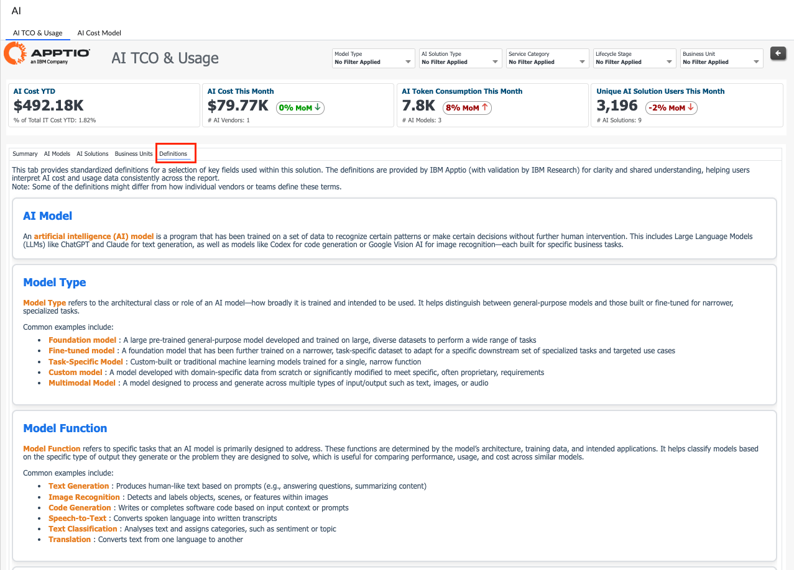
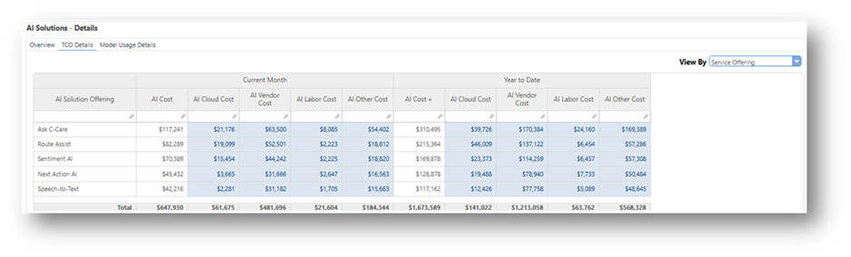
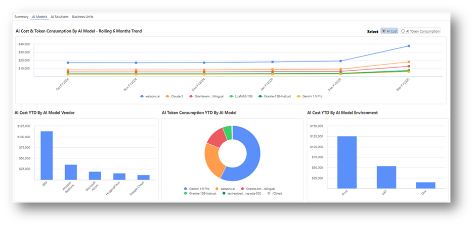
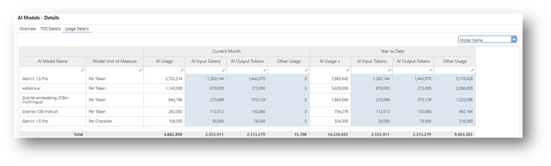

# IBM Apptio AI TCO Solution

Artificial Intelligence (AI) is a key priority for many organizations, with CIOs
increasingly being tasked with leading AI strategies across the organization. As AI spending
accelerates, so does the complexity. CIOs admit that managing costs limits their ability to unlock
the true value from AI. For organizations to adopt, scale, and manage AI initiatives sustainably and
unlock their full value, they need clear visibility into AI costs, usage and adoption.

## Overview

IBM Apptio's AI TCO & Usage solution is a purpose-built solution for tracking the full
lifecycle of your AI investments, providing defensible transparency into ongoing AI costs, usage and
adoption across AI models and AI solutions.Key features include:

- Continuous monitoring of AI TCO trends and anomalies
- Detailed cost drivers and AI usage visibility
- Unit Economics assessment for informed scaling decisions
- Responsible AI consumption and showback across the organization

## AI Cost Transparency & Allocation

Ingest all AI data sources into our purpose-built AI ATUM model, which accounts for various
essential cost and usage metrics, powering a single pane of glass of all AI costs.

Obtain end-to-end visibility into your AI Investments across their full lifecycle; track cost
drivers across cloud, labor and vendor to expose growing cost concerns early.

Answer critical questions such as:

- What is the TCO of all my AI Investments? How much does this represent as a % of Total IT Costs?
- How much are we spending on Pilot, Proof of Concept vs. Production AI Investments?
- What are the Top Cost Consumers across AI models, AI solutions and Business Units?
- What are the Top Cost Drivers across Cloud, Vendor, Labor and other costs?
- What are the unit costs of our AI solutions?

## Track & Evaluate AI Usage

Get ahead of AI Sprawl. Identify opportunities to consolidate or retire AI models or AI Solutions
based on usage - such as token consumption, users, and license numbers - and cost patterns that
expose inefficiencies. Analyze AI usage trends over time to understand AI consumption across your
organization, up to the business unit level.

Answer questions like:

- How is AI being consumed across AI models, AI solutions, and Business Units?
- What is the split of AI Input vs. AI Output tokens across our AI models?
- Are there trends in adoption and usage that could indicate early inefficiencies?

## Enable responsible AI Adoption

Increase business unit awareness via showback of AI costs, usage, and consumption to encourage
sustainable AI investment and adoption decisions.

Answer questions like:

- Which business units are consuming the most AI resources?
- Do we have redundant AI models or AI Solutions that we could retire?
- What AI solutions can we scale across other parts of the organization?

To know more about configuration, see [AI TCO Configuration Guide](../reports/ai-tco-configguide.html)
