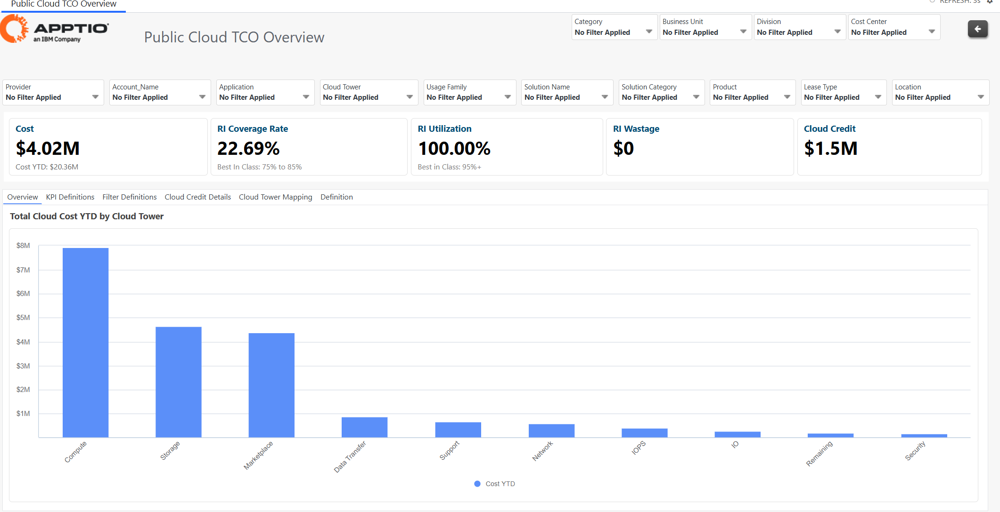
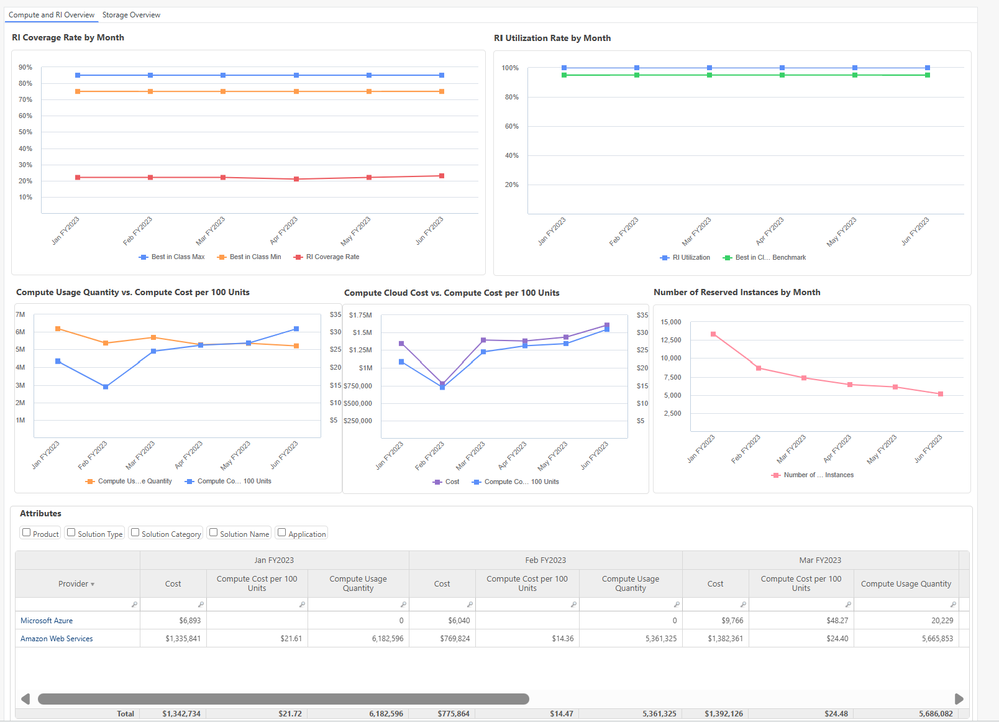
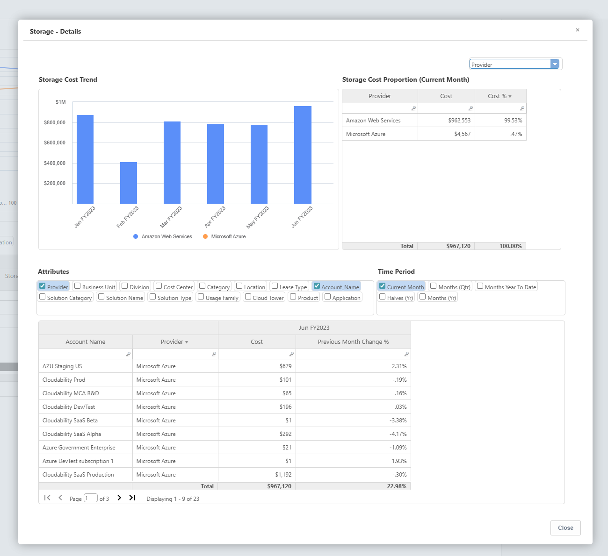

# Public Cloud TCO Reports

IBM Apptio Public Cloud TCO Reports offer Finance team members insights into monthly cloud
spend, cost drivers, and FinOps practices on AWS and Azure.

| Key Element Description |
| --- |
| 1. Financial and Operational Summary of Cloud for Cost YTD including any Credits applicable |
| 2. Additional metadata makes it self-intuitive, aligns taxonomy and makes it easy to comprehend. |
| 3. The cost trending across different Cloud Services (AWS & Microsoft Azure). |
| 4. The cost trends by business attributes such as Provider, Cost Centre, Account Name, etc. |

| Description |
| --- |
| 1. The Report enhances about the services driving the cost direction. |
| 2. The effectiveness of the Cloud Purchase model and how it compares to Best-in-Class benchmarks. |
| 3. The trend of the unit rate in relation to changes in consumption. |
| 4. Detailed breakdown of Costs, consumption and unit rates across Service Providers |

## Drilldown Reports

Drill down further to understand the Business & Technical drivers for each of the reports.

- The factors driving the service cost, including which account is responsible and the
  corresponding amount.
- The business service/application that drove the change.

**Cloud Cost - Details**

**CPU Hours - Details**

**Storage - Details**

