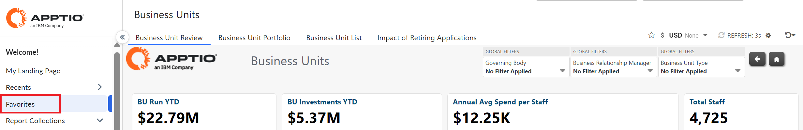
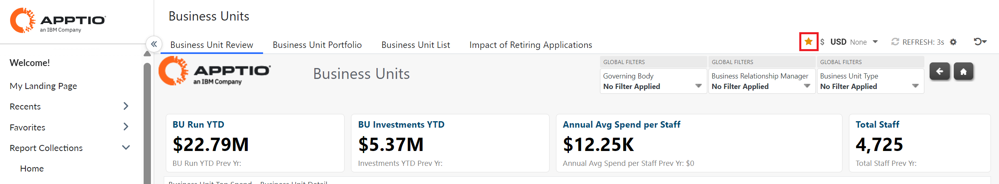
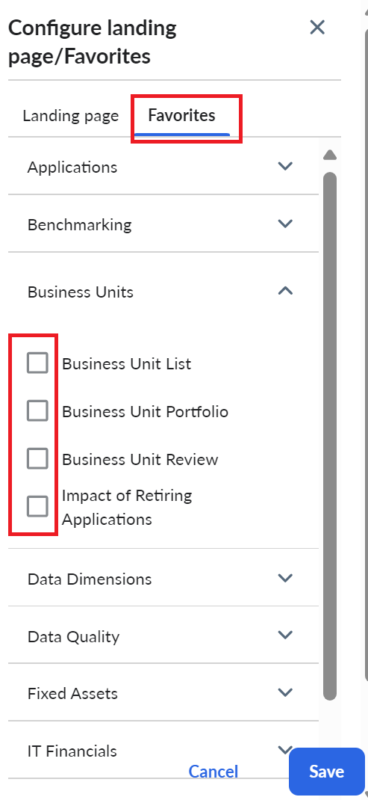
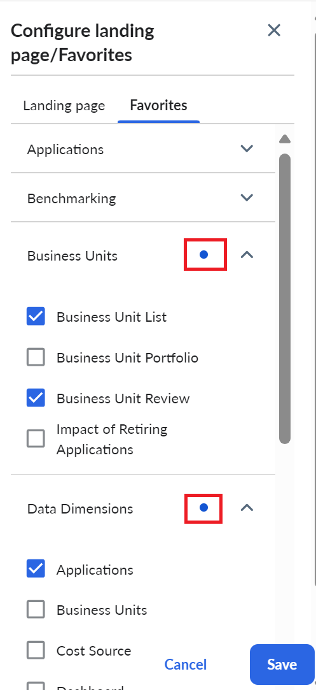
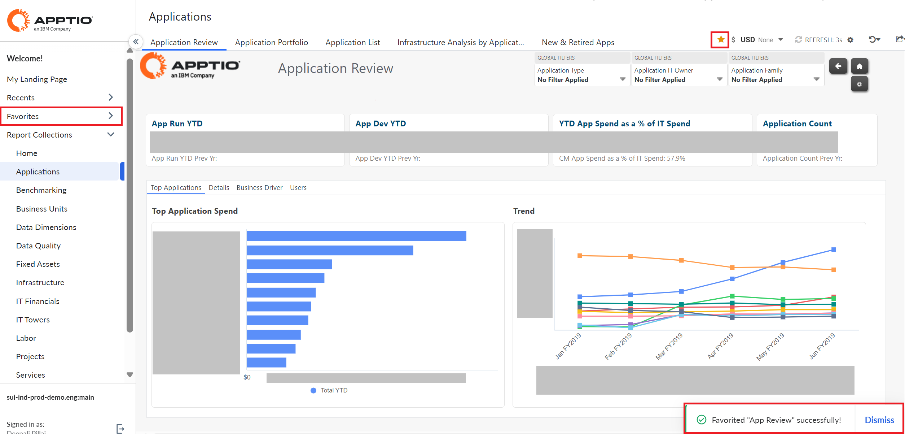
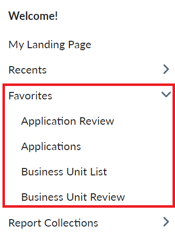
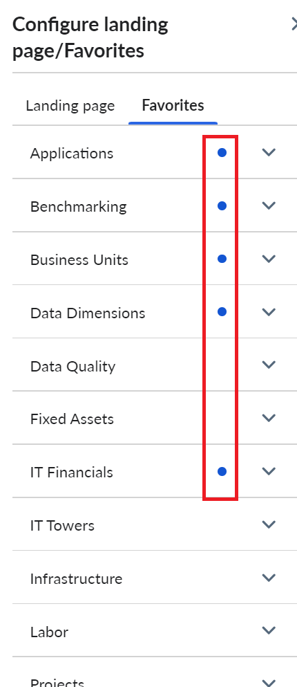

# Favorites

This feature allows you to select one or more reports and mark them as favorite, so that
you can access them easily, without the hassle of searching and navigating for viewing it. The
Favorites option is enabled by default and will appear on the left navigation menu in the
UI.

Applies to: 12.11.5 and later for TBM Studio, Costing Standard, Billing, Hybrid Business Management, Vendor Insights, Costing Essentials and Demand.

At the first login, Favorites will be empty, without any values selected.

## Adding Favorites

You can add favorites in one of the
following ways:

- From the Dashboard, select the icon from the top right corner of any report.
- From Settings, select the Configure landing page/Favorites option and check the reports to be
  marked as favorite.
- On selecting a report as favorite, a blue dot will appear in the corresponding report
  collection.

  Note: The values in the Favorites panel will be sorted alphabetically. If
  Configure Home option is not selected in the Project features, the Landing Page tab will be disabled
  in the Configure landing page/Favorites popup.

On marking a report as favorite, a confirmation message appears at the bottom of the
page.

The
report is added under Favorites in the left navigation menu and the  icon appears
yellow to show that a report is marked 'favorite'.

- You can add up to ten reports as favorites. If the count exceeds ten, an error message "Max
  number of favorites allowed are 10" will appear.
- You can remove a report from favorites by unselecting the checkbox or the icon.
- The favorite icon will not appear for drill reports.
- If an Admin impersonates a user, then the user can see the changes made in Favorites by the
  Admin.
- You can add reports from across different environments including Development, Staging, and
  Production.

Note: The favorites can belong to a single project or across different projects that you have
access to. The favorite reports will be saved across sessions, browsers, and devices, but not in the
browser cache.

## Viewing Favorites

You can view the favorites in the following ways:

- Expand the left navigation menu to see the sorted list of favorites. 
- Navigate to Settings> Configure landing page/Favorites option. This saves the user effort to
  manually expand all report collection. 

Note: : If an admin removes or revokes a report for a user, and if it was stored in the Preference
service data, it will be automatically removed from Favorites after it is first loaded in the CT
view.

**Parent topic:** [Costing and Billing](../costing-billing/home.html)
