# Saved Views

Applies to  : 12.11.9 and later for all products.

This feature allows you to select a set of ad hoc parameters and save them with a specific name,
so that you can reuse the reports with the previously selected parameters easily. The Saved views
option is enabled by default and will appear on the right side of the UI.

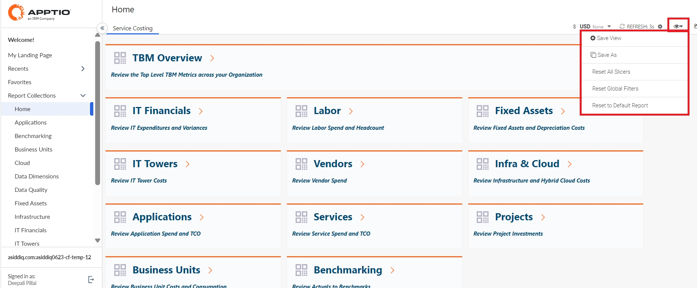

At the first login, Saved views will not have any views selected.

Saving a view

Open any report and customize it with any of the below options:

- Compact Slicer
- Row Slicer
- Column Picker - Value Picker, Metric Picker, Time Picker
- Quick Pivot
- Tabs
- Tables - Search Bar, Column Order

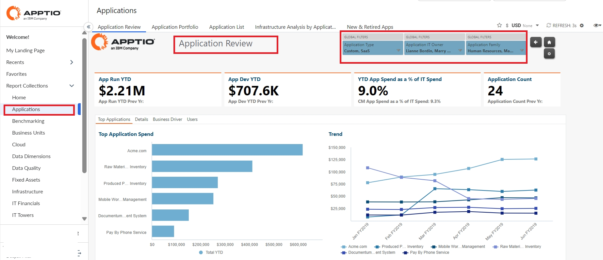

From the top right corner, expand the  View  icon and then choose
 Save View  option. The following popup appears:

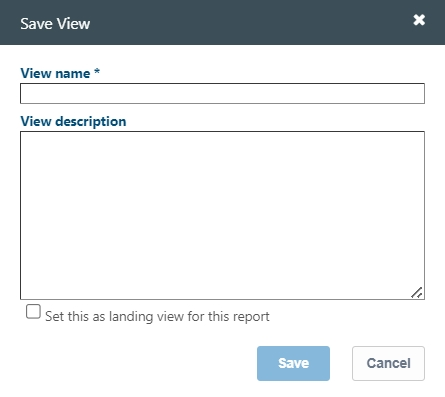

Enter values in  View Name  and  View Description 
fields. To set this as your default landing page, check the  Set this as landing view for
this report  option.

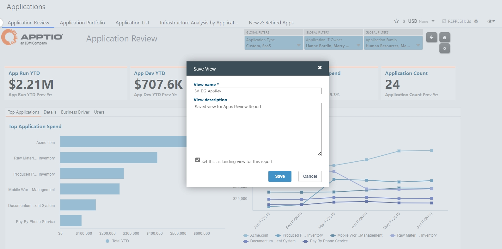

Select  Save  . A confirmation message appears at the bottom of the page
"  *<saved view name> created successfully!*  ".

Expand the  View  icon - the saved view appears at the bottom as shown:

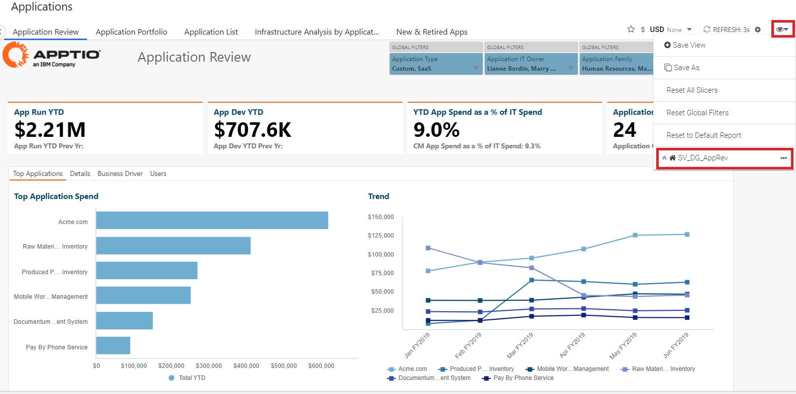

The  icon
indicates that the saved view is set as the default landing page. If you logout and login back to
the reports page at a later time, the saved view will appear as the landing page.

The 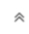 icon
indicates a 'current view'.

The blue dot icon  indicates that we are currently in a view.

Note: You can create only upto 5
views per report.

Edit a view

From the Views menu, select 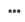 for a saved view and then select  Edit view  .

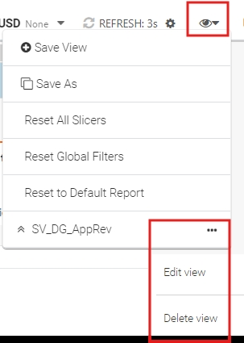

The Edit view popup appears as shown

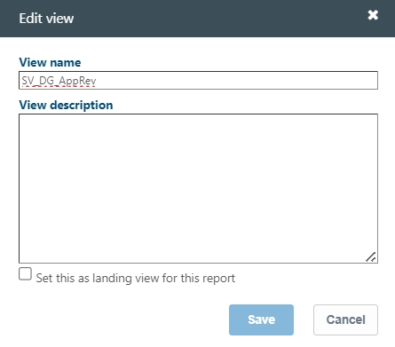

Make the appropriate changes and then select  Save  . A confirmation
message "  *<saved view name> updated successfully!*  " appears.

Note: To mark another saved view as the default landing page, select  Set this as landing
view for this report  checkbox.

Delete a view

From the  Views  menu, select  for a saved view and then
select  Delete View  .

A confirmation message "  *<saved view name> deleted successfully!*  " appears.

Save As

This option is to create a new saved view, based on modifications to an existing one.

Open a saved view, and customize some filters. From  Views  menu, select
the  Save As  option.

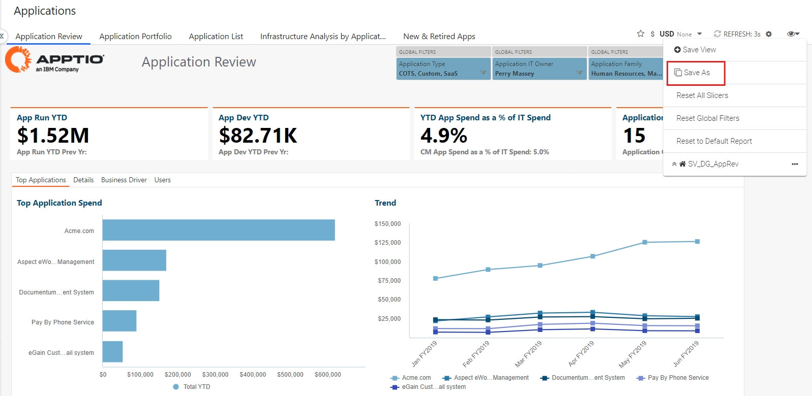

Enter a unique name for the new view and select  Save  .

Note: If you enter an existing name, an error message  *"A view with this name already exists* 
" appears.

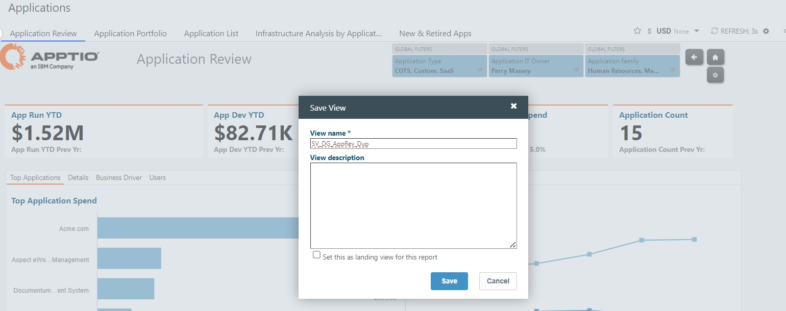

A confirmation message "  *<saved view name> created successfully!*  " appears. The
newly created view appears in the menu as shown.

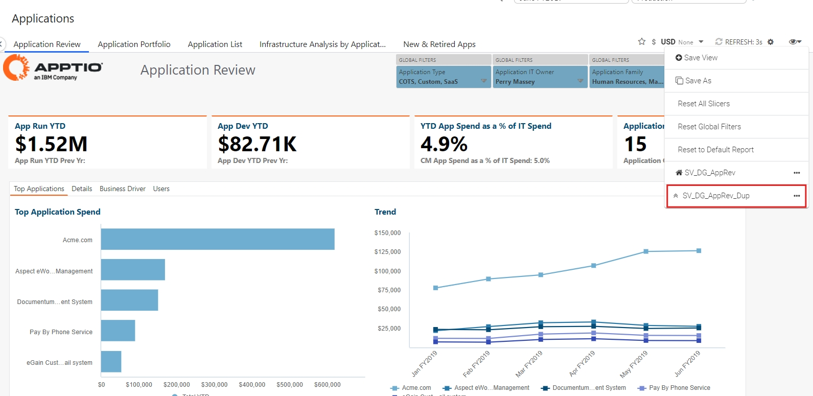

Reset

You can reset using any of the below options:

- Select  Reset All Slicers  to clear all the selected slicers.
- Select  Reset All Global Filters  to clear all the selected global
  filters.
- Select  Reset to Default Report  to clear the current view and replace it
  with the default view.

Note: The following parameters are not considered for the saved views settings - Row Sort,
Charts, Global Filters, Date Range (uses the "Default Time Period" as set in Time Settings),
Environment and Branch.
