# 2024

## Server 12.11.10.1 - December 13, 2024

- Addressed file processing issue for CCM in Gov.
- Improved Calculation Server Stability.

## Technology Emissions Management - December 12, 2024

Today we launched Technology Emissions Management (“TEM”). TEM is designed to help organizations
examine their IT Carbon Estate (Cloud & On-Prem) to meet internal sustainability needs and
support reporting requirements.

Before this release, users couldn't view relevant reports related to sustainability measures
around lowering carbon efforts.

Customers can see monthly and YTD metrics for both kWh and CO2e emissions.

Data is ingested from Cloudability, and Costing (where applicable), to provide a single pane of
glass view of carbon emissions. On-prem and cloud emissions will be shown in dashboards to provide a
full-picture view of ESG/Sustainability efforts and usage supporting multiple personas.

## How this feature can help you

Organizations require a solution that provides a single view and defensible methodology to
consistently measure IT’s carbon emissions across Cloud & On-prem providers. They also need to
track carbon metrics and reduce emissions to meet sustainability goals.

Technology Emissions Management (“TEM”) enables customers to balance cost alongside carbon
emissions for IT across On Premise and Public Cloud infrastructure.

TEM provides the customer with transparency in their IT carbon emissions calculations, as well as
flexibility to improve data areas they can affect.

To know more, contact your Apptio representative.

## Server 12.11.10 - November 22, 2024

Application template: 8160

Note:

In release 12.9 and above, include the following header values on any API calls to the platform
API.

app-type="Flagship"

app-version="NA"

This includes API calls which upload to or download from Costing Standard or other platform
projects. These are in addition to existing API headers you may already be using.

## New Application Features

## Costing Essentials enhancements (v200)

The following two new components have been introduced in this release.

- End User Devices components (GA): A new End User Devices component is available in
  Template v200. It provides insights for IT Asset manager/Desktop Support Manager to make data driven
  decisions around fleet optimization and consolidation to help decide overall fleet size and
  associated costs. It will also assist with the planning and forecasting of estimated refresh costs
  for end of life and non-compliant devices.

  

  

  To know more,
  see [End User Devices](https://help.apptio.com/en-us/apptio-cost-management/getting_started/eud-intro.htm "(Opens in a new tab or window)").
- Cost Pool Benchmark component (BETA): Cost Pool Benchmark provides insights for IT
  Leadership and IT Finance in support of strategic investment decisions regarding the role of IT in
  the business and the current IT operating model and sourcing strategies. Benchmarks can be used to
  understand cost structure of current strategy and to justify or adjust current investment and
  sourcing approaches. Compare IT spend to industry benchmarks (e.g. IT Spend as a % of Revenue).
- 

  

  To know more, see [Cost Pool Benchmarks](https://help.apptio.com/en-us/apptio-cost-management/admin/setup-be.htm "(Opens in a new tab or window)").

## Billing Essentials (BETA, v200)

This feature enables Business Unit Managers, Service Owners, and IT Finance Managers to
communicate the consumption and cost of Billable Services to consumers. This feature automates the
billing process for select IT services, allowing users to chargeback services based on a PxQ
approach, set rates using unit costs, and adjust for over or under forecasted recovery.
Additionally, users can generate and send monthly bill invoices to consumers and store billing and
chargeback records for a clear audit trail, streamlining the billing process and reducing manual
effort

## Labor Workbench for CT Configurations (BETA, v120)

This new feature enables admins and business unit owners to easily map labor resources to IT
Towers using editable tables, and optionally to Applications. To get started, admins can install the
"CTF- Labor Workbench" Component, which includes the Labor Workbench report and editable tables. End
users can then modify labor to IT Towers mapping within Apptio reports and use it in conjunction
with Time Tracking. A configuration guide is available to provide step-by-step setup
instructions.

To know more, see [Costing Standard Workbench](https://help.apptio.com/en-us/cost-transparency/workbench/introduction.htm "(Opens in a new tab or window)").

## Components Panel Enhancements

The following key improvements are made to the Installed section of the Components panel:

- Loading Indicator: A "Loading… Please Wait" message now appears when expanding Component
  Packages, ensuring a better user experience during load times.
- Improved Filtering: Only the latest installed components are displayed, and older
  versions are no longer shown in the Available section.
- Installed Components Hidden: Installed components are now hidden from the Available
  section, reducing clutter and improving usability.
- API Updates: We've added a new API or option to support these changes, enhancing the
  overall component management experience.
- Simplified Non-Content Author Experience: Non-content authors now only see the latest
  versions of each package in the Available section, making it easier for them to find what they
  need.

## Fixed in this release

- Optimized Precision Calc to skip calculation of hidden report components.
- Fixed the issue of 'Model Metrics' displaying twice under component details.
- Fixed the issue of UI becoming unresponsive after upgrade of CTF- Cost Source component.
- Fixed vulnerability issues.

## Client 2.10 - November 22, 2024

Note: Dependency

\*Client v2.10 is compatible with Server 12.11.10 and 12.11.9.x

\*Some Client
v2.10 features are dependent on new Server 12.11.10 features.

## New Client Features

Table Upload feature is now GA

## Email Distribution Enhancements

The Email Subscription feature is now GA, with the following additional enhancements:

- \*Three additional time periods have been added for email links and PDF generation, providing
  greater flexibility in selecting the reporting timeframe.
  - Current Period
  - Previous Period
  - Default Time Period
- The report distribution frequency is now set to ‘Monthly’ by default, ensuring that most data
  and report updates align with the monthly accounting cycle.
- On creating a new subscription, the Report Collection and Report fields are auto populated based
  on the current report. This update reduces the need for manual input and simplifies the subscription
  process.

  

Previously, the reporting period was set to the default time period, and the distribution
frequency was Daily.

To know more, see [Email Subscriptions](https://help.apptio.com/en-us/studio/reports/email-subscription.htm "(Opens in a new tab or window)").

## Saved Views Enhancements

\*The following enhancements have been made in the Saved Views feature.

- The toast message display duration has been increased to 5 seconds to provide users with more
  time to view notifications.
- The feature flag is now enabled by default for all users.
- If a report does not contain any data, the associated feature will be automatically hidden to
  improve user experience.
- Table filters and column sort order are now preserved when saving report views.
- Added a blue indicator near the eye icon to indicate when a report is being viewed.
- Japanese translation support.

  

Previously, Saved Views feature was behind the flag and was not enabled by default. The table
search and column filters were not persisting in the save and it was difficult to know if the user
was on a saved view or a normal view.

To know more, see [Saved Views](https://help.apptio.com/en-us/costing-billing/saved-views.htm "(Opens in a new tab or window)").

## Editable Table

- Auto flow of data for enriched editable tables - This update allows users to
  disable/enable data flow in enriched transform tables, reducing confusion and providing more control
  over data updates. With this change, users can modify source transform tables without automatically
  updating the transform off the enriched editable table, ensuring that cost model numbers are not
  impacted until changes are explicitly published. Additionally, the Score ET Transform will not be
  updated automatically, requiring users to explicitly publish changes to see the underlying table
  changes. To enable this feature, navigate to Project Settings and select the Disable Data
  Flow in enriched Transforms option.

  

  Previously,
  any change in the source table was automatically flowing to the editable table, without the publish
  step. This impacted the numbers in the cost model for customers.

  To know more, see [Disable Date Flow](https://help.apptio.com/en-us/studio/data_studio/create-table-from-et.htm "(Opens in a new tab or window)").
- Recurring schedule option to 'Auto Promote to Production'- A new column 'Auto Promote To
  Production' is added to the Recurring Schedule screen, to enable administrators to have control over
  data management and facilitating more efficient monitoring and management of recurring jobs. The
  'Auto Promote To Production' function promotes both new and updated data from the staging
  environment to the production environment based on the administrator's requirements. To enable this
  column, navigate to Project > Enable Features, and then select Enable Auto-promote to Production
  For Editable Table Recurring Schedules option.

  

  On
  selecting this option, the ‘Auto Promote To Production’ field and the ‘Auto Promote to
  Production’ column appears as shown.

  

  

  To know
  more, see [Recurring Publish](https://help.apptio.com/en-us/studio/admin/recurring-publish-et.htm "(Opens in a new tab or window)").
- New functions to display last and next publish time on the report- Two
  new functions GetNextPublishTime and GetLastPublishTime have been added to display the last publish
  time and next publish time of transform on reporting surface for editable tables. This feature
  allows users to easily view the publishing history and ensure that their changes have been
  successfully propagated to the transform table.

  

  To know
  more, see [Functions](https://help.apptio.com/en-us/studio/formulas-and-functions/functions/functions.htm "(Opens in a new tab or window)").
- Support blank values in possible value list - Editable Tables now
  supports blank values in possible value lists, thereby reducing errors and making the data more
  efficient. This change allows TBMA users to enter blank values in editable tables without receiving
  an error message. When adding a row to an editable table, columns configured with possible values
  will no longer display an error if left blank, providing a more flexible and user-friendly
  experience.

  

## Fixed in this release

- Fixed the Access Denied error when switching between Cloud Reporting & Bill of IT
  reports.
- Re-synced column definitions to resolve error on editable table after upgrade and merge.
- Fixed security vulnerabilities.

## Server 12.11.9.1 - November 7, 2024

- Quarterly Java update.

## Apptio Community Transition to IBM TechXchange - November 1, 2024

Today, Apptio Community has fully transitioned to IBM TechXchange.

Use and bookmark [this new homepage](https://community.ibm.com/community/user/apptio/home "(Opens in a new tab or window)") for the Apptio topic groups.

- Access the topic group that is relevant to your needs; Some of the topic groups with which you
  are familiar have been combined into new topic groups.

The following topic groups are available:

> - [Apptio](https://community.ibm.com/community/user/apptio/communities/community-home?CommunityKey=4100dfb8-fc23-4203-83c7-019253cf7c0b "(Opens in a new tab or window)"): Costing Essentials, Costing Standard (CT-Foundation),
>   Apptio Planning (ITP/ITFMF), Billing (Bill of IT), Benchmarking (IT Benchmarking), ServiceNow
>   Integration
>
>   - [Planning Release Notes](https://community.ibm.com/community/user/apptio/viewdocument/apptio-planning-whats-new-cumula?CommunityKey=4100dfb8-fc23-4203-83c7-019253cf7c0b&tab=librarydocuments "(Opens in a new tab or window)")
>   - [TBM Studio and Applications Release Notes](https://community.ibm.com/community/user/apptio/viewdocument/tbm-studio-and-applications-r12-rel?CommunityKey=44bcb0d2-5ce6-4504-89eb-019253d3b5d8&tab=librarydocuments "(Opens in a new tab or window)")
> - [Cloudability](https://community.ibm.com/community/user/apptio/communities/community-home?CommunityKey=15c0e07d-35c0-49de-a84b-019253d13376 "(Opens in a new tab or window)"): Cloudability Financial Planning, Cloudability
>   TotalCost, Apptio Turbonomic Integration
> - [https://community.ibm.com/community/user/apptio/communities/community-home?CommunityKey=55a3712d-1835-4ec2-bcd7-603e88cd9dd2](https://community.ibm.com/community/user/apptio/communities/community-home?CommunityKey=55a3712d-1835-4ec2-bcd7-603e88cd9dd2 "(Opens in a new tab or window)")[Targetprocess](https://community.ibm.com/community/user/apptio/communities/community-home?CommunityKey=55a3712d-1835-4ec2-bcd7-603e88cd9dd2 "(Opens in a new tab or window)")
> - [Platform](https://community.ibm.com/community/user/apptio/communities/community-home?CommunityKey=44bcb0d2-5ce6-4504-89eb-019253d3b5d8 "(Opens in a new tab or window)"): Apptio BI, ATUM, Automated Data Management,
>   DataLink, Frontdoor, TBM Studio
> - [Apptio for All](https://community.ibm.com/community/user/apptio/communities/community-home?CommunityKey=2e85ed45-9b8a-486c-bd55-019253d466eb "(Opens in a new tab or window)")

- Once you are in your topic group, read and contribute to all the usual content such as quick
  links, discussions, questions, and blogs.
- Check out [these resources](https://community.ibm.com/community/user/participate/resources "(Opens in a new tab or window)") on how to navigate and utilize community.
- Start submitting Requests for Enhancements on [IBM Ideas](https://login.ibm.com/idaas/mtfim/sps/idaas/login?client_id=NWNjMzc5NjEtMzlkYi00&Target=https%3A%2F%2Flogin.ibm.com%2Foidc%2Fendpoint%2Fdefault%2Fauthorize%3FqsId%3Dc75ff073-50e8-4426-8979-7e4b6b992e80%26client_id%3DNWNjMzc5NjEtMzlkYi00 "(Opens in a new tab or window)").

  - IBM uses a unified ideas portal at [ideas.ibm.com](https://ideas.ibm.com/ "(Opens in a new tab or window)") for you to raise ideas against all products. As of today, that
    list has expanded to include the products recently acquired from Apptio. Ideas submitted prior to
    the acquisition will be made available to product teams and may be added to the portal at a future
    date to ensure continuity.

Contact the community team at our new email, [support@communitysite.ibm.com](mailto:support@communitysite.ibm.com "(Opens in a new tab or window)") with any questions or needs.

## Server 12.11.9 - October 11, 2024

Application template: v120-8111

## New Application Features

## IBM Apptio Costing Standard + IBM Turbonomic Integration EA

Today, we launched the first native integration between IBM Turbonomic and IBM Apptio, available
via Early Access, with release 8.13.6 and release R12.11.9 respectively.

End users of IBM Apptio Costing, including IT Finance, Service and Application Owners, now are
able to expand their Hybrid IT costing perspective to include aggregated optimization views of their
Hybrid IT. Through a prescriptive integration, IBM Turbonomic’s optimization opportunities (Pending
and Executed Actions) are sent into Apptio, where the recommendations are quantified, visualized and
aligned to the TBM Solutions framework.

- Prescriptive integration between Turbonomic and Apptio, powered by new
  components: A new IBM Apptio Target Type is available in Turbonomic facilitating the
  prescriptive integration, by pushing - granular On Prem and aggregated Cloud - Pending &
  Executed actions into Apptio.

  

  *Turbonomic’s new Apptio Target Type*

  Three new TBM Studio
  Content Components (v120 template) are available in IBM Apptio created to standardize, quantify and
  provide reporting on the Hybrid IT optimization opportunities.

  

  *Apptio’s new
  content components*
  - IBM Turbonomic – Actions: Enables the integration of IBM Turbonomic’s
    Action data into Apptio. Installs various datasets that automate the ingestion and normalization of
    the Pending and Executed Action data, across both On Prem and Cloud.
  - Hybrid IT Optimization: Creates a new, parallel Hybrid IT model
    framework. Installs various master data sets, models and metrics facilitating the quantification
    & allocation of the Hybrid IT optimization opportunities.
  - Hybrid IT Optimization - Reporting: Empowers end users with 2 new Hybrid
    IT Optimization reports. A provider view report, targeted for IT Finance and Technical Service
    Owners and a consumer view report for Application Owners.

  With these components, your Optimization Insights from Turbonomic can be seamlessly
  imported to Apptio, quantified and visualized to empower your IT Finance, Service and Application
  owners with actionable insights directly in Apptio.

  For more information, see the [configuration](https://help.apptio.com/en-us/cost-transparency/technology-integration/configuations.htm "(Opens in a new tab or window)") guide.
- Hybrid IT Optimization visibility with quantified Potential and Realized
  Savings: Leveraging the Apptio cost model, the integration facilitates the ingestion,
  modelling and quantification of potential and realized savings of the optimization opportunities.
  The optimization insights are presented through the TBM framework, allowing users such as
  Application Owners to assess the recommendations in the context of their own portfolios, ensuring
  savings are easily tied to the organization's reporting structure and key dimensions. The Cost
  Optimization Index (COIN) is used to drive accountability to ensure workloads are being
  optimized.

  Users can see the savings achieved in terms of the direct savings, delayed savings, and
  costs avoidance. Via the link back to IBM Turbonomic, stakeholders can further collaborate to drive
  continuous financial & operational excellence.

  For more information, see the [configuration](https://help.apptio.com/en-us/cost-transparency/technology-integration/configuations.htm "(Opens in a new tab or window)") guide.

  

  *Apptio’s
  new Hybrid IT Optimization reporting, incl. Provider and Consumer views*

## New Server Features

## Japanese Translation for Costing Essentials

Japanese translations for the
Costing Essentials enhancements is now GA. This update benefits end users in the Japanese market by
allowing them to interact with the application in their native language, thereby improving the user
experience for Japanese-speaking customers. Users will now be able to view report labels and column
headers in Japanese, enhancing accessibility and usability. Go to the User settings, select your
User Account and set your Preferred Language to Japanese, along with the Preferred Locale to
ja-JP.

## Troubleshooting Workflow for Unused Allocations

A new troubleshooting workflow is introduced on unused allocations. This feature enhances user
experience by providing guided steps to resolve issues identified through Configuration
Recommendations, resulting in faster calculation times and improved performance. Administrators can
navigate through each step of the workflow, review supporting documents, and automate necessary
configuration changes. The system also allows for automatic check-ins of changes, marking issues as
resolved.

For more information, see [Unused Allocations](https://help.apptio.com/en-us/studio/troubleshooting/studio-troubleshooting-all-rows-recommendation.htm "(Opens in a new tab or window)").

## Calc explorer - show all queries

A new dialog has been added to Calc Explorer, displaying all queries within a build in a table
format. This table is both searchable and sortable, allowing users to easily locate specific
entities. Additionally, users can now view a list of calculated time periods directly from this
interface.

## Fixed in this release

- Fixed the issue of random occurrence of blank source and destination in the allocation
  step.
- Implemented public configuration for Positive/Negative Allocations.
- Table Info optimizations.
- Fixed vulnerability issues.

## Client 2.9 - October 11, 2024

## Dependency

Client v2.9 is compatible with Server 12.11.9 and 12.11.8.x

## New Client Features

## Enhanced Email Distribution feature (BETA)

The email subscription feature is enhanced to allow users to customize, share and utilize reports
effectively. Users can now name the report distribution, set delivery schedules (e.g., monthly or
weekly), and customize email content, including the sender, subject, and message. They can also
include a PDF attachment featuring a "print layout" view of the report.

PDF Option for Simple Reports - Users can now create simple PDF reports for email
subscriptions, providing a clean print view without the complexities of interactive elements. This
feature is designed for administrators looking to enhance end user engagement. This report is
limited to key performance indicators (KPIs), graphs, and tables, but does not support row-level
security.

For more information, see [Email Subscriptions](https://help.apptio.com/en-us/studio/reports/email-subscription.htm "(Opens in a new tab or window)").

## Enhanced Navigation - Saved Views (BETA)

The Saved View feature has been introduced to enhance your reporting experience by allowing you
to select and save interactive settings for future use. It also enables you to open reports directly
to your preferred view and switch between different views with fewer clicks. This feature is
currently behind the flag and not enabled by default. To get started, enable this beta feature via
TBM Studio > Project > Enable Features and select Report Saved View. You can create a saved view by
opening a report, adjusting Slicers, Column Pickers, Metric Pickers, Date Pickers, Group By options,
and other filters. Click the View icon (the "eye" icon) in the top right navigation bar, then choose
"Save" or "Save As" to name your view. Additionally, you can modify the properties of a saved view
by clicking the View icon and selecting the three dots, allowing you to rename, set as default, or
delete the view. This feature is designed to streamline your access to insights and improve your
overall reporting efficiency.

For more information, see [Saved Views](https://help.apptio.com/en-us/costing-billing/saved-views.htm "(Opens in a new tab or window)").

## Editable Tables

- Removed User Preference logging from Check In History - The SaveUserPreference entries
  will now be removed from the Change History UI and will only be accessible to Apptio admin.

  

  Previously,
  all changes to end user preference settings - recent report history, favorite reports, and landing
  pages, were logged in the Admin.db change history, thereby mixing admin and end user
  modifications.
- Trim leading/trailing spaces when creating a new column - To ensure consistency and
  prevent mismatches in data operations, the leading and trailing spaces in new column names will now
  be automatically trimmed on saving.

  

  Previously,
  when an administrator added a column with a trailing space, the actions like scripting and data
  validation would not match with the column name since the other operations trimmed trailing
  spaces.
- Row duplication now copies all fields in the backing table - Text BoxThe row duplication
  in editable tables has been updated in this release. If you duplicate a row in a report editable
  table, all fields from the original row will now be copied into the backing editable table by
  default, even if they aren’t listed in the "Included Columns." Fields will only be left out if you
  manually remove or change them during duplication.

  

  

  

  Previously,
  when duplicating a row in a report editable table, only the fields listed in the "Included Columns"
  were copied to the backing table, while other fields were left blank.
- Added advanced options for Button/Script lookups to another table - Administrators can
  now set up advanced button automations for editable tables. This feature allows buttons to run
  scripts based on values from another editable table, streamlining data changes and improving the
  user experience.

  The script searches for rows in the primary table that match the "Original" value
  from the lookup table, replaces it with the "New" value, and updates the Comment. A second script
  clears the values in the lookup table.

## Fixed in this release

- Disabled the save button in editable tables when an error exists.
- Fixed issue where users with multiple roles were unable to edit the editable table report
  component.
- Resolved issue where editable table data had multiple rows for a single primary key.
- Fixed the issue of uploaded file rows retain the same order as they were uploaded.
- Fixed the date format inconsistency during file downloads from editable tables.
- Changed the formula for User Type column in Logins table to accommodate IBM domain login.
- Fixed issue with numeric primary key in enriched tables.
- Performance improvements to ApptioScript bulk updates.

## Server 12.11.8 - August 23, 2024

Application template: v120-8038

Note:

In release 12.9 and above, include the following header values on any API calls to the platform
API.

app-type="Flagship"

app-version="NA"

This includes API calls which upload to or download from Costing Standard or other platform
projects. These are in addition to existing API headers you may already be using.

## New Application Features

No new application features.

## New Server Features

## Calc Explorer: Use Compact notation for displayed metrics

The metrics used for compact notation in Calc Explorer has been enhanced for improved
readability. Metrics such as Calculation Effort, Number of Rows, and Number of Columns will now be
displayed in a simplified format (e.g., 9.74T instead of 9,740,000,000,000). This change makes it
easier to quickly understand large numbers immediately.

## Fixed in this release

- Added a feature to encrypt sensitive data in browser storage by default for government users,
  with an option to disable encryption if preferred.
- Fixed the issue of error message for values that do not follow the possible value configuration
  upload.
- Fixed vulnerability issues

## Client 2.8 - August 23, 2024

## Dependency

Client v2.8 is compatible with Server 12.11.8 and 12.11.7.x

## New Client Features

ApptioCosting Essentials Now Available in Japanese

The Costing Essentials (ACE) application is now fully localized in Japanese, enhancing usability
for Japanese-speaking users. All strings used in ACE have been translated into Japanese and
integrated into our system. The content has been resized and re-aligned content within the
application to improve the overall fit and finish. These changes ensure a more polished and visually
appealing user experience.

## Cleaned up Enable Features options

The Enable Features drop down been updated to show only the features that are behind the
flag.

## Trailing Twelve Month time aggregation

The process for calculating a trailing twelve-month (TTM) aggregation has been simplified in this
release. Admins can now easily sum the previous 12 months of data, with the option to include the
trailing 13 months for a 13-period fiscal calendar. If fewer periods are available, the system will
automatically annualize the amount. This enhancement is particularly useful for viewing a running
12-month total, providing a more flexible alternative to the traditional fiscal calendar
perspective.

## Editable Tables

- Show deleted rows in Change History: The users can view the rows in Editable Tables that
  are no longer active (e.g., "deleted") and identify who deleted them. Since Editable Tables are
  based on a bitemporal database, the rows marked for deletion are not physically removed but are
  marked as invalid from the date of deletion and are no longer displayed. To view deleted rows,
  right-click on the editable table and select Show Changes for Row or Show Changes. A
  new column, "Valid Till," is added to the row history, to identify that any rows with dates before
  "December 31, 9999," have been deleted.

  

  Previously,
  the users could not identify when and who deleted the rows in the editable table.

  For more
  information, see [Show Changes](https://help.apptio.com/en-us/studio/reports/edit-row-properties.htm#Showchanges "(Opens in a new tab or window)").
- Possible Values Data Validation: The data validation process for table uploads as been
  enhanced by including an analysis of Possible Values, improving both data quality and accuracy. The
  validation process will check Possible Values and the errors are highlighted in red, and moved to
  the top of the table for easy correction. However, the upload process will continue without
  interruption, even if errors are found.

  

  

  

  Previously,
  validation checks during an editable table upload only applied to the Validation step, excluding
  Possible Values.
- Recurring Publish enhancements: In TBM Studio, the option to enable the new Recurring
  Publish feature has been moved from "Enable Features" to "Project Settings." Admins can now enable
  this feature for individual projects. If you are migrating from version 12.11.7 to 12.11.8, you must
  manually activate this feature from the Project Settings screen, as it will not be enabled by
  default. There will be no loss of configuration; schedules and transformations will remain intact
  and visible upon enabling.

  

  Added two new columns to the Recurring Schedule screen: "Run Now" and
  "Description." The "Run Now" feature allows Admins to run schedules instantly rather than waiting
  for the scheduled time. The "Description" column lets you add meaningful descriptions for each
  schedule. A Confirmation message appears in bottom right corner as “Updated Transform. Successfully
  ran the schedule- "Nightly to First Period CY"

  

  

  Added
  three more options to the "Publish To Period" feature - "First Period of the Current Fiscal Year,"
  "First Period of the Next Fiscal Year," and "First Period of the Project."

  

  For more
  information, see [Recurring publish of transform table](https://help.apptio.com/en-us/studio/admin/recurring-publish-et.htm "(Opens in a new tab or window)").

## Fixed in this release

- Fixed the issue of duplicate email subscriptions and allowed users to input a valid email
  address from one of the supported domains.
- Fixed an issue with Slicers where selecting multiple sub-values caused the filter dropdown to
  not load again.
- Fixed the issue of Time Dimensions not being added to Global Slicers.
- Fixed an issue with the report table append upload.
- Discontinued the Append Table Upload fail message due to mismatched columns; non-matching
  columns are now ignored.
- Defaulted linesPerRow to 1 for Enriched ET pk source column to improve readability and
  focus.
- Fixed the Empty "My Landing Page" notification being carried over to TBM studio.
- Fixed vulnerability issues

## Server 12.11.7.1 - August 2, 2024

- Quarterly Java update.
- Fixed an issue with the map column feature that required another authorized region for the
  GovCloud environment.

## Server 12.11.7 - July 5, 2024

Application template: v120-8008

Note:

In release 12.9 and above, include the following header values on any API calls to the platform
API.

app-type="Flagship"

app-version="NA"

This includes API calls which upload to or download from Costing Standard or other platform
projects. These are in addition to existing API headers you may already be using.

## New Application Features

## Component name displays 3 lines of text

The Components feature has been upgraded to display three lines of text, ensuring that the full
names of components are visible. This enhancement offers several benefits: Facilitates the ability
to utilize existing components as part of the Costing Standard solution. Simplifies the transition
to future report content in the New Report Designer. Allows to differentiate between components with
longer names, such as Cost Consumers, Cost Consumers – Reporting, and Cost Consumers –
Workbench.

Previously, the component names appeared in two lines and were creating confusion with longer
names.

## New Server Features

## Perspective detail information visible

The information displayed in the Perspectives section of the Project Explorer panel has been
enhanced. Open the Perspectives section within the Project Explorer panel, select the desired
perspective and view the source table and column information.

Previously, details on perspectives based on text, numeric, or modeled value types were
unavailable, except for formulas.

## Enhanced confirmation to close a branch

The process for closing branches has an additional step to reduce the risk of unintended
deletions and provide a safer experience. Navigate to Project tab > Manage Branches
and click the ‘X’ icon to close a branch. A confirmation popup appears asking users to enter the
word ‘delete’ and then click OK.

Previously, closing a branch only required users to click OK, which led to accidental permanent
deletions by some customers.

## Precision Calc enhancements

The following optimizations have been implemented to optimize reporting processes, provide faster
generation times, and improve responsiveness within our platform.

- Time-aware Optimizations: Time periods are calculated only when data has been updated or
  is impacted. This targeted approach reduces unnecessary computations, enhancing report generation
  speed and efficiency.
- Report Optimizations: The need for calculations related to non-material changes such as
  color palette adjustments has been eliminated. This streamlining ensures that computational
  resources are focused on essential report elements, further improving overall performance.

## Fixed in this release

- Raised CPU resource request and removed limits from deployment.
- Fixed the issue of EditableTableConfigDTO not calling super in copyFromPojo and copyToPojo
  methods.
- Fixed data refreshing issues.
- Renamed the copyEditableTable function to CopyToEditableTable.

## Client 2.7 - July 5, 2024

## Dependency

Client v2.7 is compatible with Server 12.11.7 and 12.11.6.x

## New Client Features

## IBM Apptio Costing Essentials is GA

IBM ApptioCosting Essentials has launched Template v200, which is designed to streamline and
simplify costing solutions for our users. It is a prescriptive costing solution authored in R12,
tailored for smaller and less complex customers. It is implemented through CS Delivery for initial
configuration and TAS for ongoing support. It utilizes standard components to facilitate ease of use
and consistency across implementations.

Admins can create new projects using the Project Type “Costing Essentials”. These projects
consist of components authored directly in R12. It is an upgradeable framework that supports future
components, extending functionality to Costing Standard. It utilizes editable tables for data entry
and maintenance, including mappings that drive pre-defined allocation methods.

## Email Subscriptions for standard reports

This feature streamlines the process of managing and distributing Studio reports via scheduled
email notifications, offering greater flexibility and control for administrators.

Administrators can sign up for email subscription of Studio reports directly from the
application's "View" mode (excluding TBM Studio). Navigate to Export icon and select Email
Subscription. Enter the mandatory values and then select Subscribe. The Manage Subscriptions option
allows viewing of the complete list of email report subscriptions, accessible from both a "report"
view and a "recipient" view.

## Enhanced Navigation

- User Impersonation: Administrators can impersonate users to enhance administrative
  capabilities, enabling seamless customization of navigation settings to align with user preferences
  and roles within the platform. It also allows pre-configuration of landing pages and favorite
  reports for the key stakeholders. To impersonate a user, select the User icon >
  Impersonate, and then enter the username of the account to impersonate. In View mode, select
  the gear icon, and then select Configure landing page/favorites. Customize the landing page, select
  favorite reports and then Save the settings to apply them for the impersonated user.

  
- Deleting Reports: These enhancements ensure a smoother user experience by effectively
  managing and communicating changes to navigation settings, maintaining clarity and usability within
  the platform.

  When a favorite report or landing page is deleted or its permissions are changed by
  the Administrator, the users will be notified about it. If the user attempts to open a deleted or
  inaccessible report, an error message will appear. Similarly, the impacted report will be
  automatically removed from the Landing Page settings or from the list of favorites.
- Enhanced Report Name Display: In this release, we have improved how report names are
  displayed. This update provides clarity and accuracy in report identification, minimizes user
  confusion, and eliminates duplicates during selection. When users enter text in the Search texbox,
  and if duplicate alias names exist across report collections, the entire report name will be
  displayed with the alias in parentheses. For example, instead of multiple reports simply showing as
  "Summary", they will now appear as distinct entries such as "Infrastructure – Server
  (Summary)".

  

  Previously, duplicate alias report names would cause confusion when
  searching and selecting reports.

## Editable Tables

- ApptioScript - DuplicateRow event type: Administrators can now define specific column
  behaviors in Editable Tables, using the ApptioScript. This feature also enhances data integrity,
  promoting efficiency and reducing errors in data management.
  - Add Row: Allows all columns to be editable, facilitating initial data input.
  - Duplicate Row: Enables administrators to lock down mapped columns, ensuring data
    integrity and preventing unintended modifications.

  For example, during Add Row actions, administrators may require all columns to be editable
  for comprehensive data input. But the Duplicate Row actions may restrict edits to mapped columns to
  maintain consistency and accuracy.
- Enhanced Publish Scheduler: The Editable Tables Publish Scheduler allows Administrators
  to create multiple schedules and centrally manage transform tables. It provides the ability to
  support different editable table use cases, data publishing needs, and is simpler to maintain and
  change “publish to” dates. To enable this feature, select Enable Recurring Publish for Transform
  Tables checkbox from Project > Enable Features tab. A new option Recurring
  Publish appears on the Build tab.

  

  

  

  

  Select Recurring Publish option to see the Recurring Publish page.
  It has two main tabs:

  - Transform Table: Provides a comprehensive view of all transform tables sourced from
    editable tables. It includes details such as the underlying editable table name and associated
    schedule information.
  - Recurring Schedule: Enables creation and modification of multiple schedules. Users can
    specify frequency, publish to periods, and other relevant parameters.

  Enabling this feature may require specific steps to migrate existing configurations
  seamlessly. To know more, see [Recurring Publish](https://help.apptio.com/en-us/studio/admin/recurring-publish-et.htm "(Opens in a new tab or window)").

## Fixed in this release

- Fixed the issue with Errors page not reloading when changing the selected Environment from the
  drop-down.
- Reduced the time to upload large files into a raw editable tables.
- Fixed the issue of slicer width changing automatically.
- Fixed the issue of unconfigured "My Landing Page" not opening in the right side panel in Non-CT
  App.
- Fixed the issue of configured "My Landing Page" shifting to parent collection.
- Fixed the issue of Perspectives Detail information visibility.
- Addressed various vulnerability issues to bolster system security and ensure compliance.

## Server 12.11.6 - May 24, 2024

Application template: v110-7985

Note:

n release 12.9 and above, include the following header values on any API calls to the platform
API.

app-type="Flagship"

app-version="NA"

This includes API calls which upload to or download from Costing Standard or other platform
projects. These are in addition to existing API headers you may already be using.

## New Application Features

No new application content features.

## New Server Features

## Published Tables (GA)

Published Tables are used to export data from one ApptioOne project to other ApptioOne project,
or to a 3rd party system. Some of the advantages are:

- Eliminates managing reports and associated permissions while exporting tables.
- Supports creating tables in the same way as a report.
- Supports export as soon as the dev calc finishes.
- Creates a more accessible, discoverable, and maintainable way to export modelled data.
- Removes dependency on the TBM Studio reporting surface, from non-Studio clients to export
  data.

​

Prior to this feature, users had to create a report to export data. The major concern was to lock
the report so that end users could not access it. Some export tables were quite large, which in turn
added load on the system. This slowed down the staging calc process, due to which the table
availability was delayed.

To know more, see [Publish Tables for Export](data%20studio/published-tables.htm "(Opens in a new tab or window)").

## Validation Step in Pipeline marked as GA

In this release, the validation step in data pipeline is available by default. The Administration
can opt out by unchecking Enable Validation Step in Pipeline (Beta) option.
This option will be removed from Enable Features in the next release.

## Fixed in this release

- Addressed various vulnerability issues to bolster system security and ensure compliance.
- Fixed the issue of Automatic ALL\_ROWS not working with Slicers.
- Fixed the issue of auto-queuing in precision calculation.
- Eval() function has been removed from template v109.

## Client 2.6 - May 24, 2024

## Dependency

Client v2.6 is compatible with Server 12.11.6 and 12.11.5.x

## New Client Features

## Enhanced Navigation (GA)

The Report navigation has been modernized to simplify the user experience by introducing the
following new features. These features are enabled by default in TBM Studio >
Project > Enable Features: Report Search by Name,
Configure Recent, Configure Home, Configure Favorites.

- Favorites: You can select one or more reports and mark them as favorite,
  so that you can access them easily, without the hassle of searching or navigating to it. To mark a
  report as favorite, you can select the favorite icon or use the Configure
  Favorites option from the Settings menu.

  

  
- Recents: The Recent option will appear in the left navigation menu of the
  production environments, and will display the list of recently accessed reports. It will show a
  maximum of five reports with the most recently accessed report at the top.

  
- Report Search: A search icon is added to the UI to search for a report
  and access it easily.

  
- My Landing Page: You can start at and quickly return to your preferred
  landing page.

  

  

  

[Enhanced
Navigation](../costing-billing/home.htm "(Opens in a new tab or window)").

## Send ad hoc email enhancements

On sharing a report to someone through email, the report URL, the comments provided by the user
will be in *Italics*, and the report link in the email will never expire. Additionally, if you
open the report link in the email, you will see the report in the same context, i.e., any filters,
slicers, pickers, and date-range applied will persist and the report will appear exactly as shared
by the sender.

Previously, it was difficult to identify the sender's comments and the report URL used to timeout
after a while. On clicking the URL, the Date/Range did not persist and hence the receiver could not
see the report in the same context as the sender.

[Print and export
reports](reports/printexportreports.htm "(Opens in a new tab or window)")

## Editable Tables

- Editable Table - Delete All Rows enhancements: On selecting the Delete
  All Rows button, a confirmation popup appears. The user must enter ‘delete’ to proceed further. The
  OK button will remain disabled unless the user enters ‘delete’. Previously, the user could delete
  all rows without seeing any warning/confirmation message. This resulted in accidental deletion and
  thereby loss of data.

  

  Additionally, if all cells in the filtered set of viewable rows are locked, then
  Add Row, Delete Row, Duplicate
  Row buttons will remain disabled, but the Delete All Rows button
  will still be enabled. Previously, the Delete All Rows button also was also disabled and it was
  difficult to plan to next month's operational process.

  
- Editable Table - CopyTable function support for Editable Tables:
  Administrators can now configure scripts to copy on values in a raw editable table. This will help
  with easy data uploads for recurring updates and ensure that correct table is uploaded. The Admin
  must create a report with a button, automation script, and include an HTML text with instructions.
  The syntax should be: CopyToEditableTable(source project, source table, destination project,
  destination table, mode = “overwrite”|”append” (required), autocheckin=”true”|”false”). Once this is
  complete, the end user can simply open the report and click on button to execute table
  copy.

  

  
- Editable Table - Checkbox selection advance capabilities: The checkbox
  has now been integrated into the ApptioScript so that bulk changes can be automated. The
  Administrator must create button specific scripts to automate common tasks and Enable the
  Check Box in the Advanced tab of Properties. After the script is created, the end user
  can use the checkbox to select the rows to apply the changes, and then select the button to execute
  the script.

  

  

  Previously, the user did not have the option to select only a few rows to act on it. They
  had to manually select each row and perform the required action.

## Rename KPI Labels in reports (Beta)

Users can create KPIs with metrics and then rename them with the desired label. To rename a KPI,
enable Allow Renaming KPIs option from Project >
Enable Features. Then, add a KPI report component to a report, drag the
metrics into the KPI configuration panel, <right-click> on the metric and select
Rename. Enter a new name for the KPI and then save it. It is not possible to
rename the perspective name used in a KPI.

Previously, a dimension or perspective had to be created to rename a specific string in the
KPI.

## Fixed in this release

- Fixed the issue of closed months jumping to previous years.
- Currency in reports cannot be reverted after changing locale.
- Fixed the issue of Overlay Charts not getting exported when Y axis is hidden.

## Server 12.11.5.2 - May 3, 2024

- Fixed an issue with a specific zip file version after being upgraded to r12.11.4.
- Quarterly Java vulnerability updates.

## Server 12.11.5.1 - April 19, 2024

Fixed a server-side issue where Billing distribution emails were not being sent out if a custom
logo was used due to an invalid host name for logos.apptio.com. As a result, no emails were sent.
Fix: added logos.apptio.com to the list of valid host names.

## Server 12.11.5 - April 12, 2024

Application template: v120-7974

Note:

n release 12.9 and above, include the following header values on any API calls to the platform
API.

app-type="Flagship"

app-version="NA"

This includes API calls which upload to or download from Costing Standard or other platform
projects. These are in addition to existing API headers you may already be using.

## New Application Features

No new application content features.

## New Server Features

## Published Tables (BETA)

- Grouping: The published tables can be organized in groups to help with
  better organization and maintenance. While creating a new published table, specify the name and
  category. The new published table will be listed under the Category in Project Explorer

  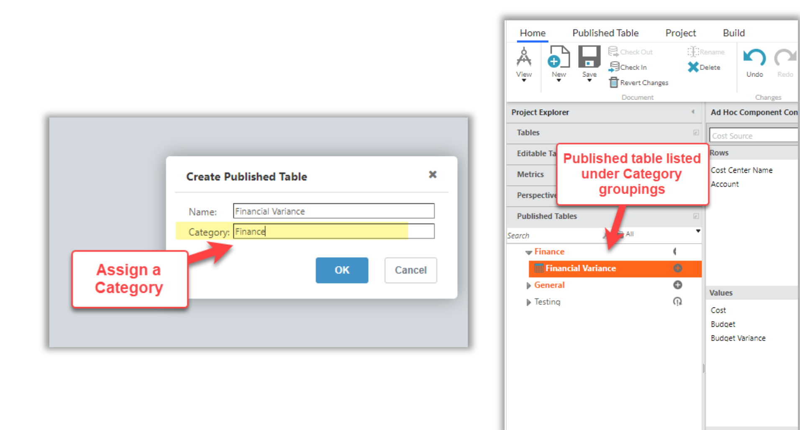
- Enable/disable calc warning: To improve the calc performance and the
  response time of API calls, a new checkbox named ‘Active’ is added to the published table. To enable
  or disable pre-calculation, open a Published Table > select the Published
  Table tab and then select or deselect the Active check
  box

  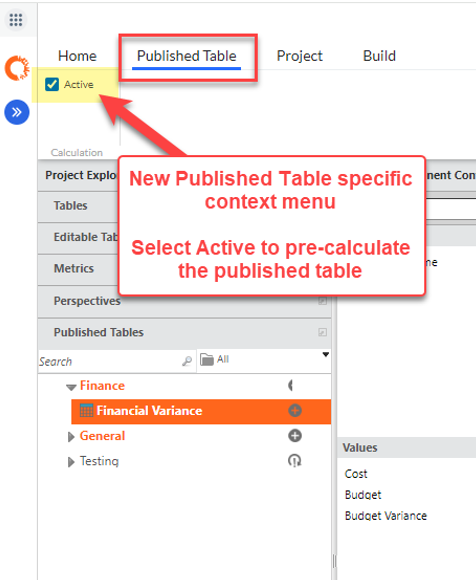
- Rename column: The users can rename the column name of a Published Table,
  and the original dimension name will be displayed in the Ad Hoc Component Configuration
  panel.

  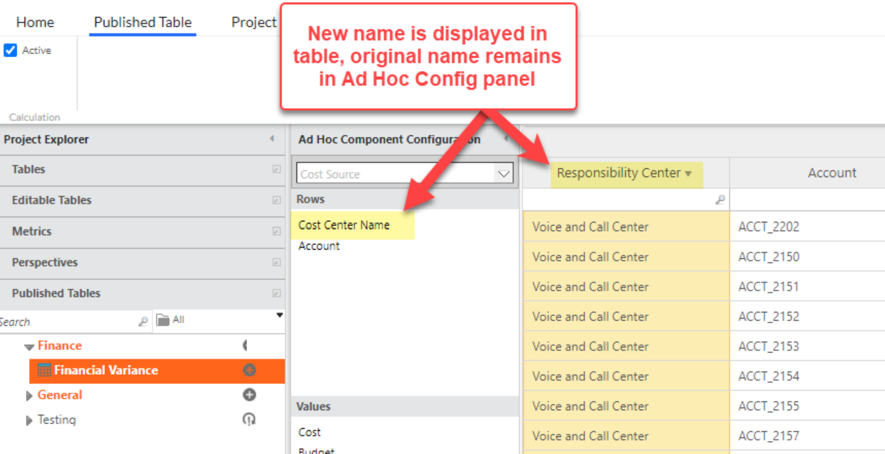

## Calc Explorer UI enhancements

The Calc Explorer has been enhanced to show builds specific to Trunk or a branch, separately. The
user can switch between Trunk and any active Branch to view the desired builds instead of scrolling
through the huge list. Additionally, the “carat” will be displayed only if there are multiple
calculations of the same build.

Previously, all the builds were shown as a single big list and it was tedious to search for a
specific build. Also, the carat was shown even for the builds that has only a single
calculation.

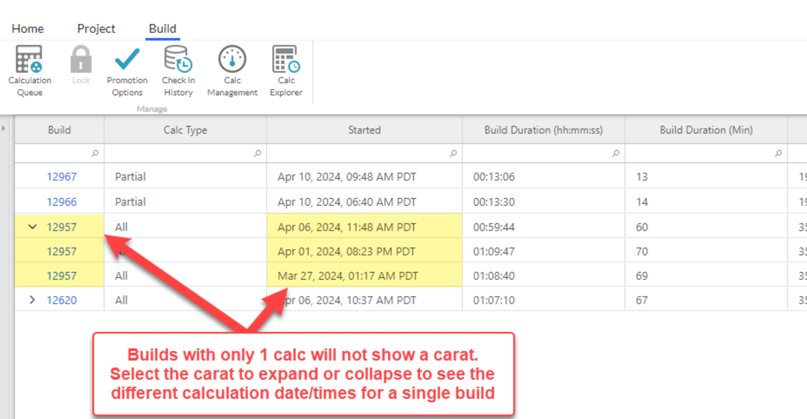​

## Fix It workflow renamed to Troubleshooting

In TBM Studio > Home tab > Config
Recommendations, the name of the 'Fix All Identified Problems' button is changed to
Troubleshoot All Identified Problems. Clicking on the button will initiate a
multi-step workflow to engage the administrator in the troubleshooting and automated “fix it”
process.​

Previously, Fix All Identified Problems was displayed to initiate a workflow, but some
administrators feared it would make changes without their control and did not want to use it. ​

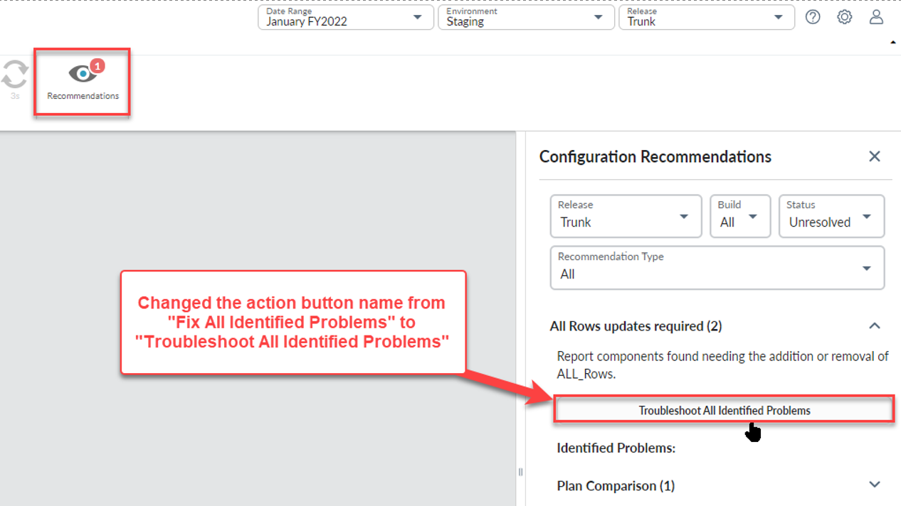

## Precision Calc Apex UI optimization

With this optimization, making a Project Setting change to 'Enable Apex UI' will no longer
require a calculation​ optimizations for setting the Apex UI flag in Project
Settings.

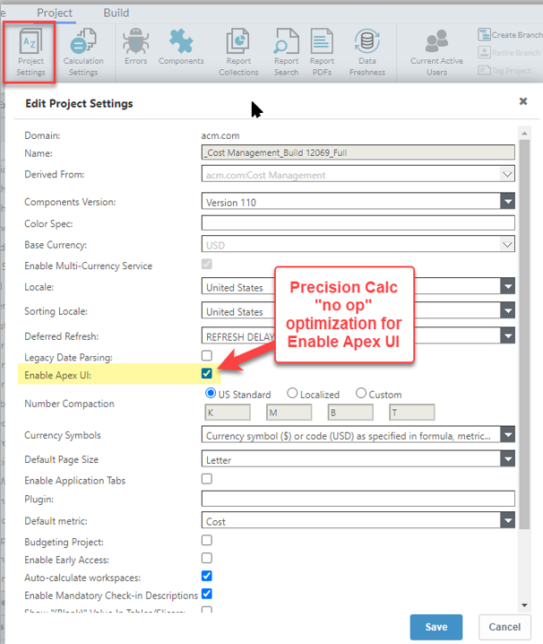​

## Fixed in this release

- Addressed various vulnerability issues to bolster system security and ensure compliance.
- Resolved the issue of error message in Date partition step of the transform pipeline.

## Client 2.5 - April 12, 2024

## Dependency

Client v2.5 is compatible with Server 12.11.5 and 12.11.4.x

## New Client Features

## Enhanced Navigation (BETA)

The Report navigation has been modernized to simplify the user experience by introducing the
following new features. These features are currently behind the flag and not enabled by default.
Admins can enable these beta feature via TBM Studio >
Project > Enable Features and selecting: Report Search
by Name, Configure Recent, Configure Home, Configure Favorites.

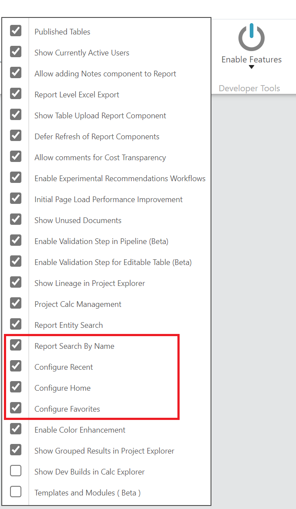

- Favorites: You can select one or more reports and mark them as favorite,
  so that you can access them easily, without the hassle of searching or navigating to it. To mark a
  report as favorite, you can select the favorite icon or use the Configure
  Favorites option from the Settings menu.

  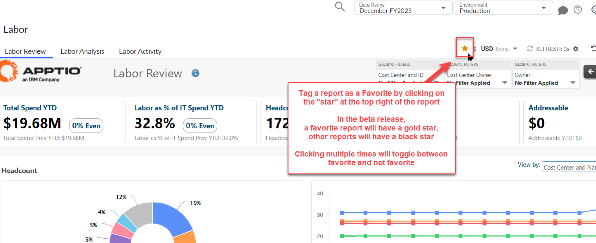

  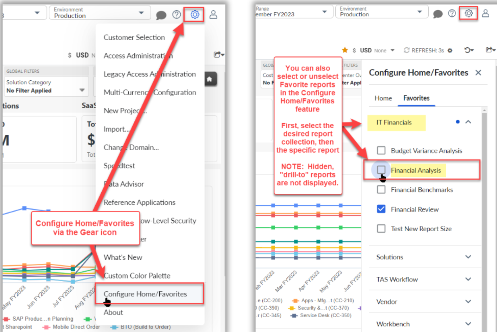
- Recents: The Recent option will appear in the left navigation menu of the
  production environments, and will display the list of recently accessed reports. It will show a
  maximum of five reports with the most recently accessed report at the top.

  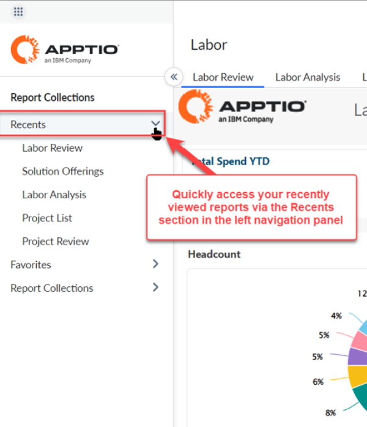
- Report Search: A search icon is added to the UI to search for a report
  and access it easily.

  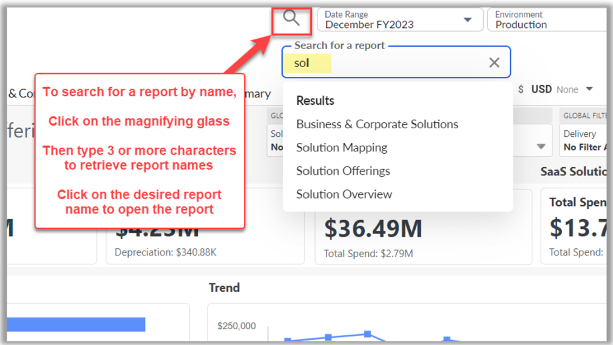
- Preferred Landing Page: You can select a specific page or report to be
  your default landing page. To mark a report as the landing page, use the Configure Home option from
  the Settings menu.

  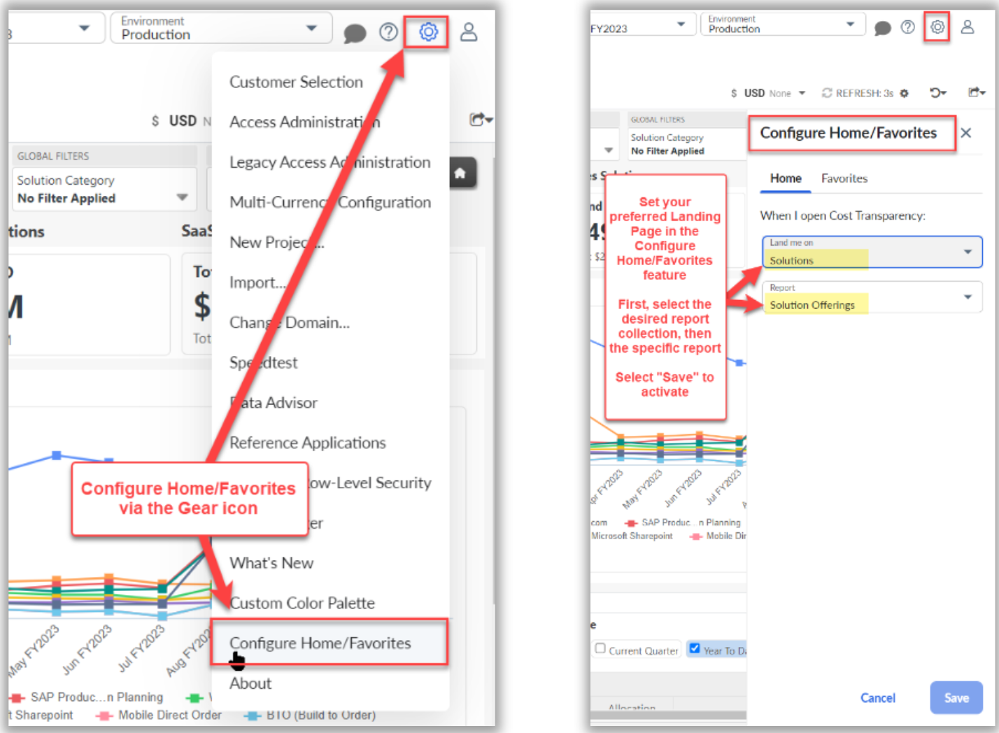

  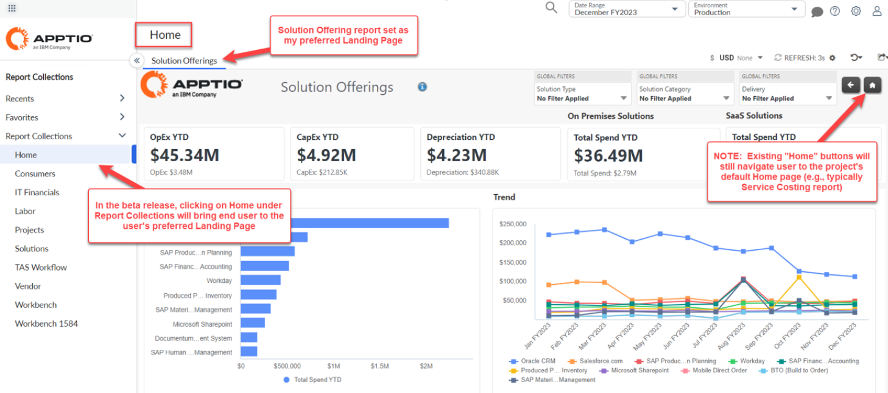

  To
  know more about the navigation enhancements, see [Enhanced Navigation](https://help.apptio.com/en-us/costing-billing/home.htm "(Opens in a new tab or window)").

## Send Email with a simplified link

On sharing any report to someone through email, the email message will be a context-specific
report URL. Previously, the email contained a lengthy and multi-line URL link of report which looked
unappealing and messy.

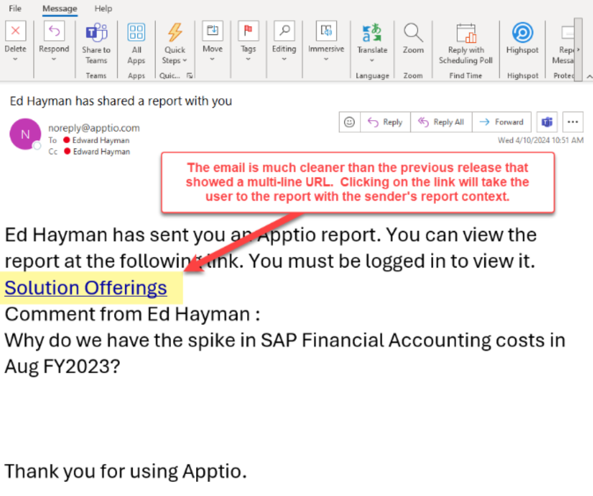

## Editable Tables

- Explore configuration without check-out: Administrators can now explore
  the configure column section without checking out the Editable Table. To do this, open an editable
  table, select the different pipeline steps and then select the different columns within Configure
  Columns steps to see specific settings.

  Previously, administrators were forced to check out the
  document to review the configuration

  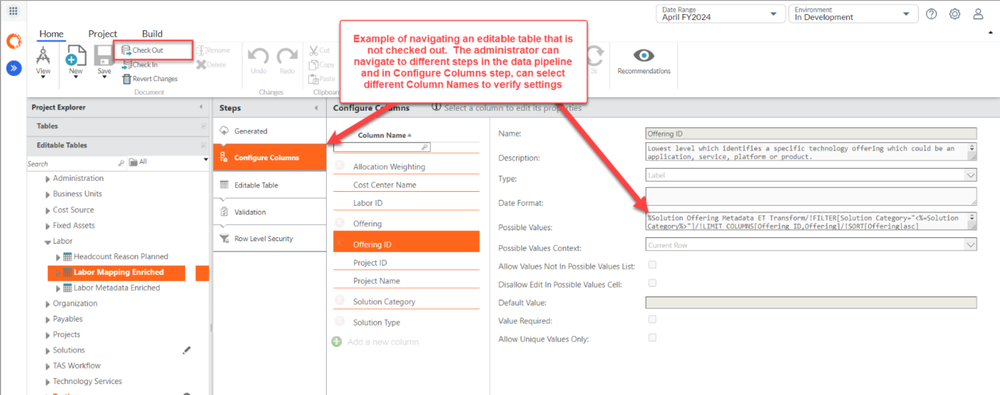
- Editable Table - Hourly option for recurring publish scheduler: A new
  option Hourly is added to the publishing schedule of an editable table, so
  that is the recurring publish can run every hour. This will help with accurate information, without
  modifying the HTML text boxes during daylight savings time transitions. The start time can be
  modified to allow precise timing.

  Previously, if there were multiple publishes in a day, the admin
  would select daily recurrence with multiple start times, and the number of start times was
  originally 8.

  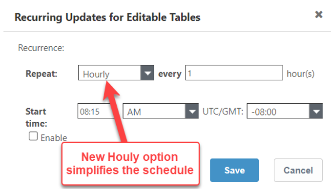
- Editable Table - check box selection for future filtering using
  ApptioScript: A new value Add Check Box column is added in
  Properties > Advance tab of Editable Table Report
  component. On selecting this checkbox, a new column appears at the beginning of the editable table.
  This checkbox is used to select single or multiple rows and delete them. Select the checkbox and
  then right-click to see the Delete Row option.

  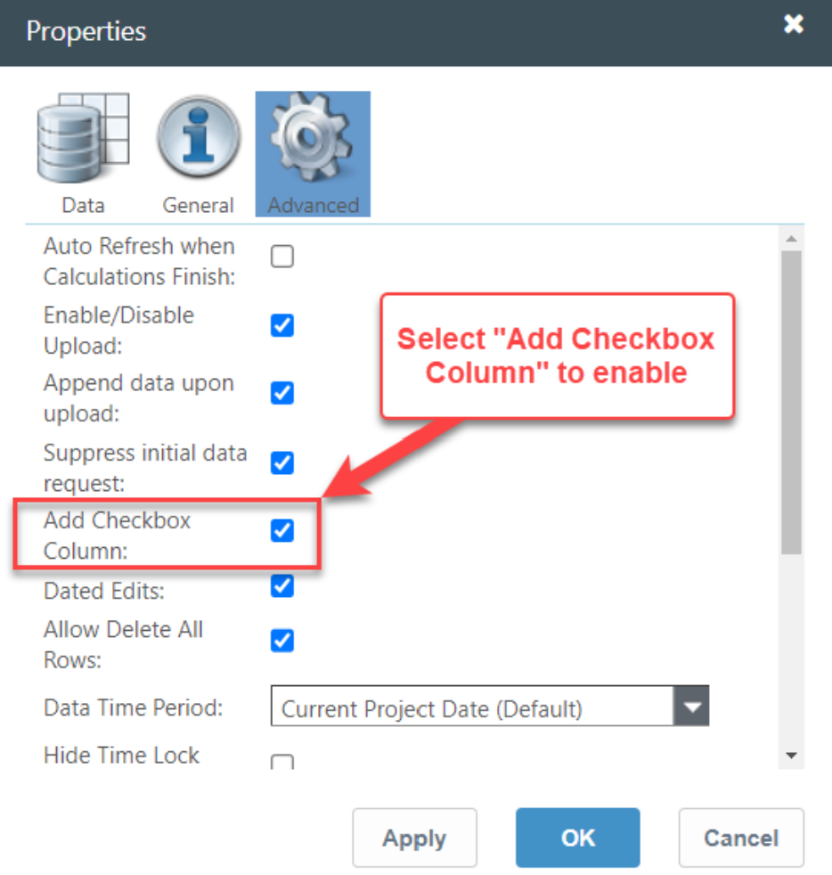

  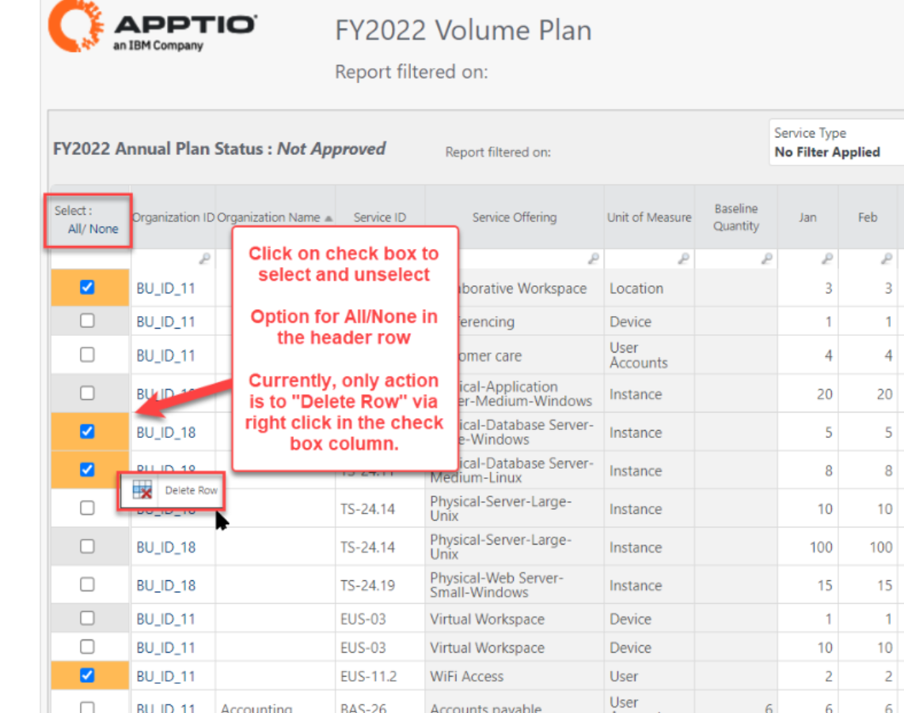
- Editable Table - Retrieve editable table schema without loading data for very large
  tables: The users can now suppress the initial load of editable table on report by selecting the
  Suppress initial data request option in the Properties
  > Advanced tab. On enabling this option, only the configuration will be
  visible and not the data. The page must be refreshed manually or automatically after applying
  filter. The data will also be visible by selecting Update Data from
  right-click menu.

  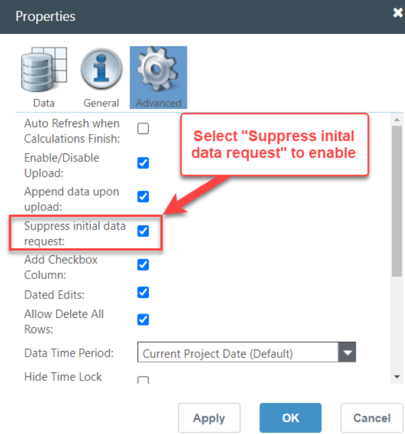

  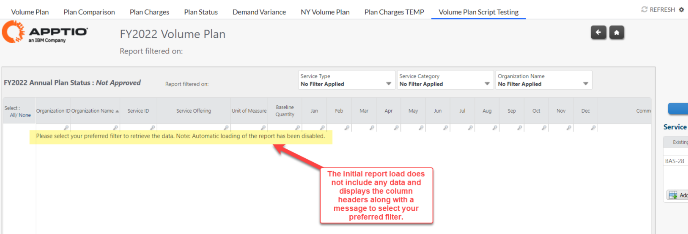

  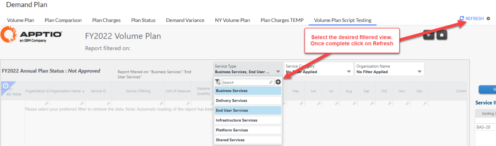
- Editable Table - Data validation for “intersects table”: A data
  validation step has been added to the Editable Tables. If you enter a data that does not exist in
  the validation table, the cell will turn red and hovering over the cell will display an error
  message. You will be able to save the changes, but the cell will remain red and rows with errors
  will appear at the top of the table for easy identification. See the below example - the valildation
  name is *Locations*, but the validation column is *Location*.

  

  

## Fixed in this release

- Resolved the sync issue while checking out ET report.
- Fixed the issue of PDF export failing due to compact slicers.
- Fixed the issue of editable tables graying out and being unresponsive.
- Resolved the issue of incorrect error message showing while appending editable tables.
- Addressed various vulnerability issues to bolster system security and ensure compliance.
- Fixed the issue of Time picker being out of sync with report and data download.

## Server 12.11.4.1 - March 28, 2024

This release fixed a server-side issue where Calc Explorer was missing 3-4% of the calculation
activities.

## Server 12.11.4 - March 1, 2024

Application template: v110-release

Note:

n release 12.9 and above, include the following header values on any API calls to the platform
API.

app-type="Flagship"

app-version="NA"

This includes API calls which upload to or download from Costing Standard or other platform
projects. These are in addition to existing API headers you may already be using.

## New Application Features

## SaaS Insights deprecated (v110)

In Template v110, the SaaS Insights components are moved behind beta and should no longer be
used. Existing SaaS Insights customers will be able to continue to use the Salesforce, ServiceNow,
and Office365 analytics. Support and enhancements will not be available.

## New Server Features

## Calc Explorer (GA)

Calc Explorer is a groundbreaking new feature designed to give administrators unparalleled
insight into build calculations. With this feature, administrators can review the list of builds and
drill into an individual build to understand what calculation activities have occurred and identify
what things are driving the largest calculation effort. This information can be used to cleanup and
optimize the project configuration.

Calc Explorer is accessible via the TBM Studio > Build tab.

- Displays a list of recent builds to explore.
- Open a specific build to see a Sankey visualization representing the calculation components
  including reports, drills, transforms, and metrics.
- The interactive Sankey diagram allows administrators to analyze the build by calculation effort,
  number of rows, or number of columns.
- Drill into a specific calculation component type to view the individual entities sorted
  descending by calculation effort.
- Drill further into the time periods; and for reports, drill next into the specific report
  components.

Future enhancements will include anomaly detection to identify and alert administrators when
calculations deviate from previous builds.

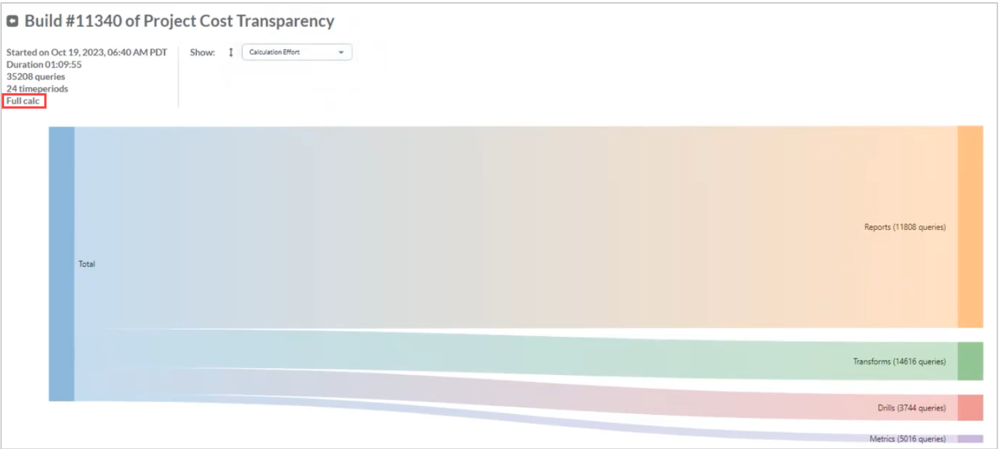

► Learn about: [Calc Explorer](https://help.apptio.com/en-us/studio/admin/calc-explorer.htm "(Opens in a new tab or window)")

## Precision Calc

The Precision Calc feature has two new optimizations with this release.

- Non-material changes on transform pipeline eliminate the need to perform a calculation update
  when:
- Change Table Description notes in Source steps under Tables section
- Change Source System in Upload step under Tables
- Move Table to a new category
- Add / Change Description in Perspectives
- Add / Change Notes in Perspectives
- UI configuration changes in Calculation Settings eliminate the need to perform a calculation
  update when the default calc priorities are changed, an active calculation is moved in the queue, or
  a staging calc is enabled or disabled for a project.

## Fixed in this release

- Improved response time performance for editable tables by optimizing the code to only fetch
  information on the table needed.
- Fixed the issue of reading correct domain
- Fixed an issue where a perspective had inconsistent behavior in a report graph when pulling in
  columns across multiple objects.
- Fixed an issue where changing the Upload Option Locale caused a cache corruption.
- Addressed various vulnerability issues to bolster system security and ensure compliance.

## Client 2.4 - March 1, 2024

## Dependency

Client v2.4 is compatible with Server 12.11.4 and 12.11.3.x

## New Client Features

## Editable Tables

- Editable Table Upload - default to Append or Overwrite: The Editable
  Table report component now includes a feature that allows administrators to specify the desired data
  upload method—either to "append" or "overwrite" existing data from the reporting surface. To access
  this setting, right-click on the report component and navigate to Properties > Advanced. There, you
  will find an option to "Append data upon upload." By selecting this, administrators set the data
  handling method directly for the Upload Options dialog.

  In the report view mode, end users with
  permissions can upload data directly from the reporting surface. After selecting the file, the
  upload modal will display "Table upload behavior is configured to:" followed by the selected method,
  either "Overwrite" or "Append." This setting is predefined by the administrator and cannot be
  altered by the user.

  Administrators will still have the ability to select either “append” or
  “overwrite” when uploading to an editable table in the data pipeline in TBM Studio.

  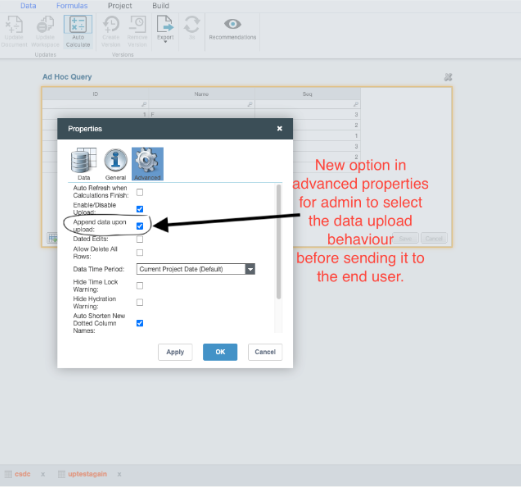

  

  Before this release, the user was required to select the upload method,
  either “Upload” or “Append” after selecting the file. This is not appropriate since the user may not
  understand the difference and could mistakenly overwrite updates from other users.
- Button Scripts - recognize filtered row: Buttons can automate bulk
  updates to editable tables using Apptio script. With this release, the EditRow and DeleteRow
  functions are only applied to filtered rows using slicers or the search bar.

  Before this release,
  scripts did not account for the filters in the report view. As such, some records may have been
  incorrectly or unknowingly updated..
- Button Scripts: lookup to values in another editable table:
  Administrators can now configure more complex editable table button scripts based on values in
  another editable table. This will make the end user experience simpler by automate common bulk data
  updates. In this release, only the EditRow function is supported and uses a "single row" editable
  table to capture the users input. If multiple rows exist in the table, the "first value" found is
  used, similar to the Excel vlookup() function.
- Truncate: A new Truncate feature permanently removes all rows including
  audit history for both raw and enriched editable tables. For raw tables, the table will be blank;
  for enriched editable tables, the table will reflect the underlying source table. The Show History
  feature will display no records.

  The Truncate feature is only available to administrators. One use
  case is to reset an editable table after initial configuration and testing. By truncating the table
  before production roll-out, the table will be fresh without any previous testing history. Similarly,
  Truncate may be used to clean out tables where change history is no longer required. This may be
  especially helpful for very large tables uploaded frequently.

  The Truncate feature is accessed
  via TBM Studio in the data pipeline Editable Table step. The button appears at the bottom right
  corner. Activating the button triggers a confirmation popup, ensuring administrators make an
  informed decision by confirming or cancelling the request. It's important to note that once
  truncated, the data is irretrievable.

  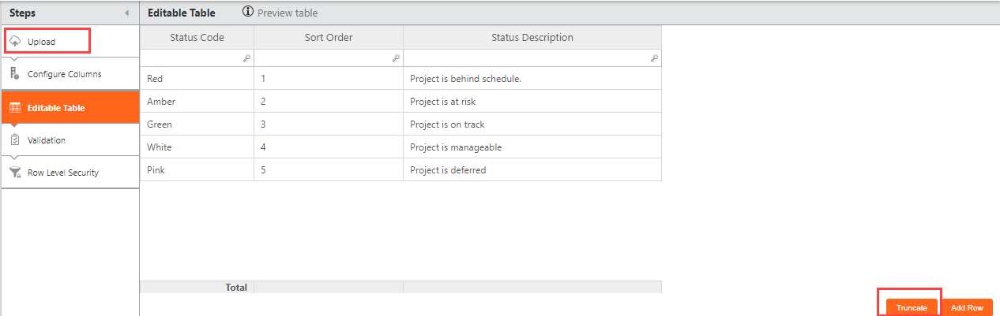

  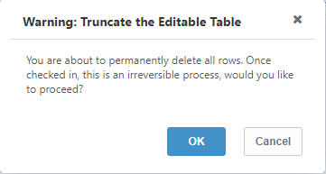

  Previous to this release, only an Apptio engineer could permanently remove all rows in the
  underlying SQL database.

## Fixed in this release

- Addressed various vulnerability issues to bolster system security and ensure compliance.
- Created a guardrail to prevent saving a formula column if its name duplicates that of an
  existing column in an editable table.
- Fixed an issue where checking out a document selected the wrong document.
- Fixed an issue with overlay charts where the hover over values on the chart were not aligned
  with the y-axis scaling.

## Server 12.11.3 - January 19, 2024

Application template: v110-7952

Note:

n release 12.9 and above, include the following header values on any API calls to the platform
API.

app-type="Flagship"

app-version="NA"

This includes API calls which upload to or download from Costing Standard or other platform
projects. These are in addition to existing API headers you may already be using.

## New Application Features

No changes were made to the Application Template v110.

## New Server Features

## Fix It Workflow GA

All Rows and Unused Columns Workflow: These Fix-it
Recommendation Workflows are now available to all customers by default.

Unused Columns Workflow functionality: The workflow streamlines system performance by hiding
unused columns in data tables, reducing calculation loads and improving overall system
efficiency.

Administrators can access this feature via Configuration Recommendations and selecting 'Fix All
Identified Problems' under the Unused Columns recommendation. The process includes:

- Check out documents for editing.
- Select tables to be fixed.
- The system will automatically hide unused columns in formula steps within the table's data
  pipeline.
- Checking in changes and marking issues as resolved.

  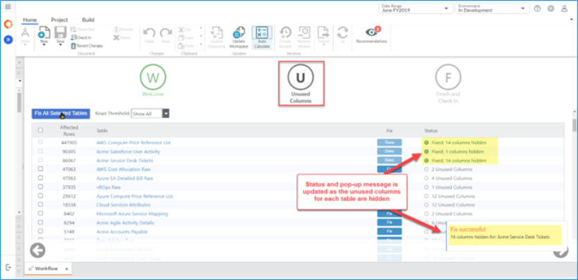

  Upcoming updates will address performance issues related to JSON parsing.

## Published Tables (Beta)

Initially released as an early access Beta in Server 12.11.2 / Client 2.2, Published Tables
provide a more accessible and maintainable way to export modelled data from TBM Studio. With this
release, Published Tables can now be activated via Enable Features and selecting Published Tables.
Published Tables can be created from scratch, using the New > Published Tables feature on the Home
tab, or from an existing report table component using Right-click and selecting Create Published
Table.

Previous to this feature, administrators needed to create report tables, promote through to
Production, Right-click the report table component to open the menu, select ‘Show API URL’, and
copy/paste the desired API URL.

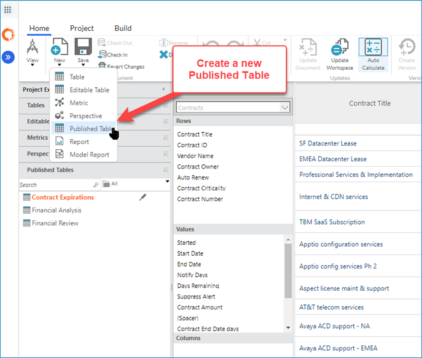

## Precision Calc – time aware optimization (EA Beta)

The Precision Calc feature has two new optimizations with this release.

Time-aware optimizations enhance efficiency by only calculating the time
periods where data has been updated or is impacted. This early access beta feature requires product
manager approval to activate the functionality and is enabled by setting
biit.background.cacher.enable.timeaware.optimization to true.

Report Collection optimizations enhance efficiency be eliminating the need
to perform a calculation update when a report is added to or removed from a report collection.

Previous to this release, all open time periods and any changes to report collections were
re-calculated.

## Data pre-processor for JSON tables (EA Beta)

A new data pre-processor service has been developed to parse JSON tables before they are loaded
into TBM Studio. JSON parsing is a calculation intensive process that is re-run every time the
system requires a calculation of this data. By parsing the data outside of the BIIT calculation
engine, the system will perform better and calculation times will be reduced. This feature requires
product approval to be enabled. A controlled rollout will be scheduled throughout 2024 to migrate
customers to this new service.

Future functionality will enable data filtering, grouping, and categorization to be applied
before being loaded into TBM Studio.

## Fixed in this release

- Fixed an error encountered when accessing Unused Documents.
- Added support for disabling compressed dense matrices, controllable via the
  disable.compressed.dense.matrix flag (default: false).
- Resolved an issue with the visibility of the "New Components" tile.
- Fixed an issue causing custom colors to revert to Apptio default colors.
- Fixed an issue of some projects not being visible in the new UI.
- Addressed various vulnerability issues to bolster system security and ensure compliance.

## Client 2.3 - January 19, 2024

## Dependency

Client v2.3 is compatible with Server 12.11.3 and 12.11.2.x

## New Client Features

## Editable Tables​

- Delete All Rows feature: A new optional feature, Delete All
  Rows, has been introduced in the editable tables report component. Using this button
  will delete all rows for raw editable tables leaving the table blank; and will remove all added rows
  or modified rows for enriched editable tables leaving the table in the same state as the source
  table. Changes to the editable table will be tracked and available via the 'Show Changes'
  feature.

  This feature is disabled by default. To enable it, right-click the editable table report
  component, select Properties > Advanced, and activate
  the Allow Delete All Rows option. The Delete All Rows
  button will be visible between the 'Add Row' and 'Publish' buttons on the reporting surface for
  users with the required permission.

  Previous to this feature, administrators would need to
  create a button with Apptio Script that ran two opposite conditions; e.g., if A=true, deleterow());
  if A=false, deleterow(). This only worked for raw editable tables. If existing rows needed to be
  deleted from an enriched editable table, an engineer was required to delete rows in the backend
  database.

  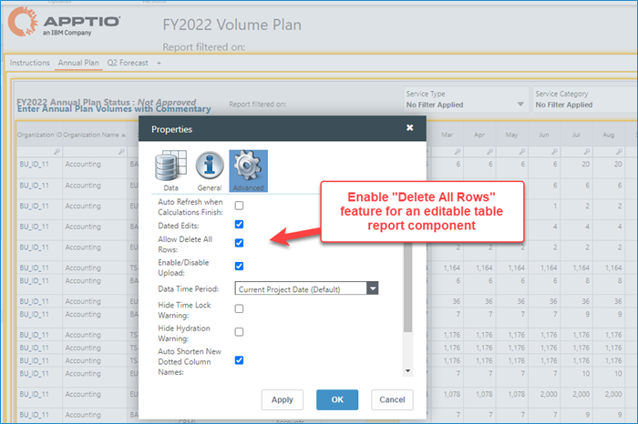

  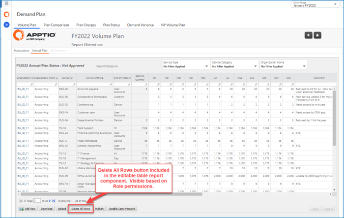

  To know more, see Delete All Rows section in [Edit properties for tables](https://help.apptio.com/en-us/studio/reports/tables/edit-properties-tables.htm "(Opens in a new tab or window)").
- Slicers across multiple editable tables: A slicer can be used to filter
  across more than one editable table report component even if they are based on different editable
  tables. The column name must be the same in both editable tables. An example in the ApptioOne Demand
  Planning is solution is where the Volume Plan and Plan Status editable tables are displayed in the
  same report. Selecting one or more options in the slicer will filter both tables. If a slicer is
  placed within a Group report object, only the tables within the group will be impacted.

  Previous
  to this feature, an administrator would need to have an slicer above each table with the slicer
  using a column from the source editable table. End users would then need to select the desired
  value(s) in both slicers to filter both tables to the same values.

  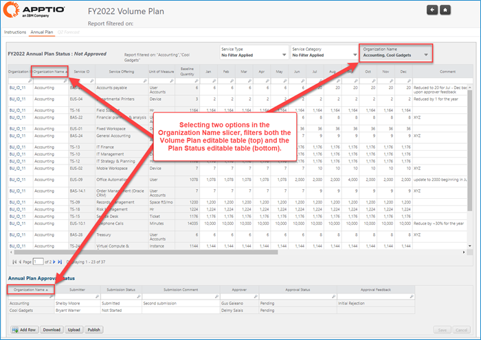
- Upload and Download UI : 'Download' and 'Upload' buttons have been added
  to the editable table report component. The Download button is enabled by default and will work with
  raw and enriched editable tables. The Download functionality mirrors the
  '<right-click> and Open in Excel...' feature and is based on the filtered report view.

  The
  Upload button is disabled by default and must be activated in studio mode. With the report
  checked-out, Right-click the editable table report component, select
  Properties > Advanced, and activate the Allow
  Upload option. The Upload feature is only available for raw editable and does not currently
  support enriched editable tables.

  Previous to this feature, a user could download the table by
  a Right-click to pull up the popup menu. This method is not visible nor easily accessible for casual
  users. Administrators could also add separate Download and Upload editable table report components
  on the report; however, these took up room on the report.

  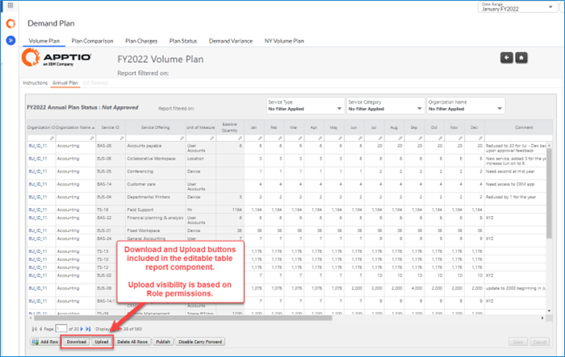

  NOTE:
  If a user attempts to upload data while the report is checked-out, the upload will not be allowed to
  proceed. The Upload and Save buttons will be disabled and the user must close the Upload data set
  modal by refreshing the table - right-click on the table area, and then select Update Data
  option.

  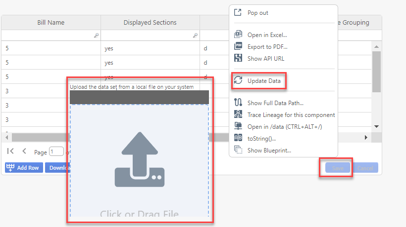
- Upload and Download UI and permission enhancements: Editable Table
  Permissions have been updated for greater flexibility and control. The three
  new permissions include: Download Permission, Upload Permission, and Duplicate Row Permission. The
  Duplicate Row provides for separate, independent control from Add Row.

  Previous to this feature,
  the Add Row Permission controlled both add and duplicate rows.

  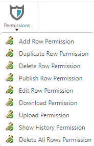
- Data Validation - Integrated into Table Upload process flow: Data
  validation has been integrated into the editable table report component to prevent the upload of
  corrupt or incorrect data. This feature can be activated via the Project >
  Enable Features dropdown and selecting Enable Validation Step for
  Editable Table (Beta). Errors or warnings are displayed in real-time as data is entered,
  with clear explanations provided for any issues. When a user uploads data which fails the data
  validation rules, the cells will be highlighted in red with hover over explanations to help the user
  resolve any data issues.

  Enable data validation

  

  End user
  manually entering data with incorrect values

  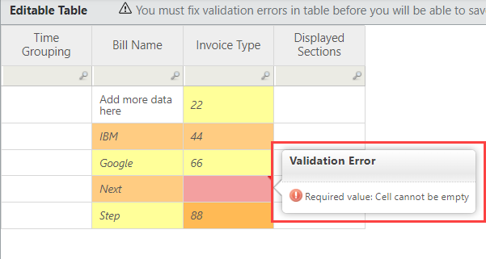

  End user uploaded
  dataset with incorrect values

  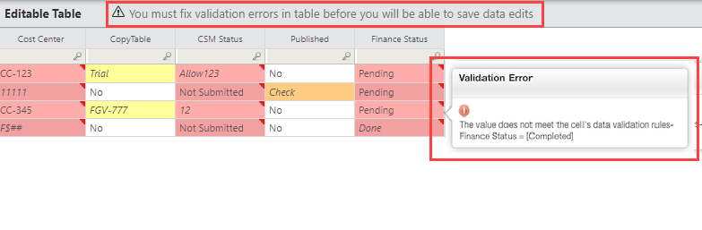

  ► Learn about:
  [Data Validation for Editable Tables](https://help.apptio.com/en-us/studio/reports/tables/data-validation-tables.htm "(Opens in a new tab or window)")
- Respect Add Row permissions with copy/paste: For copy/paste actions in
  editable tables, new rows will be added as needed, provided the user has 'Add Row Permission'.
  Without this permission, an error message will be displayed.

  Previous to this feature, additional
  rows would be added with the copy/paste action even if the user did not have ‘Add Row
  Permission’.

  User pasting multiple rows without Add Row Permission

  

  Apptio
  Script - new RowCount\_EditableTable() function: A new function,
  RowCount\_EditableTable(<Editable Table Name>), is now available. It returns the total number of
  rows in the underlying table of the report, or in a specified table if a name is provided. This is
  useful when using advanced script to delete and/or copy tables.

  Previous to this feature,
  administrators may have tried to use the RowCount() feature which did not work for editable
  tables.

  ► Learn about:: [RowCount\_EditableTable() function](https://help.apptio.com/en-us/studio/formulas-and-functions/functions/rowcount-editabletable.htm "(Opens in a new tab or window)")

## Multi-currency selection and slicer behavior

Users can now switch between multiple currencies without resetting to the default report view.
Current ad hoc selections (pivots, filters, column pickers) are retained when changing
currencies.

## Fixed in this release

- Fixed an issue where descriptions, names, and notes were not visible in Perspectives.
- Resolved a problem where formulas were inadvertently saved when creating a perspective.
- Fixed an issue where the input value of a Pipe filter disappeared with the addition of a new
  filter.
- Dimension panel display has been updated to show details of all variants of published
  dimensions.
- Addressed an issue causing oversized red/yellow/green icons and table formatting.
- Administrators can no longer create editable tables with names already used by out-of-the-box
  content. Such names are now reserved.
- Corrected a display issue with table cell annotations.
- Fixed an issue where hiding the 'value' axis in bar and column charts caused PDF exports to
  fail.
- Addressed various vulnerability issues to bolster system security and ensure compliance.
