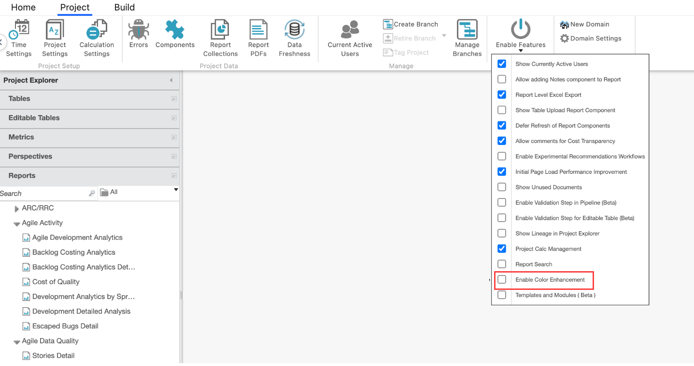
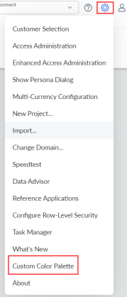
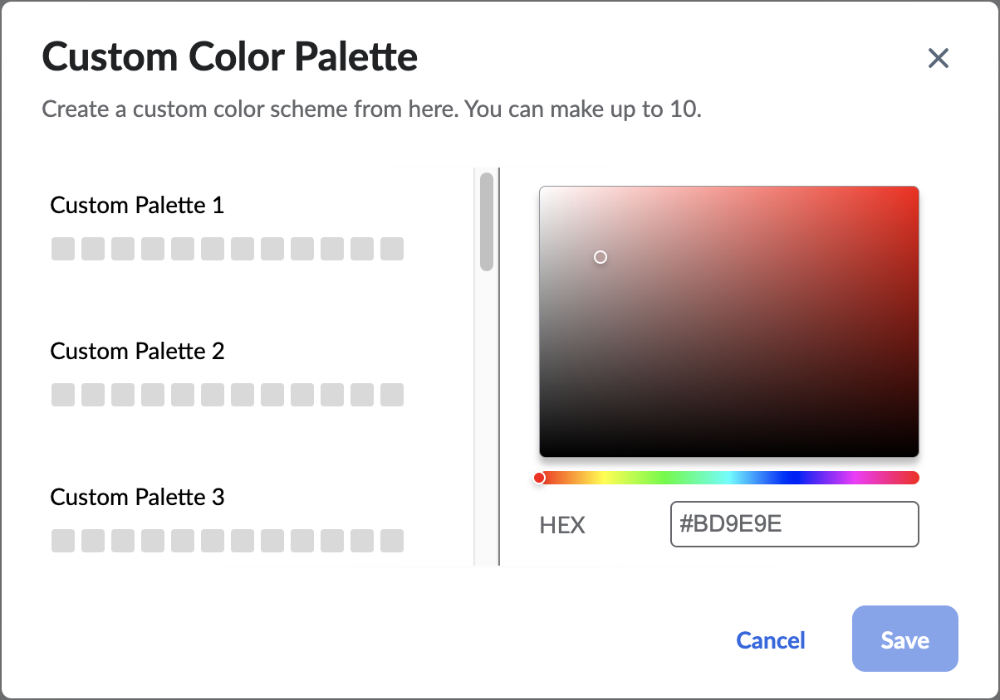
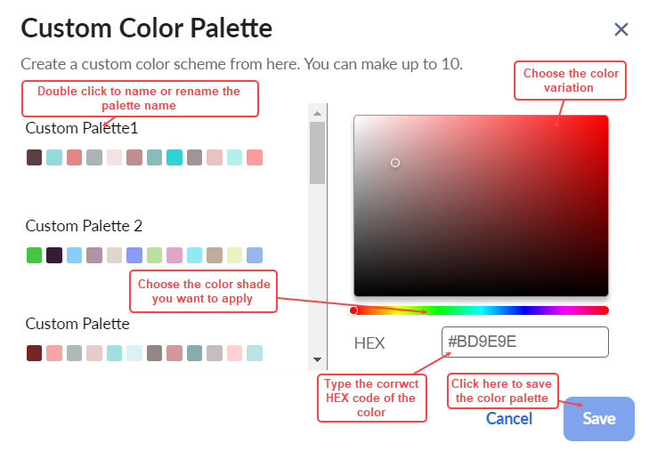
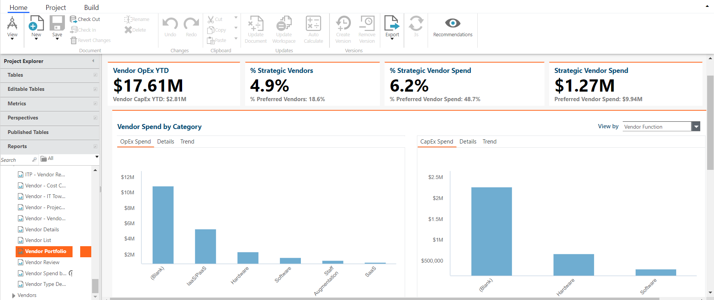
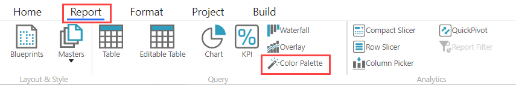
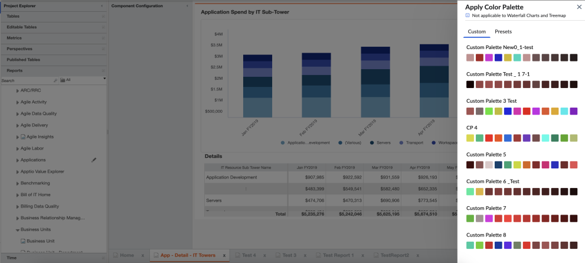
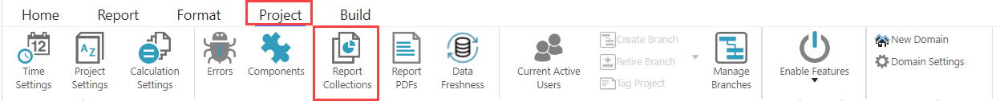
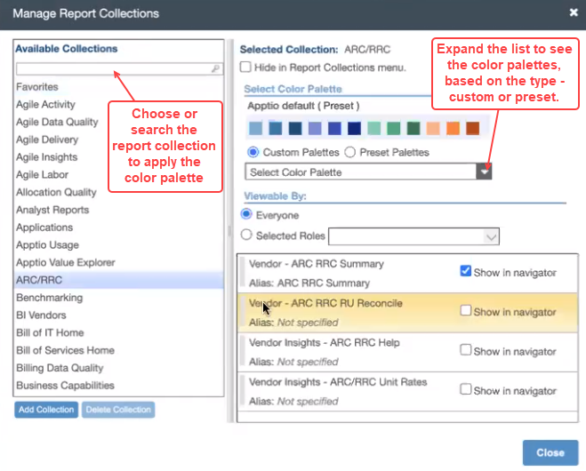

# Custom Color Palette

The Apptio Admin, Admin, and the Partner Admin have the flexibility to define, manage and apply
corporate colors to report collections and reports in TBM Reports Studio. It empowers the admins to
align the visual aesthetics of their reports with their organization’s branding guidelines and gives
them a better user experience. The color palette can be defined only at environment level, and not
at the instance level.

To enable the Custom Color Palette feature from UI, navigate to **Project** tab > **Enable
Features** > and select **Enable Color Enhancement** option.

`

## Create Custom Color Palette

From the top right corner, select **Settings** > **Custom Color Palette**. This option is
available only for Apptio Admin, Admin, and the Partner Admin roles.

The Custom Color Palette popup appears. For a first time user, the custom color palette will be
blank, without any colors.

Choose the color palette one at a time, starting from left to right. On selecting the first
color, the system will auto apply gradients of that color to rest of the 11 colors. Admin has the
option to update colors manually.

After selecting the 12 colors, select the **Save** button. The colors selected here will be
available to apply for the reports and report collections in the environment for all projects. If
the HEX code is incorrect, an appropriate error message will appear.

Note: If a customer does not have multiple colors in their style guide, then variations of the
applied color will be auto generated.

## Custom Color Palette

Each color palette has 12 colors, and there are 10 palettes that can be created and customized.
If there are more than 12 dimensions, then the variations of the 12 colors will be applied to the
additional dimensions in the chart.

## Naming the color palette

The name of the color palette should be alphanumeric, can contain 'space', ‘-‘ and ‘\_’, and must
not exceed 30 characters.

There are two kinds of palettes available:

**Custom Palette**: These can be created and managed by the Administrators, as per their
organization's color styles.

**Presets Palette**: These are Apptio standard colors that cannot be customized. They are
available at report collection and report level, and not when creating the custom palettes.

## Updating the Custom Color Palette

If you want to change any one color in an existing color palette, then auto gradient will not be
active. Rest of the colors will remain the same.

## Apply Color Palette

## Report level

Navigate to **TBM Studio** > **Projects** > **Reports** and select any report. By
default, the Apptio colors will be considered for the report.

From **Home** tab, **Checkout** the report. Navigate to the **Report** tab, and then
select **Color Palette** option.

The Apply Color Palette menu opens on the right panel, with the list of Custom and Presets color
palettes.

Select the custom color palette or presets of your choice, to be applied to the report.

A confirmation message appears and the custom color is applied to the report. The selected color
palette will be highlighted for easy identification.

The color palette will also be applied to all the Chart types, except Waterfall and Treemap. The
color palette is not applicable for Tables, Font/label colors, Slicers, Background, and KPI. To know
more, see [Set
default colors in charts](../reports/set-default-colors-charts.htm "(Opens in a new tab or window)").

## Report Collections Level

From the **Project** tab, select **Report Collections**

The Manage Reports Collection popup appears

On selecting the color palette, all reports within the report collection will automatically have
the same color palette that is applied to the report collection.

Note: If a new report is added to the report collection, then the color palette of the report will
not change automatically to that of the report collection. The Admin must manually change it at the
report level.
