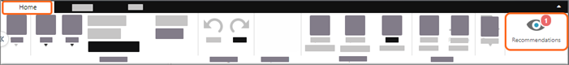
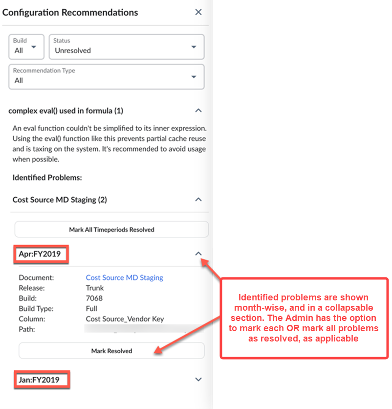
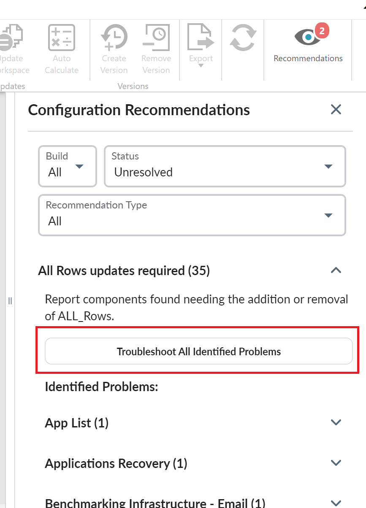

# Configuration recommendations

TBM Studio provides configuration recommendations to let you know if there is a potential problem
with the data tables.

To view recommendations, go to **Home** > **Recommendations**.

The Configuration Recommendations pane is displayed. If there are a large number of
recommendations, you can use the filter options to restrict which recommendations are displayed. The
Configuration Recommendations pane displays the number of detected instances of each problem beside
the recommendations. In the example below, there are 2 instances of a table where a legacy model
join operation has been used, so the Configuration Recommendations pane displays Legacy model join
operation used. (2) followed by the locations where the problem is detected.

Tip: See the list of recommendations and actions to [Resolve
identified issues](../troubleshooting/studio-troubleshooting-about.htm "(Opens in a new tab or window)").

The Fix All Identified Problems button is now renamed to **Troubleshoot All Identified
Problems**. Clicking on the button will initiate a multi-step workflow which engages the
administrator in the troubleshooting and automated “fix it” process.

