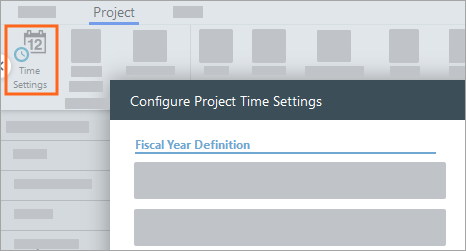
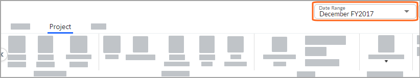

# Enable time for a project

**Applies to**: TBM Studio 12.0 and later. One of the most important
concepts in the application is time-enabling projects. In a time-enabled project, start and end
dates are set for the data, and the fiscal year is defined. In a time-enabled project, you
can:

- Enter data on a regular basis
- Allocate it to a specific time period
- See trends across the duration of the project
- View report data for the current month or period, or for quarter, half, or full-year time
  periods
- The application supports Gregorian and period calendars. However, the same type of calendar must
  be used across all projects.

There are no set rules for when you should enable time for a project. However, enabling time on a
project creates a more complex environment. For that reason, you should identify the key tables,
build the basic model, and define the major allocations before you enable time. You can enable time
only one time for a project, and the action is irreversible. Once you enable time on a project, you
cannot disable time.

Time enabling a project impacts some, but not all, areas of the application. The table below
shows the areas that are impacted and not impacted.

| Areas impacted | Areas not impacted |
| --- | --- |
| Data sets  - Models - Notes - Data displayed in reports | - Metrics - Report definitions |

## To enable time for a project

Note: To enable time, you must be assigned to a role that includes the **Configure Time
Settings** permission.

1. On the **Project** tab, select **Time Settings**. The
   **Configure Project Time Settings** window displays. The field options in the window depend on
   the calendar type you select. For a description of the fields, see [Configure project time
   settings](configure-project-time.htm "(Opens in a new tab or window)").

   
2. Select the values you want and select **Configure Time**. The date is
   displayed in the header.

## New projects are not time enabled

When you first create a new project, it is not time enabled. You can change your data sets,
transforms and models, and every change overwrites the current project information. This is
represented by the Non Time-Enabled side of this diagram:

When you enable time within a project, all changes made to the structure of data tables create a
new state for the data in the project. In the application, states are known as Versions. The new
state applies from the currently selected period forward until another state for the data is
encountered. In the diagram above, this is represented by the Time-Enabled side.

## Determine if time has been enabled

You can tell if time has been enabled on a project by looking at the Global header. Before time
has been enabled, if you have time-enabling privileges, the Global header will display Configure
Dates. If you do not have time-enabling privileges, the Global header will not display Configure
Dates.

When time has been enabled on a project, the Global header displays the currently selected period
as shown in the following image:

## Best practices for time-enabled projects

Working with time-enabled projects can sometimes have unexpected results. Note the following:

- If you make a change to a model or a table, be sure that you are in the desired month or
  period.For example, if you want to make a change effective from the earliest month/period in your
  project, make sure you select that month/period from the date picker before you make the change. If
  you want to make a change effective from the current month/period forward, make sure the current
  month/period is selected.
- The application supports the following calendar types for custom projects and application
  projects. For applications other than custom and Costing Standard, only the Gregorian calendar is supported.
  - Gregorian
  - 445, 454, and 544
  - 13 period

Note: The same type of calendar must be used across all projects.

## View data in different time periods

If time is enabled for a project, you can view tables and models for different periods, and you
can view reports for months and other time periods. For example, if you loaded data from January
2016 to December 2016, you could select any period and look at your model metrics with the data from
the selected period. You could also select Fiscal Q1 of 2016 and look at your reports with the data
for the quarter.

To view data in different time periods:

1. In the Global header, click the currently displayed time period. The date picker is displayed.
   The time periods in the date picker reflect the fiscal year defined for the project.
2. Use the date picker to select a month or period, quarter, half, or full year.
3. Click the month or period you want to view.
4. You can select the Q1 - Q4 buttons on the left side of the dialog, the H1 and H2 buttons on the
   right side of the dialog, and FY (Fiscal Year) button at the bottom of the dialog.
   - To move back or forward through the years, click the arrows to the left and right of the years
     at the top of the dialog, and then select one of the displayed dates. If an arrow is grayed out and
     cannot be clicked, you have reached the start or end date for the project.
   - If the date picker displays periods instead of months, you can point to one of the periods and a
     tooltip will be displayed that shows the start and end dates for the period.
5. The time period that you select is displayed at the top of the browser window. The data
   displayed in a report is for the selected time period.
