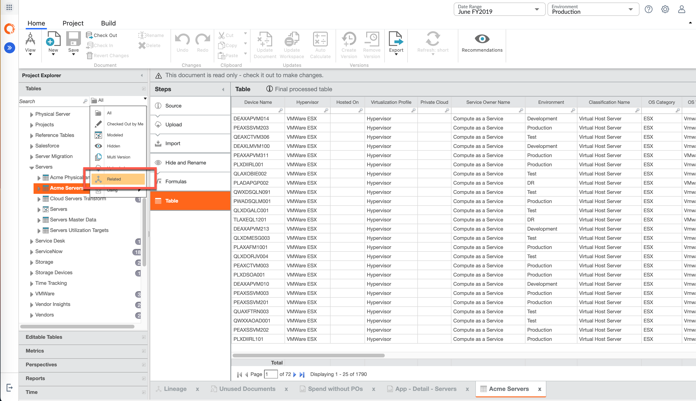

# Related Filter

Another way to utilize Lineage feature in a simplified user experience in Project
explorer is that now you have the ability when you click at any table it will show you any related
tables by bonding them further on their relationship.

Open **Servers** > **Acme Servers**, select the folder view and then select **Related**.
This will show similar set of relationships just in the explorer. You can see Billing Standard, All
Business Services, Consumption feed as some of the table examples that are associated to Acme
Server. The folder view is selected so that you know where the tables are from. In addition, you can
also see any related calculated metrics (cost per server, physical servers etc.) of Acme Servers
dataset. When you look at reports, they will also show reports that are somehow connected to Acme
Servers table, such as Application reports, Billing Standard, IT Towers and some of the Billing
reports.
